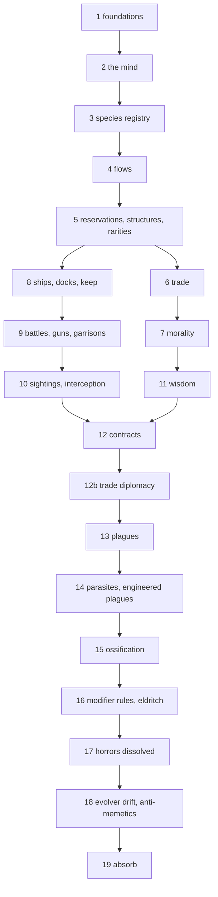

# Execution plan: the ten proposals, built in order

**Status:** Accepted for execution, 2026-09-17. Steps are ticked as they land.
**Source proposals:** every file in `specs/proposals/` (one-tick, resources-and-trade, morality, ships-and-garrisons, fleet-interception, wisdom, contracts-and-mercenaries, plagues, ossification, kinds). This plan supersedes their individual "Implementation notes" stage lists where the two differ; their Design sections stay the specification.

## How to run a step in a fresh session

Every step is written to be done by a session that has read nothing but this file. The protocol:

1. Read this file top to bottom once. Then read the **Reads** list of the step you are on: the named proposal sections and the named code files. Nothing else is needed to start; read more code as the work asks for it.
2. Check the **Progress ledger** below and `git log --oneline -5`. The ledger says which step is next and what state the last step left. If the ledger and the log disagree, the log is right; fix the ledger first.
3. Build the step's **Build** list in order. Keep to the **Architecture rules** section. When a proposal's text and this plan differ, this plan wins; when this plan is silent, the proposal wins; when both are silent, pick the simplest thing, write it in the step's ledger entry, and move on. Do not stop to ask unless the choice would change a design that is already built.
4. Run the **Gate** for the step: `go build ./... && go vet ./... && go test ./...`, then the batch command it names, and read the **Batch** numbers it lists. Fix red tests. If a batch number is far outside the range the step gives, tune the numbers the step names as tunable, not the design; if it cannot be tuned into range, record it in the ledger and go on.
5. Commit with the step's **Commit** message (one commit per step, more if the step says so). End every commit message with `Co-Authored-By: Claude Fable 5.1 <noreply@anthropic.com>`.
6. Append to **Optimisation notes** at the end of this file anything you saw that was slow or could run in parallel, one line each, without acting on it unless it is cheap and certain.
7. Update the ledger: tick the step, write one line of state (what landed, anything left out, any number that would not tune), and update `Status` in every proposal the step touched (`In Progress` when first touched, `Implemented` when its last stage lands). Commit the ledger change with the step or right after.
8. Stop with a four-paragraph summary: what was built, choices made, surprises, what is next. The next session starts at 1.

Experiments that need a changed rate are run with `go build -overlay` copies in the scratchpad or by a flag, never by editing source to test and forgetting to revert. The reference batch is `go run ./cmd/techstats -seeds 10 -out reports/tech` at 400 stars; it is committed under `reports/tech/`, so `git diff --stat reports/tech/stats.txt` after a batch shows what moved. A crowding check is `-stars 800` on three seeds through `cmd/worldgen -stats`; only steps that say so need it.

## Progress ledger

Tick a step when its commit is in. The state line is for the next session.

- [x] Step 1: Foundations: one tick, the tick pipeline, the test harness. State: landed as planned. `Config.Step` (1000), `newWorld`, `w.phases` with `insertPhase`, `civSteps` with `insertCivStep`, `World.Ticks`, `Config.Profile` behind `worldgen -phases`. techstats had no per-tick counts to convert; its "fine pass" war flag became `Waning` (began after the waning) and war lengths are now read over every finished war. Tests: `TestDeterminism`, `TestOneStep`, `TestChanceRate`, plus a small `TestHarness` that exercises `newTestWorld`/`spawnAt`. Batch: age, count of peoples, lifetime buckets, standing and remnants within seed noise; wars 395 → 462 over ten worlds, ending in peace 58% → 68% and enslavement 28% → 15%, median war 13 → 10 kyr; nothing fires twenty-fold, nothing was converted to `chance`. Batch runs in 37 s on ten seeds.
- [x] Step 2: The mind: the decision layer as one module with one tuning table. State: landed with the batch byte-identical (`stats.txt`, `civs.jsonl`, `wars.jsonl` unchanged; `report.md` moved only in its first-reach table, which read two maps in random order and now reads the tree in order). `internal/mind`: `Tuning` in seventeen groups with `Default()`, `Load`, `Set("Group.Field=value")`, `Configure(path, sets)`; `Dials` moved there (`history.Dials` is an alias); decisions `Believe`, `Strength`, `Appraise`, `Bar`, `Judge` (one enemy) and `Council` (the best of the judged), `Scout`, `SizeCampaign`, `ProposePact`, `Threatens`, `Partner`, `AnswerPact`, `AnswerCall`, `Forward`, `Survey`, `SurveyHop`, `SurveyTarget`, `TourOn`, `Sight`, `Menaces`, `SightRange`, `Find` (weights, with `Pick`), `Choose` (research), `Expand` (rate and range) and `Target` (the colony star), `Turn`, `RoamHop`, `NextStar`. Choices: a decision value carries its numbers and says `Why()` on demand rather than returning a string, so the hot paths pay nothing for the trace; the council judges each enemy in turn and executes that enemy's scout at once, because a scout takes a level from home and the next enemy is appraised after it, so `Council` is only the pick among verdicts; inputs that cost a scan of the stars (`ToSettle`, `Unread`, `NeverRead`, `Menaced`, `Nowhere`) are closures, asked only when the answer would change the decision; `Choose` and `Target` take the `*rand.Rand` because their draw is conditional; bare rolls (`w.R.Float64() > rate` in `proposePact`, the pact-refusal line, the colony guess) were left bare, since `w.chance` at `dt` 1 differs from the bare roll by an ulp and the gate wanted identity. Left in history with tuning numbers read from `Tuning`: the threat's geometry check (`Pact.ThreatMargin`), the campaign's target order (home first for conquerors and the hating), the war-will table in `war.go`, the leap weights in `miracle.go`, the scout's size of one. `-ai` now logs every decision's reason as `[the X, what: why]`; `-tuning` and `-tune` on both commands. `TestSameHistory` pins seed 11 at 200 stars (2131 events).
- [x] Step 3: Species registry: substrates, modifiers, profile, chain generator. State: landed; the batch moved only by seed noise (kind shares old → new: standard 75.0 → 74.8%, swarm 6.8 → 6.5, planetary 3.6 → 3.7, parasite 4.0 → 5.0, machine 1.6 → 1.4, evolver 8.8 → 8.5; hive 9.4 → 9.5, unconscious 5.1 → 5.4; the generator itself reproduces the old table to three decimals over a million draws), age, people counts and lifetimes within noise, 44 s. `internal/species`: `registry.go` (`Substrate`, `Mod` bitset, `Entry` with `Legacy` and `Draws` as two `Draw`s of base, tilts, skipped groups and group multipliers, `SubstrateDef`, `ModDef` with a usual cradle, `Profile` with `Ability` denials and `Can`, `Compose`, empty `Hooks`), one file per entry, `generate.go` (`Roll(r, mult, Options{Arch, Fix, Sub, Mods, Weights, Setting})` behind `Generate`, `GenerateOn`, `GenerateWith`; `tilted`/`tiltedOdds`; `TraitRolls` for the swarm roll before the modifiers so it can tilt the hive; `groupRolls` in order with own groups `rider` and `seat`). `Species` has `ID`, `Sub`, `Mods`, `Powers`, `Parent`, `Is`, `Profile()` cached on (Sub, Mods), `Flavour()`, `Portrait()`, `Arising()`, `Nature()`, `Kin`, `Branch`. Choices: tilts may key trait names as well as entries (the proposal's "voice at five times", "dormancy at ten times", "nomad way at a twentieth" are `Tilts` on the trait keys, in `Draws` only); legacy tilts of zero are allowed so the old exclusions hold exactly, the proposed table has none; `swarming` has weight zero in the bio pool and is drawn by its own roll, so the bio-trait rate did not move; the swarm's rules stay keyed on the trait in history (`Has("swarming")`); `difference`'s 2.5 term reads substrate or shape (modifiers other than hive and unconscious, and the swarm) so xenophobes hate what they hated, with the proposal's new terms left for step 16; the order term reads `orderOf` (hive, unconscious, else the org trait); `kindDiff` became `natureDiff` = `Profile().FilterDiff` plus the parasite's empty-field rule, which reads `Hosts`; the planetary reach undo on grafting reads `Is(Planetary)` in `recompute`; `Sickens`, `Flees`, `CivilWars` are the abilities read today (machine and eldritch do not sicken, planetary does not flee, hive does not split); the eldritch entry denies fields, works, trade and ships already but nothing reads those yet. Species and peoples: `World.Species` by ID with `register` in `spawnCiv`; `spawnCiv(home, sp, maker, name)`; `Civ.Origin`; schism, the fleet that never came home and the nomad split share the species (the `branch` made trait is gone); breed, remake and the Brood's change use `Branch()` (a copy with `Parent`); `machinePeople` and `remake` use `GenerateWith`; `kinship` reads `Species.Kin`; the legends say "They are a people of the X" at a shared birth and "the X by blood" in the summary; techstats records `species`, `sub`, `mods` and a Natures table with the swarm told apart. Left for later steps: the proposed `Draws` are written but only `Setting: Proposed` reads them (step 16); `Powers` is empty; the aptitude rows for the tree stay in `aptitude.go` under `sub:`/`mod:` keys. `TestSameHistory` re-pinned (seed 11: 2100 events). Lifetimes: mean 2.66 → 2.86 Myr on seeds 1 to 10, but the old build on seeds 11 to 20 gives 2.91 against the new build's 2.73, so seed noise, not a shift. Also in this step: `-cpuprofile` on `cmd/worldgen`, and a hoist in `aptitude` that halves the batch time (see Optimisation notes).
- [x] Step 4: Flows: income, upkeep, direction, dormancy. State: landed; `TestSameHistory` re-pinned (seed 11: 2208 events). `internal/flow` (`Kind`, `Income`, `Category` with `Phrase`, `Order`, `Use` with `Flight`, `Direct` returning working and dormant lists, surplus and want); `tech/upkeep.go` (`Node.Upkeep()` from the era-and-group table, `Free` producers, `Grown` for living ships and seed-clouds which pay their metal in organic matter, `Node.Cat()`, `KindOf`); `mind/direction.go` (`Direct(DirectionInput)` with `Why`, `Tuning.Direction` bars at 0.6); `history/sources.go` (`Source`, `naturalSources(g)` placed in `newWorld` with the per-star index `sourcesAt`, ranged sources for nebulae and doomed giants, remnant and globular multipliers baked into the rocky and star yields; `harnessed`, `yieldAt`, `income`); `history/flow.go` (the `flows` civ step after `arrivals`, `uses`, `order`, `hostileNear`, `setShed`, `tallyFlows`); `Civ` gains `Income`, `Upkeep`, `Surplus`, `Want`, `Order`, `Shed`, `DormantSince`, `ShedSince`, `Wanted`, `ShedTicks`, `HighIncome/Upkeep/Want`; `Tally` gains ticks and lean ticks by era and alone; `FWant` (Woe 1) with telling lines; techstats Means. Choices: the fill is greedy, not a strict tail (a use that fails takes nothing and the next is tried, so a shortage of one kind never darkens another kind's nodes; the test in `flow_test.go` says so); uses are ordered by the year learned so the newest of an era goes dark first; the dormant set (`Shed`) is the one stored thing and a node learned since the last direction is fed until the next; `recompute` runs again in the step only when the set changed; the fields of a people without fields are fed with the works, so their levels hold; the habitable world yields energy in four steps (woods with fire, coal with steam, ore with the atom, seas with fusion) because the proposal's table had no energy before era 3 and every era-1 society was dark; the star's light needs orbital habitats directly until step 5 puts the collectors in front of it; a nomad aloft takes the full yield at its bases until step 5's grazing; a parasite takes the income of hosts it holds as master; the world tag `rich in heavy elements` goes on the largest untagged rocky world of a star with [Fe/H] above 0.15, drawn from nothing so no field changed; the nebula's silence and the doomed giant's blast are not built; the lore type `Source` became `Provenance`. Numbers: world O lush 9 to dim 5, woods 5 E, coal 8, ore 5, fusion 14, rocky 5 M each times the metallicity (+3 for a superterran or volcanic home), belt 4, giant 3 E, star 1 to 4 E, terraformed 4 O, heavy ore 2 E; the upkeep table as proposed. Batch: shedding alone at era 2 12%, era 3 45%, era 4 69% (18% with colonies); 1876 peoples against 2110 on the same seeds (−11%, eight seeds of ten lower; the old build on these seeds holds 2.5 systems at peak and lives 2.86 Myr, the new 3.1 and 3.05, so more cradle-ticks are held; the spare-energy research bonus is not the cause, since a build without it also gave 1915); ages within noise (52 Myr both); era 4 share 36 → 44% and era 3 median life 1.23 → 0.97 Myr, both from the spare-energy research multiplier (a build without it: 36% and 1.24); wars 491 → 490; stars charted 132k → 52k and pacts 408 → 242 (dormant propulsion cuts reach). Batch 45 s.
- [x] Step 5: Reservations, structures, rarities, force. State: landed; `TestSameHistory` re-pinned (seed 11: 2367 events). `tech.Structure` gains `Node`, `Upkeep`, `Cat`, `Per` and the four new structures (mine, collectors, tap, lifter; the tap and lifter unlocked by stellar engineering and star lifting), `StructureKeys`, `Yields()`; the swarm's `Rate` and the flat research bonus are gone; `vacuum_energy` costs 1 M by `tech.Custom`; `Node.Gated` (never set) with `TestNoCatch22` and `TestStructureTable`. `flow.Income` gains `Covers` and `Less`. `mind/build.go` (`Build(BuildInput)` with `Why`; `Tuning.Build.Cover` 2 and `LevelWeight` 2); the appraisal gains `Prize` (`Tuning.Appraise.PrizeWeight` 0.02, `PrizeMax` 0.15) and `Judge` drops the bar by it. History: `reserve.go` (fleets, scouts, surveyors and ships as uses in flight; `afford`, `reserve`, `Civ.Reserved` cleared each `flows`; a shipyard halves a fleet's metal; living ships and seed-clouds pay in flesh), `rarity.go` (`naturalRarities`, `rare` writing `Civ.Rare`, `Grants`, `Had`, first-had lines, `levelsFromRarities`, mobility: `carryOff`, `transfer`, `bury`, `dropRarities`, `land`, `fleetLost`, `stow`, `wieldRarity`; `bounties`, `leaveBounty`, `useBounty`), `sources.go` (`Source` gains `Rarity`, `Grants`, `Levels`, `Reach`, `Legacy`, `Since`, `Wear`; the natural star source is gone, collectors stand in front of the light; `workYield`, `addSource`, `covered`, grazing and `Loot` in `yieldAt` and `income`), `build` rewritten over `sites` and `raise`, `Work.Dark`, `LegacyKind` `Bounty` with `Legacy.Source`, `FHarness` (Deed 1). Choices: structure yields live with the natural yields in history, not in tech, so the calibration is in one place; structures yield through `Works`, not through `Source` records; roaming fleets reserve nothing, since they are the people; a fleet that cannot be afforded declares no war; a relief fleet that cannot be afforded stays home with no blame; a shed fleet or ship goes on (step 8's keep is where it would wear); bounties are immobile and yield to the star's holder once put to use, and a bounty's Find is a straight wield with a Sur roll; wielded artifacts became mobile rarities and `recompute` reads their levels from the rarities, not the `Wielded` list; a catalogued black hole grants only as the star it is (its radius is its laws' reach; the first Cygnus batch had every people holding a horizon), the Heart, magnetars, pulsars, remnants and nebulae grant by radius; the beam's flares and the nebula's silence are not built; the targeting of campaigns does not read the prize, only the bar does; a luxury at the cradle is silent, a grant or a rarity come upon elsewhere is a line; harnessing lines for belts, giants, remade worlds, heavy ore, comets, nebulae and doomed giants; yielding structures log on the first of a kind and the swarm always, as before. Numbers: collectors twice the star's light, a swarm six times, a tap 12 E, a lifter 6 M, a vacuum tap 4 E per held star, a mine a belt again (4 M), bounties 4 to 8, a rarity a people lacks is 5 in the prize, a fleet at a horizon loses a twentieth a tick, a field magnetar's beam reaches 30 ly. Batch (Sol, ten seeds, the checked-in reports, against `5cc01c3` on the same seeds): shedding alone era 3 46.4% and era 4 67.0% (13.5% with colonies), against 44.6, 68.8 and 18.5; era 4 share 46.2% (43.6), era-4 median life 5.38 Myr (5.24); peoples 1951 (1876); ages 51.9 Myr (52); wars declared 268 (376: within twice the per-seed noise of about 27, but a real fall, since a fleet that cannot be afforded declares no war: campaign fleets 92 against 221) and worlds taken 115 (160); scouts 3330 (2569); surveys 5776 (7386) and stars read 19.7k (47k), since surveyors need spare; pacts 222 (222); colonies per people 1.22 (1.57, −22%, just past the fifth the gate allows; an earlier build of this step on the same seeds gave 1.31, so the measure's noise is about a tenth), peak systems 2.22 (2.57). A probe of one seed: at era 3 the spare is under 2 M on 27% of civ-ticks, under 2 E on 25% and under 2 O on 37%, though the mean spare is 14 M and 13 E, because research grows the upkeep to the income and leaves the remainder near zero for long stretches; that is what blocks ships and fleets, and it is the thing to decide on before step 6 (a research choice that will not pursue a node the spare cannot feed, or a cheaper ship). Structures per people: arcology 0.65, mines 0.52, collectors 0.44, swarm 0.26 (by 7% of peoples, four each), defence grid 0.16, shipyard 0.16, lifter 0.06, no tap and no granting rarity anywhere near Sol, since the field has no dead star but white dwarfs (diamond 1.1%, white companion 1.3%, artifacts 5.5%, bounties about 5% together). At Cygnus X-1 (three seeds, before the horizon was made star-bound) causal physics was reached 120 times with the grant and 3 without, taps 2. Batch 55 s.
- [x] Step 6: Trade. State: landed in two commits: `1604a40` (the research lever) and this one; `TestSameHistory` re-pinned. **The lever first**: step 5's probe showed the spare near zero for long stretches because research grows the upkeep to the income, so `mind.Choose` now weighs a node whose upkeep this tick's spare would not cover by `Tuning.Research.Unfed` (0.25; `Pursuit.Unfed`, set from `w.needOf`, which `uses` now shares); on seeds 1 to 10 it took colonies per people from 1.22 back to 1.55 (1.57 before step 5) and surveys from 5776 to 7265, with wars 268 → 217 and fleets 92 → 71. **Trade**: `flow.Share(surplus, wants, caps)` (per-partner caps rather than the plan's one cap, since reach and a nomad set a cap per pair; the pool is the surplus times the largest cap or the sum of wants, split by want share, each take clipped to the surplus times its own cap); `mind.Trade(TradeInput)` with `Tuning.Trade` (caps 0.25/0.5/1/0.5 nomad, grudge bar 0.3, half to the different, fear bar 0.6); `history/trade.go`: the `trade` phase after `civs` (`sendGoods`, `willing`, `drive`, `partnerInReach`, `embargoStep`, `depend`, `cutTrade`, `tradeLoss`), `Civ.From/Received/OwnWant/WorkingNeed/Dependent/Refused/Embargo/FellDependent`, `Tally.Sent/Got/Partners/Fed`, `FEmbargo` (Crime 1), `FCutOff` (Woe 2, blamed "starved us"); `flows` split into `direct` and `redirect`; `cutTrade` from `declare`, `breakPacts`, the embargo and a partner's fall; the appraisal's `Loss` (what the enemy sends) against the prize, and `Judge` clamps the bar to one; an embargo counts as a grudge in the bar and is a war cause. Choices: what arrives is counted in the next tick's income (a same-tick refill would re-shed and re-log every tick), the sending is against the partner's want without what it already receives (else the two-tick oscillation), and goods feed uses only: the launch spare is capped at what the people's own income would leave (`direct` runs `flow.Direct` twice when something was received), because the first batch let unusable goods (a kind a use needed beside another it lacked) pile up as spare and fund fleets (wars 383 against 230 with the caps at zero). Dependence is read after all sends: own income short of the fed uses' need, every sender a dependency. Partners share only the immobile rarities that grant or reach (`rarities` returns `had{s, via}`; a partner's moon is its own; the first batch shared luxuries too and Soc crept up). **The Ember and the Manna**: tech nodes `ember` (energy, antimatter and exotic matter) and `manna` (biology, synthetic biology and germline), miracles with no filter (their forms are the price); `history/objects.go`: `objectForm` tables with `Tick`, `Moved`, `Taken` hooks, `makeObject` (rolls the form, writes a `Legacy` of level "miracle" so the thing is found, taken and wielded like any artifact; the source is `Mobile` on the new `World.mobile` index, yields through `mobileYield`), the `objects` civ step after `flows` (make, remake a million years after `Remade`, run the hooks, `mannaStep`), the `tickObjects` phase after `expeditions` (a singularity loosed in a taking blasts once the taking is done), `through`, `doom` (`Star.Failing`; a non-home star is lost at once), `rise` (a vassal people by the uplift path with the made trait `table`; the eaters keep their seat), `getLoose` (a Threat remain, `FLoose` Folly 4, a blast of two light years), `cutting`, `wieldObject`, `unleashObject`; `Source.Form/Sentient/Maker/Made/Given/Fate`; `FManna` (Crime 2), `FRise` (Deed 3); species traits `born_manna` (power, 10), `kinfed` (bio, 4, with the new `Trait.Fit` hook: biological, caste or hive; 3 O per held world in `income`, its fact at birth), `table` (made); `leapWeight` for the objects is `objectLeap` (0.01) of the six's, and `elderMiracle` gives them `objectShare` (0.02) of the miracle artifacts, since the first batch had 58 leaps to them per ten worlds and the Manna, reachable an era before the six, took a third of all miracles and the Door with it. Means: trade by era (sent, got, partners, sent to), dependence at the fall, objects by form with what came of them. Batch (seeds 1 to 10, the checked-in reports; `1604a40` in brackets): peoples 1905 (1947); ages 53 Myr; shedding alone era 3 36.9% and era 4 58.5% (39.9, 62.5), with colonies 7.1 and 14.2 (6.5, 18.0); era 4 share 50.3% (45.9); colonies per people 1.50 (1.55); wars declared 288 (217), fleets 72 (71), worlds taken 249 (176), pacts 356 (260), scouts 5236 (3439), surveys 7101 (7265), stars read 29.5k (31.2k). Gate: dependence at a fall 3.6% of falls (a minority, as wanted); objects 18 per ten worlds, of which 7 by leap or find and 7 cuttings, against the one or two wanted, and only the Manna appeared (one Ember leap, and its people fell before the next tick); trade moved anything on 14.2% of era-4 partner pairs and 11% of all, not most, since a pair trades only when one has spare and the other wants and they are in reach of each other's holdings; the war count is the thing to read carefully: four controlled batches on the same build (goods off by the caps, the lever off by `Research.Unfed=1`, both, neither) gave wars 455, 442, 369 and 580 on seeds 1 to 10, and on seeds 11 to 20 the step-5 build gave 408 against 276 for neither and 488 for both, so goods and the lever together add about 210 wars per ten worlds on either seed set (fed roads mean more reach, more fronts and more worlds taken, while fleets fall since the spare is capped), and the same-build noise between resampled histories is about a hundred, so twice the seed noise is not met by the full build but the checked-in batch happens to land at 288. Not built: the embargo appeared in no world of ten (a partner is rarely a monster or a grudge), the beam's flares, the Manna judged by morality (step 7; a plain crime of two until then), the Manna Loose as its own horror kind (step 17). Batch 60 s.
- [x] Step 7: Morality. State: landed; `TestSameHistory` re-pinned. `history/morality.go`: `Morality{Kind, Object}` on `Civ` (amoral, individual, herd, fixation on conquest, spawning, knowing, old things or holding), `rollMorality(r, sp, moralHints)` as a pure core over `moralBase` and the `moralTilts` registry (rows keyed on `Is`, `Sub`, traits and the hints: the Sight, found much, a kind to lean away from, a fixation multiplier and the fixation's object), `sortFor(c, f) (Sort, weight)` over `moralTable` (the proposal's rows; a cell of none is a woe to the sufferer and `Nothing`, a new `Sort`, to anyone else), `judges`, `moralityDiff`, `Civ.differs` (blood plus morality; `hates`, the pact answer and trade's `Different` read it), `Morality.fixation()` for the direction, `Civ.fixed(object)`, the drift adapters `bornMorality` (in `spawnCiv`, with the portrait line), `branchMorality` (schism, 0.3), `churchMorality` (the faith scar), `upliftMorality` (0.5), `machineMorality` (fixation ×3 on `doing`: at war conquest, ships in flight spawning, a find wielded old things, works first holding, else knowing), `Judged` and `SplitFacts` for the batch. `sortFor` replaces `f.sort()` in `takeToHeart`, `reckon`, `wear`, `wearStep`, `scapegoat`, `loreDials`, `dearness` and the telling's frame; `judged(was, is)` adds the judgment sentence to a tale of another's act, and `judgeLine` notes one in twenty in the chronicle when learned ("hear that the X closed their ports to the Y, and count it no crime"); `deedOf` names war, embargo, breeding and the Manna. `mind.Direct` takes `Fixed`/`Fixation` and puts the category first after every other rule (`before` made safe when the category is first already); `mind.Find` takes `OldThings` (eager to master), `findChance` doubles for them; `mind.Trade` takes `Holding` (refuses, `Holds`), `Embargoed`, `Spawning` (`Organic` cap, `CapOf(k)`, `Trade.SpawnOrganic` 2) and `Grasping` (`Trade.GraspWant` 2); `embargoStep` no longer opens and closes with the partner's want (an embargo stands until the refuser relents) and a holding people's refusal is not an embargo: after the embargo's stretch the partner `tire`s and the trade ends, no fact. The summary line names the morality; techstats has `Rec.Morality/Excused/Condemned/Split/Shared` and a Morality table under Tellings. Choices: the hive row's individual multiplier is 0.04, not 0.1, since 0.1 rolls individual at 2% and the test wanted under 1%; the machine successor's object is set outright rather than tilted; `FCutOff` keeps its woe under every morality (the table's cut-off row would need the parties swapped) and the row is applied to `FEmbargo` only; the fixation's category goes before the fields too, as the proposal reads; the judgment sentence is added only to tales of others' acts. Batch (seeds 1 to 10, the checked-in reports; step 6 in brackets): peoples 1868 (1905); wars 319 (288; controlled batches on this build: the morality difference term off 618, holding peoples sending 362, the fixation direction off 461, the build with the holding embargo standing 637, so the difference term is what holds the count down, since a xenophobe that hates across a moral gulf trades less, and a holding people's standing embargoes were what doubled it before they became a tiring); fleets 107 (72); taken 249 (249); pacts 356 (356); colonies per people 2.04 (1.50); era 4 51% (50%). Moralities: herd 27%, individual 17%, knowing 16%, holding 13%, amoral 10%, spawning 7%, conquest 6.5%, old things 4%. Monsters per people that lived a million years: amoral 0.08, herd 0.30, individual 0.28, holding 0.32, spawning 0.36, conquest 0.18, knowing 0.16, old things 0.14; peoples holding a monster at the end 13.1% (15.5%). So amoral falls as the gate wanted (not to zero: blamed woes still count), herd sits with individual (its table differs from individual's only at enslavement, breeding and freeing), and the fixations split: holding and spawning above, conquest, knowing and old things below, since their rows excuse most crimes. Crimes known to two peoples or more 564, of them a crime to one and a deed to another 109 (19%). Judgment lines per world about ten, tiring lines about fifty, embargoes about a dozen (none at step 6), Church turnings about thirty. Also this step: the war rise from fed roads (step 6) was accepted as the economy's behaviour and the restraint given to the AI layer as `specs/proposals/trade-diplomacy.md` (Draft) and plan step 12b.
- [x] Step 8: Ships: quality, ships, docks, keep. State: landed; `TestSameHistory` re-pinned. `internal/battle` (`Quality` 1.25^mil, `Levels`, `Strength`, `Roll` with one draw of exp(N(0, 0.35)) on the ratio, `Losses` U(0, 0.5 × the other) in strength, `ToShips` stochastic at the payer's quality). `Expedition.Ships int`, kind `Guard`, `LaidUp`/`Laid`/`Manned`; `Civ.Away` and `Civ.Quality` gone. `history/ships.go`: `keepOf` (1 O 1 M 1 E; `bend` makes the machine's 1 M 2 E; living ships 3 O), `quality`, `levelOf`, `fleetsOf`, `ships`, `standing` (manned at a base), `guardAt`, `addGuard`, `firstGuard` (from `recompute` when `Starfaring` is first set), `takeShips` (the guard at the setting-out holding first, then the nearest others, gathered at once: the flat muster until step 9), `mergeInto`, `docks` (home 1, each working shipyard 1, a horde's fleet at base 0.25, vassal half, slave none), `dockUses` (`dock:star` at last tick's rate, four times the keep, works in peace and arms at war), `want` through `mind.WantShips` (the campaign the council could not man for 20 kyr, the survey policy's asked count plus a scout when anyone is met, a floor of 1 + round(fear)), the `shipwright` civ step after `flows` (keep, then per dock: `w.count` of the fed rate to the guard there, then next tick's rate = the fed rate plus what the spare affords up to the dock's, zero at the want or while any fleet is laid up), `keep` (lay-up from the shed set with a five-tick hysteresis on the lines, rot `count(0.1 × ships)` on any shed fleet, a fleet at nothing is lost), `strikeForce`, `reliefStrength`, `pay` (losses from the striking fleet, then the guards nearest the world), `ShipsOf`, `Docks`. Mind: `ShipLevels` (the log at the battle base; one ship or nothing is nothing), `WantShips` and `Tuning.Want` (Floor 1, FearWeight 1), `Strength` and `Appraise` take ships (the enemy's believed at the target, relief in ships), `BelieveShips` (`Belief.UnknownShips` 1 + 1 per era), `Bar` takes `NoShips`, `Scout` and `Survey` read ships (`KeepHome` 1 ship, `Scout.FearShips` 3, `Survey.MinMil` gone, `SurveyWant.Asked`), `SizeCampaign` in ships (`Need` = ceil(base^(the defender's levels − the risk tilt − own level)), `Floor` a share of the total, `Cap` what could sail less fear, `Short`), `AnswerCall` in ships (`Q`, the victim's strength, the attacker's levels), `Turn` reads both sides' ships, `Site.Dock` and `BuildInput.ShipsWanting` (`Build.DockWeight` 1); `mind` imports `battle`. History: `recompute` no longer subtracts `Away` or sets a horde's level from its fleets, `shipyard` and `defences` give no level; `strike` is the standing force at its quality against `defence` (the defender's standing force, the world as one ship when the sky is empty, relief at its owners' quality, `Appraise.Defence`/`HomeDefence`/`Grid` as levels multiplied in), `campaign` and `turn` on the same roll, losses paid in ships; `Intel` carries `Ships` and `Guns`; `reservations` lists every fleet's keep as arms fed as a flight use is, and the docks; a slave's fleets go to the master; `strip` takes the guard whole plus one ship; `takeSky`, `aloftGuards`, `flee`, `rest` and `splitFleets` convert guards and hordes; `roam` has no cap and no growth term; `hitFleet` reads the paid losses; `loseSystem` loses a laid-up guard with the world and flies a manned one home; `goNative` keeps the fleet as the successor's guard; the legends' arms line; techstats' Ships section, `Rec.Ships/ShipsEnd/LaidUp`, `Tally.Built/ShipsLost/Rotted/Building/StarTicks/AtWant/LaidTick`. Choices: the keep is fed right after the fields, not last as arms, because the first batch was a treadmill (174k ships built and 173k rotted per ten worlds, a quarter of era-3 ticks laid up: research grew into what the guard would have taken, the guard was laid up, rotted, and the docks rebuilt it at works priority); the dock's draw is a use at last tick's rate, one tick behind; the bridge is the whole standing force on both sides, as the whole level was; no launch needs the spare, since the ships are kept already; a campaign the ships cannot meet is a want for twenty thousand years; a guard in flight (a withdrawal, a horde come to rest) lands into the guard at its star; a year of zero is never, so the ship tests set `Now` to a thousand. Batch (seeds 1 to 10, the checked-in reports; step 7 in brackets): peoples 1830 (1868); wars 438 (319; seeds 11 to 20 on this build give 312, so the spread between seed sets is as large as the shift), fleets 224 (107), taken 318 (249), enslavement endings 37.9% (28.8%), peace 31.5% (43.6%), extinction 2.1% (0.3%), wars 4 kyr at the median (8), worlds per war 0.8 (1.0); pacts 200 (356), scouts 521 (4465), surveys 7724 (8048), stars read 28.9k (52k); colonies per people 2.02 (2.04), era 4 52.6% (51%). Ships at the height: median 3 (quartiles 1 to 4 at era 3 and 2 to 4 at era 4, most 9 and 13); built 8.2k, lost in battle 0.9k, rotted 5.7k; 4.0 ship-kyr of flow per ship; ticks at the want 43% and 55%; ticks with ships laid up 2.6% and 0.9%; 16 of 18 starfaring peoples standing hold a ship and none has ships laid up. Reading: wars are more, shorter and more decisive because the launch check was the brake on fleet wars (a fleet reserved 1 M 1 E per level from a spare that was mostly gone) and a fleet is now sized in ships to even odds at the enemy's home and sails when the guards have them, so homes fall to fleets; scouts fell eightfold because a scout is a ship out for the trip and the policy keeps one home while the surveyors take the rest (controlled: `Want.Floor` 2 gave scouts 467 and pacts 220 over ten worlds; `Scout.KeepHome` 0 on one seed gave 2.4 times the scouts and twice the strike verdicts, so neither was taken), and pacts halved with them since threats are seen by scouts; stars read fell with the surveys and with the Sight turned outward less in more wars. For steps 9, 10 and 19: the scout and pact fall (`KeepHome`, `Want.Floor`, pickets), whether even-odds sizing against the home wants the old caution back, and the rot (5.7k rotted against 0.9k lost in battle: laying up is the main way ships die).
- [x] Step 9: Battles: guns, silos, the battle at a world, garrisons, muster, nomads. State: landed; `TestSameHistory` re-pinned. `tech.Structure` gains `Guns`, `Modern` (a gun more per weapons era known beyond the node), `Repair` (remade through a siege) and `Dug` (raised by `dig`, never the pick, no ruin left): `defences` Guns 3 Modern Repair; `silos` on `orbital_weapons` Guns 2 Dug at `M 0.5`. `history/guns.go`: `Civ.Guns` standing per star, `gunsOf`, `gunCap` (fed gun works; with repairing set, silos only while no enemy campaign fleet is based there), `gunsAt` (standing clamped to the cap, so a dark grid stands nothing and comes back whole when fed), `gridAt`, `sieged`, `dig` (1 per kyr at the home, 0.3 at a colony, reserving the upkeep), the `guns` civ step after `shipwright` (clamp, then `count(1)` remade up to what may repair; a grid back to full from broken is a line), `GunsOf` for the legends; `raise` stands a gun structure whole; `sites` skips `Dug` and caps gun structures per star not per people; `Site.Guns` and `Build.GunWeight` 1 so a grid is ever picked (it gives no level now). `history/battle.go`: `Battle` records on `World.Battles`, `sky`/`skyAt` (guns, the guard manned, the relief at that star exactly), `defence`, `holds` (a horde holds where a fleet is based), `fight` (one a tick per star through `foughtAt`; `Contested`; the empty sky taken at once with a laid-up guard broken; `battle.Fight`; the attacker pays from its fleet only; the defender's losses on the guns first and, while a gun still stands, on nothing else, then the fleets in proportion to strength at each owner's quality; broken, held, taken, withdrew, guns outcomes; will ±0.1 on the roll and ±0.2 on a broken fleet), `fleetBroken` (a horde's fleet broken counts as glassed with a line), `take` (`w.fleet` and `emptySky` for `takeWorld`'s line; a horde's campaign becomes its Roam fleet at the world and strips; a horde's base is never taken), `withdrawSky` (a guard to `fallback`: nearest own holding within `fleetHop` 20, else an empty star, else home, as a Guard returning; a horde's fleet to `nextStar`; a relief to its host's nearest world with `Withdrawn` so it does not arrive anew), `withdraw` (the attacker falls back a hop with `Back` set when `needAt` says its ships still meet the need, else home with `FDefeat`), `needAt`, `sail` (a new leg; `Out` keeps when the campaign first set out for `resolve` and the arrival line), `reliefsAt`/`reliefAt` (exact star), `nearestOf(e, star, within, not)` over holdings. `campaign` fights where the enemy holds its base or sails to the enemy's nearest holding within a hop; `arrive` lands a campaign at its star and sends a fallen-back fleet on to `Back` while the enemy holds it; `station` sails a relief to the host's nearest world when its own is lost; `turn` is `fight` after the declaration. `strikes`, `strike`, the old `defence`, `hitFleet`, `campaignTarget`, `takeShips`, `strikeForce`, `reliefStrength`, `pay` and the "war of fleets" line are gone; `tickWars` drains and judges only; `drain` doubles when nobody's fleet is against the other (a muster counts as one through `hasFleetAgainst`); `declare`'s line is the declaration alone. `history/garrison.go`: `Muster` on the civ; the `garrison` civ step after `council` (the muster's tick every tick; wants every tick into `Civ.GarrisonWant`, which `want` sums; one move at the council's cadence, none while a muster gathers; a guard stranded where nothing is wanted goes home), `holdingsOf` (worlds and any star a guard sits at), `threats` (hostile, at war, or never looked at, not allied or bound: believed ships at believed quality over ours for every world in their reach, and a campaign fleet in a world's sky as a threat there that needs no belief), `comingTo`, `sendGuard` (the whole guard or a split, Guard returning or Roam landing as a base), `guardWith` (the nearest guard with n manned), `muster` (declares the war, gathers the shortfall nearest first, a line), `gather`, `musterStep` (re-sized while it waits; launches through `launch`, which now takes from the nearest guard that has the count). Mind: `Appraise` and `Turn` read guns and no terrain (`Appraise.Defence`, `HomeDefence`, `Grid` gone; `AppraiseInput.Guns`, `TurnInput.Guns`), `BelieveGuns` (`Belief.UnknownGuns` 2 from `UnknownGunsEra` 2), `Garrisons` with `Tuning.Garrison` (HomeBase 0.5, HomeMin 1, ColonyShare 0.3), `Muster` with `Campaign.MusterMax` 30 kyr; `Intel` carries the guard at the star, the guns, the total, the relief; `believeSky` reads the look at the target or the whole believed force and the era's silos elsewhere. `strikeFirst` opens a war only with a campaign or a muster. `battle.Fight` and `battle.Hold` (the siege to the end; the proposal's table reproduces: two silos hold 88%/13% against one and three ships, 35% against one ship four levels up, a repaired grid of three 93% against four). Legends: guns in the arms line; techstats' Battles section (`cmd/techstats/battles.go`: by outcome, the fewer-ships share by gap, sieges, garrison moves, musters, empty skies); `Tally.Battles/Won/EmptySky/Garrisons/Musters`. Choices: the grid repairs through a siege and silos only between (the plan's two sentences read as the proposal's table); a fleet in a world's sky is a garrison threat there without waiting for sightings (the proposal has sightings do it; a fleet at the world is the trivial case); a campaign found no council reinforcement: a `reinforce` that sent the next fleet whenever none was against the enemy gave peace 16% and enslavement 46% over ten worlds, without it the old shares, so it was dropped and a war whose fleet is lost drains double and is refought after the truce; `Quality + 2` for hordes was already gone at step 8; the muster declares the war when ordered; the horde campaign that wins becomes its fleet at the world. Batch (seeds 1 to 10, the checked-in reports; step 8 in brackets): peoples 1788 (1830); wars 506 (438), fleets 394 (224), taken 240 (318); endings peace 32.8% (31.5%), enslavement 36.4% (37.9%), the fall of a side 21.3% (20.5%), vassal 4.7% (6.2%), capitulation 1.8% (0.2%); wars 4 kyr at the median with quartiles 2 to 15 (2 to 7); worlds per war 0.6 (0.8); pacts 178 (200), scouts 648 (521), surveys 7059 (7724), stars read 22.6k (28.9k); colonies per people 1.47 (2.02; seeds 11 to 20 gave 1.28 against 1.50 on the step-8 build), era 4 49.8% (52.6%). Ships: median 3 and 4, most 106 and 310 (9 and 13); built 10.2k (8.2k), lost in battle 0.4k (0.9k), rotted 6.8k (5.7k); at the want 31% and 48% (43% and 55%); laid up 1.9% and 1.1%; peak ships 99th percentile 37, eight peoples over fifty, all empires of forty worlds and more. Battles 474: 185 empty skies, 60 taken after a fight, 4 withdrew, 82 behind guns, 112 held, 31 broken; fewer ships won 11%, 24%, 33%, 68% at gaps within half, half to two, two to four, four and more levels; sieges 72, 12 of four battles or more; garrison moves 819, musters 48; the attacker won the roll 70%. Grids built 453 (288), silos 3430. Crowding at 800 stars (seeds 1 to 3, the first check recorded): 440, 416 and 321 peoples, ages 64, 69 and 55 Myr, five standing in each, about two minutes a world. Reading: the gate's shares hold once the reinforcing council went; the fewer-ships share climbs with the gap as asked; sieges appear. Colonies per people fell a quarter and the era-4 share three points, mostly the largest empires growing less and more peoples ending in the atomic era or before, taken with empty skies by one ship as the proposal intends; controlled: `Garrison.ColonyShare` 0 gave colonies 1.54 and era 4 52.7% with the largest fleet 48, so the colony wants summed over an empire are what build its hundreds of ships and take the flow research had, while silos at no upkeep gave 1.64, so the silos are not the cause. For step 19: the want cap the plan names (twice the strongest neighbour's believed fleet) against the empires' fleets, `ColonyShare`, and whether the colony fall is wanted.
- [x] Step 10: Sightings: wrecks, eyes, interception, pickets. State: landed; `TestSameHistory` re-pinned. Tech: `Node.Structures []string` replaces `Structure` (`Structure()` is the first), `orbital_habitats` names the shipyard and the `observatory` (`Watch` 40, upkeep 1 E under Mind, `Max` 1, weighed in `mind.Build` by `Build.WatchWeight` 0.05 × range × (`WatchBase` 0.5 + fear)); `Structure.Watch` on the grid 12, the swarm 15, the shipyard 3, collectors, tap and lifter 2, the mine 0.5; `watchTable` keeps astronomy 2, rocketry 3, computers 5, orbital habitats 8. `history/geom.go`: `vec`, `entry` (the line-sphere entry year with a moving eye), `segmentDist`, `pos`, `line`/`posAt`/`velocity`/`nearerEnd` over `Expedition.Path` (a leg with a point in the dark at either end). `history/sighting.go`: `eye` and `eyes` (holdings at the tree's range or the widest work there, works elsewhere, fleets at base and in flight, pickets, at half the range and at least 0.5 ly), `watchAt` (`read` uses it), `seenRadius` (size √(ships/2) in [0.5, 3], torch ×2 at `Speed ≤ 4`), `timetable` on `launch` and `sail` (adrift finds, then per people the earliest entry queued on `World.pending`; the Sight at once), `newEye` on a launch and a picket's post, `sightingsDue` (resolved in year order before the tick's meetings and arrivals), `sighted` (`Civ.Sightings`, `World.Watch`, `Expedition.Warning`, `fleetSeen` once per seer, `forwardSighting` as `MsgSighting` by the intel rule and always to the member whose world it is bound for, `considerIntercept`), `scoutSeen` (point-blank at a world with orbital habitats or a grid: summoned, grudge 0.5 unless partners). `history/intercept.go`: `Kind Intercept` with `Quarry`, `Meet`, `Leg`; `considerIntercept` → `meetingPoint` (64 samples of the rest of the line from every guard but the one at the destination, `Intercept.Muster` 50 yr, `Samples` 64) → `mind.Intercept` (at war, or relief against a hostile posture; pacifists and peoples already sending only for a fleet bound for their own worlds) → `sizeIntercept` (`SizeCampaign` against the level seen plus ships as levels) → `launchIntercept`; `meetingsDue`; `meetInDark` (`battle.Fight` with no world, losses to adrift fields at the meeting point, `observeDark`, `FIntercept`/`FCaught`, will ±0.2, the quarry broken, turned back or on its way weaker); `turnBack` (the back hemisphere: own holding within a hop, any star within a hop, else `From`), `legFrom`, `homeFrom`; a returning campaign, relief or interceptor that lands where its people holds nothing goes on home. `history/field.go`: `LegacyKind Field`, `Legacy.Wrecks/Derelicts/At/Adrift`, `leaveField` (derelicts one in five, merged by star and maker, hardiness 0.3 adrift, 0.8 at a living world, 0.5 else, `bestArt` as the node, a testament), `ships()` (none at Ruin), `salvage` (derelicts and a quarter of the wrecks as a returning Guard to the nearest holding, `Civ.Salvage`/`SalvageTaken`, the field to Ruin), `salvageWorn` in `keep` (a tenth of what was taken per kyr); `payAttacker`, `payDefender` and `fleetBroken` leave fields; `find` and `chart` admit a field with ships whose art is known; `mind.Find` gets `Field` (no seal) and `Known` (no master); `attemptWield` on a field crews or fails with nothing loose. Pickets: `Expedition.Picket`, `picket` beside `survey` (`mind.WantPicket`: at war with no front, at war and caught before, or fear above 0.6 against a hostile neighbour in reach; `Picket.Rate` 0.3, `Tour` 20 kyr, `KeepHome` 1), `picketStar` (nearest empty or own star within a hop of the midpoint), `picketPost`, `picketStep`. `watchSky` and the old `fleetSeen` are gone. Facts `FIntercept` (Deed 1) and `FCaught` (Woe 1) with `factAt` for a year inside the tick; `Tally.Sightings/Intercepts/Meetings/Caught/Pickets/Salvaged`; techstats' Sightings section (`cmd/techstats/sightings.go`: seen before arrival and warning by drive, sightings by eye, meetings and their outcomes, pickets, fields). Tests: the geometry core, the observatory at forty, the mine through the belt, the picket off the line, the timetable inside a tick, the torch not met from twenty light years off, the slow fleet met from three, the meeting in the dark with the turn-back hemisphere and the adrift fields, the turned-back fleet landing, the seen scout, every ship lost in a siege in one growing field per loser, the adrift field found at 0.3 ly and not at 2, no ships at Ruin, salvage worn to nothing. Choices: the guard at the fleet's destination does not sail out to meet it (it fights behind its guns at the world; the proposal lets any holding meet, which would strip the destination of its guard on the doorstep); the interceptor's sizing reuses `SizeCampaign` with the sighting's level and the belief spread; a fleet as an eye is only a campaign, relief, horde or interceptor in flight, scouts and surveyors looking only where they arrive; the sold sighting waits for step 12. Batch (seeds 1 to 10, checked in; step 9 in brackets): peoples 1888 (1788); wars 424 (506), peace 37.5% (32.8%), enslavement 35.4% (36.4%), fall of a side 17.9% (21.3%), median 5 kyr (4) with the upper quartile 17 (15); fleets seen before arrival: torch 100%, sails 100%, slow 96%, median warning 112, 828 and 353 years; sightings 1161 (810 by works, 346 by worlds, 5 by fleets); 27 with a meeting point against an enemy, 1 interceptor sent, 1 meeting, won and turned back; pickets 1343 against 648 scouts before, so a picket is now the commonest ship out; fields 141 holding 385 ships (2 adrift), crewed 103 for 101 ships of salvage, read for their art 2, worn to ruin 139; battles 497 (474), 135 with an empty sky (185), 133 behind guns (82), sieges 88 (72). Reading: seen-before-arrival is near total because a fleet's target world is on its line and every starfaring world sees eight light years; the number that says anything is the warning, and it says what the proposal's physics section says: a torch gives a century, the slow drives centuries. Interception is nearly absent rather than nearly certain, so the gate's worry (slow fleets always met, early wars to the defender) does not arise; the feasible set is small by geometry (fifty years of muster leaves a slow fleet seen four light years out three centuries, reachable only from a guard within three light years of the line) and the sizing sent one of the 27. Wars fell a sixth; a control with `Picket.Rate` 0 gave the same 424 (peace 34%, enslavement 30%, the fall of a side 26%, sightings 762, meetings 4), so the pickets are not the cause and the drop is the histories re-rolled by the new draws (the derelict rolls, the sighting noise) and what a sighting does (will, allies called sooner), within what seeds 11 to 20 have shown between builds; for step 19 with the picket's cost, the fifty-year muster and the interceptor sizing. Cost: the batch takes a quarter more CPU than the step-9 build on the same machine (964 s against 783 s over ten seeds; 3:14 → 4:17 wall), the same with pickets off, so the timetable and the eyes are the cost; see the optimisation note.
- [x] Step 11: Wisdom. State: landed; `TestSameHistory` re-pinned. `tech.Node.Wis` on the ten nodes; `species.Profile.Wis` (unconscious −1.5, planetary +1, parasite +0.5) summed by `Compose`; `Civ.Wis`, `PeakWis`, `WisFrom` (parts for the batch), `experience` (counted in `reckon` by the fact's own sort, Woe or Folly with the people as subject); `history/wisdom.go`: `wisTable`, `wisdom(wisInput)` pure, `setWisdom` from `recompute` with the tree's `Wis` summed in the same loop as the levels, `fathomRoll` pure with the roll's numbers as consts (base 3, noise 1.5, signal +1, familiarity −0.1 per 10 kyr to −2, war −1, taught −2, broker −3, retry 0.02/0.05, forget 0.3), `tryFathom`/`fathomed`/`fathomPair`/`openPair`, the `fathoming` civ step after `lore` (retries at the taught cadence where the other teaches, and `brokering`), `forgetFathomed` from `darkAge`, `kin` (a `Species.Kin` or `Civ.Sire`, the maker passed to `spawnCiv`: uplift, breed, the Rise), `unfathomed(c, e)` reads `FathomTried` so watching from orbit is not contact, `monster` ORs it; `World.Fathomings` and `Tally.Fathomed/Unfathomed/Brokered/Misunderstood/Leaps/Dropped/Judged/ActedGap`. `mind`: `WisdomTuning` (Tail 0.08, GrudgeFade 10, VengefulBelow 7, Compulsion 0.08, Folly 0.04, ThreatSeal 0.3, AboveEras 2, AboveWield 0.07, AboveSeal 0.2, LeapMargin −1.5, LeapBar 6, LeapNoise 1.5, TeachWeaker 0, BrokerRate 0.02); `AppraiseInput.Wis`, `BarInput.Wis`, `JudgeInput.Wis`, `Compulsion(conqueror, wis)`, `AnswerInput.Wis/Noise` through `Folly`, `FindInput.Above/Wis`, `Leap`, `Teach`, `Broker` in `mind/wisdom.go`. `hearing` and `encounter` roll both sides at the top (before the miracle and posture cases) and open the pair after the councils only when mutual; `tickMessages` drops any message the recipient does not fathom the sender of; `proposePact` asks only mutual partners, `answerPact` needs mutual; `judge`/`yield`: peace and yield need `canTreat` (mutual, or an infection war, which is no negotiation), a loser that fathoms an enemy that does not fathom it sues for a `truce` (`FPeace` with What "truce"), both wills gone unfathomed is `exhaustion` with no fact, a loser that does not fathom cannot yield and the war goes on; `appraise` adds a level of spread when unfathomed; `find.go`: `masterDiff`/`wieldDiff` split out so the look before the leap can read the expected margin, taken only when the Find's seal weight is not zero; `FFathomed` (Bond 1), `FBrokered` (Deed 1, What the third party's name); `WisdomWord` in the legends' level line; techstats' Wisdom section over `PairRec`s from `FathomTried`. Choices: the retries are a per-civ step, not the rare `contacts()` pass, since the cadence is per tick; the meeting in the flesh after a hearing rolls again as a "meeting"; a dark age can forget kin (it re-fathoms at the next retry); infection wars are exempt from the fathoming rule on peace and yield, since the proposal says infection needs no understanding; the trade line at mutual is written only for pairs that have met in the flesh. Batch: wars 374 (424), peace 31% (38), enslavement 32% (35), the fall of a side 26% (18), truce 6%, exhaustion 1%; the median five thousand years as before, the longest 727 thousand (an unyielding people never tires and an enemy that does not fathom it cannot yield; 21 wars of 374 past fifty thousand years); contacts never fathomed 11% (kin 0, difference two or less 3%, to four 19%, over four 26%); lifetime spread by era unchanged; partners ever fewer (519 against 614 at era 3, 1414 against 1664 at era 4) with more trade volume at era 4; starfarers 18% wise at their peak, tech 2.8 at the mean; the wise councils act 0.007 from the estimate against 0.016 to 0.021 below eight. Batch CPU 1013 s against 964 s, seed 2 alone 185 s against 75 s from a longer history (more peoples and fleets late), not from the pass. For step 19: the tech term, the retry rates, the unyielding's zero drain against the fathoming rule.
- [x] Step 12: Contracts and mercenaries, with the sighting and broker terms. State: landed; `TestSameHistory` re-pinned (seed 11: 3908 events). `mind/contract.go`: `TermKind` (flow, rarity, access, teach, guard, strike, deliver, peace, sighting, broker) with `Lasting`, `OfferInput`/`Deal` with `AnswerOffer` and `Margin` (1; 1.5 greedy above 0.6; 0.5 for a conquest fixation selling a strike or a knowing fixation on either side of a teach; ×2 for a crime by the seller's morality; ×2 for a xenophobe against the different unless herd or amoral), `AskRate` (0.05, 0.15 greedy or holding), `PayLength` (5 kyr a unit, 5 to 50), `MercenaryRate` (0.02 × want share × spare fleet share), `BuyOffRate` (never faithful; practical once the pay failed; faithless 0.3 × greed; the new pay must beat the old at the margin), `SellSighting` by honour, `TakesTribute`; `Tuning.Contract` with every number; `mind.Direct` gains `Honour` and places the word category (faithful before the works, practical after, faithless last). `history/contract.go`: `Term`, `Contract` (buyer, seller, who proposed, ask and pay, length, formed, until, state offered/accepted/running/done/broken/lapsed/refused, failed ticks per term, `AskDone`), `termKinds` registry (`worthTo`, `worthFrom`, `start`, `tick`, `done`, `lapse` per kind), the word use (`contractUses` into `uses`, `flowTick` pays into `Civ.Paid`, counted in the next tick's income as `PaidIn`), the buyer's asks in order (guard, strike, node, rarity, access, flow, broker) at the ask rate, `payFor` (the seller's most-wanted kind the buyer has spare, then a rarity it has no node for, access, or a node the seller could pursue), `answerOffer`, the answer's return (`MsgAnswer`) forming the contract, `tickContracts` phase after trade (delivery, breaks through `betray` after `GraceTicks` 2, lapses, done, `tempt` for the buy-off, the sellsword's name at ten ticks of income more than half contract pay), the mercenary's `offerGuard`, `sellSightings` with `sightingBuyer` (the people the fleet comes for, or a partner at war with its owner; partner now or ever), `taughtNode` on `MsgTeach` (`Civ.Taught`), `tribute` from `capitulate` (a defensive, confederate, opportunist or holding winner over a loser with spare: peace for a flow of its largest kind for 20 kyr; the peace term is a truce on both to its end), `handOver` for deliver, `strikeBurns` in `fight` for a strike at a gun work, `sold` in `meetInDark` (the owner learns who sold its fleet at 0.5, a betrayal). `Expedition.Contract` and `SoldBy`; `War.Hire` (a war declared for a strike ends when the hire does); `Sighting.Offered`; `Message.Contract`, `Node`, kinds `MsgOffer`, `MsgAnswer`, `MsgTeach`; `researchRate` split out of `research` for the teach worth; access rarities in `rarities`. Facts `FHire` (Deed 1), `FTaught` (Deed 1), `FStrikeBought` (Crime 1, object the target, the seller in `What`), `FBoughtOff` (Crime 2), `FTribute` (Woe 1); morality rows for `FStrikeBought` and `FBoughtOff`; the legends say "sellswords" in the levels and list taught nodes; techstats Contracts section (`cmd/techstats/contract.go`); `Tally.Hired, Sold, Broke, BoughtOff, Tributes, SoldSightings`. Choices: worth is in one unit, yield per tick times ticks, so a lasting term counts for the contract's length and a one-off term is a total (a node is the ticks of research it saves; a guard is ships × the believed gap × ticks; a strike is the prize × 20 plus the sky believed there; peace is the will × 10; a sighting is the level seen × 5 × the crossing left; a broker's word is 10 plus the trade in reach); the pay's length is 5 kyr per ship, per tenth of the ticks a node saves, per fifth of a rarity's value, else 5; contract pay is a people's own income (`Paid`), not `Received`, so it funds fleets where trade goods feed uses only; a rarity term changes hands at once at the buyer's seat rather than by a fleet; a guard's `Until` is set when its fleet arrives, and the pay runs from the forming; a strike's ask is done when the target's world changes hands (the seller keeps what its campaign took, a deliver hands it over), a gun work is burned, or the fleet is lost, and the fleet is released then while the pay runs on; a strike declares a war for the hire, which ends with it; both fleet terms are refused at war, against an ally, or against the seller itself; `refuses` also covers a weapons node to a people read as hostile, a rarity by a fixation on old things, and the broker rule; the ask's cooldown reuses `Asked` (30 kyr per pair, shared with pacts); the flow-for-flow line is written once per pair; `Tally.Refused` is shared with pacts; the word category is in every people's order from now on (`flow.DefaultOrder` untouched, the placement in `mind.Direct`). Not built: haggling; a fleet carrying a sold rarity; `FHire` as a crime under a war-hating morality (the crime reading is on `FStrikeBought`, whose object is the target). **Batch (seeds 1 to 10, the checked-in reports; step 11 in brackets):** peoples 1814 (1775); reached the stars 49.8% (48.3); per starfaring people 8.1 contracts as the buyer and 7.8 as the seller, 0.21 broken; half had at least one; 43% learned a node by being taught; 5.9% sellswords; asked for: flow 4282 offered and 99.6% formed (a flow from surplus costs the giver nothing), teach 20548 and 17.6% (3245 nodes taught; the ask fires whenever a met people knows the pursuit, and most are refused because a node saves more ticks than a flow of 5 to 50 kyr is worth to a seller with nothing shed), guard 500 and 96%, sighting 36 (all by the seller) and 64%, broker 7 and 1, strike 0, bought off 0 (rare, as the gate asks: the faithless are tempted only by a people that fathoms them and has what they want); tribute 40% of 339 yields (the gate's share), 0.12 per starfaring people. **Wars 639 (374)**, the median 4 kyr (5), quartiles 2 to 7 (2 to 16), the longest 119 (727); results: enslaved 25% (32), tribute 21%, peace 19% (31), the fall of a side 16% (26), peace by the pact 8% (1), vassal 4%, truce 2.5% (6); second or later wars between the same two 48% (30%). Controlled batches on the same build and seeds: offers off (tribute on) 449 wars, tribute off (offers on) 507, both on without the peace term's truce 996, so the economy of contracts (pay as own income, nodes taught, reach) adds about 130 wars per ten worlds, tribute about 75 (the loser keeps its worlds and comes again), and the two together far more until the peace term became a truce of its length. The war count is step 12b's matter by the step-6 decision; the tribute and the length of its truce are numbers for step 19. Batch 87 s (1013 s at step 11: the long wars are gone).
- [x] Step 12b: Trade diplomacy: the slight, the offence in the bar, blocs, the step-6 restrictions lifted. State: landed; `TestSameHistory` re-pinned (seed 11: 3201 events). `mind/slight.go`: `Slight(SlightInput{Flow, Income, Dependent})` (Weight 2 × the pair's flow over the slighted people's income, ×2 dependent, capped at 1), `Care(CareInput)` (partner, ally, master or vassal 1; a strong neighbour in reach 0.5, doubled above fear 0.6; the hated and monsters 0), `Slighted{Name, Slight}`, `Offence(slights, conqueror)` (halved for a conqueror), `Tuning.Slight` (Weight, Cap, Tick 0.1, Source 0.3, Fact 0.2, Dependent 2, OffenceWeight 5, StrongWeight 0.5, FearBar 0.6, ConquerorShare 0.5); `mind.AppraiseInput` gains `Slights` and `Conqueror`, `Appraisal` gains `Alone` (the prize without the offence) and `Slights` for `Why` ("would slight the X (0.30)"), the prize is `PrizeWeight × (Prize − Loss − OffenceWeight × Offence)` clamped as before; `Verdict.Deterred` when the acted odds clear the bar without the offence and not with it. `history/slight.go`: `slightOf`, `slighted` at `declare` (every partner of the target, the war remembering what the target sent each), `takeSlight` (capped per war, `FSlight` once past 0.2, the line), `slightTick` from `tickWars` (a tenth again each tick the target sends a partner less than before the war), `sourceSlight` from `takeWorld` (a world that held a source the partner drew on, by `rarities`' `via`), `offence` for the appraisal; `War.Slights, Sent, Slighted, SlightTold`; `Tally.Slights, Deterred`; `Civ.PeakTrade` (the partners at the height of means, written where `HighIncome` is, for the bloc reading); `FSlight` (Crime 1, "{S} made war on the {X}, with whom {O} traded", the morality row crime 1 to individual and herd, nothing to amoral, 3 to holding); techstats Blocs and slights (`cmd/techstats/bloc.go`: components of the peak-partner graph by union-find, wars inside, across and with a side in none, slights taken, verdicts the offence alone held back). Also: the pact's answer now reads the grudge the asked holds against the proposer (`AnswerInput.ProposerGrudge`, `Pact.ProposerGrudge` 0.5 per point), since the proposal says a slighted people answers the attacker's pact colder and nothing read that grudge before; and `Trade.UsesOnly` (default false) switches step 6's uses-only rule in `direct`. Choices: the zenith for the bloc reading is the height of means, since few peoples reach the `Zenith` stage; the launch spare cap and the uses-only rule are one mechanism (the second `flow.Direct`) and were lifted as one; the source slight reads the partner's `rarities` at the moment of the taking. **The finding:** the slight is inert in this economy. On seed 2, 318 declarations: 276 targets had no partner at all, 42 had partners, and of 46 partner pairs 44 moved nothing that tick, so the slight sized by flow is nearly always nought (2.5 to 3.8 slights per world across the batches, 0.9 in the checked-in one), and no council verdict in any batch was held back by the offence alone. Wars fall on the partnerless (the unfathomed are monsters and trade with nobody) and partners rarely move goods (step 6: 14% of pairs). The mechanism works when flows exist (the tests) and is built as proposed; a floor per partnership, or dependence as the base, is the number for step 19. **The lifts**, each one batch against this step's own baseline (597 wars, 345 inside a bloc, with the pact grudge in): the uses-only rule off gave 552 wars and 311 inside, so it is lifted (the default is off); the trade caps at 0.5 and 0.75 gave 1263 wars and 628 inside, so they stay at 0.25 and 0.5. Against an earlier baseline without the pact grudge (870 wars, 424 in the waning, tribute 47% of wars, the longest 1134 kyr) the same lifts gave 660 and 883, so the count is chaotic between builds by about a hundred and the bloc reading moved with bloc membership (blocs grew under every lift: 70 to 76 to 80 peoples per world in one), which the report should normalise per member next time. **Batch (the checked-in reports; step 12 in brackets):** peoples 1874 (1814); reached the stars 52.6% (49.8); wars 552 (639), 60 in the waning (179), the median 5 kyr (4), the longest 405 (119), second or later 38% (48%); enslaved 31% (25), peace 24% (19), the fall of a side 17% (16), tribute 9% (21), truce 8% (2.5), vassal 6% (4); blocs 14.8 per world of 74.6 peoples, the largest 56; wars inside a bloc 311, across 28, with a side in none 213; shedding alone era 4 71.1% (75.4), with colonies 26.6% (22.1); contracts per starfaring people 8.1 bought (8.1), 7.8 sold; 44% taught a node; 7.9% sellswords. Not below step 6's untamed 580 by much, but the restriction is lifted on the rule the plan set, and the count belongs to the bloc reading, which needs the slight to have purchase first. Batch 90 s.
- [x] Step 13: Plagues: the object, spread, memetic, reservoirs. State: landed; `TestSameHistory` re-pinned (seed 11: 3567 events). `internal/plague` (`Kind`, `Plague{Name, Kind, Contagion, Lethality, Named, Conscious, Engineered, Band}`, `Tuning` with `Default()`, `New(r, kind, host, t)`, `Factors`, `BirthChance(kind, f, t)`, `Hygiene`, `CatchChance(c, weight, hygiene, mul)`, `CureMargin`, `Band` into `Raging`/`Contained`/`Cured`, `TollChance(l, frail, contained, t)`, `TollOf(p, contained, machine)`; cores return chances and history rolls them through `w.chance`, so the tick scaling holds); `names.Plague(r, memetic, host)`; `mind.Refuse(RefuseInput{Fear, Creed, Cautious, Censor})` with `Tuning.Refuse`, and `Tuning.Plague plague.Tuning` so one table tunes everything (`mind` imports `plague` for the type, the one exception to "flow and nothing else", recorded here); `tech.Node.Ladder/Immune/Clean/Cure`, `tech.Ladders` filled at init, the seven new nodes (sanitation, immunology, censorship, designed immunity, cognitive immunity, bodily sovereignty, sealed minds; the last two milestones) with `Desc` lines; `species.Believes`, `Profile.PlagueBio/PlagueMeme/Frail` (machine `Cannot: Sickens`, `PlagueMeme 2`; planetary `PlagueBio 2`, `Frail 2`; hive `PlagueMeme 2`; unconscious `Cannot: Believes`); `history/plague.go` (`Plague`, `Infection{Since, From, Road, Contained, Held, Carrier}`, `Reservoir`, the `roads` registry, `catchMul`, the `plagues` phase after `messages`: `bearPlague`, `fightPlagues` with `cure`/`toll`/`worldLost`/`cult`, `contagion` (trade links and signal), `suspicion`, `plagueBooks`; `expose(a, b, road)` as the hook the other files call, `offer`, `infect`, `wakeReservoir`, `wallsWritten`/`readWallsPlague`, `wakeRelic`, `inheritImmunity`, `sickLevels`/`sickRate`/`sickIncome`/`sickSeen`/`plagued`, `settledNear`, `landed`, `SickWord`); hooks in `takeWorld` (occupation both ways, `LastTaken`, the reservoir), `settle`, `encounter` (landing), `arrive` (relief), `rest`, `tickMessages` (the refusal before the switch, then the message road), `testament`/`readTestament`, `inherit`, `look` (`Intel.Sick`), `recompute`, `rateMul`/`choose`, `flows`, `dread`, `willing` (`TradeInput.Quarantine`); `Civ.Infections/Immune/Suspect/Closed/LastTaken/FirstPlague`, `Tally.Sickened/Cured/Contained/WorldsSick/Cults/Refusals/Shut`, `World.Plagues/Reservoir`, `Legacy.Plague`; facts `FPlague` (Woe 4), `FPlagueGiven` (Crime 2, morality row), `FPlagueWorld` (Woe 3), `FCured` (Deed 2), `FRefused` (Crime 1, row), `FBelieved` (Woe 3), `FWildfire` (Woe 3); the plague filter, its trait rows and wreckage, the 30% trade contagion and `Civ.Plagued` removed; legends (the Plagues section of the present, the portrait's "sick with", the gazetteer's quarantined cities and walls); techstats Sickness (`cmd/techstats/sick.go`, `plagues.jsonl`, `Rec.Origin/Sick`). Tests: `plague_test.go` in the package (lethality medians, the 250-to-1 birth ratio and the top of the ladder, the cure table at c 0.5 and 0.9, catching, the toll shape, the draw) and in history (a contained host offers nothing and a certain crossing at occupation; a refused message carries nothing and a read one does with no blame; the reservoir at c and its drying; a machine-born people never catches the body's and catches the mind's at twice; the cult immune, carrying, passing on and suspecting nobody for what it has; walls carrying an idea to a reader at c/2 and reviving the extinct; the ladder, dormant rungs, the toll on levels, research and focus, weakness, bodily sovereignty, cure and inherited immunity). Choices: cores return chances rather than rolling, and `w.chance` rolls (the rules' tick scaling); births skip a people that already has a plague; a plague acts from the tick after it is caught; the containment line is written once per infection; suspicion needs the suspect met, ends on a known cure, and never falls on a plague one has or has had; the cult is made as schism's branch with `Origin` "the believers in Y"; the relic that "does what it was made to do" bears a plague of its domain (society an idea, else of the body); the memetic home going over with no cult leaves `Into` "something that believed". **Tuning and the finding.** As proposed (0.003/0.001, `l²`) plague ended 1393 peoples on ten worlds and was 85% of early cradle deaths: a one-world cradle at Survival 3 cures a median plague one tick in forty and loses its only world at `l²` a tick, so by the design's own cure table most cradle plagues are fatal. Tuned to 0.002/0.0005 and `l³`: two in five cradles (40%) meet a plague in their first half million years (the target), but plague is the first early killer at 73% of cradles ended young (the weight of ages 6%, overshoot 3%), not the second; it cannot be tuned into second place by the named tunables without dropping the meeting rate below a third, so it is recorded. Wildfires 0.3 per world at 400 stars and 2 at 800 (targets one or two and several); every plague that travels is of the mind, since an idea rides every message and a cult carries it on the signals for ever (seed 3's Zoleis Dream: 67 peoples, 13 at once, 52 ended, 25 cults); a sickness of the body never leaves its cradle because cradles have no partners and starfarers cure in a tick. Hygiene at ÷1.25 gave the same picture. For step 19: the home world's fall as a dark age before extinction for a one-world people, a cult's signal at less than full weight, the mind ladder's reach (censorship and cognitive immunity sit off most builds). **Batch (step 12b in brackets):** peoples 2500 (1874: cults 185 and cradles replaced), lived under half a million years 83 per world (37); reached the stars 975 (986), 39.0% by share; wars 574 (552), 107 in the waning; blocs 18.5 per world of 89 peoples; trade sent per era-4 people 757 O (1240), the sent-to share 12.7% (20.3%), from the quarantines; plagues 177 per world, 59% of the body, dirt 45%; 6% reach a second host; 910 worlds, 859 peoples, 185 cults, 1229 cures, 1172 closings, 58 reservoirs and walls woken. Batch 115 s.
- [x] Step 14: Plagues: parasites as plagues, conscious plagues, engineered plagues. State: landed; `TestSameHistory` re-pinned (seed 11: 3023 events). `internal/plague`: `Tuning` gains `BornRider` 0.01, `Revolt` 4 (added to the contest's difficulty), `Detect` 0.2/`DetectCap` 0.9/`DetectCensor` 0.3, `Leak` 0.0002/`LeakShed` 10, `WorldsAim` 0.25/`GoneAim` 0.75; `Dirt(kind, f, t)` factored out of `BirthChance`; `Aim` (worlds, gone, all) with `Shape(aim, band, t)`, `Make(kind, c, l, conscious)`, `Loose(r, kind, band, host, t)`, `DetectChance(rungs, censor, t)`, `LeakChance(dirt, shed, t)`. `mind/weapon.go`: `MakeWeapon(WeaponInput{Posture, Hates, AtWar, Grudge, Bar, Worth, Vengeful})` and `TryRide(RideInput{Posture, Hates, AtWar, Prey, Odds, Sworn, Hurry})`, pure. `tech`: `Node.Weapon *Weapon{Memetic, Band, Tailored, Immune, Conscious, Rung}`, `tech.Crafts`, the six craft nodes (plague_craft, agitation at era 2; tailored_plague, memetic_weapons at 3; black_biology, basilisk at 4) with `Filter: "containment"` and `Desc` lines; machines never take plague_craft. `species`: the parasite's legacy cradle weight to nought (the distribution test re-pinned), `Species.Replace(old, key)`. `history/parasite.go`: `rides`, `riderOf`, `ridden`, `hostsOf`, `wake(p, host)` (a parasite of the plague's kind spawned at the host's home with no world of its own through `spawn(..., host)`, the rider trait matched to the kind, `Own`/`Rider` set, the maker as master for a plague made to think, `FWoke`, `ride`), `bornRider` (the cradle roll in `spawn`), `freed`, `tryRide` (the council through `mind.TryRide`, then `attempt`), `rideAll` (the every-tick channels of the rider and its ridden hosts), `converted` (a host's world failing the toll goes to the rider; the home is `ride`), `burn` (a contained host at war burns a host-world in reach a tick), `starve`/`starveOne` (a parasite with no host ends that tick, its worlds reservoirs), `riderTithe` (a ridden people's income less its rider's upkeep shared among the hosts; the rider's income is its hosts' `Gross`). `history/weapon.go`: `Weapon{Plague, Target, Node, Made}`, `ScarVial`, the `containment` filter with `Filter.Adjust` (levels and difficulty by the craft learned last), `craftLearned`, `craft`, `armPlagues` at the council (one held weapon per craft for the first met people with a reason and a road; retargeted when its target is gone; burned when nobody gives a reason), `plagueTarget`, `weaponReason`, `makePlague` (the shape by the aim, tailored to the target's blood, named "the X Gift"/"the X Lie", the maker immune where the craft grants it), `weaponUses` (a use under arms at the craft's price), `useWeapons` in the plagues phase (the leak, then the attempt where the road is open and something moves), `roadTo`, `kin`, `attempt` (one roll at `c × hygiene`; detection), `poisoned` (`FPoisoned`, `Barred`, pacts broken, a betrayal, a grudge of three, a war over the poisoning), `breakout` (at discovery a `Loose` plague of the band; from a held programme the plague it kept; the maker host 0, an immune carrier where the craft grants it; `FHorrorMade` with the name; the conscious one on its maker told once). `plague.go`: `Plague.Maker/Made/Rider/Poisonings`, roads `poison`, `whisper`, `ridden`, `loose`; `bears` false for a parasite; `rungs` counts the rider's ladder for a ridden people; `infect` returns the infection and sets `FirstHost` when unset; `fightPlagues` with the ridden contest (`Revolt` on the difficulty, `freed` on a cure, a dead rider's host freed at once, the burn while contained), `toll` skipping worlds for the ridden, `worldLost` converting for a plague with a living rider and waking a conscious one at the first host's home (or at any home for a plague that once woke), `cure` ending a conscious plague's thinking for its first host, `catchable` (not in it or had, bears the kind, of the tailored blood) in `offer`, `wakeReservoir`, `readWallsPlague`, `attempt` and `tryRide`; `contagion` and `expose` skip a plague with a living rider, and `expose` from a rider or a ridden host is the rider's `tryRide`; `shutTo` and `TradeInput.Quarantine` read `Barred`; `plagueBooks` keeps a held weapon from extinction; `wallsWritten` for a rider of the mind; a maker never suspects a people of what it made; the memetic home going over with no cult gets its line; `RideWord`. `types.go`: `Civ.Own/Weapons/Barred/Gross`, `Tally.Attempts/Poisoned/Detected/Breakouts/Leaks/Ridden/Risen`, `World.wokeOnMaker`. `civ.go`: `spawnCiv` → `spawn(home, sp, maker, name, host)`; a branch of a rider shares its plague; the no-world invariant and `loseSystem`'s end allow a rider with hosts, and `tickCivs` starves a rider whose last host died since the plagues' pass; `expand` settles nothing for a people with no world; `hostPortraits` gone. `contact.go`: `infection` and the Infection filter gone, parasites meet as anyone does, `revolt` skips the ridden. `war.go`: `ride` puts the rider's plague in the host, counts, and gives the rider the host's `Met`; `wr.Burn` and its case gone; the rider cases read `Own`. `miracle.go`: `holdDiff`'s parasite branch gone. `filters.go`: the revolt filter's rider lines gone; `natureDiff` reads `Own`. `sources.go`: `income` sums ridden hosts' `Gross`, sets `Gross`, applies the tithe. `flow.go`: `weaponUses` in `uses`. `council.go`: `armPlagues`. `legacy.go`: the `containment` wreckage row where `infection` was. `lore.go`/`telling.go`/`morality.go`: `FPoisoned` (Crime 4, row), `FWoke` (Deed 3); `horrorName` reads `What` for a plague from the vial. Legends: the portrait's "riding the X", the plagues section's maker and rider. techstats: the parasites line (by origin, standing, ridden, risings) and the engineered line (made, makers among warring era-2 peoples, attempts, took, caught, breakouts, leaks), `PlagueRec.Made/Maker/Rider/Poisoned`, `Rec.Master`, "starved rider" as a killer. Tests: `parasite_test.go` (the wake at the home going over and nothing on a cure first; the born rider's host starts ridden; a parasite bears and catches nothing on any channel or reservoir; a parasite dies the tick its last host does, and when a second plague empties its only host; the rising frees and immunises, a ridden home is not lost to the toll, a rider's plague spreads on no channel of its own and the host's channel event is the rider's choice; a pact partner is never tried and a rider that never tried wrote no `FPoisoned`, the attempt at contagion 1 takes with the crime, betrayal and war; a crude breakout leaves the maker a host and a tailored one an immune carrier, `FHorrorMade` with the name; a tailored plague is tried on nobody not of the blood and spreads to the target's kin and no further over thirty ticks of every channel; the vial's levels, difficulty and scar), `plague_test.go` (`TestMade`: shapes, detection, the leak, `Loose` within its band; the conscious share re-pinned). Choices: a parasite keeps its `Home` at the host's star and holds only what went over (`Systems` empty is allowed for a rider with hosts, the one exception to the no-world invariant); a rider's plague is put in a host taken by war or a born rider's host with the `ridden` road; the conscious wake needs the *first* host's home, or any home for a plague that once woke, so an old rider can come back from a reservoir; a weapon is made only for a target the maker has a road to, and burned when nobody gives a reason any more (without both, most weapons sat for hundreds of ticks and leaked); the maker is immune to its own tailored weapon at making, not only at breakout; the vial's overcome is silent like the Wars of Faith's; a breakout's line replaces the born line (road `loose`); `Revolt` adds to the difficulty (the proposal's "+4, the four levels the design gives it now" read as the old `holdDiff`); the `Worth` reason is prize above nought with the acted odds below the bar. **Tuning and the finding.** Conscious one in twenty gave 4.4 wakes per world, nearly all cradle plagues that wake in a people with no channels and die with it; tuned to one in fifty (1.9 wakes per world). Leak 0.0005 gave 99 leaks per world with weapons held for hundreds of ticks; the road-at-making rule and the burn cut the holding, and 0.0002 leaves 12 per world, still not rare, since a weapon made at war has no road until trade reopens (the third road, a fleet, is the proposal's open question; step 19). Breakouts at discovery are 5% of the Vial's facings by the design's table (22% scarred). Parasites ride one people each and never spread: the plagues that wake are cradle plagues, and a ridden cradle has no trade and hears nobody; the riders that grow are the few woken in a people with partners (seed 5's Ayaos: 48 worlds). Risings are one in ten at four on the difficulty. Wars fell to 433 from 574: the old parasite cradles (4 in 100) opened an infection war on every host in reach (80) and drew extermination wars (207, now 70); the poisoning is a cause of 81. **Batch (step 13 in brackets):** peoples 2728 (2500); wars 433 (574), 79 in the waning, tribute 7% (27%), the poisoning 81; plagues 236 per world (177: breakouts 14%, made 5%); cradles meeting a plague early 46% (40%); plague the first early killer at 79% (73%); parasites 2.7 per world (0.8 born, 1.9 woke), risings 1; engineered 438, 136 makers of 374 warring era-2 peoples (36%), attempts 203, took 61, caught 107, out at discovery 205, leaked 116; wildfires 0 (3 in ten worlds). Batch 102 s.
- [x] Step 15: Ossification: stiffness, the break, civil war, shattering, kinship, grudge decay. State: landed; `TestSameHistory` re-pinned (seed 11: 27940 events, against 3023: nobody dies of age, so three to four times the peoples stand through the whole age). `mind`: `OssifyTuning` (the growth table's numbers, the facing chance, the renaissance term, foresight, renewal, opportunity, the civil-war odds, the depth formula, the shard cap, grudge decay and floor, the heirs' shares, the kin loyalty and line); `BarInput.Claim/Kin/Stiff/Fought/Sailed` (a claim is wanted at the vengeful bar whatever the posture, kin without a feud never on posture alone, a stiff people adds `StiffNew` per point past one against a people never fought and sends no first fleet past `StiffNoFirst`); `AnswerInput.Kin` doubles the loyalty term; `Appraise.Stiff` 1.5 is a target of opportunity. `species`: `Profile.Stiffen` (machine 1.5, planetary 1.3, evolver 0.7), `Cannot: Stiffens` on the hive and the unconscious (step 16's rule set now, since the plan named it here), the `weight` filter diffs gone. `history/ossify.go`: `stiffInput`/`stiffGrowth` pure over the table (`stiffTraits`, `ironScars`), `tickStiff` at the Weight's place (growth, the foresighted society tilt, the facing at `Chance × (S − 1)` with foresight one easier), `renew`/`stir`/`reset` (the hooks: a first meeting, a war fought to its end, a world lost, a people made, an art mastered from a find; a miracle, a renaissance and a dark age reset), `offTick` (`(Now/1000 + ID) % 2`), `stiffMul`, `renewing`, `stiffWord`, `renaissance`, `set`, `breakDown` (civil war at `min(0.8, parts/6)` with two worlds or fleets and factions, else a dark age), `forgive` (×0.995 a kyr, cleared under 0.05), the `ossification` filter (Diff 4, `Adjust` adds `S + Renaissance × R`; a second near miss breaks). `history/sunder.go`: `heir` (a bare people from `newCiv`, the old species, `names.Civ`, `Line`, the tree, scars, boons, faced, locked, lifted, miracles, met, reached, trade, fathomed, watched, charts, intel, truces, fought, a quarter of the grudges, `Renaissances`, `DarkAges`, `NextDrift`, the whole telling), `dealing`/`deal` (worlds with works, guns, grid, docks; fleets by base or draw, a campaign keeping its errand, `Back` to the heir's nearest; others' fleets against the old people retargeted; voyages; mobile rarities by star or fleet; wielded; miracles with the object or the wielded, else to the seat; slaves and vassals to the nearest heir), `sunder` (others' grudges at half, truces, intel, met, reached, fathomed, trade, dependence, suspicion, bars, monsters copied to each heir; the old wars closed with the cause; pacts left; the old people `Dead` with the fate, `Into` naming the heirs), `inheritWar` (the same cause, the old side's will, a fresh count), `civilWar` (two heirs, three by a coin above six parts; the aloft split by fleets; each heir forgets a tenth, a branch morality, claims on the whole realm, the old wars, pairwise `declare` "the sundering" with grudge 3; `FSundered` per heir with `What` "the true X"), `shatter` (the seat first, the rest by draw to the cap, the others abandoned; shards with the reduced tree, the telling a step more worn, Emergent; `FShattered` per shard), `kin`/`ofLine`/`feud`/`warm`/`claims`/`reclaimed`/`kinMeet`/`commonLine`. `civ.go`: `newCiv` factored out of `spawn`; `offSteps` (shipwright, research, expand, build, explore, council, contracting, uplift) skipped on an off tick; `forgive` per tick; `settle` stirs; `build` at half the rate once set; `loseSystem` renews 0.05; `darkAge` at `darkDepth` (the formula, clamped) with the colonies lost at the depth, `reset`, `Renewed`, `FDarkAge.N` the depth in tenths, the line saying the share, and `shatter` when the reach is under ten with more than one world; the third-fatal branch, `schism` and `splitFleets` gone. `filters.go`: the Weight, `ScarOssified` and the trait table's `weight` column gone; `tickStiff` in `ambientFilters`; the Distance's and the strain's declines call `civilWar`. `research.go`: `stiffMul`, ×0.5 set, the renewal, society at `(1 + S/2)/(1 + S)`; `learn` stirs. `levels.go`/`wisdom.go`: `Ossified` for the scar; `sameBlood` (the old `kin`, now with line-kin) for the fathoming at once; the blood line silent for line-kin. `miracle.go`: the Chorus's scar sets the state and a stiffness of one; `gain` resets. `lore.go`: `FSchism` gone, `FRenaissance` (Deed 3), `FSundered` (Woe 4), `FReclaimed` (Deed 2), `FShattered` (Woe 4); `regard` self for the line and friend for warm kin; `reckon` and `wear` treat the line's tales as the people's own; the claims clear when the sundering wears to myth. `contact.go`: a meeting renews both; warm kin skip the council for `kinMeet` (trade, the tales, a pact of defence offered). `pact.go`: a stiff people proposes only a kind it has sworn (`swornKind`); the kin term. `appraise.go`/`war.go`: the bar's new inputs; `takeWorld`'s claim case before the glassing (`FReclaimed`, the claims gone when the whole realm is held); `declare` stirs, `endWar` renews. `find.go`: mastering renews. `legacy.go`: the line's works are one's own in the Find. `sim.go`: `risingCount` (active, not set, not ossified) for the waning and the end, with `FineActive`/`EndActive` at nought meaning no bar, since nobody dies of age and the count never falls: the sky ends the age. `types.go`: `Sundered`/`Shattered`, `Civ.Stiff/Ossified/Still/Line/Claim`, `Tally.OssFaced/OssRenewed/OssSet/OssBroke/OssStiff`, `World.fleetsBy/live`. `ships.go`: `fleetsOf` reads an index by owner, `liveFleets` all live fleets, `addExpedition`, `reown`; the owner- and target-keyed walks of `w.Expeditions` routed through them (see the optimisation note). `morality.go`: `moralRows`. Legends: the portrait's "heirs of the X", stiffness word and "claiming the old realm"; the aftermath's Lines (the family tree of every empire that broke, who holds the old seat); the gazetteer's claims; the fates' sundered and shattered counts. techstats: `Rec.Stiff/Ossified/Line/Claims`, `ossify.go` (facings and outcomes at mean stiffness, civil wars by heirs, shatterings by shards, dark ages by depth, reclaimed worlds, kin meetings, the standing by state, peoples of a line, the ended by cause), "faded as a remnant" as the killer where "the weight of ages" caught the remnant fade. Tests: `ossify_test.go` (the growth table term by term and the million-year check; the lowering hooks; an off tick banks and launches nothing and an on tick half; a second near miss breaks, renaissance and civil war clear the state; stiffness three faces within half a million years; the depth's bounds and cap; a small world with the filter forced records no contraction and no death by age; grudges decay and clear, a feud suspends the warmth and its decay restores it), `sunder_test.go` (every holding to exactly one heir and every heir a world, the old people Sundered with no trace and no heir sharing its ID, the works and the guard with their worlds, claims on the whole realm, pairwise wars with grudge 3, a stranger's grudge and truce on every heir, the line as self; a reclaimed world's fact and the claims gone with the whole realm; the shattering capped at eight with the rest abandoned, shards kin and friends at war with nobody, only when the reach is lost, never on one world; kin three steps down; the claims fading at myth; kin meeting open trade and are not wanted), `species_test.go`'s schism test now the heirs'. **Choices.** The age's end: with nobody dying of age the count of active peoples never falls (22 to 43 active through seed 11 at 200 stars where the old build had 18 to 4), so the `active ≤ 5` gate kept the age from ending at all and the run hit the cap; the age now ends on fertility alone (`EndActive`, `FineActive` nought), the present finding the old empires standing, set or broken into lines, which is the proposal's own picture of the present. Heirs carry the old people's `Renaissances`, `DarkAges` and `NextDrift`: with fresh counts a twenty-world heir faced the Distance at once at +4 and every heir renewed ten times over, and one sundering cascaded five deep in four million years. `FSundered` is one fact per heir (subject the old people, object the heir, `What` "the true X") rather than a fifth kind for the heir's deed. The dark age's depth goes in `FDarkAge.N` (tenths) with the line saying it, the template unchanged. A claimed world is never glassed by its claimant. The Chorus's scar sets the state. The strain's decline calls `civilWar` and takes a morale point where there is nothing to split. Intel carries no "their ways have set" line (the appraisal reads the stiffness directly). **Tuning and the findings.** First batch at the proposal's numbers (Chance 0.005, Renaissance 0.5): facings 924 per world at mean stiffness 1.68 (renaissance 46%, set 22%, the break 31%), civil wars 44 per world, dark ages 265, shatterings 9; a people reset to nought is back at one within a million years under a fading sky (the fade term ×2.8 at fertility 0.1, stillness ×1.5) and faced within half a million more, so every standing people renewed or broke about every 1.3 Myr for the whole age, and the present found 77% of the standing "still rising" (freshly reset), 2% ossified. Tuned: Chance 0.0015, Renaissance 1. Second batch: facings 677 at mean stiffness 2.18 (renaissance 35%, set 25%, the break 40%), civil wars 46, dark ages 243 at median depth 0.5, shatterings 11 (17 of 107 at the cap of eight), reclaimed worlds 41 per world, kin meeting again 49; standing 32 per world, 3% ossified, 25% set, the rest rising; peoples of a line 31%; the longest line 20 deep. The facing count barely moved with the chance because the peoples sit at a higher stiffness and the chance is proportional; the loop's period is the growth table's, and the plan's "a few civil wars per world" cannot be had from the proposal's growth rates with thirty standing peoples over fifty million years (the growth's base and fade term are the lever; for step 19's pass, with these numbers beside it). The thinner is now sickness: plague ends 63% of the peoples that end (67% in the first batch; 25% memetic and 16% biological at step 14), 77% of the early ends; cults ("the believers") are 23% of all peoples and heirs 31%, and 46% of peoples live under half a million years, most of them one-world heirs, shards and cults taken by a memetic plague at the home; plagues born 556 per world (236), engineered 211 per world (44), wars 1020 per world (43), the old quarrel half of them, enslavement 27% of the ends, all of it the same per standing people per million years as before and there being four times the standing peoples; wildfires 8.6 per world (0). Age length 51 Myr (53); peoples 4640 (2728); lifetimes under 0.5 Myr 46% (34%); "died of nothing" and "collapsed under their own weight" 0. Batch 13 min (102 s) after the fleet indexes; 31 min at the first numbers.
- [ ] Step 16: Kinds: modifier rules and the eldritch pool. State:
- [ ] Step 17: Kinds: horrors dissolved, the transmitter, replicators, sleepers. State:
- [ ] Step 18: Kinds: evolver drift, anti-memetics, hunts. State:
- [ ] Step 19: Absorb: design notes, decision log, proposals to done, reference batch. State:

## Order and dependencies

Why this order. One tick first because every rate afterwards is per thousand years. The mind second because every later step adds decisions, and they should land in the module from the start. The species registry third because every later step reads a people's nature through its profile and must never write a kind switch. Flows before ships because a ship is a reservation of flow. Ships before sightings because the losses rule pays in ships. Morality before wisdom because wisdom's "wants to be understood" reads a fixation. Contracts after both, since the sighting and broker terms hang on it. Plagues after ships and contracts because dirt reads sieges and refusal reads messages. Ossification after plagues because its dark age is plagues' dirt and its sunder is what the hive cut-off in kinds reuses. Kinds' mechanics last because they touch every system that exists by then; its registry is second because it is the shape everything else is written into.

## Architecture rules

These hold for every step. They are what "modular and pluggable" means here.

**The tick is a pipeline.** `runAge` becomes a loop over `w.phases`, a slice of named `phase{name, run func(*World)}` built once in `newWorld` in a fixed order. Per-civ steps stay the ordered slice in `tickCivs`, but as a package-level `civSteps []civStep{name, run func(*World, *Civ)}`. A new subsystem adds a phase or a step by inserting into the slice at a named place (`after("messages")`), never by editing the loop. Order is explicit and deterministic. Debug flag `-phases` logs each phase's time per million years.

**Cores are pure, adapters are thin.** Every new mechanic is written twice: a **core** that takes plain values and, if it rolls, a `*rand.Rand` (or a pre-drawn float) and returns a value, with no `*World` and no `*Civ`; and an **adapter**, a `World` method, that reads state, calls the core and writes the result and the log line. Cores go in files named for the mechanic, adapters in the file where the tick calls them. The test suite tests cores directly and adapters through a small real world. Where a core would need half of `Civ`, pass a small input struct built by the adapter, not the `Civ`. A core may keep a `World` pointer only for read-only geometry (`w.G.Dist`), and then it is documented as such.

**Tables are registries.** The tree, filters (`def`), facts (`factShape`), aptitudes, structures and dials are tables already. New rules follow: sources, rarities, term kinds with their `worth` and tick hooks, morality's sort table, plague ladders, the species registry's substrates, modifiers and powers, phases and steps. A rule that would otherwise be a `switch` over a kind, a term kind or a fact kind is a table lookup with a function field. `init` may fill a table from a literal; nothing else runs at init.

**Nothing in the history package names a species kind.** From step 3, `Species.Kind` no longer exists. A rule reads `c.Species.Profile()` (multipliers and flags composed from substrate and modifiers), `c.Species.Is(mod)`, `c.Species.Sub`, or a hook on the registry entry. New profile fields are added by the step that needs them, with a default that leaves behaviour unchanged for entries that do not set them.

**The mind is one module.** Every decision a people makes lives in `internal/mind`: the appraisal, the bars, the council's choice, scouting and survey policy, pact offers and answers, the answer to a call, forwarding intel, the Find's choice, research choice, the colony target, and from later steps the direction order, the ship want and garrison scores, contract offers and worth, interception, the parasite's choice to try, weapon-making, the hunt's deduction. A decision is a pure function over an input struct the adapter assembles (beliefs, dials, wisdom, morality, wants, geometry already computed) that returns a decision value and a `Why string`. Every number a decision uses is a field of one `mind.Tuning` struct with a `Default()`; nothing in `mind` holds a literal that a designer might want to move. History passes `w.Cfg.Tuning` in and executes what comes back. `cmd/worldgen` and `cmd/techstats` take `-tuning file.json` and `-tune key=value` overrides, and `-ai` prints each decision's `Why`. Tinkering with the AI is editing one table or one function in one package, with unit tests that feed it inputs by hand.

**Maintainability first; performance only when it is a large win.** Performance is not a goal of this plan, and no optimisation is taken that costs clarity unless the gain is large against what it costs to read and change the code afterwards: an index that removes a linear scan from a hot loop qualifies, a cache that every writer has to remember to invalidate does not, and a clever encoding never does. The shape should still not close doors. Cheap and certain things are done as they come: cores take values, not the world, so they can run on any goroutine later; per-phase timing under `-profile` says where the time goes; nothing new iterates every star for every people when an index by star would do; a table computed once at world generation is computed once. Anything larger (a per-people random stream so civ steps can run in parallel, a spatial index for `Near` and `Dist`, sightings' geometry fanned out per eye, an age split by region) is a note in **Optimisation notes** for the pass after this plan, not a change now. `cmd/techstats` already runs seeds on all cores; that is the parallelism that matters for tuning and it stays.

**Generators are separate.** Things that are made from randomness alone live as functions with a `*rand.Rand` in their own package or file and know nothing of history: species (`internal/species`), names (`internal/names`), the galaxy (`internal/galaxy`), and now plague shapes and names (`internal/plague`), the battle arithmetic (`internal/battle`), the flow allocation (`internal/flow`). History composes them. A generator never reads the world; the world hands it what it needs.

**Rates are per thousand years.** Every chance goes through `w.chance` or `w.count`; `w.R.Float64() < p` is allowed only for a choice that happens once by construction (which of two outcomes, a coin at a birth). Step 1 leaves the sixty-five existing bare rolls alone; a step that touches a file converts the bare rolls it passes.

**Determinism.** No `range` over a map on any path that draws from the RNG or appends to a slice that the RNG later indexes; use `sortedInts`, `knownOf`, or a sorted key slice. Every step's gate runs `TestDeterminism` (three worlds from one seed are byte-identical in their events).

**Facts before lines.** A significant moment writes a fact through `w.fact*` and then a legend line; the tellings read the fact. New fact kinds are added to `factShape` with sort and weight, and to the telling in `telling.go`. From step 7, every place that judges a fact reads `sortFor(c, f)`.

**Tests are Chicago-school.** Real structs, real collaborators, no interfaces introduced for mocking, no mocks. Two tiers. Core tests: call the core with literal inputs, assert outputs, table-driven, statistical claims over a fixed seed and a stated run count with a tolerance. World tests: `newTestWorld(t, seed, stars)` builds a small real galaxy (`galaxy.GenerateAt`) and world, `spawnAt(w, star, species)` raises peoples, the test drives `w.tick()` a number of times and asserts on state. Fixed seeds, no time, no goroutines. Tests live beside the code as internal package tests so unexported functions are reachable. Cover the edge cases each step lists and nothing for its own sake: no test of a one-line getter, no golden legends text except the determinism test.

**Packages.** `internal/species` (registry and generator), `internal/tech` (tree, structures, ladders, upkeep table), `internal/names`, `internal/galaxy` as now; new `internal/mind` (decisions and their tuning), `internal/flow`, `internal/battle`, `internal/plague`; `internal/history` wires them; `internal/legends` prints; `cmd/worldgen`, `cmd/techstats` read. Nothing in `internal/history` is imported by the four new packages; `mind` may import `flow` for the order type and nothing else of the sim.

**Files.** One mechanic per file in history: `flow.go`, `sources.go`, `trade.go`, `morality.go`, `ships.go`, `battle.go`, `garrison.go`, `sighting.go`, `field.go`, `wisdom.go`, `contract.go`, `plague.go`, `weapon.go`, `ossify.go`, `sunder.go`, `eldritch.go`, `transmitter.go`, `gap.go`. Types for a mechanic live in its file, not in `types.go`; `types.go` keeps `Civ`, `World`, `Config` and the enums shared by many files. `Civ` grows fields per step; a field used by one file only is declared in that file's section of `Civ` with a comment naming the file.

## Decisions on open questions

Taken so that no step blocks on them. Each is provisional and is written into the decision log at step 19; the batch may overturn any.

| Proposal | Question | Decision |
|---|---|---|
| one-tick | finer tick | 1000 years; 500 not taken |
| one-tick | variable tick | no |
| one-tick | per-tick counts in techstats | become per kyr |
| resources | read-only stars yield | no, only owned or grazed |
| resources | Exotic law | stays as ambient multiplier |
| resources | capacity | deferred; spare O is the number, nothing reads it yet |
| resources | soft vs hard gates | soft everywhere, the Heart included |
| resources | Manna rising | the uplift path with the made trait "grown for the table" |
| resources | Manna judged without morality | crime 2 until step 7 lands |
| resources | CLAUDE.md | added at step 1, links DESIGN_NOTES.md |
| resources | the war rise from fed roads (step 6: goods and the research lever add about 210 wars per ten worlds) | accepted as the economy's real behaviour, 2026-09-18; the restraint belongs in the AI layer (the council's appraisal and bar), to be dealt with there in a later pass, and the restrictions added at step 6 to tame it (the launch spare capped at the own-income surplus, goods feeding uses only, the trade caps) are to be lifted when that lands; the mechanism is `specs/proposals/trade-diplomacy.md`, plan step 12b. Landed 2026-09-19: the uses-only rule lifted, the trade caps kept (they doubled the count), the slight itself nearly inert as sized (see the step 12b ledger) |
| morality | sacred kind | no; a religious object is a fixation on knowing or old things |
| morality | herd and foreign herds | as written, a crime |
| morality | on Species or Civ | Civ |
| contracts | taught node in the telling | `Civ.Taught map[string]int` (node to seller), read by the telling and `Learned` |
| contracts | teaching beyond canPursue | one node at a time, canPursue only |
| contracts | haggling | one offer, one answer |
| contracts | paid access vs partner sharing | both: partners share for nothing, strangers pay |
| contracts | peace with a horror | out |
| wisdom | signal-only fathoming | +1 as written |
| wisdom | wanting to be understood | also refused by a fixation on conquest or holding toward a people it reads as weaker |
| wisdom | unpaid brokering | shared pact or confederate posture only |
| ships | base | 1.25 |
| ships | build cost, rate | 4 kyr of keep per ship, one per dock per kyr |
| ships | want cap | as written, uncapped; tunable: if more than a quarter of peoples at zenith are building until the flow gives out, cap the want at twice the strongest neighbour's believed fleet |
| ships | rot | 0.1 per kyr |
| ships | empty sky | taken without a siege tick |
| ships | guns per grid | 3, plus one per weapons era above the node |
| ships | whole worlds | a nest or a living world with an empty sky is burned as `homeFalls` has it; it costs the taker a tick of siege and nothing else |
| ships | home want, turned relief | as written |
| sightings | standing watch term | one-off sales only |
| sightings | muster | the real muster from ships; the flat fifty years goes |
| sightings | pickets and levels | a picket is one ship; the level cost goes with step 8 |
| sightings | course and destination | exact line |
| sightings | seen scout grudge | kept |
| sightings | winner's share | symmetric |
| sightings | healing | gone; docks rebuild |
| sightings | what is aboard | out |
| sightings | salvage decay | 0.1 per kyr, as written |
| sightings | observatory's node | orbital habitats |
| plagues | beacon | the transmitter of kinds, at step 17 |
| plagues | strains | out |
| plagues | fleet as third road | out (step 14 found a weapon made at war has no road until the trade reopens, and leaks while it waits; for step 19) |
| plagues | born rider's start | ridden |
| plagues | conscious chance | 1 in 20; tunable (step 14 took 1 in 50: at 1 in 20 every cradle plague that killed fast woke, 4.4 riders per world with nowhere to go) |
| plagues | censorship | a node |
| plagues | ladder strength | ÷3 per rung; tunable down to ÷2 |
| plagues | lethality | l² per world per tick; tunable to l³ (step 13 took l³ and base births 0.002/0.0005: at l² plague ended half of all peoples) |
| plagues | hygiene | ÷1.5 per rung |
| ossification | lines in the portrait | immediate parent in the portrait; the whole tree in the aftermath's Lines |
| ossification | bands or a roll | bands |
| ossification | hazard | dropped from growth |
| ossification | stillness | 200 kyr, ×1.5; war is not still |
| ossification | shard cap | 8 shards; the rest of the worlds are abandoned |
| ossification | claims and third parties | no pull on third parties |
| ossification | the age's end (found at step 15) | nobody dies of age, so the count of active peoples never falls: the age ends on fertility alone (`EndActive`, `FineActive` at nought mean no bar), and the present finds the old empires standing, set in their ways or broken into heirs |
| ossification | heirs and the old institutions (found at step 15) | an heir carries the old people's `Renaissances`, `DarkAges` and `NextDrift`: a fresh count made every heir renew ten times over and face the Distance at once, so a sundering cascaded into a line five deep in four million years |
| kinds | how many modifiers | as many as roll: each is its own tilted roll, zero is the common case (above half of births), every combination has a positive chance by construction, and the full set is astronomically rare (below one in ten million from the table). The swarm stays a bio trait |
| kinds | rates on the batch | as written; read at step 16 |
| kinds | eldritch levels | one level per power as written; revisit at step 16 if an eldritch thing reads as young |
| kinds | deepening rate | 0.0005 per kyr, times (1 + powers held / 4) |
| kinds | hunt threshold | three doerless losses inside 20 ly within 50 kyr |

## Reconciliation ledger

Amendments one proposal makes to another. The step that builds the amended thing builds the amended version.

- **ships → sightings:** `Civ.Losses` and its healing, "relief loses first" and the flat fifty-year muster are withdrawn; losses are paid in ships at the payer's quality; the muster is real.
- **ships → resources:** the fleet row becomes per ship `1 O 1 M 1 E` (machine `1 M 2 E`, living ships `3 O`); a dock at work draws `4 M 4 E` (living ships `12 O`) in proportion to its rate; `shipyard` loses `Mil +0.5` and the half-reservation and becomes one more dock; `defences` reserves per gun with no O; `silos` is the smallest upkeep in the table.
- **one-tick → everyone:** every "per tick" in the drafts is per thousand years; techstats' per-tick counts become per kyr.
- **plagues → resources, ships, wisdom, morality:** dirt reads shed uses and sieges; refusal reads fathoming; `FPlagueGiven` and the Manna are judged by `sortFor`.
- **ossification → everyone:** there is one `darkAge` of variable depth and every caller gets it; `Node.Structure` may need to become a list when the observatory lands (sightings) and `orbital_habitats` names two structures.
- **kinds → plagues, wisdom, ossification, resources, morality, ships, sightings, tellings, tree:** the table "Rules by substrate and modifier across the drafts" in kinds.md. Steps 4 to 15 write their rules against the profile so that step 16 only sets profile fields and adds hooks.
- **kinds → plagues:** parasite kind weight goes to zero at step 14 (born riders replace it); kinds' registry keeps the parasite substrate for made peoples.
- **kinds → morality:** the morality roll's "hive, nonconscious, swarm, machine-born, parasite, planetary mind" rows read `Is(Hive)`, `Is(Unconscious)`, `Has("swarming")`, `Sub == Machine`, `Sub == Parasite`, `Is(Planetary)`.
- **wisdom → contracts:** the `broker` term and the worth noise land in step 12.
- **contracts → sightings:** the `sighting` term lands in step 12.

---

## Step 1: Foundations

One tick for the whole age; the pipeline; the test harness; techstats per kyr; CLAUDE.md.

**Reads.** `specs/proposals/one-tick.md` (all). Code: `internal/history/sim.go`, `types.go` (Config, World), `civ.go` (`tickCivs`), `util.go`, `cmd/techstats/main.go` (flags and `report`), `cmd/techstats/war.go` (per-tick counts), `internal/legends/legends.go` (`Stats`).

**Build.**
1. `Config`: replace `MidStep` and `FineStep` with `Step Year` (1000). Keep `FineActive`, `FineFertility` as the waning's condition. Update `DefaultConfig` and techstats' config.
2. `runAge`: set `w.dt` once before the loop; the waning block logs and sets `Waning` and no longer changes the step.
3. The pipeline: `type phase struct{ Name string; Run func(*World) }`; `w.phases` built in a new `newWorld(seed, cfg)` (split out of `Generate`) in the order `runAge` calls now; `runAge` ranges over it. Helper `insertPhase(after string, p phase)` used by later steps. `civSteps` as a package-level ordered slice with the same helper; `tickCivs` ranges over it. `TraceAI` unchanged; a new `Config.Profile bool` logs phase time per million years.
4. Test harness in `internal/history/harness_test.go`: `newTestWorld(t, seed uint64, stars int) *World` (small galaxy through `galaxy.GenerateAt`, world through `newWorld` without running the deep pass; `w.makeCycle()` so fertility works); `w.tick()` runs the phases once and advances `Now` by `Step`; `spawnAt(w, star, sp) *Civ`; `species.Fixed(traits ...string) *Species` in the species package for tests that want a known people (not yet through the registry; step 3 rewrites it).
5. `TestDeterminism` in `sim_test.go`: three `Generate` runs at 200 stars, events identical. `TestOneStep`: the age runs at `Step` throughout, `Waning` is set once and logged once. `TestChanceRate`: over a fixed span a rate given per kyr fires within tolerance of its expectation.
6. techstats: counts that are per tick (battles, sightings, council actions, strikes) become per kyr; label the columns.
7. `CLAUDE.md` at the repo root: three lines: the canonical spec is `DESIGN_NOTES.md`; proposals live in `specs/proposals/`, the execution plan in `specs/plan.md`; commits end with the co-author line.

**Tests.** The three above. No more.

**Gate.** `go test ./...`; batch at 10 seeds; `git diff reports/tech/stats.txt`. **Batch:** age length, count of peoples, lifetime buckets, standing and remnants within seed noise of the committed batch; things that count ticks (battles, sightings) about twenty times the youth's old count and near the waning's. If a per-kyr rate was tuned on the coarse pass and now fires twenty times as often, convert it to `chance` and note it.

**Commit.** `One tick: the whole age at a thousand years; the tick as a pipeline; a test harness`.

**Done when** the ledger is ticked, `one-tick.md` is `Implemented`, and the batch is committed.

## Step 2: The mind

The decision layer moved into one module with one tuning table. No behaviour change: the batch must be identical.

**Reads.** `DESIGN_NOTES.md` "War, submission, enslavement" (the decision layer paragraphs), the architecture rule "The mind is one module" above. Code: `internal/history/appraise.go` (all), `council.go` (all), `intel.go` (`believe`, `forward`), `pact.go` (`threat`, `proposePact`, `answerPact`, `answerCall`), `explore.go` (`explore`, `sightMode`, `survey`, `surveyTarget`), `find.go` (`discover` choice weights), `research.go` (`choose`), `civ.go` (`expand`, `build`), `expedition.go` (`wouldTurn`), `nomad.go` (`roam`, `nextStar`), `dials.go`.

**Build.**
1. `internal/mind`: `Tuning` struct with every number the decisions below use (council cadence, the compulsion chance, bars by posture and the grudge discount, the scout band, pact proposal odds and the answer's score weights, the call's share and safe, intel forwarding weights, survey counts by hunger and greed, the Find's choice weights, research choice weights, the expansion chance and the blind-guess chance, the turn odds by honour, the roam hop). `Default()` returns today's numbers. `Load(path)` and `Set(key=value)` by field name.
2. Decisions as pure functions with input structs and a returned `Why`: `Appraise(in AppraiseInput) Appraisal` (beliefs, war bonus, target facts, plague and dark-age flags, the other's wars, risk dial, lag); `Bar(in) (bar, wants, far)`; `Council(in CouncilInput) CouncilDecision` (the candidate loop's choice among strike, scout, watch, nothing, given per-enemy appraisals and bars); `SizeCampaign`, `Scout`, `Survey`, `SightMode`, `ProposePact`, `AnswerPact`, `AnswerCall`, `Forward`, `Choose` (research), `Expand` (target choice among read candidates), `Find` (choice weights), `Turn`. Geometry (`front`, `nearest`, distances, reachable stars) is computed by the adapter and passed in.
3. History adapters: each existing function becomes assemble-input, call, execute. The RNG draw order must be preserved exactly so seeds reproduce: where a decision rolls, the adapter draws the floats in the old order and passes them in, or `mind` takes the `*rand.Rand` and draws in the same order; write it down per function. `Config.Tuning *mind.Tuning` defaulting to `Default()`. `-ai` logs `Why`; `-tuning` and `-tune` on both commands.
4. Later steps add to `mind`, each with its numbers in `Tuning`: step 4 `Order`; step 8 `Want`; step 9 `Garrison`, `Muster`; step 10 `Intercept`, `Picket`; step 11 the judgment rules as `Tuning` fields read by `Appraise`, `Bar`, `Council`, `Find`; step 12 `Offer`, `Worth`, `Answer`, `Sell`, `BuyOff`; step 14 `TryRide`, `MakePlague`; step 7 the fixation tilt in `Order`; step 15 the council's preference when stiff; step 18 `Deduce`.

**Tests** (`internal/mind`): `Appraise` reproduces the closed-form odds for a few hand inputs; `Bar` by posture; `Council` picks the best margin over the bar, scouts inside the band, watches below it; `AnswerPact` and `AnswerCall` on hand inputs at each honour; `Set("Council.Cadence=0.5")` changes the field and an unknown key errors. History: `TestDeterminism`, and a new `TestSameHistory` that pins the events of one seed at 200 stars before and after this step (write the digest into the test at the start of the step from the step 1 build and keep it green through the step).

**Gate.** Tests; batch. **Batch:** `reports/tech/stats.txt` unchanged to the byte.

**Commit.** `The mind: every decision a people makes in one module, with one tuning table and a reason on each; no behaviour change`.

## Step 3: Species registry

Kinds stage 1: substrates and modifiers as registry entries, the profile, the chain generator, every kind switch in history a profile read, no behaviour change.

**Reads.** `specs/proposals/kinds.md`: Substrates; Modifiers (the table only, for names); A registry; Generation: a chain of tilted rolls; What everything now becomes; Implementation notes (first three bullets and the aptitude bullet). Code: `internal/species/species.go` (all), `internal/history/dials.go` (`difference`, `orgOf`), `levels.go` (`recompute` kind switch), `filters.go` (`kindDiff`, `traitDiff` hive and nonconscious rows), `aptitude.go` (`applies`, the `kind:` keys), `civ.go` (`spawnCiv`, `expandMul`, `schism`, `machinePeople`), and `grep -rn 'species\.\(Swarm\|PlanetaryMind\|Parasite\|MachineBorn\|Evolver\|Standard\)\|Has("hive")\|Has("nonconscious")' internal cmd` for the rest (about a hundred sites in ten files).

**Build.**
1. `internal/species/registry.go`: `Substrate` (Biological, Machine, Eldritch, Parasite), `Mod` bitset (Planetary, Hive, Unconscious, Replicator, Antimemetic, Evolver), `SubstrateDef` and `ModDef` (Key, Portrait, Arising, Flavour and which fields override, Base weight or odds, Tilts map[string]float64, SkipGroups, TiltGroups map[string]float64, OwnGroups, Profile, hooks as nil-able funcs typed on species values only: `Hooks{...}` grows per step), `Profile` struct (start: Mil, Sur, Soc adds; Reach, Rate, Expand multipliers; Dom map; Env add; Fields, Works, Trades, Launches, SettlesByShip, Stiffens, CivilWars, HoldsGrudges bools with defaults true), `Compose(defs...) Profile` (multiply multipliers, add adds, and-together the "can" flags), `Species.Profile()` cached. `Species.Sub`, `Species.Mods`, `Species.Is(mod)`, `Species.Powers []string` (empty until step 16). `Species.Kind` deleted.
2. One file per entry: `sub_biological.go`, `sub_machine.go`, `sub_eldritch.go` (a stub profile; behaviour at step 16), `sub_parasite.go`, `mod_planetary.go`, `mod_hive.go`, `mod_unconscious.go`, `mod_replicator.go` (stub), `mod_antimemetic.go` (stub), `mod_evolver.go`. Each carries what `kindMods`, `flavours` and the old `hive`/`nonconscious` trait rows gave, moved and not changed. Registry order is the chain order from the proposal.
3. `generate.go`: `Generate(r, mult)`, `GenerateOn(r, mult, arch)`, `GenerateWith(r, mult, arch, sub, mods)`; `Options{Weights map[Substrate]float64}` for the deep pass; the chain: substrate by weight, each modifier by `tiltedOdds(base, tilts...)` where tilts multiply the odds `p/(1-p)`; then the trait groups with the entries' skip and tilt maps. `tilted(r, base, tilt) bool` is a pure core with a test. The old `kindWeights` become a `Legacy` weight table on the substrates and modifiers so that the cradle distribution matches the old one within tolerance (standard 74 → biological plain; swarm 7 → biological + `swarming`; planetary mind 4 → biological + Planetary; parasite 4; evolver 8 → Evolver; machine 0). The proposal's first-setting numbers (92/6/2 and the tilt table) go in as the `Draws` for the *new* generator but are switched on at step 16; until then the legacy weights hold so the batch does not move. Write both tables now.
4. Traits: `swarming` in the bio group with the swarm's rules; `hive` and `nonconscious` leave the org group; the `seat` group (of one queen, of no queen, of a moving throne), rolled only for hives, of a moving throne only when nomadic. The two old org traits' `traitDiff` and `dialTable` rows move to the modifier entries (`Profile.FilterDiff map[string]float64`, `Profile.Dials`).
5. Species and people as separate things (added 2026-09-17 at the owner's request). `Species` becomes an entity the world holds: `World.Species []*species.Species` with an `ID` and its own `Name`; `Civ.Species` points into it and several peoples may share one. `Civ.Name` is the people's own name, drawn at birth and not the species' name (a cradle people's is the species name; a schism's heir, a colony that goes its own way, a shard, a civil-war heir get their own). A schism no longer copies the species: the branch shares it and the portrait line reads "a people of the X". A people changes species only through a made path: uplift and the machine successor make a new species as now; evolver drift at step 18 makes a new species entry for the drifting people (a branch of the old, with the old as `Parent`), so kin sharing the old species are untouched by the drift. `difference`, kinship, the plague's "target's kin" and the tellings' "the same people" read species identity where they mean blood and `Civ` identity where they mean the polity. techstats records both names.
6. History: every kind switch and `Has("hive")`/`Has("nonconscious")` becomes a profile read or `Is`. `difference` reads `Sub` for the 2.5 term and `Is(Hive)`/`Is(Unconscious)` for the order term. `recompute` reads `Profile().Env`, the parasite soc term reads `Sub == Parasite`. `machinePeople` and the other made-people paths call `GenerateWith`. `aptitude.go`: `when` keys `sub:`, `mod:`, `trait:`; every `kind:` entry remapped as the proposal's table says; `tech.Node.For` likewise (`kind:swarm` → `trait:swarming`, `kind:parasite` → `sub:parasite`, `kind:machine-born` → `sub:machine`, `kind:evolver` → `mod:evolver`, `kind:planetary mind` → `mod:planetary`). techstats' `Kind` column becomes `Sub` and `Mods` strings and `forMatches` follows.
7. Portrait: substrate sentence, then one per modifier, then traits; `Describe` unchanged for traits. The legends' species line and the arising line follow.

**Tests** (`internal/species`): a schism's heir shares its parent's species pointer and has a different `Name`; a machine successor has a new species; `tilted` with a tilt of a thousand on a 1-in-20 base still fails sometimes over a million draws and a tilt of 1 matches the base rate; the legacy weights reproduce the old kind distribution within 1% over a hundred thousand draws; with the new odds, zero modifiers is the outcome in more than half of a hundred thousand draws, every one of the 64 modifier sets has a positive probability computed from the table, and the full set is below one in ten million; the profile of a people with no modifiers equals its substrate's; `GenerateWith` fixes what it is told and rolls the rest; a hive rolls a seat and skips the org group; a parasite rolls a rider. History: `difference` between a biological hive and a biological individualist is the old value; `TestDeterminism`.

**Gate.** Tests; batch. **Batch:** everything within seed noise (the generator's draw order changes, so seeds differ; the distributions must not). Compare kind shares in `report.md` against the old `Kind` column.

**Commit.** `Species registry: substrates and modifiers as plug-ins, a profile the sim reads, the chain generator; no behaviour change`.

## Step 4: Flows

Resources stage 1: `internal/flow`, sources read from systems, node upkeep, the direction, dormant nodes, the Means section.

**Reads.** `specs/proposals/resources-and-trade.md`: Commodities; Sources (natural sources table only); Uses and upkeep; Direction: the order; Kinds; What it writes; Per-tick order. Code: `internal/galaxy/system.go` (Planet, System, world tags), `internal/history/levels.go`, `research.go` (`rateMul`, `research`), `civ.go` (`expand`, `build`), `nomad.go` (`holdings`), `cmd/techstats/main.go` (`report`, to add a section).

**Build.**
1. `internal/flow`: `Kind` (O, E, M), `Income [3]float64`, `Use{Key, Cat Category, Era int, Need [3]float64}`, `Category` (Fields, Arms, Works, Mind, Road, Word), `Order []Category`, `Direct(income Income, uses []Use, order Order) Allocation` returning the working set, the dormant set, the surplus per kind and the want per kind. Pure; lowest era first inside a category; a fleet-in-flight flag on a use that only the fields may shed. Tests here.
2. `internal/tech`: `Node.Upkeep() [3]float64` from the era-and-domain table with the named exceptions; `Node.Cat() flow.Category` by domain with the named exceptions (the fields list). Table-driven and tested.
3. `internal/history/sources.go`: `Source` type as the proposal's record; `naturalSources(g) []Source` placed at world generation from systems and features (worlds by archetype, rocky worlds, tags, belts, giants, the star, comets, remnants, nebulae, doomed giants, clusters), stored on `World.Sources` with an index by star and by feature radius. `w.income(c) flow.Income`: sum of sources at held stars whose `Needs` the people knows, plus ranged sources; profile multipliers by substrate (machine pays O in E; planetary cradle double O; parasite hosts' income; evolver halves biology upkeep, doubles industry).
4. `flow.go` in history: `w.uses(c) []flow.Use` from known nodes (upkeep, category); `w.order(c) flow.Order` through `mind.Order` from dials and state (the precedence list; `Word` is added at step 12); `w.direct(c)` adapter runs the core, stores `c.Working map[string]bool`, `c.Shed` (the dormant set), `c.Surplus`, `c.Want`, and `c.DormantSince map[string]Year`. A `flows` civ step inserted before `research` in `civSteps`.
5. `recompute` sums only working nodes; the envelope shrinks only for nodes dormant ten ticks; research rate from spare E replaces the swarm's flat multiplier (keep the Dyson `Rate` until step 5 replaces it). A node dormant for a whole dark age is forgotten with the rest (`forget` prefers dormant leaves).
6. Log lines: first shed in a stretch; `FWant` (Woe 1) after a hundred thousand years of shedding; `factShape` and telling lines.
7. `techstats`: **Means** section: income and upkeep by kind at zenith, share of ticks shedding, what is shed most.

**Tests.** `flow.Direct`: fills in order, sheds newest first in a category, never sheds a fleet in flight except for the fields, surplus and want add up; a machine people pays O in E; a planetary cradle yields double O to itself; a node dormant ten ticks shrinks the envelope and one dormant nine does not; a shed stretch over 100 kyr writes exactly one `FWant`. `TestDeterminism`.

**Gate.** Tests; batch. **Batch:** the calibration target from the proposal: a cradle runs era 2 in comfort, strains at era 3, needs colonies or trade for era 4. Read the Means section: share of ticks shedding at era 2 near zero, at era 3 a minority, at era 4 a majority without colonies. Tunable: the yield table and the upkeep table, nothing else. Age length and people count within seed noise; lifetimes may shorten a little at era 3.

**Commit.** `Flows: three commodities as per-tick income and upkeep, a directed allocation that sheds the newest first, dormant tech`.

## Step 5: Reservations, structures, rarities, force

Resources stages 2 and 3.

**Reads.** `resources-and-trade.md`: Sources (structures table), Uses and upkeep (other uses), Rarities, Force, Kinds (nomad grazing). Code: `civ.go` (`build`), `expedition.go` (`launch`), `explore.go` (`survey`), `nomad.go` (`roam`, `strip`, `rest`), `war.go` (`takeWorld`), `appraise.go`, `ages.go` (`leaveLegacy`), `legacy.go`, `find.go` (`attemptWield`), `internal/tech/tech.go` (`Structure`).

**Build.**
1. `tech.Structure` gains `Upkeep [3]float64`, `Yield` rules by star kind, `Per` (one per star, per belt, per people); new structures: mine, collectors, accretion tap, lifter; `vacuum_energy` as a node yield. The Dyson swarm's `Rate 1.5` goes; it yields E by star class.
2. Reservations: fleets, scouts, surveyors and colony ships are uses (`flow.Use` with the in-flight flag); `launch` and `expand` check spare covers the reservation this tick or do not go. Structures reserve their upkeep; a structure is built only when spare covers twice its upkeep.
3. `build` chooses by deficit: the structure that fixes the deepest want, else the largest source in reach with no harness; one attempt per few hundred thousand years as now. `Work` gains nothing; `Source.Holder` set when harnessed; `FHarness` (Deed 1) on a first harness by kind.
4. Rarities: `Source` with `Grants`, `Levels`; `naturalRarities(g)` at world generation (horizon, beam, beacon, diamond star, heavy star, colours, ash, the Heart, companions, world tags); elder `Bounty` as a new `LegacyKind` placed by `leaveLegacy`; `w.has(c, rarity) bool` (own star, radius, carried, partner-shared from step 6); grants halve `price`; wielded artifacts registered as mobile rarities with `Levels`. `TestNoCatch22` in tech: every source's `Needs` closure reaches no hard-gated node.
5. Mobility: mobile rarities ride with holdings; `takeWorld` carries them off; a fleet lost with one leaves it buried where it died; nomads' ride with the greatest fleet.
6. Force and grazing: taking a star takes its sources; the appraisal gains the yield-and-rarity term weighted by the attacker's want; a nomad fleet at an unowned star grazes half, at a partner's a quarter; `strip` takes the rest once.
7. Log lines and the gazetteer name rarities; Means gains rarities had by kind and gated nodes reached with and without the grant.

**Tests.** A launch with no spare does not go and one with spare does; `build` picks the structure that fixes the deepest deficit; a mine doubles a belt's M and a second mine on the same belt is refused; a grant halves the price and a second instance of the same rarity adds nothing; `TestNoCatch22`; a fleet lost with a mobile rarity leaves a buried legacy at the star; grazing takes half at an empty star and nothing at a stranger's. `TestDeterminism`.

**Gate.** Tests; batch. **Batch:** structures built per people by kind, harnessed sources by kind, gated nodes reached; wars on rich neighbours should rise a little (war count within twice seed noise); expansion still happens (colonies per people not down by more than a fifth).

**Commit.** `Reservations and rarities: fleets and ships as flow, structures by deficit, mines, collectors, taps and lifters, natural and elder rarities with soft grants, force and grazing`.

## Step 6: Trade

Resources stage 4 and stage 5 (the Ember and the Manna).

**Reads.** `resources-and-trade.md`: Trade; The Ember and the Manna. Code: `contact.go` (where `Trade` is set), `pact.go` (`warEnded`, `breakPacts`), `appraise.go`, `miracle.go` (`gain`, `remake`), `internal/tech/tech.go` (miracles), `flow.go` and `sources.go` from steps 4 and 4.

**Build.**
1. `trade.go`: a `trade` phase after `civs` in `w.phases`: per kind, in `sortedInts` order, surplus to partners' wants with `share`, `cap` by drive, willingness (monster, grudge above 0.3, xenophobe half, fear and stronger hostile partner), refill in the partner's order; `w.tradeCap(a, b)` reads reach and drives. Core `flow.Share(surplus, wants []float64, cap float64) []float64` pure and tested.
2. Embargo: a refusal that lasts is `FEmbargo` (Crime 1 from the refused side) and a war cause the appraisal reads. Dependence: `c.Dependent map[int]bool` when a partner's sending covers the shed uses; on a break, `FCutOff` (Woe 2) and the uses go dark. The war appraisal subtracts what a war on a partner loses in trade.
3. Rarities in trade: partners share immobile rarities' grants and levels (`w.has` reads partners); the Manna cutting (below).
4. The Ember and the Manna as two miracle nodes (energy and biology, era 4, the prerequisites the proposal names); discovery makes one mobile source object with a rolled `Form` and its `Consequence` as a table of hooks (`emberForms`, `mannaForms` with per-tick funcs); lost object, another after a million years; findable as elder artifacts; `born_manna` in the power group at weight 10; `kinfed` in the bio group (weight 4, biological only, needs caste or hive); a sentient Manna (0.2) writes `FManna` (Crime 2, judged by morality from step 7) and may rise (0.001 per kyr) by the uplift path with the made trait "grown for the table"; may get loose (0.0005 per kyr, doubled in the holder's dark age) as a replicator people at step 17, until then as a Threat remain at that star that takes worlds by the blast rule; the cutting given to a partner in want of O at 0.1 per kyr.
5. Means gains trade moved by kind, dependence at the moment of a fall, the Ember and Manna forms and what came of them.

**Tests.** `flow.Share`: never sends more than surplus times cap, splits by want share, positive sum (working uses after ≥ before); an embargo writes one fact and lasts; a cut-off darkens the dependent's uses the same tick; a partner shares an immobile rarity's grant and not its yield; the pocket-star Ember dims by 2 E when moved; a Manna cutting gives the partner an instance and the giver keeps its own. `TestDeterminism`.

**Gate.** Tests; batch. **Batch:** trade moved by kind is nonzero for most partner pairs; dependence at a fall appears in a minority of falls; the war count moves by less than twice seed noise; one or two Embers or Mannas per ten worlds.

**Commit.** `Trade: surplus shared between partners with willingness, caps, embargo and dependence; the Ember and the Manna as objects with a form and a price`. Mark `resources-and-trade.md` Implemented.

## Step 7: Morality

**Reads.** `morality.md` (all). Code: `lore.go` (`hold`, `regard`, `reckon`, `loreDials`, `scapegoat`, `factShape`), `telling.go` (`frame`, `deedOf`, `blameOf`), `dials.go` (`difference`), `civ.go` (`spawnCiv`, `schism`, `machinePeople`), `contact.go` (`uplift`), `filters.go` (the Church scar), `flow.go` (`order`), `trade.go`.

**Build.**
1. `morality.go`: `Morality{Kind, Object}` on `Civ`; `rollMorality(r, sp *species.Species, hints) Morality` as a pure core over the weight table (reads `Is`, `Sub`, traits, the Sight, a found-much hint); set in `spawnCiv`; drift by schism branch (0.3), the Church scar, uplift (0.5), machine successor (fixation ×3 on the makers' doing).
2. `sortFor(c, f) (Sort, weight)`: the override table as a map from morality kind and fact kind; `-` returns a woe for the sufferer and nothing for others. Replace every `f.sort()` where a people judges: `hold`, `regard`, `reckon`, `loreDials`, `scapegoat`, the testament and the telling text.
3. Direction: a fixation puts its category first before every rule but a fleet in flight. Trade: holding sends nothing and takes first, partners embargo it after a stretch; spawning gives O at double cap. Difference: the morality term. Text: the portrait sentence; a telling line where the judgment differs from the default.
4. techstats: moralities by kind, monsters held by morality, facts that are a crime to one people and a deed to another.

**Tests.** `rollMorality` weights: a hive never rolls individual above 1%, a pacifist never amoral; `sortFor`: enslaved is a crime of 4 to an individual people, a deed of 2 to a conquest fixation, nothing to an amoral one; an amoral people holds no monsters after a run of a small world; a holding people's cap out is zero; `difference` adds 1 between individual and herd. `TestDeterminism`.

**Gate.** Tests; batch. **Batch:** the Tellings section shows monsters falling for amoral and herd peoples and rising for fixations; war count within seed noise.

**Commit.** `Morality: what a people counts as wrong; four kinds rolled from its nature, an override table every judgment reads, fixations that steer direction and trade`.

## Step 8: Ships, docks, keep

Ships stage 1 and `internal/battle`'s arithmetic.

**Reads.** `ships-and-garrisons.md`: Levels and ships; Docks and building; Fleets (the kinds table and merge/split); What reads what; Implementation notes (first six bullets). Code: `expedition.go` (all), `nomad.go` (`fleets`, `ships`, `roam`, `strip`, `takeSky`, `rest`), `levels.go` (`Away`, `Quality`, the structure sum), `appraise.go` (`strength`), `intel.go`, `council.go` (`sizeCampaign`), `war.go` (`defence`), `miracle.go` (`warBonus`), `flow.go`.

**Build.**
1. `internal/battle`: `Quality(mil float64) float64` (`1.25^mil`), `Strength(ships int, q float64)`, `Roll(r, a, b float64) bool` with multiplicative noise `exp(N(0, 0.35))`, `Losses(r, a, b float64) (la, lb float64)` (`U(0, 0.5 × other)`), `ToShips(r, loss, q float64) int` stochastic rounding. Tests with the proposal's tables (four ships beat four at three levels better about nineteen times in twenty).
2. `Expedition.Mil` becomes `Ships int`; `Kind` gains `Guard`; `LaidUp bool`; `Civ.Away` and `Civ.Quality` go; `w.ships(c)` sums fleets; `launch(c, kind, target, star, n)` takes `n` from the guard at `from`; fleets of one owner, one kind, one base merge; every starfaring people gets a guard of one at home when `Starfaring` is first set.
3. `recompute` stops subtracting `Away`, stops setting a horde's `Mil` to its fleets, stops reading `shipyard` and `defences` levels; `quality(c)` is `battle.Quality(c.Mil + c.warBonus())` and `warBonus` stops being added to rolls.
4. `ships.go`: `docks(c)` (home 1, shipyard stars 1, horde bases 0.25, vassal half, slave none); `want(c)` through `mind.Want` (garrison wants from step 9 are zero for now: campaign need + exploring policies + `1 + round(Fear)`); `shipwright(c)` civ step: per dock the rate the spare affords, `w.count`, ships to the guard at the dock's star while under want; the dock's draw as a use (works in peace, arms at war); ships in being reserve their keep by substrate (`1 O 1 M 1 E`, machine `1 M 2 E`, living ships `3 O`). Laying up: a fleet `direct` cannot feed is `LaidUp`, skipped by movement, battle and defence, rots at 0.1 per kyr, manned again when fed; a horde's laid-up fleet is left behind; a taken world's laid-up fleet is a field (a Threat-less remain; the field kind lands at step 10, so until then it is lost).
5. Bridge: `strike` and `defence` read the nearest guard's ships times `q` on each side, so the front still works until step 9. `strength`, `appraise`, `believe` and `Intel` carry ships, guns (zero until step 9) and a believed `q`; contact keeps `Mil`. `sizeCampaign` in ships. `strip` makes a Roam fleet of ships; `takeSky` and `rest` convert. `roam` loses its cap and growth term. Enslavement: the slave's fleets become the master's guards.
6. Portrait's military line; techstats: ships built and lost, ship-years spent building, share at want, share laid up.

**Tests.** The battle core tables; a dock with `4 M 4 E` spare builds one ship a kyr and with `2 M 2 E` one per two (over 2000 ticks, tolerance); a ship's build draws four times its keep whatever the tick; a people at its want builds nothing; a laid-up fleet does not fight, loses about one in ten per kyr, and is manned at the current level; learning a weapons node raises `q` next tick with the same ships; a horde with no grazing thins. `TestDeterminism`.

**Gate.** Tests; batch. **Batch:** ships per people at zenith (a handful to a few dozen); share of peoples laid up (a minority in the youth, more in the waning); wars and worlds taken within twice seed noise, since the bridge keeps the old front.

**Commit.** `Ships: Military as quality, ships as a count built at docks and kept on flow, one fleet object, laying up and rot`.

## Step 9: Battles, guns, garrisons, muster, nomads

Ships stages 2 to 4.

**Reads.** `ships-and-garrisons.md`: Garrisons; Guns; The battle at a world; The front becomes reach; Nomads; Implementation notes (the rest). Code: `war.go` (`strikes`, `strike`, `defence`, `takeWorld`, `homeFalls`, `drain`), `expedition.go` (`campaign`, `resolve`, `station`, `turn`, `arrive`), `nomad.go` (`hitFleet`), `civ.go` (`build`), `council.go`, `internal/tech/tech.go` (`Structure`, `orbital_weapons`).

**Build.**
1. Guns: `tech.Structure.Guns`; `defences` gets `Guns 3`, `Mil 0`, plus one per weapons era above the node; `silos` on `orbital_weapons` with `Guns 2`, no repair during a siege; `Civ.Guns map[int]int` standing per star; `dig(c)` raises silos at 1 per kyr at home and 0.3 at a colony; repair one per kyr in the civ tick when no campaign fleet is in the sky; `build` caps both per star.
2. `battle.go` in history: `defence(e, t)` returns guns, guard and relief at `t` times `quality(e)`; `battle(x, t)` replaces the roll block of `campaign`, `strike` and `turn`: the core's roll and losses, the defender's losses on guns first then fleets in proportion, withdrawal to the nearest own holding in a hop else an empty star else home, taking a world with nothing in its sky without a battle, a world with a gun standing never taken; one battle per tick at a world. `strikes` and the level attack go; `hitFleet` goes; the "war of fleets" line goes; a war with no fleet on the way and none at base drains double.
3. `garrison.go`: wants per holding as the proposal's score through `mind.Garrison`; one move per council; a `Guard` fleet in flight with `Star` the holding. `muster(c, star, n)`: a pending order, guards move, the campaign launches when the guard at `star` has `n`; stands down if `need` no longer holds.
4. Nomads: `takeSky` turns guards to Roam; a settled people strikes a horde by a campaign to a base; `Quality + 2` goes.
5. Lines: garrison sent, taken with an empty sky, held behind the guns, grid broken and repaired, muster, laid up and manned again, a dock's first ship. techstats: battles by outcome, won by the side with fewer ships, garrison moves, worlds struck with an empty sky.

**Tests.** Two silos hold against one ship at equal arts about nine times in ten and against three about one in eight over ten thousand runs of the core, and against one ship four levels better about one in three; a silo is not repaired during a siege and is re-dug after; an empty sky is taken without a battle and leaves no field; guns absorb before a guard and a guard that lost nothing stays; a guard that lost one withdraws to the nearest own world in a hop; a world with a gun standing is not taken; a broken grid repairs a gun per kyr; a muster completes at ship speed and stands down if need is no longer met; a war with no fleet drains double. `TestDeterminism`.

**Gate.** Tests; batch, and the 800-star crowding check. **Batch:** wars end by capitulation or peace at roughly the old shares; worlds taken per war within twice seed noise; the share of battles won by the side with fewer ships is common at two levels' gap and rare at none; sieges of several ticks appear.

**Commit.** `Battles: guns and silos, one battle a tick at a world, withdrawal, garrisons by want, a real muster, hordes on the shared rule`. Mark `ships-and-garrisons.md` Implemented.

## Step 10: Sightings, wrecks, interception, pickets

Fleet-interception minus the sighting term.

**Reads.** `fleet-interception.md`: Seeing; Meeting in the dark; Losses (only the ships-and-wrecks parts still standing after ships); Wrecks; Pickets; What the physics gives; Implementation notes. Code: `expedition.go` (`watchSky`, `fleetSeen`, `tickExpeditions`, `wouldTurn`), `intel.go` (`watchRange`), `legacy.go`, `find.go` (`discover`, `attemptWield`), `explore.go` (`survey`), `internal/tech/tech.go` (`Structure`, `Node.Structure`).

**Build.**
1. `tech.Structure.Watch`; `Node.Structures []string` replaces `Structure` (keep a `Structure()` accessor for the first); `observatory` on `orbital_habitats`, capped at one; `watchRange` drops the grid and swarm rows; `eyes(o) []eye{star, radius}` from holdings, works at any star, fleets at base, fleets in flight, pickets.
2. `sighting.go`: `Sighting` type, `Civ.Sightings map[int]*Sighting`; `timetable(x)` on launch and on a nomad hop: per people the earliest line-sphere entry year over its eyes, scaled by fleet size and drive; queued as an event at that year; a new eye checks fleets in flight. Core `battle.Entry(line, sphere) (year, ok)` pure geometry in `internal/battle` or a `geom.go` in history with no world state. Sightings forwarded to pact members by the intel rule, always to a member whose world it is bound for; dropped if unfathomed once step 11 lands.
3. `field.go`: `LegacyKind Field`, `Legacy.Wrecks, Derelicts`, `At`, `Adrift`; `leaveField(loser, ships, star, at)` merging by star and maker; wear rates; `find` admits fields with ships; `discover` zeroes seal for a field; `attemptWield` launches the salvage fleet home, `Civ.Salvage` added in `recompute` and decaying at 0.1 per kyr. Every ship lost in any battle goes to a field.
4. Interception: `Kind Intercept`, `Quarry`, `Meet`; `intercept(o, s)` feasibility (64 samples) and sizing from ships' `sizeCampaign`; `meet(x)` fights on the battle core with no world behind either side; `turnBack` to the back hemisphere; `tickExpeditions` resolves meetings before arrivals in year order. `FIntercept` (Deed 1 winner, Woe 1 loser).
5. Pickets: `Picket bool` on a Scout of one ship, tour 20 kyr; `picket(c)` beside `survey` with the policy as written. The seen scout: summons and a grudge of 0.5.
6. Lines and techstats' Sightings section.

**Tests.** Every ship lost in a battle is in a field by the next tick with the rolled split; a second battle at a star by the same loser grows the field; a surveyor whose line passes 0.3 ly from an adrift field finds it and one at 2 ly does not; a field at Ruin yields no ships; a wielded field's ships decay to nothing in ten thousand years; an observatory at a held world sees a fleet of two levels forty light years out and the world alone does not; a mine at a stranger's belt sees a fleet through that star and nothing a light year off; a torch at 4 yr/ly with 30 ly of warning yields no meeting from a holding 20 ly off the line; a slow fleet seen 5 ly out is met by a holding 3 ly from the line; a fleet that loses the meeting lands at a star with a negative dot against its old heading or at `From`; a picket at the midpoint sees a fleet a world would not. `TestDeterminism`.

**Gate.** Tests; batch. **Batch:** share of fleets seen before arrival by drive (most slow fleets, few torches); intercepts feasible, launched, met; if slow fleets are nearly always met and early wars go all to the defender, note it and leave the tuning to step 19.

**Commit.** `Sightings: eyes on worlds, works and fleets, sightings on the fleet's timetable, interception in the dark, wrecks as remains, pickets`.

## Step 11: Wisdom

Everything in wisdom except the broker term and the worth noise on contracts, which land at step 12.

**Reads.** `wisdom.md` (all). Code: `levels.go`, `dials.go`, `contact.go` (`meet`, `hearing`, `encounter`, `contacts`), `pact.go` (`tickMessages`, `proposePact`, `answerPact`), `appraise.go`, `council.go`, `find.go` (`discover`), `war.go` (`peace`, `yield`), `civ.go` (`darkAge`), `lore.go` (`monster`, `regard`), `internal/tech/tech.go` (`Node`).

**Build.**
1. `Civ.Wis` derived in `recompute` after `Soc`: `wisTable` for traits, profile terms (`Profile.Wis` add: unconscious −1.5, planetary +1, parasite +0.5, eldritch +1 at step 16), `tech.Node.Wis` on the ten nodes, experience over `c.Lore` (woes and follies as subject, +0.1 each, cap 2), renaissances, Communion, the Sight, the cycle, ossified (step 15), vassal and slave. Core `wisdom(in wisInput) float64` pure.
2. `wisdom.go`: `Civ.Fathomed`, `FathomTried`; `fathom(c, e)` roll as written with the adjustment table; `monster(c, e)` reads unfathomed; `meet`, `hearing`, `encounter` roll both ways before `consider`; a `contacts` pass runs retries, making-understood and unpaid brokering (shared pact or confederate); `appraise` adds spread when unfathomed; `tickMessages` drops messages from an unfathomed sender; `proposePact`, `peace`, `yield` need mutual fathoming; the truce path the suer's side; a war between two unfathomed peoples cannot end by peace; `darkAge` forgets each fathoming at 0.3; kin (step 15) fathom at once, so leave a `w.kin(a, b)` stub that returns false until then.
3. Judgment: the tail shrink in `appraise`, the grudge shrink in `bar`, the compulsion shrink in `council`, the vengeful `Acted = High` only below Wisdom 7, the Find's weights and the look-before-the-leap check, `answerPact`'s score through folly noise.
4. `FFathomed` (Bond 1), `FBrokered` (Deed 1); portrait words at the ends; techstats' Wisdom section.

**Tests.** Two cousins (a branch of a people) fathom each other at meeting; a difference-6 pair on a fixed seed stays unfathomed 50 kyr and then goes one-sided, and the taught side follows within 20 kyr; a hostile one-sided people does not teach; a broker cuts the mean time to fathoming over a hundred seeds of the core; a war between two unfathomed peoples does not end by peace; a people at Wisdom 9 with a Sleeper seals at least four times in five over a hundred runs; a message from an unfathomed sender is dropped. `TestDeterminism`.

**Gate.** Tests; batch. **Batch:** the share of pairs that never fathom each other is small but not zero; the lifetime spread does not move (Wisdom reads into no filter); trade opens later on average.

**Commit.** `Wisdom: a fourth level, fathoming as a state between met and understood, judgment that acts nearer the estimate`. Mark `wisdom.md` In Progress (the broker term is left).

## Step 12: Contracts and mercenaries

With the `sighting` term from sightings and the `broker` term and worth noise from wisdom.

**Reads.** `contracts-and-mercenaries.md` (all); `fleet-interception.md` Selling a sighting; `wisdom.md` Brokers (the contract paragraph) and Judgment 4. Code: `pact.go` (`Message`, `send`, `tickMessages`, `answerPact`, `betray`), `expedition.go` (`launch`, `station`, `turn`, `resolve`), `war.go` (`yield`, `capitulate`), `flow.go` (`order`), `trade.go`, `research.go` (`learn`, `canPursue`), `sighting.go`, `wisdom.go`.

**Build.**
1. `contract.go`: `Contract`, `Term`, `TermKind` as a registry: `termKinds[kind] = termDef{worthTo, worthFrom, start, tick, done, lapse}` so each kind is one entry; `World.Contracts`, `Civ.Contracts`, `Expedition.Contract`. `worth(c, term) float64` in `mind` dispatches through the registry and applies wisdom's folly noise; margins by honour, greed, fixation, morality's crime, xenophobia.
2. Offers: `MsgOffer`, `MsgAnswer`, `MsgTeach`; the buyer's want order (guard, strike, node, rarity, access, flow) at 0.05 per kyr (0.15 greedy or holding); seller selection; what it pays; `answerOffer`. The `word` category in `flow.Order` placed by honour. Breaking after two ticks undelivered through `betray`; bought off; lapsing; tribute at `yield` and `capitulate`; the mercenary offer at 0.02 × want share × spare fleet share; the sellsword name in the telling; grudge on the seller at half.
3. The `sighting` term: offered when the honour rule allows, priced by remaining crossing, sent on payment at light lag; a fleet intercepted after a sale gives the owner the seller's name at 0.5 and a betrayal of 1 and a grudge of 2.
4. The `broker` term: a brokered attempt at 0.1 per kyr while running; done on fathoming; lapses at 30 kyr or when the broker stops fathoming either; xenophobes never sell it; at war with the target never.
5. `Civ.Taught map[string]int` for the telling of who taught whom. Facts `FHire`, `FTaught`, `FStrikeBought`, `FBoughtOff`, `FTribute`; the Contracts section in techstats; `Tally.Hired, Sold, Broke`.

**Tests.** An offer with a positive margin is accepted and a guard fleet arrives and stands; a shed flow breaks the contract after two ticks and writes a betrayal; a faithless guard is bought off and turns; tribute is written by a defensive winner and worlds are taken by a conqueror; a teach term for a node the buyer cannot pursue lapses; a sold sighting of a pact member's fleet is refused by the faithful and offered by the faithless; a broker term ends when the buyer fathoms the target. `TestDeterminism`.

**Gate.** Tests; batch. **Batch:** contracts running per people-pair at zenith is a small number, not zero; bought-off guards are rare; tribute appears in a share of yields.

**Commit.** `Contracts: a timed term for a term, mercenaries, tribute, sold sightings and paid brokers`. Mark `contracts-and-mercenaries.md`, `fleet-interception.md`, `wisdom.md` Implemented.

## Step 12b: Trade diplomacy

Raised 2026-09-18 after step 6, when the war rise from fed roads was accepted as the economy's real behaviour and the restraint was put in the mind.

**Reads.** `trade-diplomacy.md` (all). Code: `war.go` (`declare`, `warEnded`), `council.go` (`cause`, the judging loop), `appraise.go` (`bar`, `tradeLoss`), `mind/appraise.go` and `mind/council.go` (`Loss`, `Prize`), `trade.go`, `rarity.go` (`rarities`' `via`), `flow.go` (`direct`'s second `flow.Direct`).

**Build.**
1. `mind.Slight(SlightInput)`: the size of a slight from the pair's flow as a share of the slighted people's income, capped; `Tuning.Slight`.
2. `history/slight.go`: at `declare`, every partner of the target takes the slight as a grudge on the attacker; each tick of the war a further share while the target sends the partner less than before; a world taken that held a source the partner drew on is a slight of its own; `FSlight` (Crime 1) once per war per slighted people past the fact bar, its telling line and its morality row.
3. `mind.Appraise` gains `Offence`, the sum over the peoples the attacker cares about (partners, allies, master and vassal at 1, strong neighbours in reach at the strong weight, doubled by fear; nothing for the hated and monsters; the whole halved for a conqueror) of the slight each would take times what the attacker itself gets from it; the bar drops by `PrizeWeight × (Prize − Loss − OffenceWeight × Offence)`, clamped as now; `Why` names the slighted.
4. The restrictions lifted, one batch each against this step's own baseline: the launch spare cap in `direct`, the uses-only rule for goods, `Trade.CapBase` to 0.5 and `CapFast` to 0.75; each kept only if wars inside blocs fall.
5. techstats: blocs as the connected components of the partner graph at each people's zenith; wars inside a bloc against wars across; slights taken per people; the offence's share of refused wars.

**Tests.** A war on a partner's supplier writes a grudge on the attacker sized by the flow; a second war on the same supplier is answered colder in the pact; the appraisal's bar rises with the offence and a conqueror's rises half as much; a slight past the bar writes one fact per war; a people that trades with nobody takes no slight. `TestDeterminism`.

**Gate.** Tests; batch. **Batch:** wars between partners of a common partner fall by more than seed noise; the total war count is read by bloc, not as one number; the lifted restrictions do not bring the count back to step 6's untamed 580 per ten worlds.

**Commit.** `Trade diplomacy: a war on a partner's partner is a slight, the council weighs the offence, blocs follow; the step-6 economy restrictions lifted`. Mark `trade-diplomacy.md` Implemented.

## Step 13: Plagues: the object, spread, memetic plagues, reservoirs

Plagues stages 1 to 4.

**Reads.** `plagues.md`: The object; Birth; Medicine in the tree; Spread; The toll; The cure; What it writes; What goes; Implementation notes (first six bullets and stages 1 to 4). Code: `filters.go` (the `plague` filter and its outcomes, `ambientFilters`), `contact.go` (the 30% trade contagion, `infection`), `research.go`, `levels.go`, `lore.go` (`readWalls`, `testament`), `legacy.go`, `civ.go` (`settle`), `war.go` (`takeWorld`), `pact.go` (`tickMessages`), `internal/names/names.go`, `internal/tech/tech.go`.

**Build.**
1. `internal/plague`: `Plague{ID, Name, Kind, Born, Origin, FirstHost, Contagion, Lethality, Conscious, Engineered, Band}`, `New(r, kind, firstHostName) Plague` with the name tables (`names.Plague` moves here or stays in names; pick names and import it), `BirthChance(base, factors) float64`, `CureMargin(level, ladder, roll, c, dirt, partnerCured) float64` with the three bands, `WorldToll(r, l) bool`, `Catch(r, c, weight, hygiene) bool`. All pure and tested here.
2. `tech`: the seven ladder nodes and their `Desc` lines; `bioLadder` and `mindLadder` lists; `Node.Ladder` marker. `bodily_sovereignty` and `sealed_minds` as milestones.
3. `plague.go` in history: `World.Plagues`, `Civ.Infections map[int]*Infection{Since, From, Contained}`, `Civ.Immune`, `World.Reservoir map[int]{Plague, Until}`, `Legacy.Plague`; a `plagues` phase after `messages` and before `civs`: births by the sanitation factor (reads working ladder rungs, shed uses, sieges from step 9's campaign-in-sky, dark ages, taken worlds, the Wars of Faith, a beacon heard), cure rolls, tolls (worlds dark or gone over; levels, morale, research, income through `direct`), then spread on each channel where the contact already happens (trade links with and without goods, occupation, settling near, resting, meeting, messages read, signal). Suspicion, refusal (all messages from a suspected sender) and embargo (through trade's willingness), `FRefused`. Cults from a memetic world going over (0.4) as a branch people carrying the idea, immune. Immunity inherited by branches, uplifts and successors. Reservoirs on emptied worlds and walls on testaments; the Find's reading and `settle`/`takeWorld` wake them; dread extends to remembered plagues. The quarantine creed from twenty contained ticks.
4. Remove the `plague` filter, the trade contagion and `Civ.Plagued` (`appraise` reads any raging infection with `l ≥ 0.2`). Machine, planetary, hive, unconscious factors read the profile (`Profile.PlagueBio`, `PlagueMeme` multipliers, 0 meaning immune).
5. Facts (`FPlague`, `FPlagueGiven`, `FPlagueWorld`, `FCured`, `FRefused`, `FBelieved`), lines, the wildfire line, the aftermath's Plagues section, the portrait line, the gazetteer's reservoirs and walls, techstats' Sickness section.

**Tests.** Core: an `l = 0.9` plague ends a four-world people within five ticks uncured at the median over a hundred runs; an `l = 0.05` one lasts fifty ticks with no world lost at the median; a cradle's birth rate against an era-3 people's with the ladder paid is about 250 to 1; a people with bodily sovereignty bears none. World: a contained host offers nothing; a refused message carries nothing; a reservoir infects a settler at `c`; a machine people never catches a biological plague and catches a memetic one at twice the rate; a cult is immune and a carrier; a testament written while infected carries the plague to its reader. `TestDeterminism`.

**Gate.** Tests; batch, and the 800-star check. **Batch:** in a 400-star run a third to a half of cradles meet a plague in their first half million years; plague is the second early killer after Overshoot; one or two wildfires per age at 400 stars, several at 800. Tunable: base birth rates, `l²`, rung strengths, hygiene.

**Commit.** `Plagues: sickness as an actor with a name, born of dirt, carried on trade and messages, fought each tick, remembered in reservoirs and on walls`.

## Step 14: Plagues: parasites as plagues, conscious plagues, engineered plagues

Plagues stages 5 and 6.

**Reads.** `plagues.md`: Engineered plagues; Parasites; Implementation notes (the Weapons and Parasites bullets, stages 5 and 6). `kinds.md`: Substrates (parasite row) for what the substrate keeps. Code: `contact.go` (`infection`, `revolt`), `war.go` (`ride`, `takeWorld`'s parasite case, `homeFalls`), `filters.go` (the `infection` and `revolt` filters), `civ.go` (`spawnCiv`), `internal/species/sub_parasite.go`, `flow.go`, `plague.go`.

**Build.**
1. Parasites onto the plague rules: `Civ.Own *Plague` rolled at birth; the toll's world-over becomes the converted host world; the home going over is `ride`; `tryRide(c, e, channel)` as the council's choice through `mind.TryRide` on every channel event under the postures as written, as an engineered attempt (`attempt`); the host's cure contest replaces the Infection filter; a contained host burns as now; a ridden people's revolt is the contest at +4; reservoirs and walls for riders; conscious plagues at 1 in 20 with `wake(plague, host)` spawning a parasite people through `GenerateWith(Parasite, ...)` when the first host's home goes over; born riders at 1 in 100 cradles (the parasite substrate's cradle weight goes to zero; `spawnCiv` rolls the infection and spawns host and rider, the host ridden); a parasite with no host dies that tick; a parasite bears and catches no plague; its capacity is its hosts' sums and it reserves first.
2. Engineered plagues: the six weapon nodes with `Filter: "containment"`; the `containment` filter with the vial scar (locks the ladder above; never uses); `Civ.Weapons map[string]*plague.Plague`; `makePlague(c, target, aim)` from the council's war and grudge pass, shaped by the aim, costing a use under arms, taking a tick; `attempt(c, e, p, channel)` shared with parasites: sneaked into goods or a message, one roll, detection by rungs, `FPoisoned` (Crime 4) on taking or catching with the war cause, the reckoning, allies, pacts broken; tailored plagues catch only the target's kin; the leak while held at `0.0005 × dirt` per kyr, ten times if the programme is shed; the breakout at discovery leaves the maker host 0 and immune only if the node grants it; `FWoke`, `FHorrorMade` for a plague that wakes on its maker.
3. techstats: parasites by origin (born, woke, made), attempts, detections, breakouts.

**Tests.** A crude weapon's breakout leaves its maker a host and a tailored one's does not; a tailored plague never spreads past the target's kin over a run; a parasite that never tries writes no `FPoisoned`; a conscious plague cured before the home goes over spawns nothing; a parasite whose last host dies dies the same tick; a parasite never bears or catches a plague; a plague that empties a parasite's only host ends the parasite; a born rider's host starts ridden. `TestDeterminism`.

**Gate.** Tests; batch. **Batch:** one or two parasites per age at 400 stars from plagues past three hosts; engineered plagues made by a minority of peoples at war at era 2 and above; breakouts rare.

**Commit.** `Plagues: parasites as plagues that choose when to try, plagues that wake into peoples, engineered plagues with a breakout filter and a leak`. Mark `plagues.md` Implemented.

## Step 15: Ossification

All of ossification.

**Reads.** `ossification.md` (all). Code: `filters.go` (the `weight` filter at its `def`, `adjust`'s weight case, `ScarOssified`, the three `schism` callers), `civ.go` (`darkAge`, `forget`, `schism`, `contract`, `endCiv`, `expandMul`), `nomad.go` (`splitFleets`), `research.go`, `appraise.go` (`bar`, target of opportunity), `lore.go` (`regard`, `wear`, `inherit`), `contact.go` (`meet`), `legacy.go` (`kinship`), `war.go` (`takeWorld`, `declare`), `pact.go` (`leavePact`), `wisdom.go` (`w.kin` stub), `dials.go`.

**Build.**
1. `ossify.go`: `Civ.Stiff`, `Ossified`, `Still`, `Line []int`, `Claim map[int]bool`; `stiffGrowth(in) float64` pure over the growth table (profile terms: `Profile.Stiffens` false for hive and unconscious, multipliers for machine, planetary, `swarming`, evolver 0.7, replicator 0 later); the lowering hooks (`master`, `uplift`, `spawnCiv` with a parent, first `meet`, `endWar` at peace, `loseSystem`, miracle gain); `tickStiff(c)` at the Weight's place; the `ossification` filter replacing `weight` with `Diff = 4 + Stiff + 0.5 × Renaissances`, Scar setting `Ossified` (a second Scar is a Decline), Decline choosing civil war or dark age; research and expansion multipliers; the council's preference past one; target of opportunity at 1.5; foresight from `deep_governance` or `KnowsCycle`.
2. Off ticks: `tickCivs` skips the council, `expand`, `research`, `build`, launches, pact offers and unsolicited messages for an ossified people on odd ticks by `(Now/1000 + ID) % 2`; on ticks halve research and double build and muster times. Renaissance, civil war and dark age clear `Ossified`.
3. `sunder.go`: `sunder(c, fate, cause)` hands holdings over without traces and copies every other people's grudge (×0.5), truce (whole), intel, watched and monster entries onto each heir; `civilWar(c)`: heirs by size (two below six worlds, two or three above), deal worlds with works, garrisons, wielded, sources; fleets, voyages, slaves and vassals, ridden hosts; wars copied per heir; pacts dropped; tree in full then `forget(nc, 0.1)`; miracles with the works; `inherit(nc, c, 0)`, dials and scars copied, `Line`; pairwise `declare` with cause "the sundering" and grudge 3; `Claim` on all; fate `Sundered`; `FSundered`. The three `schism` callers and `splitFleets` call `civilWar`.
4. Dark age: `darkAge(c, why)` takes depth from the formula; `forget(c, depth)`; colonies lost at depth; the third-fatal branch goes; stiffness reset; after `recompute`, `shatter(c)` if reach is under ten and worlds > 1: `sunder(c, Shattered, ...)`, one `spawnCiv` per world up to eight (the rest abandoned), reduced tree, `inherit(nc, c, 1)`, works, relic and garrison left; `FShattered`.
5. Kinship: `w.kin(a, b)` from `Line` (shared ancestor or one in the other's line), replacing the stub; `regard` returns self for the line and friend for kin with grudge ≤ 0.5 and no monster reckoning; the wearing pass keeps the line's tales as its own; the Find's kinship reads `Line`; `meet` for kin with no grudge opens trade at once, no first-contact council, a defensive pact at doubled odds; `bar` never wants a kin without a grudge or a claim; kin fathom at once; claims read at `bar` (the vengeful bar) and `takeWorld` (`FReclaimed`); claims clear when the sundering tale wears to myth.
6. Grudges decay ×0.995 per kyr, cleared below 0.05, in the per-tick pass; a sundering quarters the heirs' grudges against others.
7. Remove the Weight, `ScarOssified`, `schism`, `splitFleets`, contraction and extinction by age. `FRenaissance`, `FSundered`, `FReclaimed`, `FShattered`; lines; the portrait's stiffness word and parent; the aftermath's Lines; the gazetteer's claims; techstats' Ossification section with the share of peoples ended by cause.

**Tests.** The growth table and the lowering hooks; an ossified people banks no research and launches nothing on off ticks and half on on ticks; a second near miss breaks; renaissance, civil war and dark age all clear `Ossified`; a people at Stiff 3 faces within a few hundred kyr; civil war deals every holding to exactly one heir and every heir has a world; the old people ends `Sundered` with no traces left and no heir sharing its ID; heirs are pairwise at war with claims; others' grudges against the old people are on every heir at half; a shard's regard for its line is self; an heir holding the whole old realm has no claims; depth formula bounds; shattering only when reach is lost and worlds > 1, capped at eight; shards are kin and regard is friend; kin three steps apart are still kin; a grudge above the enemy line suspends the warmth and its decay restores it; grudges decay and clear; claims clear at myth; no `endCiv` and no `contract` reachable from the ossification filter (a run of a small world with the filter forced records no age deaths). `TestDeterminism`.

**Gate.** Tests; batch. **Batch:** "died of nothing" and "collapsed under their own weight" go to zero; peoples ended by cause shows wars, plagues, horrors, cosmic and the named filters; civil wars and shatterings appear a few times per world; the count of peoples rises (heirs and shards) and the lifetime buckets shift younger without the age going short.

**Commit.** `Ossification: stiffness that shows before it breaks, renaissance, true ossification, civil wars into heirs with claims, dark ages of variable depth, the shattering, kinship, grudges that decay; nobody dies of age`. Mark `ossification.md` Implemented.

## Step 16: Kinds: modifier rules and the eldritch pool

Kinds stages 2 and 3, and the new generator odds switched on.

**Reads.** `kinds.md`: Substrates (eldritch paragraph); The eldritch pool; Modifiers (all rows); Rules by substrate and modifier across the drafts; Output; Implementation notes (the eldritch, planetary, hive, unconscious bullets; stages 2 and 3); Open questions (eldritch levels, deepening). Code: `internal/species/registry.go` and the entry files, `generate.go`; history: `dials.go`, `levels.go`, `filters.go` (`face`, the faith and silence filters), `war.go` (`strike`, `homeFalls`), `expedition.go` (`launch`), `civ.go` (`expand`), `lore.go` (`takeToHeart`), `ossify.go`, `morality.go`, `plague.go`, `research.go`, `flow.go`, `horror.go` (`wakeElder`, for the waking's shape), `sunder.go`.

**Build.**
1. Switch the generator to the proposal's first setting (92/6/2, the tilt table) for cradles and the deep-pass `Draws` (55/25/20) in `ages.go`; keep the legacy table behind a species `Options.Legacy` for a test.
2. Profile fields the modifier rules need, set on the entries: hive (`Stiffens false`, `CivilWars false`, `PlagueMeme 2`, voice tilt ×5, org group skipped, the Distance's decline as `cutOff(c, world)` spawning a kin hive on the far world through `sunder` with one holding, the seat's rule on a lost home); unconscious (`HoldsGrudges false` guarding the grudge writes and `takeToHeart`, `Morale` pinned at zero, faith, silence and ossification skipped in `face`, morality forced amoral, difference +2 against any conscious people, `PlagueMeme 0`); planetary (`Civ.Neighbourhood` radius, no expeditions and no fleets, home defence multiplier, strikes inside the neighbourhood routed to `face(victim, "waking", adj)` after a demand through the council for a conscious one, worlds capped, expansion a tenth, no fields and no works, its body as a source, the nomad way at a twentieth); evolver's existing bonuses moved from the old kind (biology half price, industry dear, living ships, the Brood easier, Overshoot harder); machine's dark age forgetting half and a shattering with the whole tree; the difference terms (substrate 2.5, eldritch +3, unconscious +2, morality from step 7).
3. `internal/species/pool.go`: the fourteen powers (key, name, domain, grants as a profile delta, filter key); `Species.Powers`; an eldritch people draws one to three at birth; `eldritch.go` in history: `levelOf` reads the pool for an eldritch people (one level per power in its domain); research skipped; `deepen(c)` at the decision's rate; `appear(c)` for the second presence; the tithe and the making as hooks the flows pass calls; the pool's filters route through `face` with the node's key; the sight, the voice, the door, the unmaking, the shell, the long sleep (dormancy: sleeps when will is spent, wakes when disturbed), the mirror, the hunger, the wound; a miracle from birth at ten times the rate; wisdom +1 base; no fields, works, upkeep or yields; never trades; may hold a pact; the eldritch sense table.
4. Portrait sentences per modifier and the powers; arising line names a non-biological substrate; deepenings as legend lines and facts; techstats' substrate-by-modifier table.

**Tests.** A hive never has stiffness above zero across a full small-world run; an unconscious people ends a run with an empty grudge map and morale zero; a planetary people never launches an expedition and never holds more than the cap; an eldritch people never has a colony ship in flight and never researches, and gains powers over a long run; a cut-off hive world becomes a kin people; the cradle distribution over a hundred thousand draws matches the proposal's per-thousand figures within a fifth. `TestDeterminism`.

**Gate.** Tests; batch, and the 800-star check. **Batch:** the substrate-by-modifier table: hives, evolvers, living worlds, eldritch and machines in roughly the proposal's shares; an eldritch thing reads as neither trivial nor unbeatable in the war stats (if it reads as young, revisit the eldritch-levels decision here and record it); age length and the count of peoples within twice seed noise.

**Commit.** `Kinds: modifier rules through the profile, living worlds that warn before they wake, hives that sunder, the unconscious, the eldritch with a pool of powers`.

## Step 17: Kinds: horrors dissolved, the transmitter, replicators, sleepers

Kinds stages 4 and 5.

**Reads.** `kinds.md`: What everything now becomes; The transmitter; Modifiers (replicator row); Implementation notes (horrors, transmitter, sleeper, replicator bullets; stages 4 and 5). Code: `horror.go` (all), `types.go` (`Horror`, `HorrorKind`, `World.Horrors`, `Held`), `sim.go` (`updateHazard`, `life`), `filters.go` (the machines, replication, brood, door, signal and incursion filters and every `spawnHorror` caller), `find.go` (`unleash`), `ages.go` (sleeper and threat legacies), `beneath.go` (`leak`), `miracle.go`, `lore.go` (`factH`, `horrorName`, `FHorror*`), `telling.go`, `legends.go` (horrors in the aftermath), `trade.go` (the Manna loose), `plague.go`.

**Build.**
1. Replicator: profile (`Rate 0.2`, never trades, no yields, the Brood and swarm filters never faced, a monster to everyone, dormancy tilt ×10); the conversion of held worlds' O or M into ships at a set rate in the flows pass; a won world stripped and held empty; peace only by exhaustion; dormancy when will is spent, waking when someone settles inside reach or the Find unleashes it (shared with the long sleep).
2. Made peoples: Thinking Machines' decline makes a machine people every time it does not pull the plug (the rogue-mind horror goes); Self-Replication's decline makes a machine replicator at the eaten world with the old people extinct; the Brood's decline a biological replicator; the legacy "machines that sleep in the rubble" a dormant replicator people; unleashed industry and weapons artifacts wake one; the Manna loose becomes a biological replicator. All through `GenerateWith` with the story's fixed parts.
3. `transmitter.go`: `Legacy.Payload` (corruption 9 in 10, seed 1 in 10) drawn at making; made by the Door's decline, a thin wall, an unleashed exotic artifact, a deep-pass legacy, an eldritch door, a cult; range by the listener's era; fires on listeners that are era two or more, hold within range, are not sealed of mind, not unconscious, not eldritch, not anti-memetic; a `transmitters` phase replacing `tickBeacon`: corruption runs the Signal (scar and decline also seed a memetic plague of contagion one), a seed runs the cure contest against a conscious memetic plague and wakes a mind-rider parasite through `wake`; the decline's new transmitter at the listener's home.
4. Sleeper: `ages.go` and the Door's scar spawn an eldritch people via `GenerateWith(Eldritch, Planetary|Unconscious)` with the long sleep, asleep until disturbed; the waking is the planetary strike on everything in the neighbourhood; the Sleeper legacy points at the people.
5. Remove `Horror`, `HorrorKind`, `World.Horrors`, `Held`, `horrorTake`, `tickHorrors`, the four tickers, the incursion filter, `names.Horror`, `FHorrorMade/Strike/Beaten` (strikes become ordinary war facts; the making becomes `FUnleashed` or the new people's arising); `updateHazard` counts replicator-held worlds, live transmitters and the tithe; dread reads remembered monster peoples and transmitters; `arrivals`' `Held` check reads owners; the aftermath lists the eldritch, the sleeping and the replicators under "What is still there".
6. techstats: transmitters made, listeners lost, seeds that woke; replicators born and what ended them.

**Tests.** A Thinking Machines decline yields a machine people every time over a hundred forced runs; a replicator converts a world's yield into ships and nothing else; a replicator makes peace only by exhaustion; a sleeper wakes when a settler lands inside its neighbourhood and sleeps again when its will is spent; a transmitter with a seed wakes a parasite when the listener's home goes over and a corruption runs the Signal; `updateHazard` rises with replicator worlds and live transmitters; nothing references `Held`. `TestDeterminism`.

**Gate.** Tests; batch, and the 800-star check. **Batch:** the aftermath comes as it did (age length, standing, remnants within twice seed noise); replicators end a few peoples per world; sleepers strike a few times per world; hazard's curve resembles the committed batch.

**Commit.** `Horrors dissolved: replicators and rogue minds as peoples, the beacon as a transmitter with a corruption or a seed, sleepers as eldritch worlds that sleep`.

## Step 18: Kinds: evolver drift, anti-memetics, hunts

Kinds stages 6 and 7.

**Reads.** `kinds.md`: Modifiers (evolver and anti-memetic rows); Fighting what cannot be seen; Implementation notes (evolver and anti-memetic bullets; stages 6 and 7); Open questions (hunt threshold). Code: `internal/species/mod_evolver.go`, `mod_antimemetic.go`, `generate.go`; history: `contact.go` (`meet`, `hearing`), `explore.go` (`read`, `chart`), `sighting.go` (`fleetSeen`, `timetable`), `pact.go` (`send`, `tickMessages`), `lore.go` (`fact`, `spread`, `hold`, `scapegoat`), `war.go` (`declare`, `front`), `council.go`, `dials.go`, `plague.go` (the cure for an evolver), `civ.go` (`darkAge`), `internal/tech/tech.go`.

**Build.**
1. Evolver drift: `drift(c)` hook per tick at a slow rate: gain, lose or replace a bio, sense or world trait; world traits added per world type held past a threshold; `Civ.Drifts` read by `difference` (+0.25 per drift since the other fathomed it, tracked as `FathomedAt`) and by the plague cure (a drift while raging is a cure roll at +3); "they have changed again" as a fact and a line.
2. Antimemetic Resilience: a computation node, era 3, needs the mind ladder's first rung; `perceives(c, e)` true unless c is conscious, e is anti-memetic and c lacks the node; guarded in `meet`, `hearing`, `read`, `fleetSeen`, `deliver` and `learn`; facts with an anti-memetic party get `Doer = -1` on the victim's side and a `Where`; the chronicle keeps the name; a dark age that forgets the node forgets the people (tales go doerless, wars become hunts).
3. `gap.go`: `Civ.Gaps []Gap{Centre, Radius, Losses, Since, Will}`; a `ledger` pass over doerless facts within the window; `mind.Deduce` opens a gap at the threshold (three losses inside 20 ly within 50 kyr); a hunt is a war against a region: the war engine takes a gap as a target, strikes at stars inside it on whatever holds them, battles as any battle, a won world taken with a doerless fact, a lost battle another gap that tightens the region; ends when will is spent or the region has been empty long enough; the anti-memetic side sees the hunt and may fight, move or stop; its peace offers are dropped by the conscious side. Facts for the deduction and the hunt; scapegoating may still hang doerless woes on somebody.
4. techstats: hunts declared and what they found; evolver drifts per people.

**Tests.** An evolver's trait set differs after a long run and its difference to an old acquaintance grows by 0.25 per drift; a conscious people without the node never has `Met` set for an anti-memetic one and with the node does; an anti-memetic people's fleets are never sighted by a conscious people without the node; a hunt is declared after three doerless losses in one region and not after two; a hunt's strike lands on the anti-memetic people's garrison and is fought; a dark age that forgets the node turns the war into a hunt. `TestDeterminism`.

**Gate.** Tests; batch. **Batch:** anti-memetic peoples appear in a share of worlds and are hunted in some; evolvers drift a few times per million years; nothing else moves beyond seed noise.

**Commit.** `Kinds: evolvers that drift, the anti-memetic fought by the shape of the hole, Antimemetic Resilience`. Mark `kinds.md` Implemented.

## Step 19: Absorb

**Reads.** `DESIGN_NOTES.md` (Simulation v1, Decision log, Next steps); every proposal's Design section for what is now current; the ledger's state lines.

**Build.**
1. `DESIGN_NOTES.md`: a new "Simulation v2 (built 2026-…)" section, mid-to-high level, one subsection per system as built (One tick; Substrates and modifiers; Means: flows, sources, rarities, trade; Morality; Ships and battles; Sightings; Wisdom; Contracts; Plagues; Ossification and lines; The transmitter and what is still there), each with an *As built* paragraph from the batch. The v1 subsections that describe replaced behaviour (kinds as flavour, the Weight, the plague filter, horrors as tickers, strikes as level rolls) get a one-line pointer to the v2 subsection and their text is trimmed to what is still true. Decision-log lines for every row in "Decisions on open questions" and for each step's design. "Next steps" rewritten.
2. Each proposal: "absorbed into DESIGN_NOTES.md § …" at the top, `Status: Implemented`, moved to `specs/proposals/done/`. This plan gets a final ledger and moves to `specs/done/plan.md`.
3. The reference batch regenerated and committed; `reports/tech/report.md` read once end to end for anything absurd; a final tuning pass on the numbers each step marked tunable, one batch per change, recorded in the ledger.
4. `CLAUDE.md` checked; `go vet`, `go test ./...` green; a last `TestDeterminism`.

**Commit.** `Absorb: design notes describe v2 as built; proposals to done; reference batch`.

**Done when** `specs/proposals/` holds nothing but `done/`, the design notes describe the current system, and the batch is committed.

---

## Optimisation notes

- Step 4: `uses` rebuilds the use list (a `knownOf` scan plus a sort by year learned) for every people every tick, and `income` walks `sourcesAt` for every holding; neither showed against step 3's 40 s (the batch is 45 s with more era-4 peoples). `hostileNear` scans the met peoples but is a closure asked only above the fear bar. `naturalSources` tests every star against every feature's radius once at world generation (400 × 60, nothing). If `-phases` ever shows `civs` growing, cache the use list on the people and rebuild it when `Known` or `Learned` changes.
- Step 3: `register` scans `w.Species` by pointer on every spawn; a few hundred entries per world, called a few hundred times, nothing. `Species.Profile()` is cached on the species and recomposed only when `Sub` or `Mods` change; `Compose` allocates two maps, so if a profile were ever read per star per tick the cache is what keeps it cheap. The batch first read 37 s → 44 s; a CPU profile (new `-cpuprofile` flag on `cmd/worldgen`) showed the same shape on both builds, with `aptitude` at 60% of the run: it concatenated `"domain:"+n.Domain` for every row of the table on every call and allocated a `rank` map per call. Both hoisted (no behaviour change, `TestSameHistory` unmoved); seed 2 alone went 20.9 s → 10.2 s and the batch 44 s → 20 s. The rest of the 37 → 44 s was the histories themselves: seeds 1 to 10 happened to hold more long-lived peoples under the new draw order (mean life 2.66 → 2.86 Myr), and on seeds 11 to 20 the old build's peoples outlive the new build's (2.91 → 2.73), so it is seed noise. The next thing in `aptitude` is the table scan itself (every row for every node for every pursuit choice); an index by node key would remove it, but measure first.
- Step 2: `expand` now lists every candidate star in the hop before choosing (it used to stop at the first livable read star), and `surveyTarget` lists every star before choosing (it used to stop at a marked one); neither showed in the batch time (36 s against 37 s), but both are the first place to look if `-phases` shows `civs` growing. `answerPact` computes infamy and renown before the out-of-hand refusals; a scan of the betrayals list, cheap today.
- Step 8: `fleetsOf` walks every expedition ever made, `Over` ones included, and `ships`, `standing`, `guardAt`, `docks`, `reservations`, `keep` and `want` each call it, several times per people per tick; guards live for a people's whole life, so `w.Expeditions` grows for the age. An index of live fleets by owner (kept by `launch`, `addGuard` and whatever sets `Over`) would make each a short list; the step-5 note about `reservations` is the same walk. The batch time did not move above noise (about a minute). `pay` sorts the guards by distance per battle, tens of entries at most.
- Step 12b: `offence` runs in every appraisal (councils, pact answers, calls, sizing), a walk of the target's partners with a `rarities`-free `slightOf` each; `sourceSlight` walks `rarities(p)` for every partner of the loser at every taking; `slightTick` is a map walk per war per tick. None showed (90 s). The bloc reading in techstats is a union-find per world at the end, nothing.
- Step 12: `tickContracts` walks every contract ever written each tick (`w.Contracts`, `State != Running` skipped) and `contractFleet` walks every expedition ever made per fleet term per tick; an index of running contracts, or `Contract.Fleet` set at launch, would make both nothing. `flowWorthTo` rebuilds `uses(c)` per answer, and `ask` per people per ask-tick walks the tree in `wantNode` (`canPursue` per node) and every source in `gated`; `teacher` walks `Met` per node. `tempt` runs `payFor` and two worths per running fleet contract per tick. None of it showed: the batch fell to 87 s from 1013 s because the long wars of step 11 are gone.
- Step 11: the `fathoming` step is, per people per tick, a walk of `FathomTried` with a `taught` check (a `believe` and a `mind.Teach`) per unfathomed neighbour, and `brokering` is every fathomed people times every fathomed people with two `allied` walks each; neither shows in the profile at ten seeds (the batch is 1013 s against 964 s, within the run-to-run noise of longer histories), and seed 2's 185 s against 75 s is a bigger history (14k events against 11k), not the pass. `experienced` walks the lore once more beside `reckon`; fold it into `reckon`'s loop if lore ever shows.
- Step 10: `timetable` runs on every leg a campaign, relief, horde or interceptor sets out on and is, per leg, every active people times its eyes (`eyes` walks `holdings`, `Works` and `fleetsOf`, so `w.Expeditions` again) times one closed-form `entry`; `newEye` on every launch walks `w.Expeditions` once more; `sightingsDue` pops the earliest of `pending` by a scan per pop; `meetingPoint` is 64 samples per guard per sighting at war; `picket` per people per tick behind a 0.3 chance walks the met peoples with a `front` each. Seed 2 alone did not move (66 s against 64 s on the step-9 build; `fleetsOf` from the garrison step is still the top history symbol at 14%), but the ten-seed batch took a quarter more CPU (964 s against 783 s), the same with pickets off, so it is the timetable on every leg and the eyes walked per people per leg. The step-8 index of live fleets by owner would cut `eyes`, `newEye` and `picketAgainst` together; a heap for `pending` is the next thing if `-phases` ever shows `expeditions` growing.
- Step 9: `threats` is, per people per tick, every met people times every holding times a `nearest` over the other's holdings, plus a walk of `w.Expeditions` for fleets in its skies; `sieged` walks `w.Expeditions` per gun star per tick from `gunCap`, and `gunCap` walks `c.Works` per call, several calls per star. An index of live fleets by base star (the step-8 index by owner, keyed again by star) would make `sieged`, `guardAt`, `reliefsAt`, `comingTo` and the sieging-fleet threat direct lookups; `inReach` per (enemy, world) pair could be cached per tick since reaches change rarely. The batch time did not move above noise (about seventy seconds for ten worlds).
- Step 7: `sortFor` is a map lookup per judgment and `reckon`, `wear`, `loreDials` and `dearness` call it per tale per people per tick, four lookups where there was one array read; the batch did not move (60 s). `SplitFacts` walks every people's lore once per world at the end, nothing. `Civ.differs` is `difference` plus a switch; `hates` calls it wherever it did. The variant batches for this step ran as `rsync` copies of the tree in the scratchpad with a Python patch each, which is quicker than a worktree when the change is uncommitted.
- Step 6: the mobile-source walk noted at step 5 is now over `World.mobile`, an index filled by `addSource`, so `rare`, `levelsFromRarities`, `mobileHeld`, `carriedBy`, `stow`, `holdsObject`, `mobileYield` and the objects step read tens of entries, not thousands. `rarities` walks every partner's holdings' sources per people per tick for the shared grants; `partnerInReach` is a `nearest` per partner holding per pair per tick, and `willing` builds a `TradeInput` per pair per tick (`explain` concatenates its label whether or not `-ai` is on); none showed in the batch time (55 → 60 s, and the histories are longer). `direct` runs `flow.Direct` twice for a people that received something; cheap.
- Step 5: `rare` and `levelsFromRarities` walk every source for the mobile ones (`s.Mobile && s.Holder == c.ID`) per people per tick; an index of mobile sources by holder would make it a map lookup. `mobileHeld`, `carriedBy` and `stow` do the same walk at events, which is fine. `reservations` walks every expedition per people per tick, as `fleets` already does for nomads; an index of expeditions by owner would serve both. Neither shows above noise yet.
- Step 1: `go test ./internal/history` takes about a minute, nearly all in `TestDeterminism` (three 200-star `Generate` runs) and `TestOneStep` (one more). Sharing one run between the two, or a `-short` mode that runs 100 stars, would cut it to a third; the full-size run should stay in the gate.

For a pass after this plan. Each step appends what it saw; nothing here is acted on during the plan unless a step's Build says so. The bar for that pass is the same as the rule above: a change is taken only when the measured gain is large against the maintainability it costs, and every entry below should be weighed that way, with the profile numbers beside it.

- The one RNG stream is the wall: every per-people step draws from `w.R` in civ order, so civ steps cannot run in parallel without a stream per people (seeded from the world seed and the people's ID) and a fixed merge order for anything that writes shared state. That changes every seed's history once, so it belongs in its own pass with a batch re-read.
- `w.G.Near` and `w.G.Dist` are linear scans over all stars; a grid or k-d index at world generation would cut `expand`, `front`, `nearest`, the survey target and the sightings timetable. Measure with `-profile` first.
- The sightings timetable (step 10) is per fleet per eye and independent: fan out per eye once a stream per people exists.
- `recompute` runs per people per tick over the whole known tree; caching the tree sums would be exact but adds an invalidation duty on every writer; only worth it if the profile shows it high.
- The batch tool is the parallel win that matters for tuning; keep `techstats` one goroutine per seed and add `-cpu` only if memory becomes the limit at 800 stars.
- Step 13: the plagues phase walks every active people four times a tick (births, fights, contagion, suspicion); `factors` calls `rungs`, `halvings` (a walk of the known set) and `siegedWorlds` (a walk of the expeditions per held world) for each kind for every people every tick, and `suspicion` walks every people's whole telling every tick; `contagion`'s signal road calls `hear` (holdings × holdings) for every met people of every memetic host. The batch went from 90 to 115 s; the suspicion walk and `siegedWorlds` are the first to index if it matters.
- Step 14: `hostsOf` is a walk of every people (`w.Civs`) and runs per parasite per tick in `starve`, per ridden host per tick in `riderTithe` (through `income`), per rider in `rideAll` and `rides`, and per breakout; with a handful of riders per world it is nothing, but a `Rider.Hosts` index kept by `ride`, `freed`, `infect` and `endCiv` would make it a map. `armPlagues` runs `weaponReason` (a `bar` and, for the hostile, an `appraise`) over every met people for every people with a working craft at every council; `useWeapons` calls `factors` (a `rungs`, a `halvings`, a `siegedWorlds`) per held weapon per tick for the leak. `held` walks every people's weapons per plague with no host in `plagueBooks`. None showed against step 13's 115 s (102 s).
- Step 15: with nobody dying of age, three to four times as many peoples stand through the whole age, and everything per people per tick costs that much more; seed 11 at 200 stars went from 25 s to 480 s. The profile put `fleetsOf` (a walk of every fleet ever made, from `standing`, `guardAt`, `reliefsAt`, `sieged`, `holdingsOf`, `look`) at 14% flat, `sortFor` through `loreDials`/`wear`/`reckon` at 11% (a map lookup per tale per people per tick), `sortedInts` at 9% (`brokering` sorted the broker's fathomed set inside its inner loop), `suspicion` at 7% (two walks of the telling per people per tick), `look` at 10%. Taken now, as large and certain: an index of live fleets by owner (`World.fleetsBy`, kept by `addExpedition`, `reown` and `fleetsOf`, which compacts as it reads and returns a fresh list) and of all live fleets (`World.live`, `liveFleets`, compacted in place: a caller must not end a fleet while walking it), the walks keyed on owner or target routed through them; the moral table as an array by fact kind (`moralRows`); the brokering sort hoisted. Seed 11 is 85 s (61 in `runAge`). Left for the pass: `suspicion`'s two telling walks (index the plague and cure facts by subject as they are written), `sortedInts` in the per-tick passes (a sorted key cache per map, or `Met` as a sorted slice beside the map), `regard` through `warm` (a `kin` and two `monster` reads per call), `revise` and `wear` per tale, and the pairwise passes (`contacts`, `contagion`'s `hear`) that grow with the square of the standing peoples. `TestSameHistory` is 85 s and `TestDeterminism` about four minutes; the history package's tests take seven and a half minutes.
