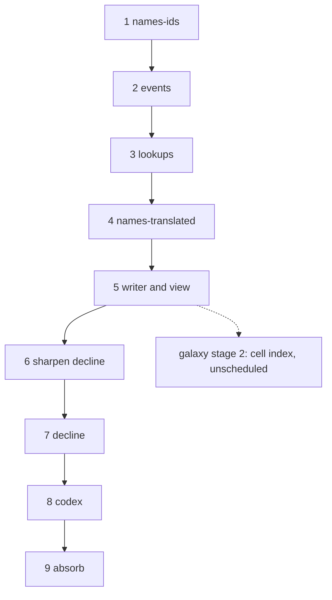

# Execution plan: the open proposals, in order

**Status:** In progress, 2026-09-22. Steps 1 to 5 done, and the first optimisation pass after them.
**Source proposals:** `names.md` (2 stages), `structured-output.md` (4 stages), `decline.md` (unstaged, not yet sharpened), `galaxy-in-motion.md` (5 stages, not scheduled). Each proposal's Design section is the specification; its Stages section is the unit of work here. Where this plan and a proposal differ on order, this plan wins.

The previous plan, which built Simulation v2, is `specs/done/plan.md`; its protocol for running a step in a fresh session applies here unchanged (read this file, then the step's proposal sections and code; check the ledger and `git log`; build; write the ledger entry).

## Order and dependencies

| step | what | proposal | shifts the histories? | gate |
|---|---|---|---|---|
| 1 | **names-ids**: ids in the sim, `FMet.how`, typed log tokens, channel and voice, families, transcribed proper names, the view through the pass | `names.md` stage 1 | **yes, once**: the history's RNG stops drawing for names; the reference batch is regenerated here and every later guard reads that batch | source test, pass determinism, convention and classifier, `TestDeterminism` on the new batch |
| 2 | **events**: every log line a typed record, `Fact` merged, `events.json`, the view from templates | `structured-output.md` stage 1 | no | byte-identical legends, the param test |
| 3 | **lookups**: the string tables to `data/`, keys where text was, the law `variant`, the `term` rule | `structured-output.md` stage 2 | no | byte-identical legends, coverage and source tests |
| 4 | **names-translated**: the plague profile, the inventory and banks, grounded translations, names read from walls, the terms replacing the miracle names | `names.md` stage 2 | no (the profile is hashed, not rolled) | size, grounding and cap tests; entitlement recomputation; the history's numbers unchanged |
| 5 | **writer and view**: the output directory, `-until`, the view and techstats from the files, the fold test, `FORMAT.md` | `structured-output.md` stage 3 | no (the fold test may add event kinds; the history does not change) | byte-identical legends from the files; the fold test |
| 6 | **sharpen decline**, and with it **what a people is to remember**: the index's variables, absolute or relative, the force, the age length; and the three memory questions the optimisation pass measured (the ledger row below holds the numbers) — how often a tale wears (the knob is in, `Config.WearEvery` and `worldgen -wear`, 1 being every tick as now; asked of the wearing on its own, a telling put through every eighth tick with each rate compounded over the gap comes out within 3% of one put through every tick, every fourth within 1%, every sixteenth 7% out, and the error is all in the forgetting, since a compounded roll grants at most one step where forgetting wants three — drawing the number of steps from a binomial over the gap would carry it further; it is worth about a tenth of a run), whether an heir inherits its parent's whole telling, and whether a first meeting trades tales about third parties | `decline.md` | — | the checklist empty, the memory questions answered or written down as left alone |
| 7 | **decline**, **a random stream per people**, and **the telling's summaries made incremental**: the index, the waning and the end read from it, the force; `w.R` split into a stream per phase and per people, each seeded by hashing a stable name (`hash(seed, "plagues")`, `hash(seed, civ id)`) and never by drawing sub-seeds in turn, so that adding a subsystem or a people moves nothing else; the civ steps run side by side behind it; `reckon`, `experienced` and `loreDials` kept as the telling changes instead of re-summed every tick | `decline.md` as sharpened; the stream from the v2 optimisation notes | **yes, twice over**: a behaviour change, and the streams renumber every history; the batch is regenerated once for both and read against the occupancy baseline | the proposal's tests; the occupancy table moved from the baseline; techstats' new measures (first wars per distinct pair, wars per thousand people-ticks, on twenty seeds) printed before and after; `TestDeterminism` green on the new streams, and the civs phase byte-identical between a serial and a parallel run |
| 8 | **codex**: the hand-written fiction, `tellings.md`, `knowing.md`, tone and vocabulary; `CLAUDE.md` links it | `structured-output.md` stage 4 | no | every emitted kind and key covered; the reader's checklist |
| 9 | **absorb**: `DESIGN_NOTES.md` describes the output directory, the names, the decline; the three proposals to `done/`; this plan to `specs/done/` | all | no | — |

## Why this order

**Names first** because it is the one step that shifts every history, and the byte-identity guard the structured-output stages rely on has to be established after it, not before; and because it makes the events step smaller (the log arguments are already typed ids). **Events before lookups** because the event vocabulary is one of the lookups and the template-per-kind is what the lookups' coverage test walks. **Lookups before names-translated** because the technical-term rule is enforced through the lookups' `term` fields and their coverage test, and the inventory files sit beside the other data files under the same embed. **Names-translated before the writer** so `FORMAT.md` documents the `names[]` rows once, with every mode in them. **The writer before decline** so decline is tuned with `techstats` reading the structured files and its baseline table can be a query rather than a scratch test; and so the guard for steps 2 to 5 (no behaviour change) is not interrupted by a behaviour change. **Decline before the codex** because the codex describes the waning and the end of an age, and should describe them as decline leaves them, not twice. **The random stream per people goes with decline** for the same reason the two regenerations are counted: splitting `w.R` renumbers every history exactly once, decline already regenerates the batch, and doing them apart would mean reading the batch twice for one change each. The optimisation pass measured what it buys (see the ledger row): the civ steps are 56% of a run and the plagues pass 13%, and only a stream per people lets either run beside itself; the 44% of civ-step time that draws nothing at all could be parallelised without the streams, but for about 1.3x against the 2x the streams open, and the same merge order has to be built either way. **Absorb last**, once, for the three proposals together, since they touch the same "Output" paragraphs of the spec.

**Galaxy in motion** is not scheduled: its own notes say stage 4 waits on a decision that the whole galaxy is what the game wants, and stages 1, 3 and 5 change the histories. Its stage 2 (the cell index replacing `Near`'s scan, no behaviour change, "pays now") can be taken any time after step 5 as an optimisation step, alongside the optimisation notes in `specs/done/plan.md`; it is drawn dotted above.

**Two regenerations of the reference batch**, at steps 1 and 7, and none in between. A step that finds it needs a third has found a behaviour change it was not supposed to make.

## What is not a proposal

Carried from the spec's "Next steps" and placed here so they are not lost:

- **The war-count measure** (`specs/notes/war-halving.md`): `techstats` prints first wars per distinct pair and wars per thousand people-ticks on twenty seeds. Do it at step 5, when techstats is rewritten to read the files, and before step 7 judges anything about war.
- **The tuning candidates** from the v2 ledger's "for step 19" (the picket's cost, the interceptor's sizing, the wisdom tech term, the tribute's length and the teach price, a floor per partnership for the slight, the fleet as a third road for a weapon, the cult share, the hunt's threshold, the want cap on ships, the heeded demand that comes straight back): after step 7, each as its own small change with the batch before and after, since each shifts the histories.
- **Level saturation at ten and the tree's cross-prerequisites**: with the tuning candidates.
- **A galaxy glitch found by the writer** (step 5): a catalogued planet with a period and no orbit puts the unseen worlds of its star at zero AU and an infinite temperature (`galaxy/system.go`, `amax` over `cat.Planets`; Gaia-5 in the 400-star field). The record writes the number as `null`; mending the generator moves the galaxy, so it waits for a step that regenerates the batch.
- **The optimisation pass** (`specs/done/plan.md`, "Optimisation notes") and galaxy stage 2: begun after step 5 with a profile in hand; see the ledger row below for what the first pass took and what it left. Galaxy stage 2 is **not** urgent for speed: `Near`'s scan did not appear in the profile at 200 or 300 stars.

## Architecture rules

The v2 rules stand (`specs/done/plan.md`, "Architecture rules": the mind decides, the profile is read never the kind, one tick, no map iteration on a random path, every rate per thousand years). Added by these proposals:

- **Ids only in the history.** No `Name` field, no text field but keys; no comparison against a lookup's text; no draw from the history's RNG for anything a consumer could re-render.
- **The record is omniscient.** Every event names its true cause and parties; ignorance is modelled only as a people's knowledge.
- **Keys resolve.** Every key the sim can emit has an entry in `data/`; the coverage test is part of every step from 3 on.
- **The chronicle is complete about the durable.** From step 5, a durable change without an event fails the fold test; the durable/derived table is kept with the writer.
- **Names are a pure function of the record.** `hash(seed, by, object, tone)` seeds every name; nothing else may.

## Progress ledger

| step | state | notes |
|---|---|---|
| 1 names-ids | done 2026-09-21 | `internal/names` rewritten as the pass; `data/` package with `families.json`; every seed shifted once (`TestSameHistory` re-pinned, `reports/tech` regenerated). Four seed-pinned harness tests moved to new seeds (`TestHarness` 6, `TestMuster` 57, `TestUnseen` 65, `TestAlienPairStaysDark` 12). Choices made without asking: `FMet.how` is the fact's `What`; `Fact.Plague` added so the sickness suspicion keys on ids; word rows for the state beneath are coined for voiceless peoples too until stage 4 (a stub); the view prints a never-named people as `unnamed #id`. |
| 2 events | done 2026-09-22 | `Event` is the typed record, `Fact` merged into it; `data/events.json` (232 kinds, 84 of them facts) with generated constants; `w.log` gone; the chronicle rendered by `lines.go` from the record. Legends byte-identical on ten seeds but for the archetype word in myth-wear tellings, which hashes the event id (296 lines of 214k); `TestSameHistory` re-pinned to the typed record's digest, and the legends digest of seed 5 pinned in `internal/legends`. Choices made without asking: a fact's chronicle line is the fact's own, chosen by a `way` parameter, and the outcome lines of filters are a `faced` chatter kind beside the silent fact, since the fact is written only the first time; the record and the chronicle are two orders over one list (`fact` places before its spread, `told` after); `node_learned` is written for every node, so the record is two fifths larger than the old log (16.5k events for 11.6k lines on seed 5); text parameters stay words until step 3. |
| 3 lookups | done 2026-09-22 | Twenty tables in `data/` (the proposal's fourteen and `aptitudes`, `sources`, `causes`, `origins`, beside `events` and `families`), each with a header and the term rule; the simulation reads its numbers from them and keeps profiles, hooks and outcome functions in Go under the same keys. Every text field of the records is a key (`Legacy.Portrait`, `Civ.Cause`, `Civ.Origin`/`Species.Made` as a `Making`, `War.Cause`/`Result`, `Betrayal.Shape`, `Trace.Kind`, `Civ.Into`, a typed `Civ.Record`) and every text parameter of an event a key or an id; the view derives the words. Legends byte-identical on the ten seeds, the full and the debug runs; `TestSameHistory` re-pinned since the record's parameters changed shape. Choices made without asking: a fact's reason is a key with the ids its text names beside it (`by`, `at`, `plague`, `blast`) rather than a struct; a blast's "what" is the blast event; the scars file lists the dialed scars first in the old order so the dial sums do not move; the profiles and outcome functions stay in Go (data would have to name code); the galaxy's remnant and companion words became keys because the history compared them, the rest of the galaxy's words did not; `Inscription.Text` stays until the writer freezes the maker's knowledge. |
| 4 names-translated | done 2026-09-22 | The plague profile at birth (`plague.Profile`, hashed from the seed and the id; `data/plagues.json`); `data/epithets.json` (1,561 entries, the `notice` table, the counted properties) and `data/banks.json`; `internal/names/translated.go` recomputes what a namer knows from the facts before the coining and draws a recipe by score; names read from walls; the miracle names replaced by terms. The history's digest unchanged; the legends' digest re-pinned. Choices made without asking: a voiced people's `friend` row is its adopted endonym and the exonym is the `stranger` row, so a pair has at most stranger, friend and enemy-or-monster; `monster` is a crime of weight four or more, since the monster reckoning is state, not a fact; sky names are capped at the twelve brightest from the cradle and coined at the people's birth; a hearer's plague name is entitled by a tale in `Civ.Lore` (state the sim leaves, read after the run); the world-given body traits (robust, fragile, hardy, cooperative) count as body, not world; the tellings ask for a name by regard through a tone on the token, with a fallback ladder; a voiceless people's plague, word and war lines say so instead of naming; the debug view's `unnamed #id` stands for a voiceless people no voiced people met. |
| 5 writer and view | done 2026-09-22 | `internal/record` (the four files' types, `FORMAT.md`, read and write), `history/export.go` and `internal/writer` (the names, the voices, the code revision); `worldgen -out`, `-legends`, `-read`, `-until`; `internal/legends` reads the directory only (the templates and the tellings' grammar moved out of the history, the text tables read from `data/`); `techstats` reads the records, run or loaded (`-runs`). Legends byte-identical on the ten seeds, the full and the debug runs; the history's digest unchanged over the told events. The fold test on four seeds forced twenty-nine silent kinds (`events.json`, `silent`), written by the setters that make each durable change (`history/notes.go`) and given ids after every told event so the tellings' archetype hash does not move. Choices made without asking: testaments freeze what the telling read of the world (`Frozen`) instead of keeping text; a tale carries its believed year, the teller's sort and weight and its rank; `plague.hosts` folds as a count; a star's class and a people's traits are snapshot; the `-ai` text names things by key. The war-count measure for techstats (first wars per distinct pair, wars per thousand people-ticks) is not added here: techstats reads the records now, and the measure is step 7's to print before and after. |
| optimisation 1 | done 2026-09-22 | Not a proposal step: the pass the plan schedules after step 5. **The tests**: `go test ./...` 11m30s to about 4m, with no coverage dropped. The history package shares one generated age (`reference`, seed 7) across `TestParams`, `TestKeysResolve` and the first of `TestDeterminism`'s three runs, so it makes three 200-star ages where it made six; the three determinism runs go side by side (race-detector clean, byte-identical), `TestOneStep` moved to 60 stars since it asks only for arithmetic over the age, `names` memoises its four seeds (they were regenerated nine times) and builds its batch concurrently, `TestFold`'s four seeds run in parallel, and `-short` gives the non-pinned heavy tests a 120-star field. **The simulation**: seed 3 at 200 stars 121.8s to 74.1s of CPU, byte-identical legends on ten seeds. Four changes, each one leaving off work that is done again and again though it rarely changes. `aptitude` scanned all 229 rows of `data/aptitudes.json` per node per pursuit choice per people per tick (and again under `had`); the table is now bucketed per node at init in its own order (`aptFor`, `tech.Node.Idx`). `uses` rebuilt each people's node list every tick, a 112-node scan with a string-map lookup each, a `tech.Get` per hit and a sort with two more lookups per comparison; the list is now kept on the people (`useNodes`) and dropped by `know`, `forgetNode` and `learn`, which are the only three writers of `Known` and `Learned`. Both were named in the v2 notes (steps 3 and 4). `revise` asked `regard` for the other party of every tale a people holds, though a people holds hundreds of tales about a handful of others and nothing `revise` writes is anything `regard` reads: the answer is now held for the length of one retelling (`regardHolder`, stamped so the table needs no clearing), which took most of `contains` with it. `suspicion` walked the whole telling twice, once for the cures and once for the sicknesses, where the second walk only read what the first built: one walk now gathers both and weighs them after, in the telling's own order. **Found while doing it**: `cosmic.go` set a boon keyed `"star kept"`, a phrase with a space and no row in `data/boons.json`, so it resolved nowhere — now `star_kept` with a row; and the telling rendered the object party in object case even where the clause made it the subject, so 317 "and us paid for it", 257 "and us declared themselves", 46 "Us bent the knee", 7 "us woke up alone" and 2 "Us yielded" across 225k lines of legends — now `{OS}` and the reflexives `{RS}`/`{RO}`, and the legends digest re-pinned for it. **Instruments left behind**: `-phases` also prints each civ step's time and what it drew from the RNG (the random source is wrapped under `-phases`, so no draw escapes the count and the numbers are the source's own), and the peoples, worlds and tales the tick was spent on; `internal/history/cost_test.go` (`COST=1`) builds worlds of a given peoples-by-worlds shape and times a tick. **What the measuring said**: cost per 1000 ticks is about `7.5*peoples + 7.4*worlds + 0.13*tales` (R^2 0.92); of the civ steps, 44% of the time draws nothing from the RNG (`flows` 29% and not one draw, `fathoming` 8.4%, `guns` 4.7%, `research` 1.8%) and could run beside itself as it stands, while `lore` at 28.9% draws 154 million numbers, about seventy-seven per people per tick, since `wear` rolls for every tale a people holds every tick; running wear on a longer cadence at a higher rate would cut the largest remaining cost by most of an order of magnitude and is the one place the measuring found where trading a mechanic buys something large, so it is a decision for decline to take or leave, not a refactor. Nothing is quadratic in the code: the curve is that tales per people grow with the number of peoples, and `prune`'s 500-tale cap turns it linear again past roughly 140 peoples. At a fixed number of worlds, splitting them among four times as many peoples costs 4.1x: a people is worth about nineteen worlds, cold. **What a telling is and what it costs** (the numbers steps 6 and 7 are to decide on; seed 3 at 200 stars): 350 peoples arose and 31 stood at the present, and a people held a median of 443 tales about some 125 distinct other peoples, of whom about four were still alive. **95.2% of the tales a people still held were about parties every one of which was already dead.** Two thirds of a telling is not its own: 66% inherited, 17% told, 15% witnessed, 2% read off a wall; 68% has degraded at least once (32% worn, 36% myth); 20.5% is about a people never met, though 98.6% is about one the teller can hold in mind, so the "nothing can be felt toward what cannot be held in mind" short circuit in `regard` almost never fires. The telling grows with the field and not merely with the age: at a matched forty million years, nine peoples held nineteen tales each at 50 stars and thirty-eight held two hundred and twenty-nine at 200. It is not unbounded — `prune` caps a telling at 500 and 148 of the 350 were at the cap — so the cost is linear in peoples with a large constant, not quadratic; the curve the pass first measured is the approach to that cap. Six walks of the whole telling run per people per tick: `wear` (each tale decays on its own, and this is where the 154 million draws are), `reckon` (who is remembered as a monster), `experienced` (what the people has suffered, which is Wisdom), `revise` (each tale's slant follows the teller's regard now), `suspicion` (who is remembered as plagued) and `loreDials` (temperament: bold from remembered wins, loyal from remembered promises). The dead parties are not dead weight to those: a people's character is shaped by what was done to it whether or not the doer survives, and `scapegoat` moves blame onto the foe of the day precisely from "a people dead or never met". What is wrong is not what is kept but when it is worked out: `reckon`, `experienced` and `loreDials` are summaries of a whole telling that move by a hair when one tale wears, and they are built again from nothing fifty thousand times a run.

**Why the streams are a stream per subsystem and not only one per people** (the optimisation pass learned this the hard way; see the note on measuring below): with one stream, any change to what is drawn or when slides every later draw, so a change to the wearing changes the galaxy, the species and when the first peoples arise. Hashing a stable name per domain keeps those apart: the same galaxy, the same bloods, the same deep pass and the same early arisings whichever way a mechanic is set. It removes the coupling that is an accident of draw order; it cannot remove the coupling that is real, since a tale reaching myth stops `dread` keeping ships from a star, so expansion moves and with it who meets whom. That is the point, and the line to hold: **a change having an effect nobody expected is fine, and is usually the interesting part; a change having an effect only because it reshuffled the draws is not interesting at all.** The streams are what tells the two apart. What is left after them is the mechanic's own doing, however surprising, and worth reading. The rule this sets is that a phase's draws belong to that phase, and it costs nothing at the call sites — `w.R` is reassigned at the top of each phase and each people's turn, so the 167 places that draw need no edit. The gate it buys, which would have caught what the pass got wrong: **the galaxy, the species pool and the deep pass must be byte-identical across a mechanic change.** It is the same rule the names pass and the plague profile already keep ("Names are a pure function of the record", above), carried inward.

**On measuring anything in this simulation** (the pass got this wrong three times before getting it right): a run's numbers have a spread wider than their middle. Over twenty-four seeds at 120 stars the wars of a run ran from 2 to 3100, a standard deviation two and a half times the mean, and the tales a living people held from 8 to 311. Two halves of the *same* twenty-four seeds differed by 299% on wars and 20% on tales. Pooling the tales out of those runs does not help, since tales of one run are not independent of each other. So no claim of the form "within five percent" can be made by comparing whole runs, at any sample size worth paying for, until the streams above make the comparison something near paired. Until then, a question about a mechanism is asked of the mechanism on its own, with the feedback cut (`internal/history/wearcadence_test.go` is the pattern: one people, a telling built to order, nothing running but the thing under test), and every such claim is checked first by running the same configuration twice and seeing how far apart it lands.

**Left for step 7**, with the streams: the summaries above made incremental — the monster tally, the suffering count and the temperament dials kept as tales are added, worn, revised and forgotten, rather than re-summed per people per tick. It is exact in principle and behaviour-preserving in intent, but the order floats accumulate in is not, so it belongs in the step that regenerates the batch and can read the result; a narrower thing to try first is that a tale all of whose parties are dead can only change slant through the teller's own state, which is 95% of a telling. Also with the streams: the parallel civ steps, and the merge order for what they write (`flows` alone is 29% of the civ steps and draws nothing, so its events need only be buffered per people and appended in civ order; `rare` marks holders on sources, which are disjoint since a star has one holder). **Left for the next optimisation pass**, in order: the rarity walk in `flows` (`rarities` reads every trade partner's every holding every tick, the one peoples-by-worlds product term; it needs care, since `rare` marks holders and fires first-had events, and its inputs include other peoples' state), interning the node keys as indices with `Known` as a bitset (string-keyed maps were 31% of the run before this pass), the roughly eighty `sortedInts` sites that allocate and sort per people per tick, and folding the lore's six walks of a telling per people per tick into fewer. |
| 6 sharpen decline | not started | |
| 7 decline | not started | |
| 8 codex | not started | |
| 9 absorb | not started | |
