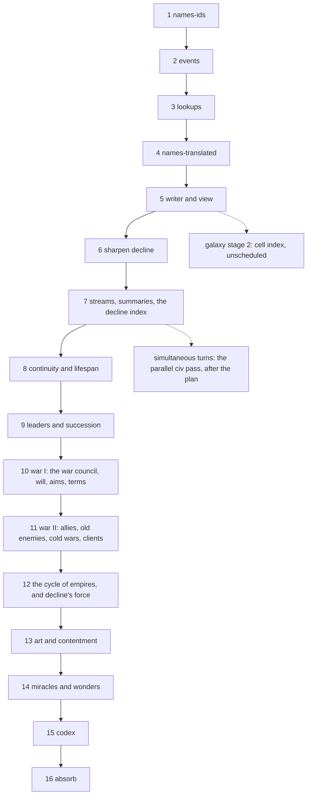

# Execution plan: the open proposals, in order

**Status:** In progress, 2026-09-24. Steps 1 to 6 done, and the first optimisation pass after step 5. Step 7 is done, and a second optimisation pass with it. Step 8 is done: `continuity.md` sharpened and built, the batch regenerated. Step 9 is done: `leaders.md` sharpened and built, the batch regenerated again. `war.md` drafted the same day and placed as steps 10 and 11; step 10 is done (stage 0, the instrument, then stage 1, the war council) and step 11's stage 2 (allies and old enemies), before the cycle of empires: the war procedure had no step for a war already running, and everything after it is tuned against the wars it makes. The parallel civ steps, the last thing step 7 named, were measured and **not taken**: the civ pass is order-dependent in the world's state, not only in the draws, so it is a rearchitecture rather than a step, and it is written up as `simultaneous-turns.md` for after the plan. The wins the profile named went in instead, for 22% of the run. Replanned at step 6's end, when the sharpening's measurements and a design round on the arc of the age added three proposals and moved decline's force into one of them; `art.md` and `miracles.md` added the same day and placed last of the mechanisms, before the codex that renders them.
**Source proposals:** `names.md` (2 stages, done), `structured-output.md` (4 stages, one left), `decline.md` (3 stages, sharpened at step 6; its stage 3 moved to `empires.md`), `continuity.md` (sharpened and built at step 8), `leaders.md` (sharpened and built at step 9), `war.md` (placed as steps 10 and 11; stage 0 built), `empires.md`, `art.md` and `miracles.md` (drafts, not yet sharpened), `galaxy-in-motion.md` (5 stages, not scheduled), `simultaneous-turns.md` (4 stages, not scheduled and deliberately after this plan). Each proposal's Design section is the specification; its Stages section is the unit of work here. Where this plan and a proposal differ on order, this plan wins.

The previous plan, which built Simulation v2, is `specs/done/plan.md`; its protocol for running a step in a fresh session applies here unchanged (read this file, then the step's proposal sections and code; check the ledger and `git log`; build; write the ledger entry).

## Order and dependencies

| step | what | proposal | shifts the histories? | gate |
|---|---|---|---|---|
| 1 | **names-ids**: ids in the sim, `FMet.how`, typed log tokens, channel and voice, families, transcribed proper names, the view through the pass | `names.md` stage 1 | **yes, once**: the history's RNG stops drawing for names; the reference batch is regenerated here and every later guard reads that batch | source test, pass determinism, convention and classifier, `TestDeterminism` on the new batch |
| 2 | **events**: every log line a typed record, `Fact` merged, `events.json`, the view from templates | `structured-output.md` stage 1 | no | byte-identical legends, the param test |
| 3 | **lookups**: the string tables to `data/`, keys where text was, the law `variant`, the `term` rule | `structured-output.md` stage 2 | no | byte-identical legends, coverage and source tests |
| 4 | **names-translated**: the plague profile, the inventory and banks, grounded translations, names read from walls, the terms replacing the miracle names | `names.md` stage 2 | no (the profile is hashed, not rolled) | size, grounding and cap tests; entitlement recomputation; the history's numbers unchanged |
| 5 | **writer and view**: the output directory, `-until`, the view and techstats from the files, the fold test, `FORMAT.md` | `structured-output.md` stage 3 | no (the fold test may add event kinds; the history does not change) | byte-identical legends from the files; the fold test |
| 6 | **sharpen decline**, and with it **what a people is to remember**: the index's variables, absolute or relative, the force, the age length; and the three memory questions the optimisation pass measured — how often a tale wears, whether an heir inherits its parent's whole telling, whether a first meeting trades tales about third parties | `decline.md` | no (the sampling hook draws nothing) | the checklist empty, the memory questions answered or written down as left alone |
| 7 | **the streams, the summaries, and the decline index**: `w.R` split into a stream per phase and per people, each seeded by hashing a stable name (`hash(seed, "plagues")`, `hash(seed, civ id)`) and never by drawing sub-seeds in turn, so adding a subsystem or a people moves nothing else; ~~the civ steps run side by side behind it~~ (not taken; see the ledger and `simultaneous-turns.md`); `reckon`, `experienced` and `loreDials` kept as the telling changes instead of re-summed every tick; `Config.WearEvery` to 4; then `decline.md` stages 1 and 2 — the index computed and exported, then declaring the waning and the end, with the fertility end kept as a floor. **The streams go in first**, because everything after this step is tuning against a table and this simulation's run-level numbers have a spread wider than their middle; the streams are what make those comparisons near-paired. | `decline.md` stages 1-2; the stream from the v2 optimisation notes | **yes**: the streams renumber every history and the index moves the waning; the batch is regenerated once for all of it | `TestDeterminism` green on the new streams; ~~the civs phase byte-identical between a serial and a parallel run~~ (dropped at the step, and moved to `simultaneous-turns.md` stage 4: see the ledger); stage 1 byte-identical legends; over twenty seeds, how many ages the index ends and how many fall through to the floor — the count step 12 drives to zero; techstats' war measures (first wars per distinct pair, wars per thousand people-ticks) printed |
| 8 | **continuity and lifespan**: `Species.Lifespan` and the tech that moves it; generations per tick; `Civ.Continuity` derived; `memory()` rewired to read it; continuity into `stiffGrowth` and the dark age's depth; the archive as a structure; the `uploading` filter and Heaven | `continuity.md` | **yes** | the two-ended failure shown: high continuity setting faster, low continuity taking deeper dark ages; continuity and stiffness demonstrably not the same number; Heaven a new contraction cause in the batch |
| 9 | **leaders and succession**: a leader as a rare, conditional, named state; where they physically are and what that does; temperament and the dials term that can invert a people's bent; their death; the succession filter; the crazed immortal | `leaders.md` | **yes** | named figures in the legends and in every telling; the succession filter's three outcomes all observed; a leader's loss costing what its realm's continuity says it should |
| 10 | **war I: the war council, will, aims and terms**: first the instrument, the seven war patterns and the health table measured on twenty seeds with no behaviour change; then press, hold or sue for each side of each running war from what it believes, the side declared on striking back, every war under a council however it began; will that follows the war instead of a clock; an aim for every war (a column on the war causes) and terms that end one before either side is broken, a ceded world among them; momentum, the machinery a conquest wave runs on | `war.md` stages 0 and 1 | **yes** | stage 0 byte-identical; then patterns 1 (short and long wars, the long ones fought throughout) and 4 (border disputes between large realms) against stage 0's baseline, the side declared on striking back in a third of fought wars or more, loop pairs none, ages inside 20 to 80 Myr, nothing capped |
| 11 | **war II: allies, old enemies, cold wars and clients**: the ally's own council with an aim bound to its principal's war, the cascade read and tuned; the rivalry, its lower bar and its escalating aim; the arms race (a deterrence term in the want), the rival watched, the incident; the vassal's council on its leash, the call to its master, the master's choice between joining and backing | `war.md` stages 2 and 3 | **yes** | patterns 2 (old enemies), 3 (world wars), 5 (cold wars) and 6 (proxy wars) observed, per seed, on twenty seeds; step 10's patterns not degraded |
| 12 | **the cycle of empires, and decline's force**: separatism and the quiet going; coalitions against a hegemon; war spending what it is fought over; plagues on connectivity; the conquest wave; later filters; and `decline.md`'s stage 3, whose gate this inherits. The tuning candidates below that are not war-shaped fold into this step's tuning pass; the conquest wave's machinery (a winner pressing on) is step 10's, and this step supplies what starts one | `empires.md`; `decline.md` stage 3 | **yes** | the concentration curve showing the arc; `decline.md`'s stage-3 gate (the present under two thirds of the height in every seed and under half in the median, no height in the last third, the still span under a third of the age, ages inside 20 to 80 Myr, nothing capped); the fertility floor removed with no seed in twenty falling through |
| 13 | **art and contentment**: `Civ.Morale` promoted to a dial with a rising side, more readers than Social and Aggression, and a bound; population as the organic capacity of the holdings; a `Hearth` category in the flow the council feeds in advance, moved up the order by discontent and shed when it cannot be paid; art as a made tale with references, circumstance tags and potency; the fit bonus; cultural art spreading on contact and physical art as a work, a find and loot; the continuity term | `art.md` | **yes** | the dial observed rising as well as falling; the hearth observed both fed and shed, with the direction naming discontent as its reason; the fit distribution not degenerate; an art outliving its maker in the hands of the people that ended it; the civil-war and separatism rates moved in the claimed direction and by no more than step 12's tuning tolerates |
| 14 | **miracles and wonders**: the new miracle rows and their filters — the evil eye (a decorator on step 7's streams), skip, echoes, empathy, delusion (a false `Intel`, never a forced decision); then the leviathans, the lure, the mirror and the elder fleet as a legacy form; then the wonders Gehenna and Eden, claimed rather than gained, with the Remnant as a people under three rules; the barrier last, after a design pass of its own | `miracles.md` | **yes** | each row observed held, used and failed at; a deluded people striking or sparing on a false picture; Gehenna converting a second world, Eden untaken and in an earlier age's myths, a Remnant traded into and never launching; the wall solved back to where it started; step 12's arc measures not degraded |
| 15 | **codex**: the hand-written fiction, `tellings.md`, `knowing.md`, tone and vocabulary; `CLAUDE.md` links it | `structured-output.md` stage 4 | no | every emitted kind and key covered; the reader's checklist |
| 16 | **absorb**: `DESIGN_NOTES.md` describes the output directory, the names, the decline, continuity, leaders, the cycle, art and the new miracles; the proposals to `done/`; this plan to `specs/done/` | all | no | — |

## Why this order

**Names first** because it is the one step that shifts every history, and the byte-identity guard the structured-output stages rely on has to be established after it, not before; and because it makes the events step smaller (the log arguments are already typed ids). **Events before lookups** because the event vocabulary is one of the lookups and the template-per-kind is what the lookups' coverage test walks. **Lookups before names-translated** because the technical-term rule is enforced through the lookups' `term` fields and their coverage test, and the inventory files sit beside the other data files under the same embed. **Names-translated before the writer** so `FORMAT.md` documents the `names[]` rows once, with every mode in them. **The writer before decline** so decline is tuned with `techstats` reading the structured files and its baseline table can be a query rather than a scratch test; and so the guard for steps 2 to 5 (no behaviour change) is not interrupted by a behaviour change. **Decline before the codex** because the codex describes the waning and the end of an age, and should describe them as decline leaves them, not twice. **The random stream per people goes with decline** for the same reason the two regenerations are counted: splitting `w.R` renumbers every history exactly once, decline already regenerates the batch, and doing them apart would mean reading the batch twice for one change each. The optimisation pass measured what it buys (see the ledger row): the civ steps are 56% of a run and the plagues pass 13%, and only a stream per people lets either run beside itself; the 44% of civ-step time that draws nothing at all could be parallelised without the streams, but for about 1.3x against the 2x the streams open, and the same merge order has to be built either way. **The streams come first, before everything**, which step 6's sharpening settled: every step from here on is tuning against a table, and this simulation's run-level numbers have a spread wider than their middle, so the comparison has to be near-paired before it can be read at all. Nothing after step 7 can be measured honestly without them.

**Continuity before leaders before the cycle**, because that is the order they read each other. Continuity is an input to ossification, to a dark age's depth, to the succession filter's difficulty and to the conquest wave's fragility, so building the cycle first would mean retro-fitting it into every one of those and touching each twice. A leader is what a conquest wave *is*, and the succession filter is how a wave ends, so leaders precede the cycle for the same reason.

**War after leaders and before the cycle.** Added at step 9's end, when the question of why battles are so rare was run down (the ledger's step-9 row, and `war.md`'s Problem): the council has no step for a war already running, so each war gets one fleet from its declarer and none from anyone else, over a third get no fleet by construction, and will runs out on a clock. The cycle of empires is tuned against how wars behave — its conquest wave is a war that keeps going, its coalitions are allies that fight, its separatism is a war an heir starts — so building it on today's wars would mean tuning it twice. Leaders come first because a leader at the front is one of the things a war council reads, and the war steps are where step 9's front first matters. Two steps and not one, because the first (the council, will, aims and terms) changes every war and is worth reading alone before allies, rivals and clients are layered on it.

**Decline's force moved out of step 7 and into step 12.** The attrition `decline.md` specifies — the old letting go of their outer worlds — and the separatism `empires.md` specifies are the same check with two outcomes, chosen by whether the province has enough to stand on. Building the quiet one at step 7 and the loud one at step 12 would be building it twice at a regeneration each. So step 7 takes decline's first two stages and keeps the fertility end as a floor, and step 12 supplies the force and removes the floor. Step 7 is still worth taking on its own: it delivers the index as an instrument, and the index is what steps 8 to 12 are read with.

**Absorb last**, once, for all the proposals together, since they touch the same "Output" and "Filters" paragraphs of the spec.

**Art last of the mechanisms, and immediately before the codex.** It is the one step whose value is mostly legible rather than structural, and it wants the structural arc already settled: an art is about its maker's circumstances, and separatism, coalitions, waves, leaders and their deaths are most of the circumstances worth making anything about. It also reads `continuity.md` (an art is a memory that does not wear) and modulates step 12's break, which is a reason to come after that tuning rather than during it. Its first stage carries a contraction lever that is not military and that step 12 may want: the hearth's upkeep scales with population, so a large realm pays more to keep itself content out of the same income that buys its expansion, and a core fed by its provinces' tribute carries a population its own land cannot. The honest cost is that it is a sixth regeneration and a seventh step on a plan whose steps 7 to 12 are all unbuilt; its first two stages are separable if that cost has to come down, since stage 1 is contentment alone and touches no new object.

**Miracles after art and before the codex.** They are mostly content — rows in `data/miracles.json` and a filter each — but two of them are not schedulable earlier: the evil eye is a decorator on the per-people streams and a rewrite of every call site without them, so it waits for step 7; and Gehenna is a world whose holder acquires a programme, which is step 12's kind of thing and wants step 12's arc already measured before it is added to. Kept as one step rather than folded into the steps that already regenerate, because the gate is about rarity and the wall budget across the whole set, and that measurement cannot be read through step 12's tuning. The wall is the step's real constraint: miracles are era-4 tech nodes behind their own prerequisites, not a fixed pool, so new rows raise the number of holdings through the tree, through `born` and through elder artifacts alike, and the new wear rates are solved against the batch so the wall at the present lands where it started.

**The codex moved behind the cycle.** It describes the fiction, and leaders, continuity, the deathless, the cycle, art and the new miracles all change what the fiction is; written at step 8 it would be written twice. Art in particular gives the tellings a shape they do not have, so the codex is cheaper written once, after it. This is the reason the plan already gave for putting it after decline, with more weight behind it now.

**Galaxy in motion** is not scheduled: its own notes say stage 4 waits on a decision that the whole galaxy is what the game wants, and stages 1, 3 and 5 change the histories. Its stage 2 (the cell index replacing `Near`'s scan, no behaviour change, "pays now") can be taken any time after step 5 as an optimisation step, alongside the optimisation notes in `specs/done/plan.md`; it is drawn dotted above.

**Seven regenerations of the reference batch**, at steps 1, 7, 8, 9, 10, 11 and 12, and none in between any pair. Each of the last six is one proposal's worth of behaviour change landing at once; a step that finds it needs a second has found a change it did not mean to make. Within a step, the intermediate tuning is measured against itself and not against the batch, which is what the streams are for — the batch is re-pinned once, when the step lands.

**The proposal chain, and what reads what.** `continuity.md` is the foundation: `leaders.md` reads it for the succession filter's difficulty and a leader's span, `empires.md` reads both for the conquest wave's fragility, `art.md` reads continuity again (an art is a memory that does not wear) and pushes on `empires.md`'s shared quantities rather than adding its own, and `miracles.md` hands `empires.md` one wonder whose holder acquires a programme. Two lines are drawn across the whole chain and every later proposal keeps them: **the disposition and the picture may be moved, the decision procedure may not** (`leaders.md`, kept by `art.md`'s hearth and by `miracles.md`'s delusion, which corrupts a people's `Intel` and never its council); and **mechanisms cohere by pushing on a few shared quantities** (`empires.md` — overreach, spentness, what is remembered against the holder, continuity, and contentment as the fifth). Nothing in the chain adds a population number, because `art.md` settles that the organic yield of a people's holdings already is one.

**Why the new work is five proposals and not one.** (Six since step 9, with `war.md`.) Continuity, leaders, the cycle, art and the miracles are each a coherent unit with its own gate, and each is large; bundled they would be a single step nobody could review or roll back. Split the other way — a proposal per mechanism — and the count of regenerations goes up with it, since every one of them shifts the histories. Five is the smallest split where each step is gateable and each regeneration pays for a whole design rather than a mechanism.

## What is not a proposal

Carried from the spec's "Next steps" and placed here so they are not lost:

- **The war-count measure** (`specs/notes/war-halving.md`): `techstats` prints first wars per distinct pair and wars per thousand people-ticks on twenty seeds. Do it at step 5, when techstats is rewritten to read the files, and before step 7 judges anything about war.
- **The tuning candidates** (the war-shaped ones — the picket's cost, the interceptor's sizing, the tribute's length, the hunt's threshold, the want cap on ships — now fold into the war steps, 10 and 11, since each would otherwise cost a regeneration of its own and each is read by the war patterns; the rest into step 12's tuning pass) from the v2 ledger's "for step 19" (the picket's cost, the interceptor's sizing, the wisdom tech term, the tribute's length and the teach price, a floor per partnership for the slight, the fleet as a third road for a weapon, the cult share, the hunt's threshold, the want cap on ships, the heeded demand that comes straight back): after step 7, each as its own small change with the batch before and after, since each shifts the histories.
- **Level saturation at ten and the tree's cross-prerequisites**: with the tuning candidates.
- **A galaxy glitch found by the writer** (step 5): a catalogued planet with a period and no orbit puts the unseen worlds of its star at zero AU and an infinite temperature (`galaxy/system.go`, `amax` over `cat.Planets`; Gaia-5 in the 400-star field). The record writes the number as `null`; mending the generator moves the galaxy, so it waits for a step that regenerates the batch.
- **The optimisation pass** (`specs/done/plan.md`, "Optimisation notes") and galaxy stage 2: begun after step 5 with a profile in hand; see the ledger row below for what the first pass took and what it left. Galaxy stage 2 is **not** urgent for speed: `Near`'s scan did not appear in the profile at 200 or 300 stars.

## Architecture rules

The v2 rules stand (`specs/done/plan.md`, "Architecture rules": the mind decides, the profile is read never the kind, one tick, no map iteration on a random path, every rate per thousand years). Added by these proposals:

- **Ids only in the history.** No `Name` field, no text field but keys; no comparison against a lookup's text; no draw from the history's RNG for anything a consumer could re-render.
- **The record is omniscient.** Every event names its true cause and parties; ignorance is modelled only as a people's knowledge.
- **Keys resolve.** Every key the sim can emit has an entry in `data/`; the coverage test is part of every step from 3 on.
- **The chronicle is complete about the durable.** From step 5, a durable change without an event fails the fold test; the durable/derived table is kept with the writer.
- **Names are a pure function of the record.** `hash(seed, by, object, tone)` seeds every name; nothing else may.
- **A phase's draws belong to that phase, and a people's to that people.** From step 7 `w.R` is a stream per phase of the tick and per people (`internal/history/streams.go`), each seeded by hashing a stable name with the world's seed and never by drawing sub-seeds in turn. A subsystem added, or a draw moved inside one, moves nothing else; the peoples may be stepped in any order. `TestStreamsAddAPhase` is the gate: a phase that only draws changes no history at all.
- **What a telling says about a people is kept, not counted.** From step 7 the dials a telling pulls and the count of a people's own griefs are running totals, moved as tales are learned, worn, forgotten and restored (`internal/history/summaries.go`); nothing may write a tale's `Wear` or `Forgot` except through `amend`. The dials are kept as whole four-hundredths of a point so that a total reached in one order equals the same total reached in another, which is what makes the check exact and what will let the peoples be summed beside each other. `TestSummariesAreKept` is the gate: at every tick of a whole age the kept numbers equal a walk of the telling, to the bit.
- **A leader moves what the council reads, never how it decides.** From step 9 (`internal/history/leaders.go`) a leader's bent is a term in the dials and its stance is what `posture()` returns while it reigns; `mind.Bar` and the rest of the mind are unchanged, and nothing about a leader branches around the council. Whether one rises, and its bent and temperament, are drawn from a stream of the people's leaders' own (`leader:<id>`), so a people's history is the same draw for draw until it has one.
- **A people's continuity is derived, never stored, and read on the log of its loss.** From step 8 (`internal/history/continuity.go`) continuity is computed where it is read, from the blood's span, the arts, the archives and a recent dark age; a term that reads it reads `doublings`, the loss over the middle on a log scale, because continuity bunches under one for everyone with letters and medicine and the loss is where peoples differ. A blood's span is hashed from the seed and its id when it is registered, so the span, like a name, moves no stream.

## Progress ledger

| step | state | notes |
|---|---|---|
| 1 names-ids | done 2026-09-21 | `internal/names` rewritten as the pass; `data/` package with `families.json`; every seed shifted once (`TestSameHistory` re-pinned, `reports/tech` regenerated). Four seed-pinned harness tests moved to new seeds (`TestHarness` 6, `TestMuster` 57, `TestUnseen` 65, `TestAlienPairStaysDark` 12). Choices made without asking: `FMet.how` is the fact's `What`; `Fact.Plague` added so the sickness suspicion keys on ids; word rows for the state beneath are coined for voiceless peoples too until stage 4 (a stub); the view prints a never-named people as `unnamed #id`. |
| 2 events | done 2026-09-22 | `Event` is the typed record, `Fact` merged into it; `data/events.json` (232 kinds, 84 of them facts) with generated constants; `w.log` gone; the chronicle rendered by `lines.go` from the record. Legends byte-identical on ten seeds but for the archetype word in myth-wear tellings, which hashes the event id (296 lines of 214k); `TestSameHistory` re-pinned to the typed record's digest, and the legends digest of seed 5 pinned in `internal/legends`. Choices made without asking: a fact's chronicle line is the fact's own, chosen by a `way` parameter, and the outcome lines of filters are a `faced` chatter kind beside the silent fact, since the fact is written only the first time; the record and the chronicle are two orders over one list (`fact` places before its spread, `told` after); `node_learned` is written for every node, so the record is two fifths larger than the old log (16.5k events for 11.6k lines on seed 5); text parameters stay words until step 3. |
| 3 lookups | done 2026-09-22 | Twenty tables in `data/` (the proposal's fourteen and `aptitudes`, `sources`, `causes`, `origins`, beside `events` and `families`), each with a header and the term rule; the simulation reads its numbers from them and keeps profiles, hooks and outcome functions in Go under the same keys. Every text field of the records is a key (`Legacy.Portrait`, `Civ.Cause`, `Civ.Origin`/`Species.Made` as a `Making`, `War.Cause`/`Result`, `Betrayal.Shape`, `Trace.Kind`, `Civ.Into`, a typed `Civ.Record`) and every text parameter of an event a key or an id; the view derives the words. Legends byte-identical on the ten seeds, the full and the debug runs; `TestSameHistory` re-pinned since the record's parameters changed shape. Choices made without asking: a fact's reason is a key with the ids its text names beside it (`by`, `at`, `plague`, `blast`) rather than a struct; a blast's "what" is the blast event; the scars file lists the dialed scars first in the old order so the dial sums do not move; the profiles and outcome functions stay in Go (data would have to name code); the galaxy's remnant and companion words became keys because the history compared them, the rest of the galaxy's words did not; `Inscription.Text` stays until the writer freezes the maker's knowledge. |
| 4 names-translated | done 2026-09-22 | The plague profile at birth (`plague.Profile`, hashed from the seed and the id; `data/plagues.json`); `data/epithets.json` (1,561 entries, the `notice` table, the counted properties) and `data/banks.json`; `internal/names/translated.go` recomputes what a namer knows from the facts before the coining and draws a recipe by score; names read from walls; the miracle names replaced by terms. The history's digest unchanged; the legends' digest re-pinned. Choices made without asking: a voiced people's `friend` row is its adopted endonym and the exonym is the `stranger` row, so a pair has at most stranger, friend and enemy-or-monster; `monster` is a crime of weight four or more, since the monster reckoning is state, not a fact; sky names are capped at the twelve brightest from the cradle and coined at the people's birth; a hearer's plague name is entitled by a tale in `Civ.Lore` (state the sim leaves, read after the run); the world-given body traits (robust, fragile, hardy, cooperative) count as body, not world; the tellings ask for a name by regard through a tone on the token, with a fallback ladder; a voiceless people's plague, word and war lines say so instead of naming; the debug view's `unnamed #id` stands for a voiceless people no voiced people met. |
| 5 writer and view | done 2026-09-22 | `internal/record` (the four files' types, `FORMAT.md`, read and write), `history/export.go` and `internal/writer` (the names, the voices, the code revision); `worldgen -out`, `-legends`, `-read`, `-until`; `internal/legends` reads the directory only (the templates and the tellings' grammar moved out of the history, the text tables read from `data/`); `techstats` reads the records, run or loaded (`-runs`). Legends byte-identical on the ten seeds, the full and the debug runs; the history's digest unchanged over the told events. The fold test on four seeds forced twenty-nine silent kinds (`events.json`, `silent`), written by the setters that make each durable change (`history/notes.go`) and given ids after every told event so the tellings' archetype hash does not move. Choices made without asking: testaments freeze what the telling read of the world (`Frozen`) instead of keeping text; a tale carries its believed year, the teller's sort and weight and its rank; `plague.hosts` folds as a count; a star's class and a people's traits are snapshot; the `-ai` text names things by key. The war-count measure for techstats (first wars per distinct pair, wars per thousand people-ticks) is not added here: techstats reads the records now, and the measure is step 7's to print before and after. |
| optimisation 1 | done 2026-09-22 | Not a proposal step: the pass the plan schedules after step 5. **The tests**: `go test ./...` 11m30s to about 4m, with no coverage dropped. The history package shares one generated age (`reference`, seed 7) across `TestParams`, `TestKeysResolve` and the first of `TestDeterminism`'s three runs, so it makes three 200-star ages where it made six; the three determinism runs go side by side (race-detector clean, byte-identical), `TestOneStep` moved to 60 stars since it asks only for arithmetic over the age, `names` memoises its four seeds (they were regenerated nine times) and builds its batch concurrently, `TestFold`'s four seeds run in parallel, and `-short` gives the non-pinned heavy tests a 120-star field. **The simulation**: seed 3 at 200 stars 121.8s to 74.1s of CPU, byte-identical legends on ten seeds. Four changes, each one leaving off work that is done again and again though it rarely changes. `aptitude` scanned all 229 rows of `data/aptitudes.json` per node per pursuit choice per people per tick (and again under `had`); the table is now bucketed per node at init in its own order (`aptFor`, `tech.Node.Idx`). `uses` rebuilt each people's node list every tick, a 112-node scan with a string-map lookup each, a `tech.Get` per hit and a sort with two more lookups per comparison; the list is now kept on the people (`useNodes`) and dropped by `know`, `forgetNode` and `learn`, which are the only three writers of `Known` and `Learned`. Both were named in the v2 notes (steps 3 and 4). `revise` asked `regard` for the other party of every tale a people holds, though a people holds hundreds of tales about a handful of others and nothing `revise` writes is anything `regard` reads: the answer is now held for the length of one retelling (`regardHolder`, stamped so the table needs no clearing), which took most of `contains` with it. `suspicion` walked the whole telling twice, once for the cures and once for the sicknesses, where the second walk only read what the first built: one walk now gathers both and weighs them after, in the telling's own order. **Found while doing it**: `cosmic.go` set a boon keyed `"star kept"`, a phrase with a space and no row in `data/boons.json`, so it resolved nowhere — now `star_kept` with a row; and the telling rendered the object party in object case even where the clause made it the subject, so 317 "and us paid for it", 257 "and us declared themselves", 46 "Us bent the knee", 7 "us woke up alone" and 2 "Us yielded" across 225k lines of legends — now `{OS}` and the reflexives `{RS}`/`{RO}`, and the legends digest re-pinned for it. **Instruments left behind**: `-phases` also prints each civ step's time and what it drew from the RNG (the random source is wrapped under `-phases`, so no draw escapes the count and the numbers are the source's own), and the peoples, worlds and tales the tick was spent on (both lines are totals since the last line, not one tick's; the tales are the count at the moment of printing, so a phase's cost per tale-tick is its milliseconds over the tales summed across the lines times the thousand ticks each line covers); `internal/history/cost_test.go` (`COST=1`) builds worlds of a given peoples-by-worlds shape and times a tick. **What the measuring said**: cost per 1000 ticks is about `7.5*peoples + 7.4*worlds + 0.13*tales` (R^2 0.92); of the civ steps, 44% of the time draws nothing from the RNG (`flows` 29% and not one draw, `fathoming` 8.4%, `guns` 4.7%, `research` 1.8%) and could run beside itself as it stands, while `lore` at 28.9% draws 154 million numbers, about seventy-seven per people per tick, since `wear` rolls for every tale a people holds every tick; running wear on a longer cadence at a higher rate would cut the draws by most of an order of magnitude, so it is a decision for decline to take or leave, not a refactor. (**Step 6 measured what that is worth and it is not what this row expected**: the wearing is most of what the lore phase draws and only about a fifth of what it costs, so the cadence is worth a few percent of a run rather than a tenth. The phase's cost is its other five walks. See step 6's row.) Nothing is quadratic in the code: the curve is that tales per people grow with the number of peoples, and `prune`'s 500-tale cap turns it linear again past roughly 140 peoples. At a fixed number of worlds, splitting them among four times as many peoples costs 4.1x: a people is worth about nineteen worlds, cold. **What a telling is and what it costs** (the numbers steps 6 and 7 are to decide on; seed 3 at 200 stars): 350 peoples arose and 31 stood at the present, and a people held a median of 443 tales about some 125 distinct other peoples, of whom about four were still alive. **95.2% of the tales a people still held were about parties every one of which was already dead.** Two thirds of a telling is not its own: 66% inherited, 17% told, 15% witnessed, 2% read off a wall; 68% has degraded at least once (32% worn, 36% myth); 20.5% is about a people never met, though 98.6% is about one the teller can hold in mind, so the "nothing can be felt toward what cannot be held in mind" short circuit in `regard` almost never fires. The telling grows with the field and not merely with the age: at a matched forty million years, nine peoples held nineteen tales each at 50 stars and thirty-eight held two hundred and twenty-nine at 200. It is not unbounded — `prune` caps a telling at 500 and 148 of the 350 were at the cap — so the cost is linear in peoples with a large constant, not quadratic; the curve the pass first measured is the approach to that cap. Six walks of the whole telling run per people per tick: `wear` (each tale decays on its own, and this is where the 154 million draws are), `reckon` (who is remembered as a monster), `experienced` (what the people has suffered, which is Wisdom), `revise` (each tale's slant follows the teller's regard now), `suspicion` (who is remembered as plagued) and `loreDials` (temperament: bold from remembered wins, loyal from remembered promises). The dead parties are not dead weight to those: a people's character is shaped by what was done to it whether or not the doer survives, and `scapegoat` moves blame onto the foe of the day precisely from "a people dead or never met". What is wrong is not what is kept but when it is worked out: `reckon`, `experienced` and `loreDials` are summaries of a whole telling that move by a hair when one tale wears, and they are built again from nothing fifty thousand times a run.

**On normalising a phase's cost**: the `-phases` lines are totals since the last line, and the tales beside them are the count at that moment, so a phase's cost per tale-tick is its milliseconds over (the tales summed across the lines x the thousand ticks each line covers). Step 6 misread the lines as single ticks, and before that compared runs that were racing each other for cores; both readings said the opposite of the truth. The measure is sound and its spread is wide, so it needs the streams behind it like everything else here.

**Why the streams are a stream per subsystem and not only one per people** (the optimisation pass learned this the hard way; see the note on measuring below): with one stream, any change to what is drawn or when slides every later draw, so a change to the wearing changes the galaxy, the species and when the first peoples arise. Hashing a stable name per domain keeps those apart: the same galaxy, the same bloods, the same deep pass and the same early arisings whichever way a mechanic is set. It removes the coupling that is an accident of draw order; it cannot remove the coupling that is real, since a tale reaching myth stops `dread` keeping ships from a star, so expansion moves and with it who meets whom. That is the point, and the line to hold: **a change having an effect nobody expected is fine, and is usually the interesting part; a change having an effect only because it reshuffled the draws is not interesting at all.** The streams are what tells the two apart. What is left after them is the mechanic's own doing, however surprising, and worth reading. The rule this sets is that a phase's draws belong to that phase, and it costs nothing at the call sites — `w.R` is reassigned at the top of each phase and each people's turn, so the 167 places that draw need no edit. The gate it buys, which would have caught what the pass got wrong: **the galaxy, the species pool and the deep pass must be byte-identical across a mechanic change.** It is the same rule the names pass and the plague profile already keep ("Names are a pure function of the record", above), carried inward.

**On measuring anything in this simulation** (the pass got this wrong three times before getting it right): a run's numbers have a spread wider than their middle. Over twenty-four seeds at 120 stars the wars of a run ran from 2 to 3100, a standard deviation two and a half times the mean, and the tales a living people held from 8 to 311. Two halves of the *same* twenty-four seeds differed by 299% on wars and 20% on tales. Pooling the tales out of those runs does not help, since tales of one run are not independent of each other. So no claim of the form "within five percent" can be made by comparing whole runs, at any sample size worth paying for, until the streams above make the comparison something near paired. Until then, a question about a mechanism is asked of the mechanism on its own, with the feedback cut (`internal/history/wearcadence_test.go` is the pattern: one people, a telling built to order, nothing running but the thing under test), and every such claim is checked first by running the same configuration twice and seeing how far apart it lands.

**Left for step 7**, with the streams: the summaries above made incremental — the monster tally, the suffering count and the temperament dials kept as tales are added, worn, revised and forgotten, rather than re-summed per people per tick. It is exact in principle and behaviour-preserving in intent, but the order floats accumulate in is not, so it belongs in the step that regenerates the batch and can read the result; a narrower thing to try first is that a tale all of whose parties are dead can only change slant through the teller's own state, which is 95% of a telling. Also with the streams: the parallel civ steps, and the merge order for what they write (`flows` alone is 29% of the civ steps and draws nothing, so its events need only be buffered per people and appended in civ order; `rare` marks holders on sources, which are disjoint since a star has one holder). **Left for the next optimisation pass**, in order: the rarity walk in `flows` (`rarities` reads every trade partner's every holding every tick, the one peoples-by-worlds product term; it needs care, since `rare` marks holders and fires first-had events, and its inputs include other peoples' state), interning the node keys as indices with `Known` as a bitset (string-keyed maps were 31% of the run before this pass), the roughly eighty `sortedInts` sites that allocate and sort per people per tick, and folding the lore's six walks of a telling per people per tick into fewer. |
| 6 sharpen decline | done 2026-09-22 | `decline.md` sharpened on eight seeds at 400 stars sampled every hundred thousand years through the whole age (`Config.Sample`, a hook called once a tick that draws nothing; `internal/history/declineshape_test.go`, `DECLINE=<dir>`). The checklist is empty and the three memory questions are answered in the proposal. **What the sampling found, and it is not what the old five-seed reading said**: the age reaches a stationary occupancy and sits in it — the present holds a median 71% of what the height held, and the last 20% to 74% of every age (median 35%) has a held share within a fifth of its value at the present; in three seeds of eight the *height* falls in the last third of the age, so the galaxy is fullest at the moment the legends call it the waning. At the present 89% to 100% of the held habitable worlds are held by peoples over five million years old, the median standing people is 14 to 53 Myr old, and the largest holder has held its worlds for 28 to 77 Myr; what churn there is (2 to 31 stars a million years) happens among the small and the young and leaves the total flat. The hazard is capped at 2.5 and sits there through the last third of four seeds in eight, among them the three largest standing empires — so the proposal's own first suggestion, a decline term inside that `min`, would have been inert exactly where it was needed. **What it settles**: the index is three terms (held habitable share, rising count, births per Myr), each against the age's own running peak, averaged; reach is dropped because it *rises* through the waning (it is a technology, not a possession) and the median stiffness because it is 0 at the present in seven seeds of eight; relative, with the absolute numbers beside it in the dossier. And the answer to the open question that mattered: computed over the eight ages exactly as the sim would, the index with the old draft's bars ends **one age in eight**, and at a bar of 0.55 five of eight, the three it never ends being exactly the three whose present holds 83% to 96% of the height. **The force is not the second half of the proposal; it is the proposal**, and the lever it needs is the one the draft called "the lever that does not exist": the old letting go of their outer worlds, with the world spent for a while after, because settlement and loss already balance around a total that does not fall. Three stages: the index read-only (no behaviour change at all, byte-identical legends), the index declaring the age with the fertility end kept as a floor, then the force; the fertility floor comes out last, because with it gone and no force three seeds in eight run to `MaxFades`, which is an age of 130 to 240 Myr at a cost linear in ticks. **The memory questions**: the wearing goes to every fourth tick and the other two are left alone, with reasons and triggers in the proposal. The cadence's cost was re-measured here, because the runs the optimisation pass compared for it were racing each other for cores, and because a phase's cost per tale has a spread wide enough to swamp the effect. Asked instead of the wearing alone, in one process, cadence after cadence (`TestWearCost`): the work falls as 1/n exactly — 50.0% of the draws saved at every second tick, 74.9% at every fourth, 87.4% at every eighth, 93.8% at every sixteenth, the time following (152 ms, 136, 72, 38, 23). Four takes three quarters of what there is to take at a 1% error; eight takes an eighth more at a 3% error. **And the correction that matters for step 7's planning**: the wearing is most of what the lore phase *draws* (0.41 draws per tale-tick at every tick, 0.11 at every fourth, exactly 1/n) and only a part of what it *costs* — about 16 ns per tale-tick against the phase's 47 to 70, the phase being 12.7% of a run — so the cadence is worth two or three percent of a run, not the tenth this plan said, and two seeds at four cadences cannot see an effect that size through their own spread (27.9 to 51.2 ns per tale-tick, no trend in the cadence). The lore phase's cost is its other five walks, which is what the incremental summaries are for, and they are now the larger half of that part of step 7. |
| 7 streams, summaries, decline index | done 2026-09-23 | **The streams, the wearing's cadence, `decline.md`'s stages 1 and 2 and the kept summaries have landed. The parallel civ steps were measured and not taken**; see the end of this row. **The streams** (`internal/history/streams.go`): `w.R` is a stream per phase of the tick and one per people, each seeded by hashing a stable name with the world's seed (`streamSeed`, FNV-1a over the name then splitmix over it and the seed), made on first ask and kept for the run, never drawn as a sub-seed in turn. It cost nothing at the call sites, since `w.R` is reassigned at the top of each phase (`runPhases`) and each people's turn (`tickCivs`), so the 218 places that draw needed no edit; the galaxy, the cycle, the deep pass, the myth and the age's own linger are streams of their own, and under `-phases` each stream wraps its source in the one tally so no draw escapes the count. **The gate was checked both ways**: `TestStreamsAddAPhase` puts a phase in the tick that draws and does nothing else and asserts the history is byte-identical — it **fails at `7a0402c` (1346 events against 1184) and passes here**, which is the whole claim of the step in one test. `TestCivStreamIsTheIdAlone` pins that a people's stream is a function of its id and the seed and of nothing that came before it, which is what will let the peoples be stepped beside each other. **A latent bug the reshuffle found**: `TestFold/seed9` segfaulted on a `world_lost` whose people had not been born. `leaveLegacy` sets `w.Now = at` and the myth's legacies are left in years the pass does not walk in order, so a sleeper laid on a star another sleeper held stripped it in a year *before* its birth and the chronicle lost a world that had never been held; `layAncient` now refuses an occupied star, since two ancient things do not share one. Pre-existing, confirmed against the base commit in a worktree. **The decline index** (`decline.go`, a `decline` phase between `legacies` and `hazard`; it draws nothing): three terms, each the present against the age's own running peak — habitable systems held by living peoples, peoples still rising, peoples born per Myr in the window — and the index is one less their mean, with `DeclineTuning` in `mind.Tuning` (`BirthWindow` 2, `WaningBar` 0.35, `EndBar` 0.55, `HoldMyr` 1). The waning and the end are read from it; a bar must stand for `HoldMyr` before it is believed and a dip under starts the count again, and once believed a good tick does not unsay it. The fertility floor stays beside the end bar, whichever comes first, until the force lands; `FineFertility`, `FineActive` and `EndActive` are gone, and `risingCount` with them, since the index computes it. `World.Decline` is in the dossier with the peaks and the absolute numbers beside the terms (`FORMAT.md`), and `techstats` prints the occupancy table. **What the index says**, the reference batch of ten seeds at 400 stars (`reports/tech/report.md`, the Decline section): the index at the present runs 0.09 to 0.69, mean 0.51, and at the waning 0.35 to 0.53, against the proposal's 0.47 to 0.80 and 0.21 to 0.58 read off the eight sampled ages — so the bars land where they were meant to. **Five of ten ages end on the index and five fall through to the fertility floor**, which is exactly what the proposal predicted of a 0.55 end bar ("five of eight"); that second count is the number step 12's force drives to zero, and `Decline.ByIndex` carries it into the dossier so it can be read off any batch. **Nothing is capped.** Two things the batch says that the force has still to answer, and neither is a reason to hold the index back, since the index is the instrument the force is read with: **four of ten worlds have their height in the last third of the age**, which is the same shape the step-6 sampling found (three of eight) and is the thing lever 1 exists to remove; and **seed 1's age is 16.2 Myr, under the 20 Myr the stage-3 gate names** (the others run 26.0 to 70.0, mean 44.5), so if the force shortens ages further the bars move before the cycle does, as the proposal's age-length answer already says. Seed 7 is the batch's standing argument for the force: index 0.09, a hundred and fifty peoples standing, 85% of the habitable worlds held and its height at the present itself — an age that has not declined at all, ended by the fertility floor alone. **The reach measure was wrong when first written** and is worth the note: it read a people's reach from its seat, so a realm's outer holdings fell outside the reach they were counted against and the held share came out larger than the reach it is a share of (1.89 in seed 9). It now reads from every holding, and held over reach is 0.15 to 0.85 across the batch. The `KWaning` line now names the two terms that fell furthest instead of asserting the same thing of every age (`partWord`). **The wearing to every fourth tick** (`Config.WearEvery` 4, `-wear` 4), as step 6 settled. Checked over four seeds at 200 stars at both cadences: **the direction is not consistent** — told events 38047/17170, 31419/11596, 12072/44943, 23109/25487 and wars 1319/70, 510/92, 34/1027, 665/4415 at cadence 1 against 4 — so two seeds fall, two rise, one of them thirtyfold, and the means of the told events are 26162 against 24799, within 5%. The cadence reshuffles which world you get; it does not make a quieter or busier galaxy, and seed 11's halved record is one draw of the heavy tail this plan already documents. **Three seed-pinned tests turned out to be traps rather than measures, and were mended rather than re-seeded**, since moving a seed makes them green today and leaves the same trap for step 8: `TestUntil` took `Present / 2` as a `-until` year, which only worked while `Present/1000` was even (now snapped to a tick boundary); `TestSalvage` asserted an event of chance 0.4 within three ticks, a **22% failure rate on any stream**, and now asks at ten thousand years, which is what its own comment claims; `TestExonymSpread` read a 3% bar off a sample whose standard error at that share is 0.4 points, so it would flip on any change to the histories, and now allows the sample's own error and logs the three largest shares. `wisdom_test.go`'s `pass` was not a trap but a wrong driver: it ran two peoples' steps off one stream where the civs phase gives each its own, and with that mended its pinned seed 12 held. **Already paid**: the war measures the step owed (first wars per distinct pair, wars per thousand people-ticks) went in at step 5 with `flattenWarBase`. `TestSameHistory` and the legends digest re-pinned; `reports/tech` regenerated.

**The kept summaries** (2026-09-23, `internal/history/summaries.go`). Two of the three walks of a telling per people per tick are gone. The dials a telling pulls and the count of a people's own griefs are running totals: `hold` puts a tale's part in through `learned`, and every change to a tale's wear or its forgetting goes through `amend`, which takes the old part off and puts the new one back. A whole telling moved at once (a sundering's heirs) or a mind changed (`Civ.think`, the one way a morality is set) drops a flag, and the next read takes the dials again (`resum`). The grief count needs no flag at all: its sort is the fact's own, which no change of judgment moves, so it is right at every moment — which is the whole of what changed behaviour, below. **The dials are kept as whole four-hundredths of a point, not as floats**, because a running total is reached in whatever order the telling happened to change in and floats do not give the same answer twice that way; every coefficient in the rules is a multiple of 0.005 and a tale's wear multiplies by 1, 1.5 or 2, so the unit holds all of them exactly and the kept total is the walked one to the bit. The rules moved out of a switch into `loreRules`, a table beside `dialTable` and `scarDials`, so the numbers sit in one place; `TestLoreRulesAreWhole` holds the constraint the integers put on them. **The gate is `TestSummariesAreKept`**: at every tick of a whole age every people's kept numbers equal a walk of its telling, exactly and not to a tolerance — which is what the integers buy. It is decisive: made to miss one mutation site (the wear a retelling costs, in `revise`) it fails in a tenth of a second.

**What it buys**, asked the way step 6 asked the wearing's, in one process on one telling (`TestSummaryCost`, `SUMMARY=1`): the walk is 895 ns at 50 tales and 4519 ns at 400; the kept read is 53 ns and 35 ns, flat. Two such walks per people per tick go. **And the run-level number is genuinely paired for once**, since seed 11 at 200 stars comes out with a byte-identical chronicle before and after, so the two times are the same work measured twice: 29.6, 30.1, 29.8 seconds against 29.1, 29.0, 29.0, which is 2.5% of the run. The profile says the same: the dials' walk was 3.0% of the age and the griefs' 0.9%, and both are now under the profile's floor.

**One thing changed behaviour, and it is a staleness removed.** Wisdom counts a people's own woes and follies, and that count used to be left behind by the reckoning in the lore step — which runs *after* the levels are derived, so the level read a count a tick old. It was the only input to `setWisdom` that was not read as it stood. Kept, it is the count now. In seed 11's dossier that is 129 peoples' Wisdom by a tenth of a point, 41 dial fields losing the float sum's error (`0.24000000000000002` became `0.24`, which is also the evidence that the rules table reproduces the switch it replaced), and eight `acted_gap`s following; the chronicle does not move at all. In seed 5's legends it is three lines of forty-nine thousand, each a people reading "a wise people" at the end that did not before.

**And what a tenth of a point does to the batch is the clearest look at the heavy tail this plan has had.** Over the ten reference seeds at 400 stars, run old against new: **eight chronicles are byte-identical**, seed 9 differs by three events in forty-eight thousand with its Decline row unchanged to every digit, and **seed 3 goes somewhere else entirely** — 137959 events against 63796, 605 peoples against 306, an age of 37.9 Myr where it was 49.5. The batch's whole difference is that one seed and nothing else: 3254 civilisations against 2955 is exactly 605 less 306. So the same one-tenth nudge either does nothing at all or moves a world by a quarter of its age, and no reading of a difference between two runs can tell which it did without the pairing. This is also the plainest argument yet that the streams had to come first: before them a change this size renumbered every seed, and none of the eight byte-identical ones would have been visible.

**`reckon` is not kept, and the reason is worth recording** so it is not attempted again for nothing. Its per-tale contribution turns on three things that move under the telling every tick: whether the people can perceive the doer at all (`seen`), whether the doer is of its own line, and whether it trades with or is sworn to the sufferer. The tales can only be grouped by (subject, object, blamed), and such a grouping shrinks the walk only as far as tales share parties — a small factor bought with three new invalidation triggers. What it got instead is exact and costs nothing to believe: the two maps it made and threw away per people per tick are now a stamped scratch reused across peoples (`tally`) and a map cleared rather than remade, and the reading back walks the peoples in the order the telling reached them instead of a map's. 2.4% of the age to 1.4%, with the chronicle untouched.

**The parallel civ steps, measured and not taken.** The summaries are per-people state with no shared accumulator, and the integer units mean a total reached in one order equals the same total reached in another, so nothing in them stands in the way; `tally` and `regardHolder`'s stamps are the world's scratch and would want one of each per worker. Neither is the wall. **The pass is order-dependent in the world's state**: seed 11 at 200 stars with the peoples stepped in reverse in `tickCivs` and nothing else changed gives **136 peoples and 35265 events against 206 and 36446**, digest `2a185476…` against the pinned `2312728f…`. The streams made a people's *draws* independent of the peoples before it, which is what `TestCivStreamIsTheIdAlone` pins and all they ever claimed; the world a people acts on is still whatever the peoples before it left. **And the coupling is the record, not the scratch**: `told` and `fact` both end in `spread` (`lore.go`), which sends a `Message` to every met partner, ally and hearer of both parties and calls `hold(e, f, Witnessed, …)` for every active people with a holding in watch range — a tale written straight into another people's `Lore` in the middle of the tick. `setOwner`, `addExpedition`, the war list and `uplift`'s spawn are the same shape. A fixed merge order fixes the order writes *land* in; it does nothing about a people reading what an earlier people wrote this tick, which the pass does everywhere. So the gate as written ("byte-identical between a serial and a parallel run") can only be met by making the turns simultaneous — every people acting on the tick's opening state, writes buffered and merged in civ order — which is a rewrite of the civ engine and a regeneration of every history for no intended behaviour change. **Written up as `specs/proposals/simultaneous-turns.md`, for after this plan**, with the measurement above as its Problem section and the parallel gate as its stage 4. The prize is recorded there and is real: `tickCivs` is 54% of `runAge` in the profile (seed 5, 200 stars) on a ten-core machine. |
| optimisation 2 | done 2026-09-23 | Not a proposal step: the pass the user took in place of the parallel civ steps, from the profile the measurement above left behind. **Seed 5 at 200 stars goes from 70.6s to 55.2s** (paired, two reps of each on the same machine), and `go test ./internal/history -run TestSameHistory` from 46s to 23s. **All three changes are byte-identical**: `TestSameHistory`, `TestDeterminism` and the legends digest are green untouched, and nothing is re-pinned. Each leaves off a walk or a sort that is made again and again over something that rarely moves. **1. The suspicion pass stops walking the telling.** The tales that bear on sickness — a plague on another people, a cure on anyone — are kept on the people (`Civ.sickLore`) beside the dials and the griefs, in the telling's own order, built by `learned`, taken again in `resum`'s own walk and rebuilt by `prune`, which is the only thing that reorders a telling. The predicate reads the kind and the subject and nothing else, because an event's other parameters are the caller's to fill after the record is made — `f.Plague` among them, so a list built on it at learning time would miss every tale; the list is a superset and `suspicion` asks for the named plague itself. `TestSummariesAreKept` now holds it against a walk at every tick (`walkedSick`). **2. `knownOf` is kept too.** It scanned all 112 nodes of the tree with a string-map lookup each, per call, from `recompute`, `halvings`, `gunsOf` and `forget`: 3.7s of 71.4s. It is now kept on the people (`knownKeys`) and dropped by `know` and `forgetNode`, the only two writers of `Known` — the same shape `useNodes` already had beside it. A rebuild takes a new slice, so the two callers that snapshot the list and then end the people (`outgrow`, the remaking) keep the snapshot they asked for. **3. The kept orders** (`internal/history/kept.go`): `Trade` and `Met` are read in id order many times a tick and written rarely, so the order is kept beside the set (`keptIDs`) and read through `tradeOf` and `metOf`. `startTrade`, `endTrade`, `addMet` and `dropMet` are now the only writers, plus four places in `sunder.go` that write the maps directly and drop the order beside them. `sortedInts` was 6.7s of the run before this and is 3.2s of a smaller one after; the single largest site was `suspicion` sorting **every sick partner's partners, per suspecting people per tick** — 2.07s of 71.4s in one line, now 0.06s. **The invalidation duty is not left to memory**, which is what the architecture rules are wary of in a cache: `TestKeptOrders` holds every kept order that claims to stand — the partners, the roll and the known nodes — against a fresh walk of its set, for every people at every tick of a whole age, so a write that goes round the writers fails the run after it. Each kept order also checks the set's size beside its flag, which costs a length and catches every add and delete: the sim's writers all drop the order, but the small world tests put a people's roads, meetings and knowledge into the maps by hand, and an order taken before that would be wrong for the rest of the test. A swap of the same size still needs the flag, which is what the guard test is for. **What the profile says is left**, in order, on the 56.3s that remain: string-keyed maps are still 6.2s (`tech.Get`, `working`, `miracle`, `direct`, `setShed`, `canPursue`) and the named fix is still interning the node keys as indices with `Known` a bitset; `uses` 7.6% and `reckon` 6.2% and `revise` 6.0%; the three throwaway maps `suspicion` builds per people per tick and the sort of the last of them, about 2.5%; the garbage collector 6.2%; and the rarity walk in `flows`, untouched and still the one peoples-by-worlds product term. `sortedInts` over `map[int]*Infection` (1.4s) is the next set that would take a kept order, and it wants the same two named writers first. |
| 8 continuity and lifespan | done 2026-09-23 | **`continuity.md` sharpened and built** (`internal/history/continuity.go`, `mind.Tuning.Continuity`); every open question is answered in the proposal's new "As built" section, which is the list of choices made without asking. **Lifespan** is `Species.Lifespan`, hashed from the seed and the blood's id at `register` (`unit`, beside the streams), log-uniform in the band the traits name (30–60, 60–300, 300–1000 years) and 0 for a blood that does not turn over (a machine, an eldritch thing, a living world, a blood in software); the traits stay as the band's names, and an evolver's drift into the other band re-hashes the span. The span a body lives now is the blood's times medicine, sanitation, life extension and germline (the last two refused under a mortality creed), halved while a plague of the body is in the people. **Continuity** is `exp(-x)`, x the generations a thousand years times a generation's loss (the old `memoryTable` inside it, the unbroken memory, the archives), plus a drift of 0.025 nothing escapes, plus a dark age's cut healing over 200 kyr; derived where it is read, never stored, exported as a snapshot (`continuity`, `lifespan` on the civ, `lifespan`, `software` on the species; `FORMAT.md`). **`memory()` reads it** (the wear multiplier is the loss over the loss at 0.5, so a preliterate hundred-year kind wears at the old rate and a machine at the old twentieth), and so do **the ways setting** (`(MidLoss/loss)^0.3`, clamped 0.5 to 1.6, replacing the long-lived, short-lived and unbroken-memory rows of `stiffTraits` and the machine's and living world's `Stiffen`), **a dark age's depth** (+0.08 a doubling of the loss) and **the Distance** (+0.5 a doubling). Every term reads the log of the loss, not continuity, because continuity bunches under one for every people with letters and medicine: the first measurement, written linearly in continuity, had 77% of samples at 0.95 or over and the depth term swamped by stiffness. **The archive** is a work (`works.json`, unlocked by writing, three at most, valued by the builder through a new `Keeps` term); it is shed like any work in a shortfall ("let the archive go dark to keep the road fed"), and its remain holds 24 tales where a wall holds 8. **The upload** is a filter on Mind Uploading (difficulty 6 on Social, plus half a point a point of stiffness up to three), never faced by a machine, an unconscious people or a replicator: overcome is a blood of its own in software, scarred the creed of the flesh (`flesh` in `scars.json`), declined **Heaven**, a contraction (cause `heaven`) to the world the remnant raises its `upload substrate` on, a work the pick never offers (`Structure.Given`), with continuity one so its telling does not wear, and a remain of 40 tales when it goes. The lines are in `lines.go`; `techstats` has a continuity paragraph and names Heaven among the causes.

**The gate**, `TestContinuityShape` (`CONTINUITY=1`, ten seeds at 400 stars, every people that can set sampled every hundred thousand years and every dark age read against its people's continuity the tick before; it draws nothing, and its 4744 peoples are the reference batch's 4744). **High continuity sets faster**: among peoples of eras 3 and 4, facings of Ossification per million years by band of the loss run 0.396, 0.381, 0.318, 0.223, 0.105, 0.007, from under 0.03 to over 0.4. **Low continuity falls further**: a dark age's mean depth by the same bands runs 0.128, 0.153, 0.189, 0.235, 0.323, 0.535 for peoples under stiffness one and 0.481, 0.464, 0.516, 0.574, 0.644, 0.800 over it, so it is not stiffness doing it. **Continuity is not stiffness**: r = 0.26 over 115,692 samples (the log of the loss against stiffness, −0.28); the golden corner (continuity over 0.95, stiffness under 0.5) holds 25.9% of samples, and the corner the proposal called unreachable (continuity under 0.9, stiffness over 1.5: doing things for reasons nobody can name any more) holds 748, 0.6%. **Heaven is a new contraction cause**: 372 facings of the upload, 66.7% overcome, 25.8% scarred, 7.0% declined; 26 peoples went into their heaven, and it is on the batch's table of endings at 11 (0.3%, beside the Long Silence's 55). The setting's continuity term averages 1.05 over the batch's people-ticks, so the batch's rate of setting is nearly where it was: facings 452 per world at mean stiffness 2.26 against 412 at 2.20; dark ages 176 per world against 177, at median depth 0.40 against 0.50.

**The software blood bred a cascade at first, and it was the mind plagues.** The proposal traded biology's plagues for computation's, and the first build gave a software blood the machines' memetic rate, twice flesh's. That multiplies the birth, the catching and the bearing of a plague of the mind, and the blood passes to heirs and cults: in seed 8, 1048 of 1280 peoples were software and 719 of its 815 memetic plagues were born in software hosts. A blood in software is now sick of the body's plagues at a quarter and of the mind's as any mind is. **That was not all of seed 8, and the rest is the heavy tail, measured rather than argued**: with the fix it still made 1412 peoples (heirs 714, believers 420, the cult share step 12 inherits), but switching off the setting's term alone, or the depth and Distance terms alone, gives 207 and 210, the old batch's 206, while switching off the archives leaves 1321. No one term makes it; the seed is a knife edge. Over twenty seeds at 200 stars, old build against new, the median age has 148 peoples against 159 and the largest 267 against 415, and no new seed exceeds its old counterpart by more than 68 peoples. So the batch's totals (4744 peoples against 2955, civil wars 51.9 per world against 21.5, seeds 2, 7 and 8 at 770, 556 and 1412) are three draws of the tail and should be read per seed; the median seed has 314 peoples against 283. Seed 1's age, under the stage-3 gate's 20 Myr last time, is 37.3; seed 6's is 22.5.

**Four bugs found on the way, all older than the step.** A remain of this age put back to work was keyed by its node's first structure, so an abandoned mine or collectors taken over became a shipyard (`Legacy.work` now reads the remain's own work). The shipwright built guard ships for a living world, whose profile says it builds nothing and sends nothing; `TestPlanetaryStaysHome` passed only because seed 42's world never had the spare, and now asks ten seeds and counts ships built. And the fold test caught two durable changes with no event, each on a path the old histories never walked: a rider that fell to Thinking Machines spawned its machine people on its host's home, which took the world in the ledger of owners while the host went on listing it, so the world was two peoples' and was later settled twice (`machinePeople` now sends a rider's machines to the nearest star nobody holds); and a Manna risen into a people set `Vassal` on the field instead of through `setMaster`. **One trap mended, and what it was measuring**: `TestExonymSpread` asked that no entry be over three percent of a batch's exonyms, which is a question about the histories — one of its four ages gave 2975 of 3169 exonyms and its peoples had refused each other so often that each refused-deed pattern was four percent; given two more patterns the deed took a quarter of the batch, since the pass scores each row on its own and a deed with more rows wins more often (worth knowing for the codex). It now asks what the pass controls: no pattern used more than twice the mean of the patterns answering the same requirement in the same tone, and at least a hundred and fifty entries in use; the batch's largest shares are logged. `TestStiffGrowth` and `TestDarkDepth` carry the continuity term; new tests: `TestLifespanBands`, `TestContinuityEnds`, `TestDarkDepthReadsContinuity`, `TestUpload`, `TestArchiveBuilt`. `TestSameHistory` and the legends digest re-pinned; `reports/tech` regenerated, and regenerated again after the last two fixes, which moved seeds 7 and 10 (the numbers above are from that second batch, the gate re-run on it). |
| 9 leaders and succession | done 2026-09-23 | **`leaders.md` sharpened and built** (`internal/history/leaders.go`, `mind.Tuning.Leaders`, `data/leaders.json`); every open question is answered in the proposal's new "As built" section, which is the list of choices made without asking. **A leader** is a record of the world's (`Leader`, `w.Leaders`, `Civ.Leader`), raised by one of four occasions the people is already in: an heir's first 20 kyr, the 20 kyr after a dark age, a renaissance's surge, a war. Only a people that has reached the stars, is free and has someone to follow raises one; the unconscious, the replicators and a living world cannot (a new `Leads` ability). **The finding that shaped it**: the war decision reads a posture, which is a trait, and no decision reads the aggression dial at all, so the proposal's dials term alone could never have turned a peaceful people to war. The leader carries a **stance** read off its bent on aggression (the people's own moved along pacifist, defensive, the middle, opportunist, conqueror), `posture()` returns it while it reigns, and `mind.Bar` is untouched; the bent on the eight dials is 0.45 at most, correlated 0.65 with the people's own lean. **Its place**: at the front (by the dials with noise) it rides with the greatest campaign or stands at the first of its worlds fought over in the tick, at +1.5 levels to the quality there, and falls with a broken fleet or a taken world, in a lost battle by the share of ships lost, in a won one at 3%; in the capital it adds 0.3 Military and Social everywhere and falls only with the capital. A quarter run instead, once, diminished. **Its span**: about 3 kyr, or half its body's if longer, twice through hibernation; none for a people that does not turn over, unless it made death sacred. **The Succession** (`filters.json`, difficulty 4.5 on Social) is faced the next time the people acts, plus 1, plus 1.5 times how far the leader turned the people against its own bent, plus 0.5 per doubling of the continuity loss, less 2 with `forking`; scarred is centralism, declined is `breakDown` (which now takes the reason) under the cause `succession`, or for a people with no factions its far world cut away. **The crazed immortal**: a deathless leader slides 0.005 a kyr at war and 0.02 a crime of its people; at a half its people's good narrows to conquest, at one to nothing; mad, it is a conqueror, its purges add 0.5 to the realm's continuity loss, and with no enemy left the realm breaks under it at 10% a kyr (`overthrown`, `mad_leader`). **The view**: the chronicle has a line for the rising (by occasion and form: a ruler, a founder and the line after, a directive, a brood-line, a doctrine; and a line when the leader turns the people to war or from it), the loss, the flight, the snap back, the narrowing and the succession; the tellings say `{X} rose among us`, `we lost {X} at {T}`, `we faced the succession after {X}`, and at myth the name gives way to the form's archetype. The names pass coins a leader's name at the rising, in its people's sounds or by 27 new recipes (`about: leader`). Exported as `leaders[]` and `civ.leader` (`FORMAT.md`), folded from `leader`, `leader_lost` and `leader_ended`; `techstats` has a leaders paragraph.

**The gate**, on the reference batch (ten seeds at 400 stars, `reports/tech`; the same ages read in more detail by `TestLeaderShape`, `LEADERS=1`). **Named figures**: 256 leaders rose, 25.6 a world (6 to 43 a seed but for seed 8's cascade, 91): occasions war 22.3%, crisis 25.0%, reform 25.8%, founding 27.0%; ruler 71.1%, line 19.9%, doctrine 6.2%, directive 1.6%, brood-line 1.2%. Every one of seed 5's 33 has a name row, and its chronicle's 71 leader facts are held as 106 tales, the risings by 30 peoples. **The three outcomes**: 103 successions, overcome 35.0%, scarred 22.3%, declined 42.7%. **What continuity says it should cost**: declined 12.5% of 40 at under 0 doublings of the loss, 25.0% of 12 at 0 to 1, 33.3% of 3 at 1 to 2, 72.9% of 48 at 2 and over; overcome falls 70%, 25%, 8% across the three bands that have numbers. The high bands are nearly all leaders of the crisis occasion lost while the dark age's cut is still on the realm's continuity, which is the realm with no institution behind the person the proposal describes. **Besides**: 18.8% stood at the front; 28.1% turned their people to war or from it against its own stance; they ended died 35.5%, with their people 35.9%, overthrown 9.4%, deposed 5.5%, fell with the capital 3.1%, fell with the field 2.3%, reigning at the present 8.2%; 163 were deathless and 28 of those went mad. **The front matters seldom**, and that is the galaxy's, not the leaders': a whole age at 200 stars has 13 to 65 battles, so a reign of a few thousand years rarely meets one, and 30 battles were fought at a leader's side over the batch. Step 12's conquest wave, which is a leader at war, is where it will matter.

**The batch moved** to 4499 peoples (4744): seeds 1 to 10 are 270, 672, 344, 302, 363, 260, 311, 1409, 248, 320, median 316 (314); seed 7's cascade of sunderings went (556 to 311) and seed 2's shrank (770 to 672), which is most of civil wars going from 51.9 to 38.7 a world. Facings 449.6 a world (451.9), dark ages 181.2 (175.6), 13 heavens (11).

**Found and fixed on the way.** `TestDeterministic` in the names package appended a meeting to the shared seed-7 age and never took it back, so `TestExonymSpread` read two exonyms more in the whole package than alone; it takes it back now. `TestExonymSpread` needed a requirement named fifty times, which the heavy tail failed a third time (401 exonyms); the floor is fifty or a twentieth of the batch. The upload filter's cause for a horde brought to rest (`filter_upload`) was missing from `causes.json`, and is there with `filter_succession`. The leader forms first shared the `form:` requirement prefix with the plague and miracle forms, which `TestKeysReal` caught; they are `leader:` now. `TestSameHistory` and the legends digest re-pinned; `reports/tech` regenerated. |
| 10 war I | done 2026-09-24 | **Stage 1, the war council**: each side of every war presses, holds or sues (`mind.WarCouncil`, `history/warcouncil.go`, `mind.Tuning.War`); every war has an aim (a column on the war causes, `War.Aim` exported) and ends in a yield to the winner's aim, in terms (worlds, tribute, an artifact, vassalage, peace on the lines; the fact `settled`), or as before; will follows the fighting and a tick nobody fights costs both sides; the winner's grudge is settled and the loser grows wary, past certainty if beaten often; a large realm offers vassalage first (`yoke`, the cause `defiance`); momentum. **The tools** the first batches called for were built before any more tuning: scenarios (`cmd/scenario`, `history/scenario.go`, specs in `history/testdata/scenarios` run as tests on five seeds) and watchers (`history/watch.go`, `Config.Reason`, `TestWarShape` with `WAR_WATCH` and `WAR_TUNE`, `worldgen -watch`); with them every loop pair was found and cut (a hunt on a vassal declared 160 times, the spared home with no winner, the bought-off grudge, the rider through shut doors, the shipless allies' cascade). **The gate on twenty seeds** (`war.md`, "As built (stage 1)"): 64% of fleet wars fought, short 35% and long 28%, a long war carried in 34% of its ticks (a fleet in flight counts, settled with the user; battles alone 18%), 127 old-enemy pairs and no loop pair, 53 conquest waves in 5 seeds, the age 33–47 Myr, 1h37m against 1h30m. **Left to the tuning at the end of `war.md`**, by the user's choice: long wars in most seeds (8 of 20), border disputes (25%, wanted a third), the side declared on striking back (16%, wanted a third). Choices made without asking are in the "As built" section; the handover of the two sessions is `specs/notes/war-stage1-handover.md`. **Stage 0, the instrument**: `internal/warshape` reads a run's record, and only the record, for the seven patterns, the vassal's lot and the health; `TestWarShape` (`WAR=1`, twenty seeds at 400 stars) and `techstats` ("The shape of war") print it. No behaviour change: `TestSameHistory` and the legends digest did not move, and the rest of `reports/tech/report.md` is as it was. **The baseline**, in `war.md`'s gate beside the thresholds now set against it: 28% of wars see a battle; of those a quarter are short and two fifths long, but a long war is fought in 6% of its ticks; the side declared on strikes back in 1% of fought wars; 111 old-enemy pairs and 25 loop pairs; 13 world wars in 6 seeds; border disputes 5% of the wars between large realms, where 61% are short and never fought; 78 cold wars without a build-up to read; no proxy war; 3 conquest waves, in one seed; vassals mostly made at a meeting, and bonds lasting a median of 14 kyr. The aim, the build-up and the tribute are printed as not yet in the record; the stages that add them extend the reader. |
| 11 war II | stage 2 done 2026-09-24; stage 3 in progress | **Stage 2, allies and old enemies** (`war.md`, "As built (stage 2)"): an ally prices a separate peace by what the alliance is worth to it (`mind.Bound`), counts its war fought while its principal's is, and stands with its principal when too small to carry the war; a battle records the relief in the defender's sky (`Battle.Relief`); old enemies (two wars and a grudge standing) want each other, and each war asks more (redress, what was lost taken back; the whole only when the declarer holds twice the other's worlds). Loops cut: a master hunting its own slave, a hole hunted forever, a neighbour bought off twenty times, settlers sent for a million years to an unseen people's home, a muster outliving its war, a claim struck twenty-nine times past a wariness capped short of certainty (`War.WaryStop`), and a lost fleet's people holding one world seven times (which shattered heirs onto nothing). **The tools grew**: the gate with a verdict per row and a batch beside another (`WAR_SAVE`, `WAR_BASE`), chosen seeds (`WAR_LIST`), every seed's record kept (`WAR_OUT`) and read again in seconds by `cmd/warshape` (the report, the widest systems, the pairs past a count, a people's chronicle, the census of fleet senders); a seed that panics is reported and the rest of the batch read. **The gate on twenty seeds** and again on seeds 21 to 40: old enemies 122 pairs in 18 seeds, no loop pair, world wars 32 in 6 seeds (26 in 6 on 21–40), conquest waves in 6 and 7 seeds; long wars fell (28% to 20% of fought wars, 26% to 17%) and go to the tuning list; world wars in most seeds is not reached, because the quiet seeds have 12 to 34 campaign senders in a whole age (`-census`), and is put to the user. |
| 12 the cycle of empires | not started | |
| 13 art and contentment | not started | |
| 14 miracles and wonders | not started | |
| 15 codex | not started | |
| 16 absorb | not started | |
