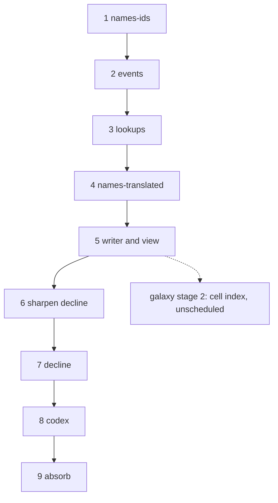

# Execution plan: the open proposals, in order

**Status:** In progress, 2026-09-21. Step 1 done.
**Source proposals:** `names.md` (2 stages), `structured-output.md` (4 stages), `decline.md` (unstaged, not yet sharpened), `galaxy-in-motion.md` (5 stages, not scheduled). Each proposal's Design section is the specification; its Stages section is the unit of work here. Where this plan and a proposal differ on order, this plan wins.

The previous plan, which built Simulation v2, is `specs/done/plan.md`; its protocol for running a step in a fresh session applies here unchanged (read this file, then the step's proposal sections and code; check the ledger and `git log`; build; write the ledger entry).

## Order and dependencies

| step | what | proposal | shifts the histories? | gate |
|---|---|---|---|---|
| 1 | **names-ids**: ids in the sim, `FMet.how`, typed log tokens, channel and voice, families, transcribed proper names, the view through the pass | `names.md` stage 1 | **yes, once**: the history's RNG stops drawing for names; the reference batch is regenerated here and every later guard reads that batch | source test, pass determinism, convention and classifier, `TestDeterminism` on the new batch |
| 2 | **events**: every log line a typed record, `Fact` merged, `events.json`, the view from templates | `structured-output.md` stage 1 | no | byte-identical legends, the param test |
| 3 | **lookups**: the string tables to `data/`, keys where text was, the law `variant`, the `term` rule | `structured-output.md` stage 2 | no | byte-identical legends, coverage and source tests |
| 4 | **names-translated**: the plague profile, the inventory and banks, grounded translations, names read from walls, the terms replacing the miracle names | `names.md` stage 2 | no (the profile is hashed, not rolled) | size, grounding and cap tests; entitlement recomputation; the history's numbers unchanged |
| 5 | **writer and view**: the output directory, `-until`, the view and techstats from the files, the fold test, `FORMAT.md` | `structured-output.md` stage 3 | no (the fold test may add event kinds; the history does not change) | byte-identical legends from the files; the fold test |
| 6 | **sharpen decline**: the index's variables, absolute or relative, the force, the age length; then split if it is more than one session | `decline.md` | — | the checklist empty |
| 7 | **decline**: the index, the waning and the end read from it, the force | `decline.md` as sharpened | **yes**: a behaviour change; the batch is regenerated and read against the occupancy baseline | the proposal's tests; the occupancy table moved from the baseline; techstats' new measures (first wars per distinct pair, wars per thousand people-ticks, on twenty seeds) printed before and after |
| 8 | **codex**: the hand-written fiction, `tellings.md`, `knowing.md`, tone and vocabulary; `CLAUDE.md` links it | `structured-output.md` stage 4 | no | every emitted kind and key covered; the reader's checklist |
| 9 | **absorb**: `DESIGN_NOTES.md` describes the output directory, the names, the decline; the three proposals to `done/`; this plan to `specs/done/` | all | no | — |

## Why this order

**Names first** because it is the one step that shifts every history, and the byte-identity guard the structured-output stages rely on has to be established after it, not before; and because it makes the events step smaller (the log arguments are already typed ids). **Events before lookups** because the event vocabulary is one of the lookups and the template-per-kind is what the lookups' coverage test walks. **Lookups before names-translated** because the technical-term rule is enforced through the lookups' `term` fields and their coverage test, and the inventory files sit beside the other data files under the same embed. **Names-translated before the writer** so `FORMAT.md` documents the `names[]` rows once, with every mode in them. **The writer before decline** so decline is tuned with `techstats` reading the structured files and its baseline table can be a query rather than a scratch test; and so the guard for steps 2 to 5 (no behaviour change) is not interrupted by a behaviour change. **Decline before the codex** because the codex describes the waning and the end of an age, and should describe them as decline leaves them, not twice. **Absorb last**, once, for the three proposals together, since they touch the same "Output" paragraphs of the spec.

**Galaxy in motion** is not scheduled: its own notes say stage 4 waits on a decision that the whole galaxy is what the game wants, and stages 1, 3 and 5 change the histories. Its stage 2 (the cell index replacing `Near`'s scan, no behaviour change, "pays now") can be taken any time after step 5 as an optimisation step, alongside the optimisation notes in `specs/done/plan.md`; it is drawn dotted above.

**Two regenerations of the reference batch**, at steps 1 and 7, and none in between. A step that finds it needs a third has found a behaviour change it was not supposed to make.

## What is not a proposal

Carried from the spec's "Next steps" and placed here so they are not lost:

- **The war-count measure** (`specs/notes/war-halving.md`): `techstats` prints first wars per distinct pair and wars per thousand people-ticks on twenty seeds. Do it at step 5, when techstats is rewritten to read the files, and before step 7 judges anything about war.
- **The tuning candidates** from the v2 ledger's "for step 19" (the picket's cost, the interceptor's sizing, the wisdom tech term, the tribute's length and the teach price, a floor per partnership for the slight, the fleet as a third road for a weapon, the cult share, the hunt's threshold, the want cap on ships, the heeded demand that comes straight back): after step 7, each as its own small change with the batch before and after, since each shifts the histories.
- **Level saturation at ten and the tree's cross-prerequisites**: with the tuning candidates.
- **The optimisation pass** (`specs/done/plan.md`, "Optimisation notes") and galaxy stage 2: after step 5, with a profile in hand.

## Architecture rules

The v2 rules stand (`specs/done/plan.md`, "Architecture rules": the mind decides, the profile is read never the kind, one tick, no map iteration on a random path, every rate per thousand years). Added by these proposals:

- **Ids only in the history.** No `Name` field, no text field but keys; no comparison against a lookup's text; no draw from the history's RNG for anything a consumer could re-render.
- **The record is omniscient.** Every event names its true cause and parties; ignorance is modelled only as a people's knowledge.
- **Keys resolve.** Every key the sim can emit has an entry in `data/`; the coverage test is part of every step from 3 on.
- **The chronicle is complete about the durable.** From step 5, a durable change without an event fails the fold test; the durable/derived table is kept with the writer.
- **Names are a pure function of the record.** `hash(seed, by, object, tone)` seeds every name; nothing else may.

## Progress ledger

| step | state | notes |
|---|---|---|
| 1 names-ids | done 2026-09-21 | `internal/names` rewritten as the pass; `data/` package with `families.json`; every seed shifted once (`TestSameHistory` re-pinned, `reports/tech` regenerated). Four seed-pinned harness tests moved to new seeds (`TestHarness` 6, `TestMuster` 57, `TestUnseen` 65, `TestAlienPairStaysDark` 12). Choices made without asking: `FMet.how` is the fact's `What`; `Fact.Plague` added so the sickness suspicion keys on ids; word rows for the state beneath are coined for voiceless peoples too until stage 4 (a stub); the view prints a never-named people as `unnamed #id`. |
| 2 events | not started | |
| 3 lookups | not started | |
| 4 names-translated | not started | |
| 5 writer and view | not started | |
| 6 sharpen decline | not started | |
| 7 decline | not started | |
| 8 codex | not started | |
| 9 absorb | not started | |
