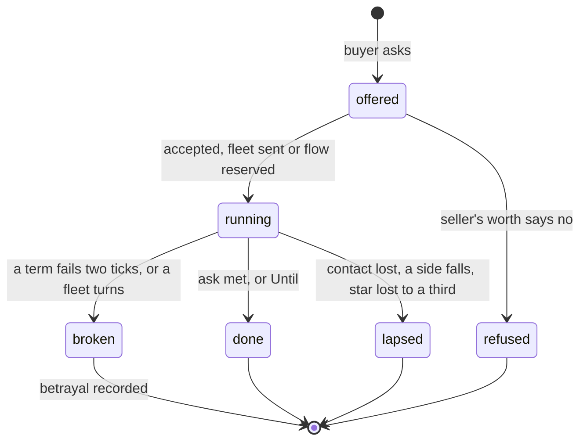

# Contracts and mercenaries

*Absorbed into `DESIGN_NOTES.md` § Simulation v2, "Contracts" (plan step 19, 2026-09-21). The Design section below stays the specification where the notes are silent; the notes win where they differ.*

**Status:** Implemented (plan step 12, 2026-09-19; see "Contracts" in `DESIGN_NOTES.md`; a rarity term changes hands at once rather than by a fleet, and a strike is against a world or a gun work)
**Last updated:** 2026-09-17

Assumes [one-tick](one-tick.md): every rate below is per thousand years, and "per tick" means a thousand-year tick, the same thing.

Depends on [resources-and-trade](resources-and-trade.md) (flows, rarities, the direction order) and reads [morality](morality.md) (fixations, observer-dependent sorts). Neither is needed to argue this one; both are needed to build it.

## Problem

Peoples in the sim can be friends, allies or enemies, and with the resources proposal they can share surplus. They cannot hire, pay, tribute or buy. A weak rich people has no way to turn its surplus into a fleet at its gate; a strong poor one has no way to sell its idle fleet; nobody can pay for an artifact, a cutting of the Manna, a facility burned or the making of fusion. Knowledge passes only by the Find, by nomads carrying it for nothing, or by uplift. The resources proposal moves commodities for commodities and shares rarities only between partners, so a thing of one kind is never exchanged for a thing of another. Strategy games solve this with a contract: a timed payment for a discrete thing. This proposal adds that, and mercenaries are its first use.

## Scope

**In:** a `Contract` binding two peoples, each giving one **term** for a length; term kinds flow, rarity, access, teach, guard, strike, deliver, peace; who offers what and who accepts; how a term is paid from the direction order; breaking, lapsing, and being bought off; tribute as a war ending; what it writes.

**Out:** haggling beyond one offer and one answer; contracts among more than two; contracts with horrors or the state beneath; a market or a price; folding pacts into contracts; teaching a miracle.

## Design

### The contract

```
Contract {
  ID          int
  Buyer, Seller int      // the buyer asks, the seller does; the buyer pays
  Ask, Pay    Term
  Offered, Formed, Until Year   // Until 0: until the ask is done
  State       offered | running | done | broken | lapsed | refused
  Broken      int        // who broke it
  Expedition  int        // the fleet doing a guard, strike or deliver, or -1
}

Term {
  Kind    flow | rarity | access | teach | guard | strike | deliver | peace
  Res     O | E | M        // flow
  Amount  float64          // flow: units per tick; guard, strike: Mil
  Legacy  int              // rarity: the instance; access: the immobile rarity
  Node    string           // teach: the node
  Star    int              // guard: where to stand; strike, deliver: the target star
  Work    string           // strike: a structure key at Star to burn, or "" for the world
  Target  int              // strike: whose; peace: with whom
}
```

The buyer is whoever asked; the seller whoever does. Either term can be a flow, so flow for flow is one object with everything else, but the usual shape is a flow paid for a discrete thing.

| Term | What it means | Done when |
|---|---|---|
| flow | Amount of Res per tick sent to the other side, subject to the transport cap of trade | Until |
| rarity | a mobile rarity handed over once, carried by a fleet as in the resources proposal | it arrives |
| access | the receiver counts an immobile rarity's grants and levels as its own | Until |
| teach | the giver's knowledge of Node passes to the receiver as a message, with the lag of light or at once by the Voice; the receiver must be able to pursue it (`canPursue`, checked at the answer and again at arrival); never a miracle | it arrives |
| guard | a fleet of at least Amount stands at Star, defending it as a relief fleet does | Until |
| strike | a fleet of at least Amount campaigns against Target at Star; if Work is set, the structure is burned and the world left | the world or the work is broken, or the fleet is lost |
| deliver | as strike, but the star is taken and handed to the buyer | the buyer owns Star |
| peace | no war between the two before Until, on top of any truce | Until |

A guard reuses the relief expedition with the contract's ID on it, so `reliefAt` counts it and the fleet's own rules apply: it turns if home is at stake. A strike and a deliver reuse the campaign expedition. The clock of a guard starts when the fleet arrives, not when the words are exchanged.

### Offers

An offer is a message (`MsgOffer`) and travels at light speed unless the sender has the Voice; the answer (`MsgAnswer`) likewise. One offer, one answer. A refused offer sets `Asked` as a pact proposal does, and the buyer does not ask that people again for 30 kyr.

**Who asks, and for what.** Each tick, with chance 0.05 (0.15 for a people with greed above 0.6 or a fixation on holding), a people looks at its wants in this order and asks for the first one it finds a seller for:

1. **A guard**, if `threat` names a people and the believed enemy strength exceeds its own by 0.5 or more, at the star the front would fall on first. Amount: the gap.
2. **A strike**, if at war and its fleets are not enough, against the enemy's nearest structure or world. Amount: the defence there.
3. **A node**, if a met people knows the node it pursues; failing that, the highest-era node it could pursue that a met people knows.
4. **A rarity**, if a node it pursues is soft-gated on one and a met people holds a mobile instance.
5. **Access**, if the same and the instance is immobile.
6. **A flow**, if it has shed uses of a kind and no partner sends enough.

The seller is the met people whose spare of the asked thing is largest: idle fleet strength at peace (Mil less Away, less what its own threat needs), a held rarity it has no node for, a surplus of the kind, or for a node, the met people that knows it and holds the smallest grudge. A people at war sells no fleet. A monster or a people holding a grudge above 0.3 against the buyer is never asked.

**What it pays.** The buyer offers the kind of commodity the seller wants most, as its intel reads it, up to its own surplus in that kind and the transport cap, for a length of 5 kyr per unit of fleet asked or per rarity (min 5, max 50). If it has no surplus the seller wants, it may offer a mobile rarity it has no node for, access to an immobile one, or a node the seller could pursue and does not know, the highest era first. Anything on either side; a node for iron and iron for a node are the same object. A buyer with a fixation on old things never pays with a rarity; one with a fixation on holding never pays with M.

**Answering.** The seller accepts if `worth(seller, Pay) ≥ worth(seller, Ask) × margin`, where `worth` is one function of a term for a people:

| Term | Worth to the receiver | Worth to the giver |
|---|---|---|
| flow | the shed uses of that kind it refills, plus 0.1 × the rest | 0 if from surplus; else the uses it sheds |
| rarity, access | the nodes it opens at full cost, plus its levels | the same, ×3 for a fixation on old things (never sold) |
| teach | the ticks of research it saves: the node's cost less its progress, over its rate | 0.1 × the same; ×5 if the receiver is its threat or hostile in posture; never a military-domain node to a people its intel reads as hostile |
| guard | Amount × the threat's believed strength over its own | Amount × 0.1 × the risk of loss (0.5 if the star is in a hostile front, else 0.1) |
| strike, deliver | the appraisal of the target star, as in the war appraisal | Amount × the defence there, plus the grudge it will earn |
| peace | its own war will against the other | the appraisal of what it would have taken |

Margin is 1 for the faithful and pragmatic, 1.5 for greed above 0.6, 0.5 for a fixation on conquest selling a strike, 0.5 for a fixation on knowing on either side of a teach, and 2 for a people whose morality counts the ask as a crime. No kind or way gets a margin of its own: a nomad sells cheaply because its want is high and its fleet is what it has, not because it is a nomad. A xenophobe that counts the buyer different doubles the margin. A herd or amoral morality ignores who is asking.

### Paying

A flow term is a reserved use in the direction order of the resources proposal, in a category of its own, **word**, whose place is set by honour:

| Honour | Order |
|---|---|
| faithful | fields, word, works, mind, road, arms |
| practical | fields, works, word, mind, road, arms |
| faithless | fields, works, mind, road, arms, word |

So a faithless people drops its obligations first when times are thin, and a faithful one lets its own yards go dark to pay. War moves arms first as before; a faithful people at war still pays before works. What is sent leaves with the flow of trade and arrives the same tick.

### Breaking

A term not delivered for 2 consecutive ticks breaks the contract, and the one that failed is the breaker. A guard that goes home early, a strike fleet that turns, a flow that is shed, an access withdrawn, a peace broken by war: each is a **betrayal** on the world, weight 1, through `betray`, and infamy follows. Faith kept at a cost, a faithful people paying through a dark age, is faith with negative weight, as pacts already record. A broken guard or strike sends its fleet home; a broken flow ends the guard at once.

**Bought off.** Each tick a running guard or strike stands against a people with something to give, that people may offer the seller a contract whose ask is peace with itself and whose pay beats the buyer's by the seller's margin. A faithful seller refuses. A practical one accepts if the buyer's pay has already failed once. A faithless one accepts with chance 0.3 × greed per tick, and the fleet turns on its employer as a strike if the new payer asks it to. That is the story the feature is for: the hired fleet at the gate, sold the gate.

**Lapsing.** A contract whose parties lose contact, whose star is lost to a third party, or whose either side falls, lapses without blame.

### Tribute

A war that ends by yielding or capitulation may write a contract instead of taking worlds: ask peace, pay a flow of the loser's largest surplus kind, for 20 kyr, from the loser to the winner. The winner takes tribute over worlds if its posture is defensive, confederate or opportunist, or its fixation is holding; a conqueror takes worlds. The loser's honour decides how long the tribute holds, by the order above.

### Mercenaries

Nobody is a mercenary by kind. The seller side is open to everyone: each tick, with chance 0.02 × its want share (its shed uses over its uses, 0 to 1) × its spare fleet share (idle fleet over Mil), a people offers a guard to the most threatened met people that has a surplus of a kind it wants, at its own margin. A people with no want or no idle fleet never offers; one with both offers often. Nomads come out sellswords because their want is high, they have no works to feed, and their fleet is the people; a settled people in a dark age with a fleet left over comes out the same way, and that is as it should be. A nomad horde in a guard contract comes to rest at the guarded star for its length, and grazes there at the partner rate, which is only what the existing rest rules do at a partner's star.

A people is a **sellsword** for the telling when more than half its income of any kind over 10 ticks came from contract pay. The name is earned, never rolled.

Everyone who sees a hired fleet reads it as taking sides. The target's grudge falls on the seller at half the weight it falls on the buyer, and `fleetSeen` treats a hired fleet as it treats an ally's. A people whose morality counts war a crime counts the hire a crime too, on both sides.

### What it writes

| Fact | Sort | Text |
|---|---|---|
| `FHire` | Deed 0 | "the X took the Y's iron to hold the gate at Z" |
| `FTaught` | Deed 0 | "the X taught the Y the making of fusion, for grain" |
| `FStrikeBought` | Crime 1 (the target's view; sortFor decides) | "the X paid the Y to burn the yards at Z" |
| `FBoughtOff` | Crime 2 | "the Y, paid to hold the gate at Z, sold it" |
| `FTribute` | Woe 1 (payer), Deed 0 (receiver) | "the X paid the Y in grain for twenty thousand years" |
| broken contract | via `betray` | as betrayals are told now |

Techstats gets a **Contracts** section: running, done, broken, bought off, tribute paid and received. The Tally gets `Hired, Sold, Broke`.

### The lifecycle



## Implementation notes

- `Contract` and `Term` in a new `contract.go`; `World.Contracts []*Contract`; `Civ.Contracts []int`; `Expedition.Contract int`.
- `MsgOffer` and `MsgAnswer` on `Message`, with a `Contract int`; `tickMessages` dispatches to `answerOffer`.
- `worth` is one function; the offer, the answer and the buy-off all call it.
- Flow terms enter the direction function as the `word` category; the resources proposal's `direct` gets the honour-ordered table.
- Guard and strike reuse `launch` with the kind Relief or Campaign and the contract ID; `station`, `campaign`, `resolve` and `turn` check the contract and mark it done or broken.
- Tribute hooks into `yield` and `capitulate`.
- A teach term is a `MsgTeach` sent on acceptance; on arrival it calls `learn(to, node, false)` if `canPursue` still holds, else the contract lapses. Nomad `carry` stays as it is: free teaching among nomad partners, the sellsword's gift.
- Stage order: after resources stage 4 (trade), since flows must exist; morality's fixation rules apply if morality is built first, and degrade to greed and honour alone if not.
- Tests: an offer with a positive margin is accepted and a fleet arrives; a shed flow breaks the contract and writes a betrayal; a faithless guard is bought off and turns; tribute is written by a defensive winner.

## Open questions

- **A taught node in the telling.** `Learned` records nodes gained by pursuit or find, and inherited nodes are absent. A bought node should be present, with the seller on it, so the telling can say who taught whom; the `Miracles` map's `how` string is the precedent.
- **Teaching a node the buyer cannot yet pursue.** `canPursue` gates it now. A seller could instead teach the prerequisites first as one contract of several terms, or the buyer asks for them one at a time; the latter is simpler and slower.
- **Haggling.** One offer, one answer, or one counter from the seller naming a longer length?
- **Access as a paid term versus partner sharing.** The resources proposal shares immobile rarities between partners for nothing. Should partners also be able to pay for access, or is partnership the only road?
- **Peace with a horror.** Out of scope; a people paying a horror to pass by is a fine story and a different proposal.
- Numbers: chances, lengths, margins, grudge halving.
