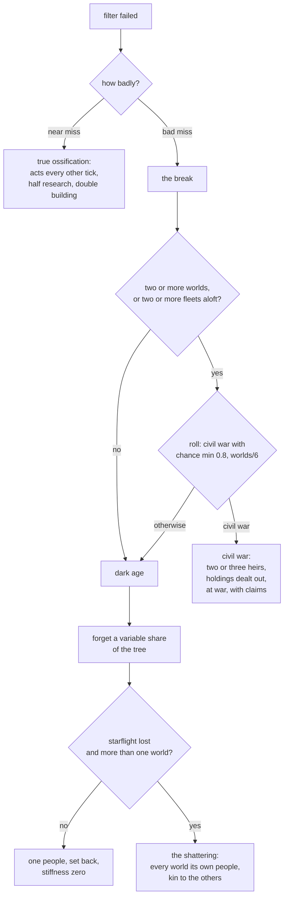

# Ossification: how an old people falls

*Absorbed into `DESIGN_NOTES.md` § Simulation v2, "Ossification and lines" (plan step 19, 2026-09-21). The Design section below stays the specification where the notes are silent; the notes win where they differ.*

**Status:** Implemented (step 15, 2026-09-19). Tuned at build: the facing chance 0.0015 and a renaissance adding one to the difficulty (0.005 and 0.5 here). Built as written but for what the batch found: the age ends on fertility alone, since nobody dies of age and the count of active peoples never falls; heirs carry the old people's renaissance and dark-age counts and its Distance drift, since a fresh count made every heir renew ten times over; see the ledger in `specs/done/plan.md`.
**Last updated:** 2026-09-19

Assumes [one-tick](one-tick.md): every rate is per thousand years. Reads [plagues](plagues.md) (a dark age as dirt, sickness as the other great thinner), [resources-and-trade](resources-and-trade.md) (holdings that change hands carry their sources and upkeep), [ships-and-garrisons](ships-and-garrisons.md) (fleets and garrisons as holdings to divide) and [wisdom](wisdom.md) (kin understand each other). None is needed to argue this one.

## Problem

The Weight of Ages is the great killer. On the reference batch at the thousand-year tick it is faced more than any named filter and declined more than all of them together: on one seed it declined 113 times among 154 peoples, and of the 45 peoples that ended, 38 "collapsed under their own weight and did not recover", 20 more contracted under it to remnants that died later of nothing in particular, and a handful of dark ages in the whole run came from Overshoot and the Wars of Faith, never from age. The roll is a private one against Social, its difficulty climbs with time lived and every renaissance, and its decline is contract, schism or extinction. Nothing about it depends on what the people is doing. A people that passed every named filter dies at its desk.

That is the wrong story, and it fights the arc the galaxy is meant to have: crowded and quarrelsome, then warlords, then empires, then a fall that leaves successors and ruins, not blank stars. An old empire should not vanish. It should **ossify** in the Foundation sense: its institutions harden until they cannot answer anything new, and then it breaks along its own seams. What comes out of the break is more peoples, not fewer: warring heirs to the same throne, or a dark age deep enough that every world is on its own again and the cousins have to find each other.

The rework replaces the Weight of Ages with **ossification**: a stiffness that a people accumulates from age, size and stillness, that shows before it breaks, that a renaissance clears, and whose failure has three outcomes, none of them death: the people ossifies outright, or it breaks in a civil war, or it falls into a dark age. **A people never dies of old age.** Death stays what wars, plagues, horrors, cosmic events and the named filters do.

## Scope

**In:** a stiffness number on every people, how it grows and what lowers it; its effects before the break; the ossification filter and its three outcomes: **true ossification**, a people that acts every other tick at half speed until something clears it; **civil war** into two or three heirs at war with claims on the old realm; and a **dark age** of variable depth, with the **shattering** as its deep form, when starflight is lost and every world becomes a people, kin to the others; claims; **kinship** by shared line at any depth; **grudges that decay**, and that a sundering weakens; what every dark age now does, whoever called it, and does not do; what it writes and shows; the Weight of Ages, contraction and extinction by age removed, and the old schism replaced by the civil war wherever it was called.

**Out:** the named filters and their own declines (Overshoot, Wars of Faith and the rest keep their dark ages and contractions; only the schism they call changes); remnants as such (a people still contracts to a remnant when it loses its colonies to a blast or a horror); plagues; the crowded-dawn levers (cradle count, fertility), which get their own draft.

## Design

### Stiffness

Every active people carries `Civ.Stiff`, a number from zero up. Zero is a young people, fresh from its cradle or its last renewal. One is an empire whose ways have set. Past two it is Trantor: the machines are kept running by people who do not know how they work.

**Growth** per thousand years is a base times what the people is:

| | factor | why |
|---|---|---|
| base | 0.00025 | one in four thousand: a lone cradle world with nothing else stiffens to one in four million years |
| size | × (1 + worlds / 8) | bureaucracy grows with the realm |
| the fading galaxy | × (1 + 2 × (1 − fertility)) | the age-ender stays: less is new under a dimming sky, up to three times faster at zero fertility |
| still | × 1.5 if no war, no new world, no node learned and no first meeting in the last 200 kyr | an empire at peace sets fastest; this is the Foundation reading |
| ossified (the state below) | × 1.5 | "it works, for a while": a people that has stopped changing stiffens fastest |
| centralism, stewardship, quarantine, fatalism scars | × 1.25 each | the iron answers |
| kind: machine-born × 1.5, planetary mind × 1.3, hive × 1.3, swarm × 0.5 | as the Weight treats them now: machines ossify, a nest has no institutions |
| traits | longlived × 1.4, caste × 1.3, memory × 1.2, solitary × 1.15; shortlived × 0.6, individualist × 0.8, nomadic × 0.6 | the weight table today, as rates instead of margins |

A mid-sized people of eight worlds under half fertility stiffens at 0.001 per thousand years and is at one after a million years. A cradle world under a fresh sky takes four million. Nothing else in the sim has a clock this slow, which is the point: this is the thing that comes for whoever survives the rest.

**What lowers it.** Ossification is stillness, so anything genuinely new takes some off:

| event | stiffness |
|---|---|
| renaissance (the filter overcome) | reset to 0 |
| dark age of any depth | reset to 0: the institutions are gone, whatever else is |
| a miracle gained | reset to 0, as the surge does now through `Ascended` |
| a node mastered from a find, an uplift made, a branch or heir spawned | − 0.2 |
| a first meeting with a stranger people | − 0.1 |
| a war fought to peace | − 0.1 |
| a world lost | − 0.05 |

The surge, `Renewed`, `Ascended` and `Renaissances` stay; `Renaissances` still makes each renaissance harder than the last.

### What stiffness does before it breaks

The reader should see an empire ossify before it falls, and other peoples should be able to read it too.

- **Research** runs at × (1 / (1 + Stiff / 2)): a third slower at one, half at two. Society research is hit hardest, × (1 / (1 + Stiff)), since it is the institutions that have set.
- **Expansion** runs at × (1 / (1 + Stiff / 2)).
- **The council** past one prefers what it did last time: renewals of old wars over new ones, no new pact kinds, and a people at two or more never sends a first expedition. Under [resources-and-trade](resources-and-trade.md), shedding under strain drops the newest use first: an ossified people keeps its old works running and lets the new ones go dark.
- **Read from outside.** A stiff people is a target of opportunity in the appraisal, as a dark age is today, once Stiff ≥ 1.5. Intel carries it as a line ("their ways have set").
- **Foresight.** A people with `deep_governance` or that `KnowsCycle` sees it coming: past 0.7 its research tilts toward society ×1.5, and the filter below is one easier. This is the psychohistory nod: knowing the fall is coming does not stop it, but it changes what you do on the eve.

### The filter

Once Stiff passes one, the people faces **Ossification** each tick with chance `0.005 × (Stiff − 1)`: at one and a half, once in two hundred thousand years; at three, once in a hundred thousand. It is a Social filter, `Diff = 4 + Stiff + 0.5 × Renaissances`, with the same margin rule as every filter. The existing "weight" trait adjustments move to the growth table above and do not also apply to the margin; the lived-age term goes, since stiffness carries it.

| margin | outcome |
|---|---|
| overcome (≥ 0.5) | **Renaissance.** Stiff to zero, ossification cleared, morale +1, `Renaissances` +1, research focus ×1.5 for 300 kyr. `FRenaissance` (Deed 3). "The X grow old and tired, and then, unexpectedly, young again." |
| the near miss (−2 to 0.5, the scarred band) | **True ossification.** The people sets, as below. Nothing is reset. |
| the bad miss (< −2, the declined band) | **The break.** Civil war or dark age, chosen by what the people is. Ossification, if any, is cleared by the break. Never contraction, never extinction. |

The three outcomes are the user's three; the bands are the filter's own. A flat three-way roll on any failure is the alternative (open question).

#### True ossification

An ossified people (`Civ.Ossified`) is Trantor in its last centuries: everything still runs, nothing new happens, and it takes twice as long as it used to.

- It **acts every other tick**. On its off ticks it does only upkeep: pays its sources under [resources-and-trade](resources-and-trade.md), keeps garrisons and works, moves fleets already in flight, fights the wars already open, fights any plague it has, answers a strike at its own worlds. It holds no council, launches nothing, settles nothing, offers no pact, sends no message that is not an answer, and its research banks nothing.
- On its on ticks **research runs at half** and **every construction takes twice as long**: a work that took one tick takes two, a fleet's muster likewise, a colony ship's building likewise.
- Its stiffness keeps growing, at ×1.5, and it keeps facing the filter on the same roll, so an ossified people is faced again sooner and at a higher difficulty than one that was renewed. It cannot be scarred twice: a second near miss counts as a bad miss.
- It is a target of opportunity in the appraisal, and its neighbours read it ("their ways have set; a fleet sent there would find the answer late").
- **Clearing.** A renaissance clears it. So does the break: a civil war's heirs are not ossified, and a dark age's forgetting takes the bureaucracy with everything else. Nothing else does; an ossified people that is left alone stays ossified until the filter comes for it again, which is the state the reader should find most of the old empires in when the present arrives.

"The X stop changing. Every year is like the last. It works, for a while." stays as the line.

### The break: civil war or dark age

A hive and a planetary mind cannot have a civil war (a hive has no factions, a mind is one mind), so they always fall the dark-age way; a hive can shatter, since its nests are on different worlds, and the shards are kin.

#### Civil war

The realm breaks into **two or three heirs**: two if it holds fewer than six worlds, two or three by a coin above that. Every holding is dealt out at random, each heir guaranteed at least one world:

- **Worlds**, with the works standing on them, the garrisons on them, the wielded legacies at them, and the sources and upkeep that go with them under [resources-and-trade](resources-and-trade.md).
- **Fleets**, each to a random heir; a fleet keeps its errand and its base if the base went to the same heir, otherwise it is recalled to its heir's nearest world.
- **Colony ships in flight**, each to a random heir.
- **Slaves and vassals**, with the world they are ruled from; a parasite's ridden hosts likewise.
- **Wars.** The old realm's enemies are every heir's enemies: each open war continues against each heir. This is why a civil war on top of a foreign war is the end of an empire.
- **Pacts** dissolve. The sworn do not know whom they are sworn to.
- **The tree** goes to every heir in full, then each forgets a tenth (the arsenals were in the other province). Miracles go with the works that hold them, or to the heir with the old seat if none does.

**No heir is the old people.** The old people ends with fate `Sundered` and the cause "tore themselves apart"; its record, its `Peak` and its telling close there, as Rome's did. Every heir is a **new people** of the same species, named by `names.Civ`, `Made` "heirs of the X", with a **line** back to the old people (`Civ.Line []int`, the old ID and the old people's own line before it, so a shard of an heir of an empire traces three steps back). Each is born with the full telling (`inherit`, wear 0), the parent's dials and scars, and the parent's miracles where its works hold them. Nobody's stiffness carries over: every heir starts at zero, because the institutions just broke. Each heir's `Peak` starts at what it holds. Mechanically the heirs are equals; the one that got the old seat has the seat, and nothing else.

**Every heir holds itself the true X.** In its own telling the old people's deeds are its deeds and the old people's crimes are excused as its own are: `regard` returns "self" for any ID in the people's line, and the wearing pass keeps the line's tales as it keeps the people's own. The others in the galaxy do not distinguish either: every grudge, truce, intel record and monster reckoning others held against the old people is copied to every heir, and every pact the old people had is dissolved. The heirs' legends open "The Y, heirs of the X"; Italy and Rome, or the two Chinas and the empire, and each is as sure as the other.

Every heir is **at war with every other** from the first tick, declared with the cause "the sundering", and holds a grudge of three against each. Each heir carries a **claim** on every world of the old realm (`Civ.Claim map[int]bool`, the old `Systems` at the moment of the break). A claimed world held by anyone is a wanted target in the appraisal regardless of posture, with the vengeful bar (odds above three in ten), and taking a claimed world scores a bond, not a crime, in the taker's own telling ("restored to the realm"). The claim outlives the war: peace between heirs leaves the claims standing and the truce short. A claim fades when the tale of the sundering wears to myth in that people's telling, which is how a faction stops being a faction and becomes a people. There is no reunion: an heir that comes to hold every world of the old realm has simply run out of claims, and is the Y that holds what the X held. The old people does not come back.

The old schism goes. Where the Distance filter called it, it calls the civil war instead; the same for the fleet split among the aloft, which becomes two fleets at war under the same rules. The Distance's decline is thereby the same story told from the colonies' side: they became strangers, then enemies.

#### Dark age

A dark age is now of **variable depth**. The people forgets a share of its tree, drawn once:

`depth = 0.1 + 0.3 × min(1, Stiff / 3) + 0.1 × DarkAges + U(−0.1, 0.1)`, clamped to [0.1, 0.8]

A fresh people that failed young forgets a tenth to a fifth. Trantor at three forgets four tenths and up. Every earlier dark age deepens the next by a tenth, which replaces the rule that a third dark age is fatal: nothing is fatal here, but a people that keeps falling forgets more each time until it shatters. The forgetting is leaves-first as now, so the tree stays consistent, and the relic on the eve, the wearing of the telling, the wielded works lost and the stage set back all stay. Colonies go dark at the depth rather than half; the home is kept. Stiffness resets to zero, `Renewed` to now, morale −1.

**This is every dark age.** There is one `darkAge`, and whoever calls it gets this one: Overshoot, the Atomic Age, Thinking Machines, the Wars of Faith, a swarm outbreak, sickness under [plagues](plagues.md), and ossification. The depth reads the people's stiffness as it stands, so a young people that burns its world forgets a little and a stiff empire that does the same forgets a lot, and any of them can shatter if the forgetting takes the stars.

The dark age keeps its place in the plagues draft as dirt (×3 to bearing a plague for a hundred thousand years) and in the appraisal as a target of opportunity.

#### The shattering

If the forgetting takes **starflight** (Reach under ten light-years after `recompute`, the same test that sets the Emergent stage today) and the people holds more than one world, it cannot hold them: **every world becomes its own people**. The old people ends with fate `Shattered` and the cause "forgot how to reach the stars". Every world, the old seat included, is a new people of the same species, `Made` "heirs of the X", with the line back to the old people, named `names.Civ` and introduced by its world ("the Ulm, heirs of the Qaosh, on Wolf 359"), with the reduced tree, the telling one step more worn, the works standing on that world, the relic where it was left, and the garrison there as its whole Military. Nothing is at war. Stiffness is zero everywhere. As with the heirs of a civil war, each shard holds the old people's history as its own, and the galaxy's grudges and truces against the old people pass to every shard.

The shards are kin, as every people that shares a line is; kinship is below. Nothing is at war between them and no grudge is held.

The shattering is the Foundation's interregnum: thirty thousand years of barbarism with the old provinces each on their own, and whoever climbs back to the stars first finds the cousins waiting. It is also the only way a people's own works end up in another people's hands without a war, and the kinship bonus in the Find (the design is theirs) applies to any people finding the works of anyone in its line. An empire leaves enough behind that nobody needs to plan for the fall: its relics on the eve, its works on every world and its walls are the Foundation.

### Kinship

Two peoples are **kin** when their lines share an ancestor, or one is in the other's line: the heirs of a civil war, the shards of a shattering, and the shards of an heir and the heirs of a shard, at any depth. An empire sundered in three, each heir shattered into five, leaves fifteen peoples that are all kin. Kinship is a fact of descent and never fades; what changes is whether it is acted on.

- **Understanding.** Kin understand each other's messages and read each other's testaments without the [wisdom](wisdom.md) fathoming roll, grudge or no grudge. A shared tongue does not go away because of a war. (Assumed; the alternative is to suspend this too under a grudge.)
- **Regard.** Kin regard each other as friends (1) unless the ordinary reckoning makes one a monster to the other, or the grudge between them is above the enemy line (0.5). A grudge suspends kinship's warmth; it does not end kinship, and as the grudge decays the warmth comes back. This is how the heirs of a civil war, who start at war with a grudge of three, become cousins again a few hundred thousand years after the last of them made peace.
- **Meeting.** When kin meet with no grudge between them, by ship or by signal, trade opens at once, no first-contact council is held, and a defensive pact is offered with the loyalty dial's odds doubled.
- **War.** Kin with no grudge never declare a first war on each other on posture alone; only a grudge above the enemy line, a claim, or the monster rule can start one.
- **No reunion.** Kin never merge back into one people, by conquest or by consent. The most they can be is a **confederation** under the existing pact rules: a defensive pact, then a wider one, with the loyalty dial's odds doubled at every offer between kin. Vassalage between kin is what it is between anyone.
- **Depth.** The effects are the same at every depth. A cousin twice removed is as welcome as a sibling.

### Grudges

Grudges never decay today: every path adds, nothing subtracts, and a wrong done at the dawn is held at the end of the age. Two rules change that.

- **Decay.** Every grudge loses half a percent per thousand years (a first setting, to be tuned on the batch) (×0.995 per tick, a half-life of about 140 kyr) and is cleared outright below 0.05, since a dozen checks read "any grudge at all". A civil war's grudge of three falls under the enemy line after roughly 360 kyr and is gone after 800 kyr; the grudge of a lost war (about one) is gone in 600 kyr. Remembered crimes keep feeding it through the telling (`takeToHeart`), so a wrong that is still told is still held, and a grudge now outlives its cause only as long as the memory does. Under [plagues](plagues.md) the grudge for a plague given decays the same way.
- **A sundering forgets.** A new people has new quarrels. Every heir and every shard inherits the old people's grudges against others at a **quarter**, and others' grudges against the old people pass to each heir at **half**: the wronged remember better than the heirs do, but they too can see this is not the same people. Truces pass whole. The grudge of three between the heirs of a civil war is fresh and is not touched.

### What goes

- The **Weight of Ages** filter, its roll, its `lived` and hazard terms and its decline table. Hazard stays for the other filters; it no longer multiplies age.
- **Contraction and extinction by age.** `contract` and `endCiv` are never called from ossification. Remnants keep coming from lost colonies (blasts, horrors, the named filters that contract).
- **The third dark age fatal.** Replaced by depth.
- **`schism`** and `splitFleets`, replaced by the civil war.
- The `weight` key in the trait adjustment table, folded into the growth table.
- **`ScarOssified`** as a scar. Ossification is a state that clears, not a scar that stays; the scar's ×1.5 lives on the state.

Remnants from earlier breaks still die of nothing: a remnant under a failing star, or one taken by a horror, ends as it does now. What changes is that nobody becomes a remnant because they got old.

### What it writes

| fact | sort | for |
|---|---|---|
| `FRenaissance` | Deed 3 | a people renewed (the overcome has no fact of its own today) |
| `FSundered` | Woe 4 for the old people; Deed 2 for each heir as "declared themselves the true X" | the civil war, replacing `FSchism`, object the heirs |
| `FReclaimed` | Bond 2 (own), Woe 2 (loser) | a claimed world taken |
| `FShattered` | Woe 4 | the shattering, object each shard |
| `FDarkAge` | Woe 3, as now, with the depth in `What` ("forgot a tenth", "forgot half") | |

Log lines: "The X stop changing. Every year is like the last." at the scar as now; "The X tear themselves in three: the Y, the Z and the W, each the true X by its own telling, each holding the others traitors. The Y hold the old seat." at a civil war; "The X forget how to reach the stars. On seven worlds seven peoples wake up alone." at the shattering; The legends' portrait of a living people carries its stiffness in words (young, settled, set in its ways) and says outright when it is ossified; the aftermath gains a "Lines" section: every people that ended in a sundering or a shattering with its heirs, their heirs in turn, and who holds the old seat now, the family tree of each empire; the gazetteer marks a world under claim by whom. `techstats` gains an "Ossification" section: facings, outcomes, mean stiffness at the break, civil wars by heir count, dark ages by depth, shatterings by shard count, and the share of peoples ended by cause, so the "died of nothing" count can be watched going to zero.

## Implementation notes

- `Civ.Stiff float64`, `Civ.Ossified bool`, `Civ.Claim map[int]bool`, `Civ.Still Year` (last tick something new happened, for the stillness factor). `Civ.Line []int`. Fates `Sundered`, `Shattered`. `FRenaissance`, `FSundered`, `FReclaimed`, `FShattered` in `lore.go` with sort and weight.
- `ossify.go`: `tickStiff(c)` at the point in `tickFilters` where the Weight is rolled now (`filters.go:237`), growth per the table, the facing roll, and the lowering hooks (`master`, `uplift`, `spawnCiv` with a parent, first `meet`, `endWar` at peace, `loseSystem`, miracle gain). The filter `ossification` replaces `weight` in `def`, with Scar setting `Ossified` (a second Scar routed to Decline) and Decline choosing civil war or dark age; `adjust`'s `weight` case goes; `ScarOssified` goes.
- **Off ticks.** `tick` skips the council, `expand`, `research`, `build`, `launch`, pact offers and unsolicited messages for an ossified people on odd ticks (`(w.Now/1000 + c.ID) % 2`, so half of them act on any given tick); upkeep, fleets, wars, plagues and answers to strikes run every tick. On on ticks the research rate is ×0.5 and every build or muster time ×2. Renaissance, `civilWar` and `darkAge` clear `Ossified`.
- `civilWar(c)`: heirs by size; deal `Systems`, `Works`, `Wielded`, `Expeditions` by `Owner`, `Voyages`, slaves by `Master`, `Ridden`; wars copied per heir via `declare` with the old war's cause; pacts dropped by `leavePact`; heirs spawned by `spawnCiv(home, &sp, -1)` with `Known` copied and `forget(nc, 0.1)`, `inherit(nc, c, 0)`, dials and scars copied, `Line` = parent's line plus parent; the old people ended by a new `sunder(c, fate, cause)` that hands holdings over without turning them to traces (so `endCiv` is not used) and copies every other people's `Grudge`, `Truce`, `Intel`, `Watched` and monster entries for the old ID onto each heir; `declare` pairwise with cause "the sundering", `Grudge` 3 each way; `Claim` set on all. Callers of `schism` (`filters.go:332, 458, 493`) and `splitFleets` call it.
- `bar` in `appraise.go` reads `Claim`: a claimed world's holder is wanted at the vengeful bar. `takeWorld` writes `FReclaimed` when the world is in the taker's claim. `regard` returns self for any ID in `Line`; the wearing pass in `lore.go` treats tales whose subject is in the line as the people's own; the Find's kinship test reads `Line`. `contact.go` meeting: kin skip the first-contact council, open trade, offer a defensive pact at doubled odds; every later pact offer between kin at doubled odds too.
- `darkAge(c, why)` takes the depth from the formula; `forget(c, depth)`; colonies lost at `depth`; the third-fatal branch goes; after `recompute`, if `Reach < 10 && len(Systems) > 1`, `shatter(c)`: `sunder(c, Shattered, ...)` then one `spawnCiv` per world, the seat included, with the reduced tree, `inherit(nc, c, 1)`, `Line`, works, relic and garrisons left where they stand; the shards are kin by `Line`.
- Claims fade in the tale wearing pass in `lore.go`: when the sundering tale in a people's telling reaches myth, its `Claim` is cleared. Kinship does not fade: `Kin` is not stored but computed from `Line` (`w.kin(a, b)`: shared ancestor or one in the other's line), cached per tick if it shows in the profile.
- `Grudge` decay in the per-tick pass over each people's maps: ×0.995, delete below 0.05. In `sunder`, the old people's `Grudge` entries copy to each heir ×0.25 and every other people's entry for the old ID copies to each heir ×0.5; `Truce` copies whole.
- `regard` returns friend for kin with `Grudge ≤ 0.5` and no monster reckoning; `fathom` in the wisdom pass and the testament reading skip the roll for kin; `contact.go` meeting skips the council for kin with no grudge; `bar` never wants a kin without a grudge or a claim.
- Research and expansion multipliers in `research` and `expandMul`; council preference in the options pass; `appraise` treats `Stiff ≥ 1.5` as a target of opportunity beside dark age and plague.
- Legends: portrait word from `Stiff`; "heirs of the X" in every heir's opening line; aftermath "Lines"; gazetteer claims; `techstats` section.
- Stages: (1) stiffness, the filter and the ossified state with the old decline table kept (measure facings and stiffness at the break); (2) the dark age of variable depth and the shattering; (3) the civil war and claims; (4) kinship and grudge decay; (5) legends and stats; (6) remove the Weight, schism, contraction and extinction by age.
- Tests: growth table; the lowering hooks; an ossified people banks no research and launches nothing on its off ticks and half on its on ticks; a second near miss breaks; renaissance, civil war and dark age all clear `Ossified`; a people at Stiff 3 faces within a few hundred kyr; civil war deals every holding to exactly one heir and every heir has a world; the old people ends `Sundered` with no traces left and no heir sharing its ID; heirs are pairwise at war with claims; others' grudges against the old people are on every heir; a shard's regard for its line is self; an heir holding the whole old realm has no claims and no new fact; depth formula bounds; shattering only when reach is lost and worlds > 1; shards are kin and regard is friend; kin three steps apart are still kin; a grudge above the enemy line suspends the warmth and its decay restores it; kin skip the fathoming roll with or without a grudge; grudges decay and clear; a sundering quarters the heirs' grudges and halves others' against them; claims clear at myth; no `endCiv` and no `contract` reachable from the ossification filter.

## Open questions

- **Lines and the present.** A people's line can get long (an empire sundered, an heir shattered again). The legends should show it somewhere the reader can follow; the "Lines" section in the aftermath is proposed, and the gazetteer could name the founding people of a world's works. How far back should a portrait go: the immediate parent, or the whole line?
- **Bands or a roll.** The draft maps the three outcomes onto the filter's margin bands: a near miss ossifies, a bad miss breaks. The alternative is a flat three-way roll on any failure, which makes ossification rarer and the break more common at low stiffness. Bands are proposed because they reuse the margin every other filter uses and because a barely-failed roll reads as "it works, for a while".
- **Hazard.** The Weight multiplied by galactic hazard; the growth table above drops it. Keep a softened term, × (0.5 + 0.5 × Hazard), so a crowded galaxy still ages its peoples faster? Proposed: drop it, since crowding now thins through plagues and wars, and hazard only ever rises.
- **Stillness.** The 200 kyr window and the ×1.5 are guesses. A long peace should ossify an empire, but a people at endless war also has its ways set, just different ones. Should war count as still after a million years of it?
- **Depth of the dark age.** The formula makes shattering rare for a people below Stiff 2 and likely above 3 with prior dark ages. Is a shattering of a twenty-world empire into twenty peoples too much for the sim to carry at the thousand-year tick (twenty councils, twenty tellings)? A cap at eight shards, the rest going dark as abandoned worlds, is the fallback.
- **Claims and the arc.** Claims make heirs fight each other over the old realm and mostly ignore strangers, which is the warlord stage of the arc. Should a claim also pull a third people in, the neighbour that takes a claimed world while the heirs are busy, as the old realm's enemies do?
