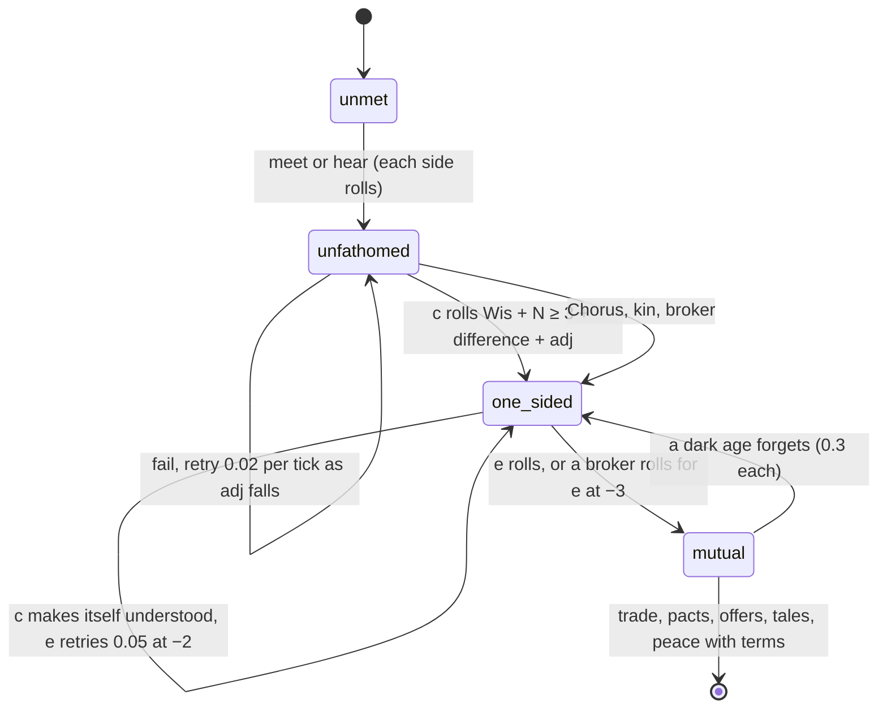

# Wisdom: understanding others, and judging well

*Absorbed into `DESIGN_NOTES.md` § Simulation v2, "Wisdom" (plan step 19, 2026-09-21). The Design section below stays the specification where the notes are silent; the notes win where they differ.*

**Status:** Implemented (plan step 11, 2026-09-18: the level, fathoming with the unpaid broker, and the judgment rules; the `broker` contract term and the worth noise on contract terms with plan step 12, 2026-09-19; see "Wisdom" and "Contracts" in `DESIGN_NOTES.md`)
**Last updated:** 2026-09-18

Assumes [one-tick](one-tick.md): every rate below is per thousand years, and "per tick" means a thousand-year tick, the same thing.

## Problem

A people has three levels: Military answers threats, Survival keeps it alive, Social holds it together. Nothing measures whether it *understands* what it is looking at, or whether it judges well what it knows. So a first meeting is settled by fleets and postures alone, and two peoples with nothing in common trade within a generation as readily as two cousins. The council acts on the hopeful or the pessimistic tail of a belief with no regard for how well it reads the belief, a conqueror strikes a stronger neighbour on a compulsion no experience tempers, a vengeful people pays any price for a grudge, and a people that finds an elder engine three eras above it switches it on as readily as one that could have built it.

This proposal adds **Wisdom**: the capacity to see the counterintuitive and make the right call when the obvious call is wrong. It does exactly two things: it lets a people **fathom** another, and it makes a people's **decisions** closer to its own true estimate. It makes nothing else better. A wise people is not a good one: it wants what its posture, honour and morality say it wants, and gets it more surely. The interrogator in *1984* has plenty of wisdom.

## Scope

**In.** A fourth derived level, on the same 0 to 10 scale, from species, kind, tech, experience remembered, boons and scars. **Fathoming**: each people understands each other people or not, separately; contact defaults to mutual incomprehension; a Wisdom check against how alien the other is; what one-sided and mutual understanding each open; brokers; a `broker` term for the contracts proposal; loss of understanding in a dark age. **Judgment**: the council's acted-on odds, grudge and compulsion; the worth of an offer; the choice at a Find; when to sue for peace. A portrait word, facts, `techstats`.

**Out.** Wisdom as a dial. Wisdom changing what a people wants. Any bonus to research, levels, filters, the Weight of Ages, dark ages, the seal or mastery rolls, intel gathering, or the tree. Wisdom cooling grudges, rewriting the telling, or touching morality and honour. Wisdom in horrors, elders or the state beneath.

## Design

### The level

Wisdom is derived every tick in `recompute` like the other three, clamped to 0 to 10. No filter tests it.

| Source | Wisdom |
|---|---|
| Base | 2.5 |
| contemplative | +1.5 |
| memory (unbroken) | +1 |
| longlived | +1 |
| curious, cautious, pragmatic | +0.5 each |
| shortlived, herd | −1 each |
| xenophobic | −0.5 (it sees less because it looks less) |
| nonconscious | −1.5 (no intuition to see past, and nothing to read another mind with) |
| planetary mind | +1 (slow, and whole) |
| parasite | +0.5 (knows its hosts from inside) |
| swarm | −1 |
| tech (new `Wis` field on a node) | philosophy +0.5, doubt +0.5, scientific_method +0.5, mass_politics +0.25, neuroscience +0.5, memetics +0.5, deep_governance +0.5, posthuman_law +0.5, long_thought +1, substrate_minds +0.5 |
| experience (below) | up to +2 |
| each renaissance | +0.5, capped at +1 |
| Communion (spoke with a sleeper) | +1 |
| the Sight | +1 |
| knows the cycle | +1 |
| ossified | −1 |
| vassal / slave | −0.25 / −0.5 |

Morale does not touch it. Neither does age by itself: the old are wise only through what they remember.

**Experience** is every tale a people holds of its own woes and follies, blamed on someone or not, excused or not: +0.1 each, capped at +2. A people learns from what it went through whatever it tells itself about whose fault it was. A dark age wears the tales a step and so eats experience without any rule saying so; a people that reads its own walls gets it back. No honour, posture or morality term: the faithless are as wise as the faithful, and a conqueror is wise or foolish as its makeup and history leave it, minus the half point above for the one trait that refuses to look.

### Fathoming: understanding another people

A meeting now has a third state between "unmet" and "understood": **unfathomed**. Each people keeps `Fathomed map[int]bool`, and it is one-way: the X may understand the Y while the Y do not understand the X. When `meet` or `hearing` fires, neither side fathoms the other; each rolls once at once, and thereafter each retries on its own.

The roll, `fathom(c, e)`, is the filter shape without the filter bands:

```
Wis(c) + N(0, 1.5) ≥ 3 + difference(c.Species, e.Species) + adj
```

`difference` already runs from 0 (same kind, order, senses and world) to about 6. Adjustments:

| Condition | adj |
|---|---|
| contact by signal only (hearing), no face yet | +1 |
| every 10 kyr since c met e | −0.1, floor −2 |
| a war between c and e fought and ended | −1 (you learn what a people is by fighting it) |
| e fathoms c and is making itself understood (below) | −2 |
| a broker stands for c on e (below) | −3, for the brokered attempt |
| c holds the Chorus | automatic |
| e is a branch of c, a machine-born successor of c, an uplift of c, or the reverse | automatic |

A failed roll is retried with chance 0.02 per tick, or 0.05 when e is making itself understood, or on each brokered attempt. A truly alien pair (a hive planetary mind and a solitary machine-born people, difference 5 to 6) stays unfathomed for tens to hundreds of thousands of years, through a war or two, until familiarity, a war, a broker or a lucky generation gets through. Cousins fathom each other at once. The primitives rule is untouched: watching from orbit is not contact. Parasites and mindriders are untouched: infection needs no understanding, which is the point of them.

**What being unfathomed does.** While c does not fathom e, c reads e as a **monster** in every rule that asks `monster(c, e)`: regard −2, more will in war, a hostile neighbour to the fearful, no colonising toward it, the monster slant on every tale learned about e. c's appraisal of e carries one extra level of spread: it cannot tell what e is or wants. The council's bar is not itself lowered (that is posture), so a defensive people and an unfathomed neighbour sit and watch each other, while a conqueror does what it would have done anyway with more will behind it. A message from e to c means nothing on arrival and is dropped: intel, news, a call, a pact, an offer.

**What one-sided understanding opens.** When c fathoms e and e does not fathom c:

- c stops reading e as a monster and loses the extra spread. c can see e coming, and see that it is not.
- c can **make itself understood**: e's retries run at 0.05 per tick with −2, so long as c wants to be understood. It wants to unless it hates e, is at war with e, or its posture is hostile and it reads e as weaker (a conqueror does not explain itself to prey). This is the wise side's gain that a mutual rule would give away: a wise people brings its neighbours to understanding at its own pace, and can choose not to.
- c can **broker** e to others.
- c can sue e for a truce (no new war for a time), since it knows what to ask for. Nothing with terms.
- e still cannot trade, pact, offer, or hear c. The tales it learns of c are still a monster's.

**What mutual understanding opens.** Trade, pacts, offers and contracts, the exchange of tales at contact, messages both ways, peace with terms and tribute. The trade rule in `encounter` and `hearing` now runs at the moment the pair becomes mutual, not at the meeting.

**Wars of misunderstanding.** A war between two peoples neither of whom fathoms the other cannot end by peace or yield: the offer means nothing. It ends when a side falls or when both wills run out, as an exhausted war does now. The war counts −1 on both sides' rolls once over, so the second war is usually the last unfathomed one.

**Brokers.** A people z can broker c's understanding of e when z fathoms e, z fathoms c and c fathoms z. Brokering is one direction: e's understanding of c is a separate act. A brokered attempt is an immediate roll for c on e at −3. It happens two ways:

- For its own reasons, when z holds a pact with both c and e (allies that cannot speak to each other are no use in a war), or z is confederate by posture: chance 0.02 per tick. A go-between that merely trades with both does nothing: its position is the middle, and it keeps it. "The Z, who traded with both, never spoke for either."
- As a **contract term** `broker` in the contracts proposal: `Term{Kind: broker, Target: e}`, sold by z to c for any other term. While the contract runs, c gets a brokered attempt with chance 0.1 per tick; it is done when c fathoms e and lapses after 30 kyr or when z stops fathoming either. Seller's worth: 0.1 × the trade it expects to lose or gain, plus greed; a broker that fathoms both is the only seller, so the price is what it can get. Buyer's worth: the trade, pacts and peace it cannot have until then, which the contracts proposal already prices. A xenophobe never sells it. A people at war with e never brokers c to e; a people at war with c happily brokers e to c's enemies.

"The Z, who knew both, spoke for the X to the Y, for iron. Within a generation the X understood." A broker that lies is out of scope; a broker's slant on its tales is not, and is already built.

**Forgetting.** A dark age loses each fathoming with chance 0.3: "they forgot how to speak to the Y". The Y still fathom the X if they did; the X retry as before with the familiarity they had. Loss of contact does not lose it.

**Facts.** `FFathomed`: Bond, weight 1, subject the one who understands, object the understood. "After ninety thousand years of silence and two wars, the X come to understand the Y, and find the Y had been talking the whole time." "The Y, long spoken to, at last understand the X." `FBrokered`: Deed, weight 1, subject the broker, object the buyer, `About` the third party.



### Judgment: acting on the estimate

Wisdom touches how a belief is *used*, never what is believed or wanted. Every rule below leaves the want (posture, greed, fixation, grudge, honour) as it is and moves the act toward the people's own true estimate.

1. **The council.** `Acted` is the odds on the hopeful or pessimistic tail by the risk dial. Wisdom pulls the acted-on point toward the mean: the tail term `(2·Risk − 1) × spread` is multiplied by `(1 − 0.08 × Wis)`. At Wisdom 10 a people acts on its estimate; at 0 on its hope or its dread. The risk dial still decides which tail, so a wise reckless people is a reckless people that has looked.
2. **Grudge.** The bar discount for a grudge (−0.1) is multiplied by `(1 − Wis / 10)`. A vengeful people still names revenge as its cause and still wants the war, but at Wisdom 7 or more it acts on `Odds` instead of `High`: the grudge is counted at its true price, not ignored. The grudge itself is not touched. Wisdom is not forgiveness; it is knowing what revenge costs, and paying it when it can.
3. **Compulsion.** The conqueror's tenth-chance of striking on a lowered bar becomes `0.1 × (1 − 0.08 × Wis)`. A wise conqueror is still a conqueror. It stops striking on impulse at the strong and strikes the weak with the same appetite.
4. **Offers.** Every `worth` a people puts on a pact or a contract term (the contracts proposal) is read through folly noise: `worth × (1 + N(0, 0.04 × (10 − Wis)))`. A fool at Wisdom 2.5 misprices a bargain by a third one time in three; a people at 10 prices it exactly. The greedy stay greedy and the faithless stay faithless: the noise is on the estimate, the margin is theirs.
5. **The Find.** The choice weights in `discover` get a Wisdom term: for a Sleeper or a Threat, `seal += 0.3 × Wis`; for an Artifact or Structure whose node is two or more eras above the people's, `wield × (1 − 0.07 × Wis)` and `seal += 0.2 × Wis`. And whichever way the die falls, before mastering or wielding a wise people asks whether it can: if its expected margin on that roll is below −1.5 and it rolls `Wis + N(0, 1.5) ≥ 6`, it seals instead. The rolls themselves (master, wield, seal) are unchanged; Wisdom decides what is attempted, not whether it works. Kinship 2 still zeroes the seal.
6. **Peace.** The check that decides whether to sue for peace or yield reads the same appraisal as the council, so the tail shrink in (1) already makes a wise people give up a lost war sooner and a hopeless one later than a fool. No separate rule.

No other rule reads Wisdom. In particular research, the levels, the filters and the Weight of Ages do not: a wise people ages, falls and forgets like anyone.

### Portrait and telling

The portrait names it only at the ends: 8 or more "a wise people", 2 or less "a foolish people"; nothing between. The legends read it the same way when it decides something: "The X, who are wise, seal it and post a watch." "The Y, who are wise, look hard at the Z and count the cost of their grudge, and pay it." `techstats` gets a **Wisdom** section: distribution at zenith, sources by share (species, tech, experience, boons), contacts fathomed at meeting / by familiarity / by war / by being taught / by broker (paid or not) / never, mean years unfathomed by difference band, one-sided pairs and how long they stay so, wars of misunderstanding, brokered contracts, seals chosen by the look-before-the-leap rule, and the council's acted-on odds against its mean by Wisdom band.

## Implementation notes

- `Civ.Wis float64` next to `Mil, Sur, Soc` in `types.go`; derived in `recompute` (levels.go) after Soc, before `setDials`. `level()` does not learn it: no filter tests it.
- `tech.Node.Wis float64`, summed in the known-nodes loop like `Soc`. Ten nodes set it; the rest default 0.
- Species trait and kind terms in a `wisTable map[string]float64` in levels.go, the same shape as `traitDiff`; kinds in `kindMods`.
- Experience is a count over `c.Lore` of unforgotten tales whose fact is a Woe or Folly with the people as subject. It shares the loop `reckon` already walks.
- `Civ.Fathomed map[int]bool`, `Civ.FathomTried map[int]Year` for the retry cadence. `monster(c, e)` returns `c.monsters[e.ID] || (c.Met[e.ID] && !c.Fathomed[e.ID])`. `meet`, `hearing` and `encounter` call `w.fathom(a, b)` and `w.fathom(b, a)` before `consider`; trade and the tale exchange move to the moment `Fathomed` becomes mutual, in a per-tick pass in `contacts` that also runs the retries, the making-understood cadence and the unpaid brokering by shared pact or posture. `appraise` adds 1 to `spread` when unfathomed. `tickMessages` drops any message to a recipient that does not fathom the sender. `proposePact`, the contracts proposal's offers, `peace` and `yield` check mutual fathoming; the truce path checks the suer's side only. `endWar` by exhaustion is unchanged.
- The `broker` term is one more `Term.Kind` in the contracts proposal, with the running-state hook in its tick; that proposal's implementation notes get a line for it at reconciliation.
- `darkAge` drops each `Fathomed` entry with chance 0.3 after `forget`.
- `appraise` applies the tail shrink; `bar` applies the grudge shrink; `council` applies the compulsion shrink; the vengeful `Acted = High` line checks `c.Wis < 7`. The worth noise is one line in the contracts proposal's `worth` and in `answerPact`'s score.
- `discover` weights and the look-before-the-leap check in find.go. `attemptSeal`, `attemptMaster`, `attemptWield` are untouched.
- Facts `FFathomed` and `FBrokered` in lore.go with their telling lines; slant on tales learned while unfathomed needs no new code, since `regard` already returns −2 through `monster`.
- Stage: after the contracts proposal's offers exist, since the broker term and the worth noise land there; the level, fathoming and the council rules can go first as their own stage, with the unpaid broker only.
- Tests: two cousins fathom each other at meeting; a difference-6 pair on a fixed seed stays unfathomed 50 kyr and then goes one-sided, and the taught side follows within 20 kyr; a hostile one-sided people does not teach; a broker cuts the mean time; a war between two unfathomed peoples does not end by peace; a people at Wisdom 9 with a Sleeper seals at least four times in five; the lifetime spread in the notes does not move (Wisdom reads into no filter).

## Open questions

- **Signal-only fathoming.** At +1 the very alien can still be fathomed by radio before any ship arrives. Is that right, or should a hive planetary mind be unfathomable until met in the flesh?
- **Wanting to be understood.** The rule above has the fathoming side teach unless it hates, is at war, or is a hostile posture facing prey. A morality fixation (holding, conquest) might refuse too; reconcile with the morality proposal.
- **Unpaid brokering.** Only a shared pact or a confederate posture brokers for nothing. Should a morality fixation (knowing) or the herd kind do so too? A middleman that trades with both never should.
- **A broker's honesty.** Out of scope here, but a faithless broker that "translates" a strike into an insult is a story worth having later.
- **Numbers.** The tail shrink, the worth noise, the Find weights and the −3 broker bonus are first guesses. The thing to watch in `techstats` is the share of pairs that never fathom each other, which should be small but not zero.
