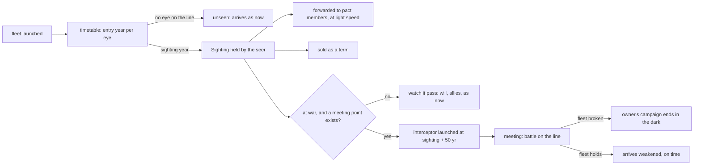

# Sightings and interception

**Status:** Implemented (plan step 10, 2026-09-18: seeing, the timetable, the observatory and the works as eyes, meeting in the dark and turning back, wrecks as fields the Find reads, pickets; the sold sighting with plan step 12, 2026-09-19; see "Watching the sky" and "Contracts" in `DESIGN_NOTES.md`)
**Last updated:** 2026-09-17

Assumes [one-tick](one-tick.md): every rate below is per thousand years, and "per tick" means a thousand-year tick, the same thing.

Reads [contracts-and-mercenaries](contracts-and-mercenaries.md) (a sighting as a term), [resources-and-trade](resources-and-trade.md) (structures at stars a people does not hold, and upkeep for the ones added here) and [wisdom](wisdom.md) (a warning is a message, and messages need understanding). None is needed to argue this one; the contract term and the outposts need the first two to build. The losses rule changes every battle, not only interceptions, and stands on its own.

## Problem

A fleet in flight is invisible and immune. The sim already has a watch: every people sees a campaign or relief fleet that passes within a few light years of one of its worlds, farther for a relativistic torch, and the sighting raises will and calls allies. But it does nothing else, it comes only from worlds, never from a fleet, a scout or a station, a nomad horde on the move is never seen at all, and the watch is taken at tick boundaries while most crossings are shorter than a tick, so most fleets are never in flight when anyone looks. Nothing can be done with a sighting except brace. Space is vast and a fleet should be hard to find, but a people that has found one should be able to meet it in the dark before it arrives, and a people that saw one pass should have something to sell.

## Scope

**In:** what sees fleets (worlds, structures at other stars, fleets at base, fleets in flight, scouts on picket) and how far, by the seer's tree, the structure and the fleet's size; built eyes, from a mining outpost that sees almost nothing to an interstellar observatory that sees most of a neighbourhood; sightings computed on the fleet's timetable, not at tick boundaries; what a sighting tells; sightings passed to allies and sold to anyone; interception as a new expedition kind that meets a fleet on its line at a computed point; **losses in every battle** rolled against the other side's strength instead of the flat cut; a fleet beaten in the dark turned back; **one military level is one ship**, and every ship lost in a battle is left where it fell as a wreck or a derelict, a remain for the Find; pickets as scouts that stay and watch; what it writes.

**Out:** wrecks from anything but a battle (a cosmic blast, a horror, a ship lost on a guess: those stay as they are); a wreck field as a horror's lair; a fleet changing course or speed once launched; stealth or cold running as nodes; two fleets meeting by chance; blockades and sieges; seeing colony ships and Voyages; the Sight's rules (they stand: it sees everything bound for its holder's worlds); horrors' movements; a standing watch contract (open question).

## Design

### Seeing

Every fleet in flight is a point on a straight line from `From` to `Star`, at a known speed. Every people has **eyes**: each of its worlds, each structure it holds at another star (the resources proposal's harnessing works), each of its fleets at base or in flight, each picket. Each eye has a radius:

| eye | radius |
|---|---|
| a world | `watchRange` from the tree, 1 to 15 ly, as now |
| a structure, at any star | its own `Watch`, below; at a held world the larger of this and the world's |
| a fleet at base, in flight, or a picket | `max(1, watchRange / 2)`: a ship carries no great telescope |

**Built eyes.** `tech.Structure` gains `Watch`, a radius in light years. The structures the resources proposal adds are eyes where they stand, most of them poor ones, and one new structure is nothing but an eye:

| structure | node | Watch | note |
|---|---|---|---|
| observatory (new) | orbital habitats | 40 | mirrors flung across a system, a baseline of light-hours; upkeep 1 E; one per people (`build` caps it at one, not two) |
| defence grid | planetary defence | 12 | as the node gives now; the grid is the eye |
| Dyson swarm | Dyson swarms | 15 | as now |
| shipyard | orbital habitats | 3 | yards watch the lanes they serve |
| collectors, accretion tap, lifter | as in resources | 2 | a crew at a star sees what passes it |
| mine | orbital habitats | 0.5 | a belt outpost sees the belt |
| arcology, ansible net | | 0 | |

The observatory is the one that changes the map: a people with one sees a fleet of two levels forty light years out, a horde of eight at eighty, and a torch at twice that, which is most of a neighbourhood. It has no level bonus and no yield, so under the resources proposal a people builds it only when nothing is in deficit, and under the current `build` it is one more lottery pick; either way it is a mark of a people that fears the sky. The `watchTable` rows for the grid and the swarm move onto the structures (a people that has the node but has not built the grid sees five light years, not twelve), and the rest of the table stays as the world's plain range. Nomads build nothing and see with their fleets' eyes only. Text: "The %s hang mirrors across %s, a telescope with a baseline of light-hours. Little moves within forty light years that they do not see."

The radius is multiplied by the **size** of the fleet seen, `clamp(sqrt(Mil / 2), 0.5, 3)`: a fleet of two levels is seen at the plain range, one of eight at twice it, one of eighteen at three times. A relativistic or faster drive (`Speed ≤ 4`) doubles it again: the torch is the brightest thing in the sky. Scouts, surveyors and pickets (`Mil` 1, ships of a few) are not scaled: they are seen **point-blank** only, within 0.5 ly, which in practice means at the star they arrive at, and only if the people there has orbital habitats or a defence grid. A people that sees a scout at its world knows it was looked at: it is summoned, and the scout's people gets a grudge of 0.5 if the two are not partners.

The sighting is computed **on the timetable, at launch**: for each eye, the year the fleet's line enters its sphere, if it does, with the eye where it will be then (a fleet in flight is itself moving; its sphere is taken at the meeting year). The earliest year per people is the **sighting year**. Every crossing gets this, however short. An eye that appears after launch (a fleet launched later, a picket placed later) checks the fleets already in flight when it launches. The Sight's holder sees a fleet bound for its worlds at launch, as now.

A sighting yields a `Sighting{Fleet, Owner, Kind, From, Star, Launched, Arrive, Mil, Year, Eye}`. The line and the speed are exact: a fleet between two stars has one course, and a few years of watching give it. `Mil` carries noise 0.4, less than a scout at the world (0.2) and more than a battle (0.3). The people holds it in `Civ.Sightings` keyed by fleet, and it is an event for the council. The fleet does not know it was seen.

What it does, beyond what `fleetSeen` does now: the sighting is **forwarded** to pact members by the intel rule (loyalty times need against greed times designs), except that a fleet bound for a pact member's world is always sent to that member. It travels by `send`, at light speed from the eye's star, and under the wisdom proposal it is dropped if the receiver does not fathom the sender. It may be **sold**, below.

A nomad horde's hops are fleets in flight and are seen like any other, scaled by size, so a horde is seen far. Interceptors are fleets and are seen like any other.

### Meeting in the dark

A people `o` holding a sighting of a fleet `x` of `c` may **intercept** it if it is at war with `c`, or if `x` is a relief fleet bound to stand against `o` and `o`'s posture would declare on its owner (the usual bar; a relief fleet bound against you is cause enough for a conqueror or opportunist, and for nobody else).

**Feasibility.** The fleet is at `P(t)` for `Launched ≤ t ≤ Arrive`. An interceptor mustered at `m = Year + 50` (the sighting year plus fifty years to muster; a people cannot answer faster than that) from an eye or holding `h` reaches `P(t)` at `m + |h − P(t)| × o.Speed`. The meeting is the earliest `t` with `m + |h − P(t)| × o.Speed ≤ t < Arrive` over all `h`. None: "The Y saw the fleet of the X pass, and could do nothing." A meeting at `t = Arrive` is the battle at the destination, which exists. A slower interceptor can still meet a fleet if it starts near the line ahead of it; a fleet cannot be chased.

**Sizing** is `sizeCampaign` against the sighting's `Mil` instead of a world: need is the believed strength tilted by risk, floor a tenth of the total, cap `Mil × (1 − 0.4 Fear)`, and under the wisdom proposal the same `Acted` shrink. The council does not wait for its cadence: a sighting is an event, and the decision is made at the sighting year on the timetable. A people already sending a campaign or relief fleet does not also intercept unless the sighted fleet is bound for one of its worlds. A pacifist intercepts only a fleet bound for its own worlds.

**The battle** is a strike with no world behind either side: `atk = interceptor Mil + o.warBonus + N(0, 1.5)`, `def = x.Mil + c.warBonus + N(0, 1.5)`, no home or grid bonus, no relief. The roll decides who holds the field; the losses rule below decides what each side pays. Both observe the other. Will moves ±0.2 as for a fleet broken at base. The interceptor turns home whatever happened. A scout or surveyor met by an interceptor is lost, and its report with it. A horde's fleet met in flight is a fleet like any other, the extinction rule included. The battle is a fact for both: `FIntercept`, a deed to the winner, a woe to the loser, `Star` the nearer of the two ends, and the legend line names the dark between them: "The Y meet the fleet of the X between S and T, and turn it back." "The fleet of the X, met in the dark, arrives at W a third weaker."

**Turned back.** A fleet that loses the roll cannot go on. It must leave the meeting point into the **back hemisphere**: any star whose direction from the meeting point makes an obtuse angle with its old course. It goes to its people's nearest holding in that hemisphere if one is within a hop (20 ly), else to the nearest star of any kind in that hemisphere within a hop, else back to `From`; from wherever it lands it turns for home by the usual rule. Its campaign is over, `Returning` is set on the first leg, and the war's will does not pause for it. A relief fleet turned back does not reach its host; a horde's fleet turned back bases at the star it lands on. A fleet that wins the roll keeps its course and its timetable and arrives with whatever it has left. Nothing in flight ever changes course except this.

### Losses

The flat cut goes: no more "the loser keeps seven tenths". In **every battle** (a strike at a world, a campaign fleet's battle, a nomad fleet hit at base, a relief fleet turning on its host, and the meeting in the dark) each side loses `U(0, 0.5 × the other side's strength)`, where strength is what that side rolled with before the noise: a fleet's `Mil` plus its war bonus, a world's `defence()`. Losses past a side's own strength wipe it. So ten against ten risks up to five each; two against ten risks the whole two, three times in five, and costs the ten at most one. Winning and losing are the roll, as now; the price is the roll of dice after it, and the winner pays too.

A fleet's losses come off `x.Mil` and it is over below 1, freeing `Away` as `resolve` does. A world's losses come off a new `Civ.Losses`, which `recompute` subtracts like `Away`, and which heals at a tenth of the tree's military level per thousand years: a wipe is made good in ten thousand years in the fine pass, and within a tick in the coarse one. The attacker in a strike from home loses from `Losses` too. The bonuses count as strength for what a side can inflict: a home world fights with everything it has, and the +2.5 is ships as much as resolve. A defence grid's +1.5 is guns and counts; relief stationed at the world counts, and its losses come off the relief fleet first.

**Ships.** One military level is one ship, for the count and for the telling: a fleet of four is four ships, a scout is one, and a people of ten levels at home has ten ships in its yards and orbits. Losses are rolled as above and rounded to ships stochastically (2.4 lost is two ships and a two in five chance of a third), so a battle's cost is always whole ships and the legend can count them: "The X take S, and leave three ships in its sky doing it."

What it changes: wars become attrition. A strong people striking a strong one bleeds even when it wins, a campaign fleet that wins three battles has paid for them, and a home that beats off a fleet is weaker the next time it is struck. A fleet sized to `need` at launch that takes half its strength in losses on the way in fails at its first world, which is what interception is for. The `campaign` loop's three battles a tick and `strikes`'s rate stand; with losses on both sides they will resolve faster, which is a number to watch.

Both fleets are in flight until the meeting, and `drain` already pauses will for a fleet in flight; interceptors and fleets turned back are excluded from that rule so a war does not stand still for a chase or a retreat.

### Wrecks

Every ship lost in a battle stays where it fell. Each is a **wreck** (four in five: broken, its makers' arts still in it, repairable with a lot of work) or a **derelict** (one in five: bad shape, but a ship). They are gathered into a **field**: one remain per battle per side that lost a ship, a `Legacy` of new kind `Field` with `Maker` the side that lost them, `Wrecks` and `Derelicts` counts, `Node` the best weapons or propulsion node the maker knew (what the hulls teach), `Cond` Derelict if any derelict is in it, else Wreck, and its makers' testament, since a fleet carries its people's tales as its logs. A second battle at the same star by the same loser adds to the field there rather than leaving another, so a long siege leaves one great field, not thirty small ones. A field at a star sits at the star like any remain. A field from the meeting in the dark is **adrift**: its `Star` is the nearer end of the line for the gazetteer and the telling, and it keeps the point; it is found by whoever reads that star, and at once by any fleet, scout or surveyor whose own line passes within half a light year of it.

Fields wear like other remains, a step at a time by `tickLegacies`: Derelict to Wreck to Ruin to Lost. Hardiness 0.3 adrift, where nothing touches them, and 0.8 at a star with a living world, where they are picked over and fall. At Ruin there are no ships left, only what can be learned.

What a finder does with a field is the Find as it is, with the three choices read for hulls:

- **Master**: the usual attempt at the maker's `Node`. This is the one tech channel the war build lacked, the wrecks of a stronger enemy read for what made them stronger, and it is gated as mastery is now: a difficulty of 7.5 against the finder's levels, so a young people finds a great fleet's grave and learns nothing but that it happened.
- **Wield**: the usual roll against `Mil`. On success the finder crews the derelicts and a quarter of the wrecks, repaired after a fashion, as a fleet of that many ships at the field's star, turned for home; on arrival they add to `Civ.Salvage`, which `recompute` adds like `Losses` subtracts, and which decays at a tenth a thousand years, since nobody can keep another people's ships running for long. The field's `Cond` steps to Ruin once its ships are taken.
- **Seal**: never offered for a field. There is nothing in it to hold.

A people finds the fields at its own worlds by the own-works rate (they are in its sky; it gets to them when it can), and the enemy's wrecks above a world it held are the commonest Find a war produces. The rule that skips a remain whose node the finder knows stays for what can be learned, but a field with ships in it is a candidate anyway, for the ships. Kinship counts as now: a people crewing its own dead fleet's derelicts gets the kinship discount and the line "something in them remembers".

A field in the telling: "the wrecks of the fleet of the X, seven ships, above S"; "the derelicts of the Y, adrift between S and T"; found, "The Y come upon the grave of the X's fleet between S and T. Three ships will fly again; the rest they read." The gazetteer lists fields with the count and the state.

### Pickets

A **picket** is a scout that stays: `Scout` with `Picket` set, `Mil` 1, sent to a star and holding there for a tour of 20 kyr or until recalled, then home. It is an eye at half range. Policy, in one function like scouting: a people at war with an enemy it has no front with, or that has been caught by a fleet before (`Tally.Caught > 0`), keeps one picket per such enemy at the star nearest the midpoint between its nearest holding and the enemy's nearest world, if that star is empty or its own; a fearful people (`Fear > 0.6`) keeps one against any hostile neighbour in reach in peacetime. A level must stay home, as for surveyors, and wartime does not recall pickets. The level cost is what keeps pickets rare: a people of three levels cannot afford one.

### Selling a sighting

A sighting is a thing of one kind, and the contracts proposal exchanges it for a thing of another. New term kind `sighting` with `Fleet int`: the seller passes the sighting it holds. The seller **offers** it, at light lag, when it holds a sighting of a fleet bound for a people it is not allied with and not at war with, or of a fleet of a people the buyer is at war with, and the buyer is a trade partner or has traded before. The buyer answers by the contract rules (worth, margin), and `worth` for the buyer is the fleet's believed `Mil` times the fraction of the crossing still to run; a sighting of a fleet about to arrive is worth little. Paid in flows as any term. The sighting is sent on payment, at light lag, so three lags pass between the seeing and the knowing, which is why slow fleets are the ones that get sold.

Honour governs whose fleets are for sale. The faithful sell no sighting of a pact member's fleet and none of a fleet bound to stand with one; the practical sell no pact member's; the faithless sell anyone's, and if a fleet sold this way is intercepted, its owner learns who sold it with chance 0.5, which is a betrayal of weight 1 by the existing rule and a grudge of 2. "The Z sold the coming of the X's fleet to the Y, for a thousand years of metal. The X learned of it, later."

### What the physics gives

A relativistic fleet is seen from far and arrives before an answer can be mustered: with a defence grid and the torch, thirty light years of warning is a hundred and twenty years, and the muster alone is fifty; only a holding almost on the line can meet it. A slow fleet at a hundred years to the light year is the opposite: seen five light years out it is five centuries away, and anything within reach can meet it. So interception is a theatre of the slow drives and the early age, and a people that gains the torch escapes it, as it escaped the watch. "The Y saw the torch of the X's fleet a century out. There was nothing to be done."

### Portrait and output

Legend lines at sighting (once per fleet per seer, as now, with the eye named when it is a picket, a fleet or a structure: "the pickets of the Y", "a fleet of the Y in flight", "the mirrors at S"), at interception, at a fleet turned back, at a sale, at the observatory's raising. Battles in the legends say what they cost when it was much: "The X take S, and lose half the fleet doing it." `techstats` gains a Sightings section: fleets seen before arrival by kind of eye; warning years, by drive; intercepts feasible, launched, met, won; fleets turned back; pickets kept and their cost in levels; sightings sold, and betrayals from it; and under war, losses per battle by winner and loser, wipes, and how often a world's `Losses` is above zero.

## Implementation notes

- `tech.Structure` gains `Watch float64`; `observatory` in `tech.Structures`, hung on `orbital_habitats` beside the shipyard (a node may name two structures, or the observatory gets `Structure` on a second node; the first needs `Structure` to become a list); `build` caps it at one. `watchRange` drops the grid and swarm rows; `eyes(o)` returns every (star, radius) pair for a people, reading `Works` for structures at any star.
- `Civ.Losses float64` and `Civ.Salvage float64` in types.go, subtracted and added in `recompute` beside `Away`, healed and decayed in the civ tick; `ships(x float64) int` for the stochastic rounding;
- `LegacyKind Field`, `Legacy.Wrecks, Derelicts int`, `Legacy.At [3]float64` and `Adrift bool` for the point; `leaveField(loser, ships, star, at)` in legacy.go merges by (star, maker) for fields at a star; `find` admits fields with ships even when the node is known, and the adrift check lives in `timetable` (a line within 0.5 ly of a field's point is a Find on the spot for the fleet's owner); `discover`'s choice weights zero seal for a field; `attemptWield` on a field launches the salvage fleet; `Describe` and the gazetteer count ships; `losses(a, b float64) (la, lb float64)` in war.go called from `strike`, `campaign`, `hitFleet`, `turn`, `meet`; the 0.7 cuts go.
- `Expedition` gains `Kind Intercept`, `Quarry int` (the fleet ID), `Meet Year`, `Picket bool`; `Tour` is reused for the picket's stay. `turnBack(x, from, heading)` picks the back-hemisphere star and sets the first leg. `Launched`, `Arrive` and `Meet` may fall inside a tick; `tickExpeditions` resolves meetings with `Meet ≤ Now` before arrivals with `Arrive ≤ Now`, in year order, which is what makes a sub-tick crossing interceptable.
- `Sighting` type and `Civ.Sightings map[int]*Sighting` in types.go; `Tally` gains `Sighted, Seen, Intercepts, Caught, Pickets, SoldSightings`.
- `watchSky` is replaced by `timetable(x)` called from `launch` and `moveFleet` (the nomad hop): for each people, over its eyes, the line-sphere entry year; the earliest is queued as a sighting event at that year. Eyes are `holdings(o)`, structures at other stars, fleets at base, fleets in flight (position at the candidate year), pickets. A newly launched fleet or picket runs the check against every fleet in flight.
- `fleetSeen` keeps its will and ally logic, then calls the council with the event; `intercept(o, s)` does feasibility (sample `t` at 64 points on the remaining line, take the earliest that works, per `h`) and sizing, and launches with `Meet`.
- `meet(x)` resolves the battle: shared code with `strike`'s roll, then `hitFleet`-style cut; `FIntercept` in lore.go with the sort table entry (Deed 1 winner, Woe 1 loser).
- `fleetInFlight` excludes `Intercept`; `hasFleetAgainst` too.
- `drain`, `judge` unchanged. `resolve` handles a broken campaign fleet as now once `Mil < 1`.
- Scout arrival at a world with orbital habitats or a defence grid: `arrive` adds the point-blank sighting, the summons and the grudge.
- `picket(c)` beside `survey` in explore.go; the picket's eye enters `timetable`.
- The `sighting` term hooks into the contracts proposal's `Term`, `worth` and `answer`; the honour rule in the seller's `offer`; the discovery roll in `meet`.
- Stage: the losses rule and the ship rounding first, with fields at stars (no adrift fields yet), since it changes every war and the batch must be re-read after it; then eyes, timetable and sightings (with the forwarded message and the legend line); the observatory and the structure watch with the resources proposal's structures, or the observatory alone under the current `build`; interception and turning back; pickets; the term when contracts exist.
- Tests: every ship lost in a battle is in a field by the next tick, wrecks and derelicts in the rolled split; a second battle at a star by the same loser grows the field; a surveyor whose line passes 0.3 ly from an adrift field finds it and one passing 2 ly off does not; a field at Ruin yields no ships; a wielded field's ships arrive home and decay to nothing in ten thousand years; ten against ten never loses more than five a side; two against ten is wiped whenever its loss roll is two or more and the ten never loses more than one; a world's `Losses` heals to zero in ten thousand years of the fine pass; a fleet that loses the meeting lands at a star with a negative dot against its old heading, or at `From`; an observatory at a held world sees a fleet of two levels forty light years out and the world alone does not; a mine at a stranger's belt sees a fleet passing through that star and nothing a light year off; a fleet crossing inside one coarse tick is seen by a world on its line; a torch at 4 yr/ly with 30 ly of warning yields no meeting from a holding 20 ly off the line; a slow fleet seen 5 ly out is met by a holding 3 ly from the line; a broken fleet frees `Away`; a picket at the midpoint sees a fleet a world would not; a sold sighting of a pact member's fleet is refused by the faithful and offered by the faithless.

## Open questions

- **Standing watch.** A second term kind, `watch` with `Target`, where the seller forwards every sighting of a people's fleets for the length. Simpler to run than one-off sales and closer to how intelligence is actually bought, but it makes a partner into a sensor for a stranger. One-off first, or both?
- **Muster.** Fifty years is a guess. A people with the ansible or a standing fleet at base might muster at once; a people in a dark age not at all.
- **Pickets and levels.** A level for a picket is the surveyor's price, and it keeps pickets to the strong. Should a picket cost less than a level, since it is a few ships that only look? Then scouts and surveyors should too, which is a wider change.
- **Course and destination.** The line is exact here. Should a people that sees a fleet know only its heading and guess the star, with the guess better by tree? It adds fog where the gain is small, since the meeting is on the line either way.
- **The seen scout.** A grudge for looking is cheap drama; drop it if scouts stop being sent.
- **Winner's share.** The losses roll is symmetric: the winner pays as the loser does. Should the loser roll from the upper half of its range, or the winner from the lower? Symmetric is simplest and what the example says; the roll that decides the field already favours the stronger.
- **Healing.** A tenth a thousand years is a guess; a people in a dark age or shedding under the resources proposal should heal slower, and a shipyard faster.
- **What is still aboard.** A derelict of a mind-rider people is a derelict with a rider in it, and a field of machine-born ships may have something awake. Crewing them could be an infection or a waking, by the parasite and horror rules; this is the cheap horror the scope keeps out for now.
- **Salvage decay.** A tenth a thousand years makes salvage a war's windfall, not a fleet; if the finder has the field's node it could keep them as its own, which is a nice reason to master first and wield second.
- **The observatory's node.** Orbital habitats makes it an era-3 thing, which is when fleets start. Hanging it on `computers` instead would give the atomic age a long eye and a reason to look up before it can go anywhere; the design notes' watch table says computers see five light years, and an observatory at that era could be a second row at twenty.
- **Numbers to watch.** The share of fleets seen before arrival by drive; if slow fleets are nearly always met, the early age's wars go all to the defender, which may be right. With losses on both sides, how much shorter wars get and how often a home is wiped and heals before the next strike.
