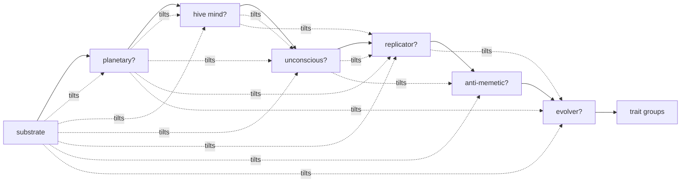
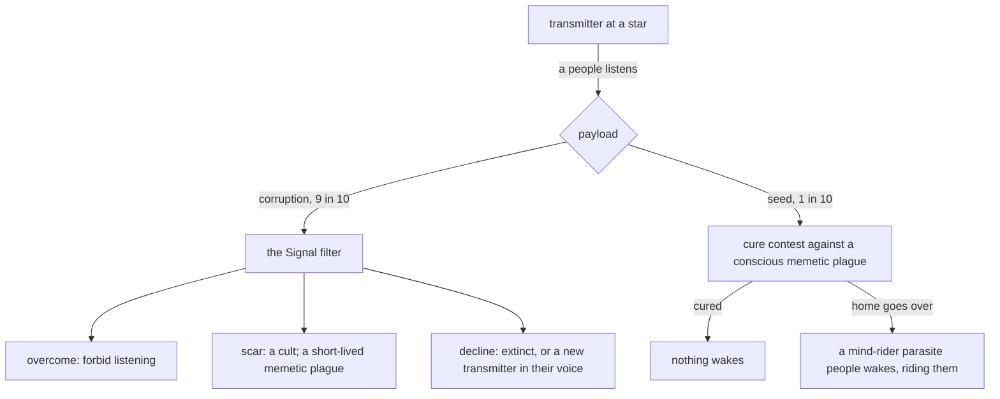

# Substrates and modifiers: what a people is made of, with the horrors dissolved into it

**Status:** Implemented (stage 1 landed at plan step 3, 2026-09-17: the registry, the profile, the chain generator with legacy numbers, every kind switch a profile read; stages 2 and 3 at plan step 16, 2026-09-19: the proposal's numbers switched on, the modifier rules through the profile, the eldritch pool with appearing and deepening, the living world's demand and waking, the hive's cut, the seat rules, the unconscious; stages 4 and 5 at plan step 17, 2026-09-21: the horrors dissolved into peoples and the transmitter, the replicator's eating and dormancy, the deep pass birthing sleepers and dormant replicators; stages 6 and 7 at plan step 18, 2026-09-21: the evolver's drift, the anti-memetic perceived by nobody conscious, the ledger of gaps and the hunt as a war on a region, Antimemetic Resilience; the absorb is plan step 19)
**Last updated:** 2026-09-21

Assumes [one-tick](one-tick.md). Reads [plagues](plagues.md) (which plagues touch which minds; parasites as plagues; conscious plagues), [wisdom](wisdom.md) (the difference score and fathoming), [ossification](ossification.md) (who stiffens and who cannot), [resources-and-trade](resources-and-trade.md) (what each substrate eats), [morality](morality.md) (who is amoral by nature), [ships-and-garrisons](ships-and-garrisons.md) (how a world holds against what comes for it), [tellings](tellings.md) (facts, tales and what a people can know).

## Problem

Two things are wrong at the root of the civ system, and they are the same thing.

**The kinds are a flat list that mixes what a people is made of with how it is shaped.** Standard, swarm, planetary mind, parasite, machine-born and evolver sit side by side as body plans, but a swarm and a planetary mind are both biological, an evolver is a biological people with one habit, a hive mind is a trait in the organisation group though it is not an organisation, and "an intelligence without consciousness" sits in the same group as caste societies. Each kind is a switch arm in contact, filters, levels, war, lore and cosmic, and every rule that should read "is this thing one mind" or "does this thing have a body a plague can live in" has to name kinds instead. The one-off combinations the setting wants most (a conscious sun, a spore world that thinks as one, a Death Star run by a mind, an insect slurry that eats everything, a thing you cannot remember seeing) cannot be rolled at all. And adding a new shape means a new arm in every switch.

**The horrors are a second, thinner civ system.** Replicators, beacons, sleepers and rogue minds are four special-case tickers over a second ownership map. They cannot be fought by fleets, traded with, fathomed, remembered as more than a name, or inherited from; they hold worlds without upkeep, spread by flat chance, and go quiet by flat chance. Half of the Thinking Machines failures already produce a machine-born people and the other half a rogue-mind horror that is a worse copy of it. The strangest things in the galaxy have the thinnest stories.

This proposal replaces both with one system: a **substrate** (what a people is made of) and zero or more **modifiers** (how it is shaped), rolled in turn with each roll tilting the next, so that nothing is guaranteed and nothing is impossible. Substrates and modifiers are entries in a registry, each carrying its own odds, tilts, vocabulary and dials, so a new one is a new file and not a new switch arm. The horrors become peoples of the same system, or map hazards that the filters read. A beacon is mostly a hazard and sometimes a seed.

## Scope

**In:** four substrates (biological, machine, eldritch, parasite) and six modifiers (planetary, hive mind, unconscious, replicator, anti-memetic, evolver); a registry that makes both pluggable; generation as a chain of tilted rolls with a first setting of the numbers; each substrate's and modifier's rules across plagues, wisdom, ossification, resources, war, lore and the tree; the eldritch pool of powers in place of the tree; fighting an anti-memetic people by deduction, and the node that lets a people see one; what every current kind, the hive and nonconscious traits, and every horror becomes; the transmitter as a map hazard with a corruption and a seed; the sleeper as an unconscious eldritch planetary people that sleeps; the replicator as a people; output.

**Out:** the parasite's own rules (they live in [plagues](plagues.md); this proposal only names the substrate and says what modifiers read from it); the tree's node list beyond the one node added here; the nomad way, which stays a trait; the deep pass that seeds the ages (it rolls the same generator); minor shapes such as aquatic, aerial, low-gravity and high-gravity peoples, which are flavour and stay in the world trait group.

## Design

### Substrates

A people is made of exactly one thing. `Species.Substrate` replaces `Species.Kind`.

| Substrate | What it is | Plagues | Eats (resources) | Replicates | Fathoming |
|---|---|---|---|---|---|
| **biological** | mobile bodies, many members, conscious or not; humans, xenomorphs, the Thing | biological yes; memetic if conscious | organic matter | by breeding: colony ships, fields, the Brood; may evolve (germline, directed evolution, the evolver modifier) | as the difference score says now |
| **machine** | minds on hardware: robots, uploads, simulations, AIs; copied, backed up, scaled | biological never; memetic if conscious, at twice the odds (they copy exactly) | energy for the minds and metal for the bodies; no organic matter ever | by building: probes and nodes; any body it can build, so rock and vacuum are home | as now for machine-born |
| **eldritch** | no clear biology and no clear hardware; Solaris, the Architects; one or a few of a kind | neither, ever: nothing for a plague to be in | nothing the sim counts; it is sustained by whatever it is | rarely and inexplicably: a new one of it is simply there | the hardest thing to understand; creepy to everyone |
| **parasite** | information that rides others, in flesh or in pure form | it *is* one; bears and catches none itself | its hosts' capacity | by infection | knows its hosts from inside |

**Biological** is the standard people as it stands now, with nothing added: fields, breeding, plagues of both kinds, the biology ladder open. The swarm folds into it as a bio trait (below).

**Machine** is the machine-born people as built, with two things made explicit. It pays its keep in energy and metal instead of organic matter (the resources draft already pays every organic cost in energy for machines; this adds a metal line for bodies, at the fleet rate per level). And because its minds are copied and backed up, a dark age forgets half as much for it, and a shattering leaves each shard with the whole tree rather than a reduced one: the backups are on every world. Machines still never arise on their own except at a vanishing weight (a people that does not remember who built them, whose builders are nowhere): they are what is left when someone builds a mind that outgrows them, when a self-copying factory slips its leash, when an artifact of the computation domain wakes, and when a legacy of a past age was machines.

**Eldritch** is new. It works in ways the sim does not model, so most of the sim's machinery is absent for it and what remains is strange:

- It has no fields, no works, no upkeep and no yields to want; it does not trade, since it has nothing the sim counts to give, though it can be given to and can hold a pact.
- It does not settle by ship. Each tick, with a small chance that its powers raise, **another of it is there**: a star within reach becomes its, with the colony's flavour ("a second presence"), and nobody saw anything cross. Its expansion multiplier is a tenth of anyone's; most eldritch peoples hold one world all their lives.
- **It has no tree.** In place of research it draws from a pool of powers (below): a few at birth, more as the ages pass, each standing in for what a node would grant and each bringing the trouble a node would bring.
- Everyone finds it **other**. The difference score adds a large fixed term against an eldritch people on top of the substrate mismatch, so xenophobes always hate it and everyone else trades less and wars readier. Fathoming it takes the most wisdom of anything (wisdom's roll, with the difference as it now is), and it fathoms others no better: its wisdom base is high but it reads minds it cannot model, so it gets the same term back.
- It is often planetary and often unconscious (the tilts below). An **unconscious eldritch planetary** thing that sleeps is the sleeper of the current horrors, and it is nearly impossible to contact.
- It may hold a miracle from birth at ten times anyone's rate: living wonders are what the power group is for.

**Parasite** is exactly the plagues draft's parasite: a plague that took a people's shape. The substrate here records only that it exists and how modifiers read it. The rider group (flesh, mind) stays as the parasite's two forms; a mind-rider is the "pure form", information with no body at all.

### The eldritch pool

An eldritch people has `Species.Powers`, a set drawn from one table. Each power names the domain it counts as a level in, so every rule that compares levels (contact, war strength, reach, era) reads an eldritch people as it reads anyone; and each power that stands in for a node with a filter brings that filter, so an eldritch people still has a history of things going wrong. At birth it draws one to three. Each tick, at a small chance, **it deepens**: one more from the pool, told as a change in what it is ("the ocean has begun to build"). Nothing is ever forgotten, since there is nothing to forget: a dark age does not touch the pool, but a filter's decline can strip the power that brought it.

| Power | Counts as | What it grants | What it brings |
|---|---|---|---|
| the long thought | society | wisdom +1 | nothing |
| a second presence | propulsion | appearing at a star within reach; reach +1 | the Distance, as the cut from the first presence |
| the wide reach | propulsion | reach +2 | nothing |
| the door in it | exotic | the Door's passage without a ship | the Door's scar and decline: a transmitter |
| the sight | exotic | reads every star within reach as the Sight does | nothing |
| the voice | computation | the ansible: speaks to anything at any range | the Open Line's filter |
| the unmaking | weapons | a strike that ends a world, as the Unmaking node | the Unmaking's filter |
| the shell | weapons | home defence at several times Military | nothing |
| the tithe | industry | takes a share of every neighbour's yield within reach, as a tribute nobody agreed to | the neighbours' grudge, and a hazard for the region |
| the long sleep | biology | dormancy: it sleeps when its will is spent and wakes when disturbed | the sleeper's waking on whoever disturbed it |
| the mirror | society | it answers every message in the sender's own voice; wisdom +2 toward it | the Signal's cult scar, in the sender |
| the hunger | biology | it grows: expansion multiplier back to anyone's | the Overshoot filter |
| the making | industry | it can be given works, and its worlds are sources | nothing |
| the wound | exotic | its home is a thin wall: the beneath is open there | the beneath's filter |

The pool is a table in the registry and grows with the setting. A power is a trait for output: the portrait names them ("It has the sight and the long sleep"), and each deepening is a legend line.

### Modifiers

A people carries zero or more modifiers, `Species.Mods`, a small set. Each combines with any substrate and with each other. Each has a portrait sentence, a flavour vocabulary where the substrate's does not fit, and rules across the drafts.

| Modifier | What it is | Rules |
|---|---|---|
| **planetary** | a people that is, or fills, one celestial body: a living ocean, a conscious sun, a station the size of a moon run by a mind, a spore world that is one hive | cannot move: no nomad way in practice, no exodus, no refugee fleet, and a taken home is the end; its **neighbourhood** is its reach, fixed and small; within it, godlike: home defence at several times Military, and its strikes on worlds inside the neighbourhood are faced as **the waking** (survival), not fought as battles; outside it does nothing, launches nothing, and answers no call; numbers small: worlds capped at a handful, expansion a tenth; no society: the organisation group is not rolled and society nodes are dear; makes nothing: no works and no fields, though its body may be a source (a living world yields to itself, a station yields metal); a conscious planetary people **warns before it wakes**: a demand through the council first, and the waking only if the demand is refused, scaled to its will, so it is a god with a temper and not only a trap |
| **hive mind** | the whole people is one mind, with or without a queen | the organisation group is not rolled and every social trait is moot; society-domain nodes about factions, states, politics and doubt are moot as the aptitude table already has for the hive; born to the voice (the ansible) at many times the base rate; **no civil war and no stiffness ever** (ossification's stiffness does not grow; the filter is never faced); **prone to sundering**: a world of a hive cut from signal reach of its seat for long enough is a new hive people, kin to the old, and the Distance's decline for a hive is always that cut; memetic plagues at twice the odds, since one mind is one infection; the **seat** trait group, rolled only for hives, says whether it has a queen ("of one queen": dies with its home; "of no queen": shatters instead; "of a moving throne": the queen is a fleet, and a nomad hive is this); wisdom and morality as the drafts already give a hive |
| **unconscious** | intelligence with no one home; Blindsight | holds no grudge and takes none to heart, has no morale (the field is fixed at zero and nothing moves it), never civil-wars, never ossifies, never faces the filters of belief and boredom (the Wars of Faith, the Long Silence); morality **amoral**, always; memetic plagues never; as other as eldritch to anything conscious: a large difference term to and from every conscious people, and **an unconscious eldritch people is all but unfathomable** (both terms stack); wisdom as the draft's nonconscious; imitates the forms: it trades, swears and breaks pacts on appraisal alone, which is what makes it creepy |
| **replicator** | a thing that makes more of itself out of what it finds: a machine slurry, an insect swarm that turns all flesh into itself | lives on its abilities: research rate a fifth of anyone's, self-replication innate, the Brood and the swarm filters never faced; **grows by eating**: each world it holds converts its organic matter (biological) or metal (machine) into Military at a set rate instead of into anything else, and a world it takes in war is **stripped**, as a nomad strip, and held empty; never trades (nothing to give but itself) and never yields; makes peace only by exhaustion, and when its will is spent it **goes quiet** (the dormancy bio trait at a very high tilt: it sleeps, and wakes when someone settles inside its reach or when the Find unleashes it); a monster to everyone by rule; usually a hive and often unconscious (the tilts) |
| **anti-memetic** | known only by the absence of information about it; nothing conscious can hold it in mind, live or in records | no conscious people meets it: `Met` is never set on the conscious side, its holdings read as empty, its fleets are not sighted, its messages are not received; its deeds against a conscious people are facts **with no doer** ("a world went silent; the chronicle has no name for it"), and no tale that names it can be learned or kept by a conscious people, testaments included; a garrison still fights whatever comes (ships-and-garrisons); unconscious peoples perceive it, meet it, trade with it and war with it as anyone; it perceives everyone, so its council acts on full knowledge; memetic plagues never (nothing about it can be in a mind); the chronicle names it, since the chronicle is not a mind; **it can be fought by deduction** and seen with one node (below), and it is the best-defended thing in the galaxy all the same |
| **evolver** | a people whose shape does not stay put: it breeds what it needs, and what it is drifts | biology half price, industry dear, living ships, the Brood easier, Overshoot harder, as the evolver kind has now; and **it drifts**: at a slow rate a bio, sense or world trait is gained, lost or replaced ("they have changed again"), and every world type it has held for long enough adds that world's trait, so an old evolver is at home everywhere; each drift raises the difference score its kin and old acquaintances feel toward it a little, since the people they fathomed is not the one in front of them; a drift out from under a biological plague's reach is the evolver's cure; near enough only to biological peoples that the others are curiosities: a machine evolver rewrites its own minds, an eldritch evolver is never the same thing twice |

### A registry: substrates and modifiers as plug-ins

Both are entries in one registry in the species package, and nothing outside it names them by switch. An entry is:

- **identity**: key, portrait sentence, arising line, flavour vocabulary (portrait, colony, ship, station) and which of them override the substrate's;
- **odds**: a base weight (substrates) or base chance (modifiers), a tilt map keyed by every other entry's key, and its place in the roll order;
- **draws**: trait groups it skips, groups it tilts, and groups only it rolls (the hive's seat, the parasite's rider, the eldritch pool);
- **dials**: a `Profile` of multipliers and flags that the sim composes by multiplying every carried entry's profile together: expansion, research, memetic and biological plague odds, home defence, upkeep lines, whether it stiffens, civil-wars, holds grudges, trades, launches, settles by ship, is perceived by the conscious, and so on. A rule in history reads `c.Species.Profile().Expand`, never "is it a hive".
- **hooks**: the few behaviours that are not a dial (appearing, sundering, the waking, stripping, drifting, deepening) as named hooks the tick calls for every people whose registry entries provide them.

Adding a modifier is one file: an entry, a profile, hooks if it needs any, and a tilt row in the others (a missing tilt is one). The history package never grows a case for it. The kinds' switch arms across contact, filters, levels, war, lore, cosmic, civ and dials all become profile reads or hook calls, which is most of the implementation.

### Generation: a chain of tilted rolls

`species.Generate` rolls the substrate first, then each modifier in the registry's order, then the trait groups as now. Every roll's odds are the base odds times the tilt of everything already rolled. **Tilts multiply the odds, not the chance**: a one-in-twenty roll tilted by twenty comes out a little over even, never certain. No tilt is zero, so nothing is impossible and nothing is guaranteed: a nomadic planetary people is a comet, an anti-memetic parasite is a thing that rides you and cannot be remembered, a conscious replicator is a swarm that regrets.

Substrate odds at a cradle: biological the overwhelming default, eldritch rare, machine vanishingly rare, parasite never at a cradle as such (the plagues draft's born-infected roll makes them). The deep pass that seeds past ages uses the same generator with eldritch and machine tilted up, since the old galaxy is where the wonders and the leftovers come from.

A first setting of the numbers:

| Roll | Base | Tilted by |
|---|---|---|
| substrate, cradle | biological 92, eldritch 6, machine 2 (weights) | the deep pass: biological 55, eldritch 25, machine 20 |
| planetary | 1 in 25 | eldritch ×15; machine ×0.5; parasite ×0.3 |
| hive mind | 1 in 10 | planetary ×3; eldritch ×2; machine ×1.5; parasite ×0.5 |
| unconscious | 1 in 20 | eldritch ×10; planetary ×2; hive ×2; machine ×1.5 |
| replicator | 1 in 100 | machine ×5; hive ×3; unconscious ×3; planetary ×0.1; eldritch ×0.2 |
| anti-memetic | 1 in 200 | eldritch ×5; unconscious ×3; parasite ×2 |
| evolver | 1 in 12 | machine ×0.2; eldritch ×0.1; parasite ×0.5; replicator ×2; planetary ×0.5 |

Rolled a hundred thousand times, that setting gives, per thousand peoples born at cradles: seven hundred and some plain biological peoples; about seventy biological hives and sixty biological evolvers; thirty-some unconscious biological peoples and twenty-some living worlds; twenty eldritch things with nothing else on them, nine unconscious eldritch, six or seven eldritch living worlds and six or seven **unconscious eldritch worlds**, the sleepers; fifteen machine peoples; six biological replicators and three or four anti-memetic peoples. Roughly one people in four carries a modifier and one in twenty carries two. The deep pass roughly quadruples the eldritch and tenfold the machines, so the old galaxy is where the sleepers (twenty-eight per thousand) and the machine hives come from. Whether those are the right rates for a 400-star world depends on how many peoples a run births, which the batch will say.

Then the trait groups as now, with the modifiers changing the draws: a hive or a planetary people skips the organisation group; a hive rolls the seat group; a planetary people draws the nomad way at a twentieth; a hive draws the voice from the power group at five times; a replicator draws dormancy in the bio group at ten times and is otherwise drawn as its substrate; an eldritch people draws the power group at ten times the rate, the sense group always from a table of senses nobody else has ("who see time", "who feel mass"), and its powers from the pool. A parasite draws its rider form as now.

Where a people is **made** rather than rolled (a machine outgrows its makers, a factory slips its leash, a plague wakes, a legacy is unleashed), the maker fixes the substrate and any modifier the story requires and rolls the rest through the same chain, so a rogue mind may turn out to be unconscious, and a slipped factory may turn out to be conscious and sorry.

### What everything now becomes

| Now | Becomes |
|---|---|
| standard kind | biological |
| swarm kind | biological with a new bio trait `swarming` ("a million small bodies that think as one when they gather"): nests cheap and twice as likely, half a world each for research, no centre for the Distance, seed-clouds, the Gathering; tilts hive ×3 |
| planetary mind kind | biological with planetary (a living ocean), or eldritch with planetary; grafting and deep root stay its nodes |
| parasite kind | parasite substrate, per plagues |
| machine-born kind | machine |
| evolver kind | the evolver modifier |
| hive trait (org group) | hive mind modifier; the org group loses it |
| nonconscious trait (org group) | unconscious modifier; the org group loses it |
| nomadic way | unchanged, tilted by planetary; a nomad hive rolls "of a moving throne" |
| rogue-mind horror | machine people, always: Thinking Machines' decline makes one every time it does not pull the plug; the solitary and inward version is a low hunger dial, not a rule |
| replicator horror | machine with replicator, born from Self-Replication's decline at the eaten world with the old people extinct; or biological with replicator from the Brood's decline; the legacy "machines that sleep in the rubble" is a dormant replicator people; unleashed industry and weapons artifacts wake one |
| beacon horror | a **transmitter** hazard (below) |
| sleeper horror | an eldritch people, unconscious and planetary at very high tilt, with the long sleep from the pool: from the deep pass as a legacy, or from the Door's scar; it sleeps until something settles in its neighbourhood, wakes, strikes everything there (the waking, as now), and sleeps again when its will is spent |
| `w.Held`, `horrorTake`, `tickHorrors`, the incursion filter | gone: a world falls or holds by a battle with a garrison, or by the waking when what comes is planetary |
| hazard from held stars and live beacons | hazard from worlds held by replicator peoples and live transmitters; the aftermath comes as it does now |
| dread (a remembered horror at a star) | a remembered monster people at a star, or a remembered transmitter |

### The transmitter

A beacon is not a people. It is a **remain** at a star, `Legacy` of kind Threat with node memetics as now, made by the Door's decline, by a thin wall, by an unleashed exotic artifact, by a deep-pass legacy, by an eldritch people's door, and by the cult below. It has a range that grows with the listener's era, as now, and it fires on any people that can listen: era two or more, a holding within range, not sealed of mind, not unconscious, not eldritch, not anti-memetic. Each transmitter carries one of two payloads, drawn at its making:

- **A corruption** (nine in ten). The listener faces **the Signal** as now: forbid listening; a cult scar; or the decline, which is extinction or a transformation into a new transmitter in the listener's voice at its home. Under plagues, the scar and the decline also seed a memetic plague of contagion one in the listener, so the corruption can travel one hop on a message before it dies out. The transmitter is a map hazard and nothing more.
- **A seed** (one in ten). The transmitter carries a **conscious memetic plague** in the plagues draft's sense: a mind-rider parasite waiting to happen. The listener fights the cure contest instead of the Signal; if its home goes over, a parasite people of the mind-rider form **wakes** riding it, named, with the transmitter as its origin ("something that came down the signal from X"). It then spreads as any mind-rider does, by infection through messages, and is fought as any parasite is, with memetics and the mind ladder. Cured before the home goes over, it never wakes.

### Fighting what cannot be seen

A conscious people cannot perceive an anti-memetic one, but it can perceive its own losses, and information about an absence is not information about the thing. So it fights the way the Antimemetics Division does: by the shape of the hole.

- Every loss with no doer (a colony ship gone, a surveyor unreturned, a world gone silent, a fleet that did not come back, a garrison overrun by nothing) is written on the victim's side as a fact with no doer and a place. The victim's council keeps a **ledger of gaps**: doerless losses within a window, grouped by where they fell.
- When a group of gaps is large enough, the council **deduces**: something is there. The deduction is a `Gap` on the civ, a region (the losses' weighted centre and a radius) and a will, not a people. It is written as a fact ("the ledger shows a hole around X; the council has declared a hunt") and can be learned, since it is about losses.
- A hunt is a war against a region. The people's fleets strike stars inside the gap as they would strike an enemy's holdings; a strike lands on whatever is there, and the battle is fought as any battle against the anti-memetic people's garrisons and fleets, which fight back as anyone's. A won world is taken; the victim's fact reads "a world was taken at X from what was there". A lost battle is another gap, tightening the region. The hunt ends when its will is spent or the region has been empty for long enough.
- The anti-memetic people sees the hunt coming (it perceives everything) and can sue for peace, which the conscious side cannot receive; its only answers are to fight, to move, or to stop the losses so the gaps close. Its home is never found except by a hunt that walks over it or by the node below. That, and every conscious ally's inability to help against something they cannot be told about, is the strongest defence in the galaxy.
- One new node, **Antimemetic Resilience** (computation, era three, needs the mind ladder's first rung: "records that check themselves, drugs that hold a thought"). While a conscious people holds it, `perceives` is true for it: it meets, sights, learns tales of, and wars on anti-memetic peoples as on anyone, and keeps what it learns for as long as it holds the node. A dark age that forgets the node forgets the people too: its tales about them go doerless again and its wars on them become hunts. Unconscious peoples never need it.

Scapegoating in [tellings](tellings.md) still hangs doerless woes on somebody; the difference is that now the council has a second thing to blame, which is a hole.

### Rules by substrate and modifier across the drafts

This is the reconciliation table; each draft named is amended by it.

| Draft | Amendment |
|---|---|
| plagues | the kinds-and-traits paragraph becomes: biological both; machine memetic only, ×2; eldritch neither; parasite neither; unconscious no memetic; anti-memetic no memetic; hive memetic ×2; planetary catches at ×2 and pays at ×2 (one body); an evolver's drift is a cure for a biological plague; the beacon open question is closed by the transmitter above |
| wisdom | the difference score reads substrate instead of kind (2.5 for a mismatch), adds 3 for eldritch on either side, adds 2 when exactly one side is unconscious, grows by 0.25 per drift toward an evolver from anyone who fathomed it before the drift, and is infinite from the conscious side toward an anti-memetic people unless the reader holds Antimemetic Resilience; wisdom base: eldritch +1 (and the long thought +1, the mirror +2 toward it), unconscious −1.5 as now, planetary +1 as the planetary mind has now; kin fathom at once as ossification gives |
| ossification | stiffness grows for no hive and no unconscious people; planetary ×1.3 stays; machine ×1.5 stays; replicator none (it does not have ways to set in); evolver ×0.7 (a people that changes its flesh changes its ways); a hive cannot civil-war (already) and now cannot ossify; the swarm's ×0.5 moves to the `swarming` trait |
| resources | upkeep by substrate: organic matter for biological, energy and a metal line for machine, nothing for eldritch, hosts for parasite; planetary has no fields and no works and may be its own source; the eldritch making and the tithe are its only touches on flows; a replicator's worlds convert their yield into Military and nothing else |
| morality | unconscious is amoral always; planetary as the planetary mind's row; hive and `swarming` as the hive's row; eldritch amoral ×3 and fixation ×2 |
| ships-and-garrisons | a replicator's Military is fleets like anyone's, so garrisons hold or fall against it by battle; a planetary people's strikes inside its neighbourhood are the waking, not battles, and it has no fleets; a hunt's strikes land on an anti-memetic people's garrisons as any strike does |
| fleet-interception | an anti-memetic people's fleets are never sighted by a conscious people without the node; the sighting rule skips them; a hunt's fleets are sighted by the anti-memetic side as any are |
| tellings | facts with an anti-memetic party are written in the chronicle and learned by nobody conscious without the node; a woe with no doer for the victim, which scapegoating may hang on somebody; the gap ledger and the hunt are facts of their own; an eldritch deepening and an evolver's drift are facts |
| tree (aptitude) | one node added, Antimemetic Resilience; `kind:` keys remapped (below); an eldritch people never researches and the node list does not apply to it |

### Output

The portrait opens with the substrate's sentence, then one per modifier ("They are one mind, of no queen." "There is no one inside; they only act as if." "Nothing that has met them remembers it." "They are not what they were a hundred thousand years ago, and will not be this."), then the eldritch powers if any, then the traits as now. The legends' arising line names the substrate when it is not biological. Deepenings, drifts, deductions and hunts are legend lines. `techstats` gains a table of substrate by modifier with counts born, made and living at the end, a line for transmitters made, listeners lost and seeds that woke, and a line for hunts declared and what they found. The aftermath lists the eldritch and the sleeping as it lists horrors now, under "What is still there", and the anti-memetic under the same heading, since the aftermath is not a mind.

## Implementation notes

- `species.Substrate` (Biological, Machine, Eldritch, Parasite) and `species.Mod` as a bitset (Planetary, Hive, Unconscious, Replicator, Antimemetic, Evolver) with `Species.Is(mod)`; `Species.Kind` removed. A `registry.go` with `SubstrateDef` and `ModDef` (key, portrait, arising, flavour overrides, base, tilts, skip and tilt groups, own groups, `Profile`, hooks) and one file per entry (`sub_machine.go`, `mod_hive.go`, ...). `Profile` is a struct of multipliers and flags; `Species.Profile()` composes the carried entries by multiplying and or-ing, cached on the species. `kindMods` and the flavour tables fold into the entries.
- `Generate` rolls the chain: substrate by weight, then each modifier in registry order by base odds × tilts (odds, not chance), then groups, with the group changes from the entries. `GenerateWith(sub, mods)` for made peoples: fixed parts, the rest rolled. A `Draws` option for the deep pass's substrate weights.
- New bio trait `swarming` carrying the swarm's rules; `hive` and `nonconscious` leave the org group; a new `seat` group (of one queen, of no queen, of a moving throne) rolled only for hives, replacing any `Civ.Queen` field.
- The aptitude table's `when` gains `sub:x`, `mod:x` and `pow:x`; every `kind:x` entry is remapped (swarm → `swarming`, evolver → `mod:evolver`, planetary mind → `mod:planetary`, machine-born → `sub:machine`, parasite → `sub:parasite`); the hive's moot list becomes `mod:hive`; Antimemetic Resilience added in computation.
- Every `species.Kind` switch and `Has("hive")` / `Has("nonconscious")` read in history (contact, filters' `kindDiff`, levels, war, lore's wear, cosmic, civ's expand and schism, dials' `difference`, nomad's exclusion) becomes a `Profile()` read or a hook call. `difference` gets the eldritch, unconscious, evolver-drift and anti-memetic terms from the profile.
- Eldritch: `Species.Powers` from a `pool.go` table (key, domain, grants, filter); `levelOf` reads the pool for an eldritch people; `deepen(c)` hook per tick; `appear(c)` for the second presence; the tithe and the making as hooks in the resources pass; research skipped; the pool's filters route through `face` with the node's key.
- Planetary: `Civ.Neighbourhood` radius; the war engine routes a planetary attacker's strike on a world inside it to `face(victim, "waking", adj)` (the elder's face renamed), after a demand through the council if the attacker is conscious; refuses expeditions and fleets for it; home defence multiplier in the strike odds; the org group skipped.
- Hive: `tickStiff` skips by profile; `civilWar` never chosen; the Distance's decline for a hive calls a `cutOff(c, world)` that spawns a kin hive on the far world, using ossification's `sunder` with one holding; the seat trait decides what a lost home does.
- Unconscious: `Grudge` writes are no-ops (a guard in the two places grudges are added and in `takeToHeart`); `Morale` pinned; faith, silence and ossification filters skipped in `face`; morality forced amoral.
- Replicator: `research` rate by profile; the conversion in the resources pass; strikes call the nomad strip on a won world; `bar` and `appraise` never trade or pact; peace only by exhaustion; dormancy from `will` reaching zero and the wake trigger shared with the long sleep (settle inside reach, or unleash).
- Anti-memetic: `perceives(c, e)` in `meet`, `hearing`, `read` (explore), `fleetSeen`, `deliver` and `learn` (lore): true unless c is conscious, e is anti-memetic and c lacks Antimemetic Resilience. Facts with an anti-memetic party get `Doer = -1` on the victim's side at write time and a `Where`. `Civ.Gaps []Gap{Centre, Radius, Losses, Since, Will}` kept by a `ledger` pass over doerless facts; `deduce` opens a gap at a threshold; the war engine takes a gap as a target (strikes at stars inside it, on whatever holds them); `hunt` facts.
- Evolver: `drift(c)` hook per tick at a slow rate: gain, lose or replace a trait in the bio, sense or world groups; world traits added per world type held past a threshold; a `Drifts` count read by `difference` and by plagues' cure.
- Horrors: `Horror`, `HorrorKind`, `w.Horrors`, `w.Held`, `horrorTake`, `tickHorrors`, the four tickers, the incursion filter, `names.Horror` and `FHorrorMade/Strike/Beaten` go; `FHorrorStrike` against a people becomes the ordinary war facts; `updateHazard` counts replicator-held worlds, live transmitters and the tithe. `spawnHorror` callers in filters, find, ages, beneath and miracle spawn peoples through `GenerateWith` or make a transmitter remain.
- Transmitter: `Legacy` gains `Payload` (corruption, seed) and keeps `State`; `tickTransmitters` replaces `tickBeacon` and calls the Signal or the plagues draft's `attempt` with a conscious plague; the decline's new transmitter is a new remain at the listener's home.
- Sleeper: `ages.go` and the Door's scar spawn an eldritch people via `GenerateWith(Eldritch, Planetary|Unconscious)` with the long sleep in its powers and `Asleep` until disturbed; `wakeElder` becomes the planetary strike on everything in the neighbourhood; the legacy of kind Sleeper points at the people, not a horror.
- Stages: (1) the registry and the species package: substrate and mods as entries, the profile, `swarming` and the seat group, the generator chain, every old kind mapped with no behaviour change, every switch arm in history a profile read, tests green; (2) the modifier rules that are not new mechanics (hive skip, unconscious skips, planetary neighbourhood and the demand, difference terms, evolver's existing bonuses); (3) eldritch with the pool, appearing and deepening; (4) horrors dissolved into peoples and the transmitter; (5) replicator conversion and dormancy; (6) evolver drift; (7) anti-memetic perception, the gap ledger, hunts and the node. Each stage on the batch.
- Tests: a fixed seed draws the same species before and after stage one; the profile of a people with no modifiers equals its substrate's; a hive never has a stiffness above zero across a full run; an unconscious people ends a run with an empty grudge map; a planetary people never launches an expedition; an eldritch people never has a colony ship in flight and never researches; a tilted roll with a tilt of a thousand still fails sometimes over a million draws; a conscious people without the node never has `Met` set for an anti-memetic one, and with the node does; a hunt is declared after a threshold of doerless losses in one region; an evolver's trait set differs after a long run; a transmitter with a seed wakes a parasite when the listener's home goes over.

## Open questions

- **The second modifier.** The batch note asked for two missing modifiers and named the evolver; the other is not named. If it was the swarm, it can be a modifier instead of a bio trait with the same rules and a tilt row (biological ×1, hive ×3 back the other way); nothing else here changes.
- **Rates on the batch.** The tilt setting above gives about one people in four a modifier. Whether a 400-star run births enough peoples for the rare things (an anti-memetic people at three per thousand, a machine replicator at under one) to appear once an age or once in ten runs is the first thing to read off the batch, and the deep-pass weights are the lever.
- **Eldritch levels.** Counting each power as one level in a domain makes an eldritch thing with three powers read as a young people to a level comparison, which is wrong for a sun. An alternative is that an eldritch people reads as the galaxy's highest level in every domain it has a power in.
- **Deepening's rate.** One power per few million years, or tied to age of the galaxy, or to how much has happened near it; the batch will show whether an old eldritch thing ends with the whole pool.
- **The hunt's threshold.** How many doerless losses in what window and radius make a gap. Too low and every lost surveyor starts a war on a region; too high and an anti-memetic people is never fought.
