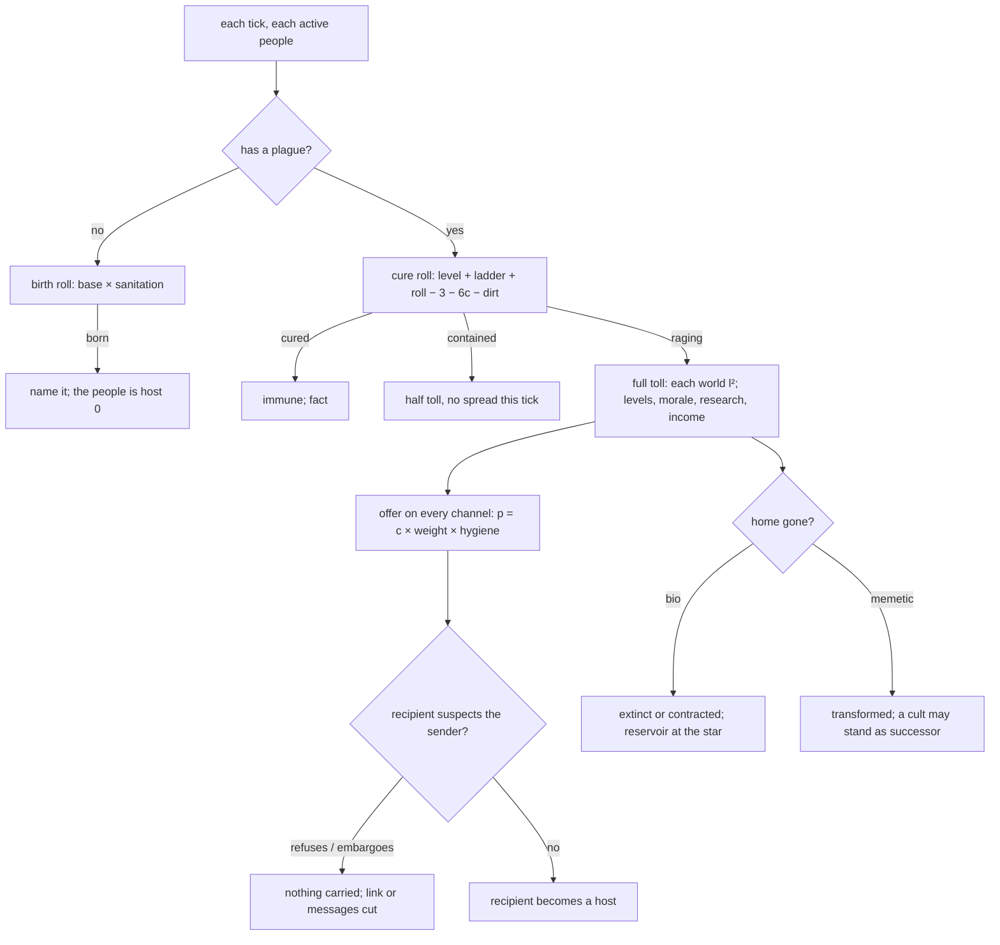

# Plagues: sickness as an actor

**Status:** Draft
**Last updated:** 2026-09-17

Assumes [one-tick](one-tick.md): every rate below is per thousand years, and "per tick" means a thousand-year tick, the same thing. Reads [resources-and-trade](resources-and-trade.md) (dormant nodes, trade links, dependence), [ships-and-garrisons](ships-and-garrisons.md) (a world under siege), [wisdom](wisdom.md) (messages need understanding) and [morality](morality.md) (bringing a plague as a crime). None is needed to argue this one; the sanitation modifiers that read dormant nodes and sieges need the first two to build.

## Problem

Plague today is a filter: a private roll every people makes now and then against its own Survival, passed seven times in ten, and a one-shot 30% chance at the opening of a trade that both partners sicken. It does not exist between rolls. Nothing is born, nothing moves, nothing has a name. On the reference batch at the thousand-year tick it fires a hundred to three hundred times a run, kills five to thirteen peoples outright, and its line is the most common sentence in the legends because it fires often and passes. Meanwhile the crowded early galaxy that the crowded-dawn work wants is thinned by the Weight of Ages, which is the wrong story: a hundred young peoples in a dense field should be thinned by what dense fields do, which is sickness moving along the roads.

The rework replaces the filter with a **plague**: an actor with a name, a kind, a contagion and a lethality, born somewhere for a reason, carried along the same trade, occupation and message graph the rest of the sim runs on, fought every tick by whoever has it, and remembered.

## Scope

**In:** the plague object and its two kinds, biological and memetic; birth, with sanitation and medicine deciding the rate; a **medicine ladder** and a **mind ladder** in the tree, seven new nodes from era 1 to era 4, ending in immunity; spread by channel, with the recipient of a message allowed to refuse it; the toll, paid in worlds; the cure contest each tick; immunity, carriers and reservoirs, including a memetic plague carried in testaments; suspicion, embargo and refusal; **engineered plagues** as weapons, six nodes in two ladders, delivered in goods or messages, with a breakout filter on every node and a leak while they are held; **parasite peoples as plagues** under the same rules, choosing when to try, and any plague that turns out to be conscious becoming one; what it writes and what the present shows; the plague filter, the infection filter and `Civ.Plagued` removed.

**Out:** ossification and the Weight of Ages, which are the next rework and get their own draft; a population number (the toll is paid in worlds and levels, as everything else is); mutation and strains (an open question below); a fleet that carries a plague to a world as a strike (an open question below).

## Design

### The object

A plague is `Plague{ID, Name, Kind, Born, Origin, FirstHost, Contagion, Lethality, Hosts, Toll, Extinct}`.

- **Kind** is biological or memetic. A biological plague lives in bodies and moves with goods and people. A memetic plague lives in minds and moves with messages.
- **Contagion** `c` and **lethality** `l` are each drawn uniformly in (0, 1] at birth, independently. Contagion is the chance a channel carries it and how hard it is to shake. Lethality is the damage and the panic once it is in. The two work against each other by construction: a plague that kills its hosts in three ticks has three ticks to cross a trade link, and a plague that kills nobody has the age.
- **Hosts** is who has it now, with when they caught it and from whom. **Toll** counts worlds lost and peoples ended.
- A plague with no host for a hundred thousand years is **extinct**, unless it has a reservoir (below).

Every plague has a **name**, drawn at birth by `names.Plague(kind)`. A biological plague is "the {adjective} {noun}" from a table of the Red, Grey, Weeping, Glass, Silent, Sweating, Hollow, Slow, Quick, Black, White, Wandering and Crystal, and the Fever, Rot, Blight, Wasting, Sleep, Cough, Bloom, Pox, Fade, Sweat and Ague. A memetic plague uses the same adjectives and the Song, Question, Doctrine, Laugh, Silence, Certainty, Word, Number, Joke, Prayer, Dream and Argument. One in three is named for its first host instead ("the Qaosh Sweat", "the Fever of Wolf 359"), which is what the neighbours call it, and is a slight the first host remembers.

### Birth

Each tick each active people may bear a new plague. The chance per thousand years is a **base** times a **sanitation factor**:

| | base per kyr | means |
|---|---|---|
| biological | 0.003 × (1 + worlds / 8) | once in three hundred thousand years for a cradle with nothing |
| memetic | 0.001 × (1 + worlds / 8), needs writing (era 1) | a quarter as often; an idea needs a medium |

The **sanitation factor** multiplies the base. Medicine divides it, dirt multiplies it:

| condition | biological | memetic |
|---|---|---|
| each working node of the medicine ladder (below): medicine, immunology, genetics, synthetic biology, designed immunity | ÷ 3 | — |
| sanitation working; closed ecologies working | ÷ 2 each | — |
| each working node of the mind ladder (below): doubt, censorship, memetics, cognitive immunity | — | ÷ 3 |
| the top of either ladder working: bodily sovereignty, sealed minds | none are born | none are born |
| a node of the ladder known but **dormant** this tick (resources: not paid) | no division; it counts as absent | same |
| a world under siege (ships: a campaign fleet in its sky) | × 2 per world, at most × 4 | × 2 |
| any use shed this tick (resources: fields, works or arms dormant) | × 2 | × 2 |
| a dark age within the last hundred thousand years | × 3 | × 3 |
| a world taken in the last ten thousand years, either side | × 2 | — |
| the Wars of Faith faced, ever | — | × 2 |
| a beacon heard, ever | — | × 2 |

So a cradle at era 0 bears a plague once in three hundred thousand years, a cradle under siege with its fields shed and a dark age behind it once in twenty-five thousand, an era-1 people with medicine and sanitation once in two million, an era-2 people with immunology and genetics once in fifteen million, and an era-3 people with the ladder paid once in seventy million, which is longer than the age. That is the shape asked for: most early peoples meet one; a people with modern medicine almost never breeds one at home, and can still catch one; a people at the top of the ladder is done with the kind.

### Medicine in the tree

The tree has medicine at era 1 and nothing that is plainly about sickness after it, and nothing at all about sick minds. Seven nodes go in, so that each era has an answer to each kind and the answer gets better, and so that not paying for one (resources) is felt at once. Levels are as the era's biology and society nodes give now (Sur or Soc 0.5), so the ladders are worth climbing for their own sake.

| key | name | domain, era | prerequisites | what it does |
|---|---|---|---|---|
| `sanitation` (new) | Sanitation | Biology 1 | medicine, industrial | ÷ 2 births; the word "unsanitary" made literal: sewers and clean water |
| `medicine` | Medicine | Biology 1 | scientific method | the ladder's first rung |
| `immunology` (new) | Immunology | Biology 2 | medicine, chemistry | vaccines and antibiotics; the rung that ends the early die-off |
| `genetics` | Genetics | Biology 2 | medicine, chemistry | a rung |
| `synthetic_biology` | Synthetic Biology | Biology 3 | genetics, closed ecologies | a rung, and the node a bred plague would sit on |
| `designed_immunity` (new) | Designed Immunity | Biology 3 | immunology, synthetic biology | an immune system that is written, not grown; a rung |
| `bodily_sovereignty` (new) | Bodily Sovereignty | Biology 4 | designed immunity, germline | nothing lives in them that they did not put there: no biological plague is born in or caught by them, as the Flesh gives now; Sur 1 |
| `doubt` | Doubt | Society 1 | philosophy, printing, organised religion | the mind ladder's first rung: a people that can ask whether a thing is true |
| `censorship` (new) | Censorship | Society 2 | mass politics, law | a rung, at a price: the people refuses messages from anyone it suspects at twice the chance, and its society research runs at 0.9 |
| `memetics` | Memetics | Society 3 | networks, neuroscience | a rung: ideas as things with a shape |
| `cognitive_immunity` (new) | Cognitive Immunity | Computation 3 | memetics, neuroscience | minds that feel an idea trying to get in; a rung, and the cure bonus counts double |
| `sealed_minds` (new) | Sealed Minds | Society 4 | cognitive immunity, deep governance | no memetic plague is born in or caught by them, as the Chorus gives now; no cult can form from them; Soc 1 |

A rung on a ladder does three things: divides the birth chance by three, divides the catching chance by one and a half, and adds a half to the cure roll. Sanitation and closed ecologies halve births only. The top of a ladder is immunity to the kind. A rung that is known but dormant this tick does none of it, which is what "not paying for medicine" means here. The kind nodes fit in: `maintenance` is a machine-born people's sanitation against nothing, since they bear no biological plague, and `host_craft` is a parasite's rung on both ladders, since a rider that cannot keep its hosts clean has none.

Filters steer research as they do now: a people with a biological plague raging has biology focus × 1.5, and one with a memetic plague raging has society × 1.5, so a sick people climbs the ladder it needs.

**Kinds and traits.** Machine-born bear and catch no biological plague and are twice as likely to bear and catch a memetic one: they copy exactly. A planetary mind is one body: catches at twice the chance and pays the toll at twice the lethality. A hive is one mind: memetic at twice, biological as standard. Nonconscious minds bear and catch no memetic plague. A people with directed evolution (the Flesh) has bodily sovereignty without the node; the Chorus has sealed minds without the node. Mind-riders are **carriers** of memetic plagues: they carry one without toll and pass it by infection. Flesh-riders are carriers of biological ones. Short-lived and nomadic peoples catch at one and a half times, as their trait tables say now.

### Spread

Each tick every host people `A` offers the plague to every people `B` it touches, on each **channel** it touches it by. The chance per channel per tick is

```
p = c × weight × hygiene(B)
```

where `hygiene(B)` is `÷ 1.5` per working rung of B's ladder (gentler than birth: medicine stops outbreaks at home better than it stops imports), and the kind and trait factors above apply. A contained host (below) offers nothing this tick. An immune people cannot catch it.

| channel | kind | weight |
|---|---|---|
| a trade link with goods moving this tick (resources: surplus sent either way) | bio | 1 |
| a trade link with nothing moving | bio | 0.3 |
| a world of A taken by B, or of B by A (occupation) | bio | 1, that tick, certain if `c > 0.5` |
| B settles a world within a hop of A's infected world | bio | 0.3 |
| a fleet of A rests, relieves or bases at a world of B, or of B at A's | bio | 0.5 |
| a meeting by ship (`meet`, `encounter` with a landing) | bio | 0.5 |
| a parasite's infection of a host | bio, memetic | 1 |
| any message from A delivered to B and **read**: news, intel, a pact, a call, a warning | memetic | 1 per message |
| signal contact with A this tick (`hear`) with nothing sent | memetic | 0.1 |
| a battle between fleets | either | none |

A ship battle carries nothing, as asked. A siege does not carry a biological plague by itself; taking the world does.

**Refusing.** Under the wisdom draft a message means nothing unless the sender is fathomed. Here a recipient that fathoms the sender may still **decline to read**. `B` **suspects** `A` when B holds a tale of a plague striking A that is not yet forgotten, or has intel on A from within ten thousand years that says sick, or trades with a people it knows to be sick that also trades with A. A suspicious B refuses a message with chance `fear + 0.5 × quarantine creed + 0.3 × cautious`, capped at 0.9, and it refuses **all** messages from a sender it suspects while it suspects them, so the cost is real: no news, no intel, no pacts, no calls. A refused message is dropped unread and carries nothing. For a biological plague the same suspicion drives an **embargo**: B stops goods on the link with the same chance, which under resources is a cut-off for whoever depended on it, with the fact and the blame that draft gives. "The Y close their ears to the X" and "The Y stop the trade with the X for fear of the Grey Rot, and the yards at H go dark for it" are the lines.

**Carriers and reservoirs.** A world that a biological plague empties keeps it: the trace left is "quarantined dead cities" and the star holds a **reservoir** that lasts `c × 2` million years. A people that settles or takes the star catches the plague with chance `c`. A memetic plague lives in words: the testaments on the walls of any remain left by a people that had it at the time carry it, and a people that reads those walls (the Find: a visit, a relic found, a colony placed) catches it with chance `c × 0.5`, at one step more worn, for ever. So both kinds outlive their hosts and both can be woken by the Find, and the dread rule (a remembered horror at a star keeps surveyors away) extends to a remembered plague.

**Immunity.** A people that is cured is immune to that plague for good. A branch, an uplift or a successor inherits the parent's immunities.

### The toll

While a people has a plague and has not contained it this tick, the plague acts on it:

| effect | biological | memetic |
|---|---|---|
| each held world, each tick | goes dark with chance `l²`: abandoned as quarantined dead cities; a reservoir | **goes over** with chance `l²`: lost as a world that believes; four times in ten it declares itself a new people carrying the idea (a cult, immune to it, a carrier), as schism's branch does |
| the home going dark | extinction, "sickened and died of the X", unless another world stands, in which case contraction to it as a remnant, as `contract` does | transformation, "listened to the X and were changed by it": the people is over; if a cult formed it is the successor |
| levels, in `recompute` | Survival −2l, Social −2l | Social −3l |
| morale, each tick | −l | −l |
| research | × (1 − l / 2), and biology focus × 1.5 | × (1 − l / 2), and society focus × 1.5 |
| income (resources) | organic matter × (1 − l) | energy × (1 − l / 2) for machine-born |
| the neighbours' appraisal | a target of opportunity, as `Plagued` is now | same |

At `l = 0.9` a world dies with chance 0.81 a tick: a people of four worlds is gone in three or four ticks unless it is cured, and it has had three or four ticks to give it to everyone it traded with. At `l = 0.05` a world dies once in four hundred ticks: the plague sits in the people for the age, a drag on its levels and its morale, and it offers itself to every partner every tick. At `l = 0.3` it is the ordinary catastrophe: a world in ten ticks, a dark age's worth of damage in a hundred thousand years.

### The cure

Each tick each host makes one **cure roll**: a contest of the plague's contagion against the people's fitness to fight it.

```
margin = level + ladder + roll − (3 + 6c) − dirt
```

`level` is Survival for a biological plague and Social for a memetic one; `ladder` is +0.5 per working rung of the relevant ladder, +1 for cognitive immunity (dormant gives nothing); `roll` is normal with spread 1.5, as every filter; `dirt` is +1 for a siege, +1 for a shed use, +1 for a recent dark age, the same conditions as birth. A people whose fathomed trade partner has been cured of the same plague gets +2 for a biological one (the cure travels with the goods) and nothing for a memetic one (nobody can be argued out of an idea by someone else's cure).

| margin | outcome |
|---|---|
| ≥ 0 | **cured**: immune; "The X are rid of the Grey Rot" |
| −2 to 0 | **contained** this tick: the toll is halved, the plague is offered on no channel, the doors are closed |
| < −2 | **raging**: the full toll, every channel |

A people contained for twenty ticks in a row takes the **quarantine creed** as a scar, which is what the scar always meant. The creed stays what it is: +0.2 hate, and now +0.5 to refusing and embargoing. There is no scar for merely having been sick; the tale is the scar.

The contest is set so that a cradle with Survival 3 and nothing else against a `c = 0.5` plague (difficulty 6) is cured one tick in forty and contained one in four, and an era-3 people with the ladder paid (Survival 6, +2.5) is cured nineteen ticks in twenty. Against `c = 0.9` (difficulty 8.4) the cradle is cured almost never and contained one tick in eighty, and the era-3 people is cured one tick in two. For anyone below the ladder the very contagious plagues are the ones that stay; for anyone on it a plague is a bad millennium.



### Engineered plagues

A people that knows the craft may **make** a plague instead of waiting for one. An engineered plague is the same object with two differences: its contagion and lethality are **chosen** within the band its maker's node allows, and its maker is **immune** to it, since a thing designed has a designed cure, except at the crudest level, where the maker has the plague and not the cure.

Six nodes, three per kind, each a rung above the last in the band it opens:

| key | name | domain, era | prerequisites | band | notes |
|---|---|---|---|---|---|
| `plague_craft` (new) | Plague-craft | Biology 2 | immunology, mechanised war | c, l ≤ 0.5 | crude: the maker is **not** immune; it spreads to anyone |
| `tailored_plague` (new) | Tailored Plagues | Biology 3 | plague-craft, synthetic biology | c, l ≤ 0.8 | tailored: only the target and its kin (branches, uplifts, the same made species) can catch it; the maker is immune |
| `black_biology` (new) | Black Biology | Biology 4 | tailored plagues, designed immunity | any | as tailored, and the plague may be made conscious on purpose (below) |
| `agitation` (new) | Agitation | Society 2 | mass politics, censorship | c, l ≤ 0.5 | crude: the maker is not immune; the idea spreads to anyone who reads |
| `memetic_weapons` (new) | Memetic Weapons | Society 3 | agitation, memetics | c, l ≤ 0.8 | tailored to the target's kind of mind; the maker is immune |
| `basilisk` (new) | the Basilisk | Computation 4 | memetic weapons, cognitive immunity | any | an idea that ends whoever holds it; machine-born may take this ladder and no other |

**Making.** A people with the node and a reason picks a target and a shape. The reason is the council's: at war, a grudge above the war bar, a xenophobe's difference, or a conqueror's appraisal that the worlds are worth more than the war. The shape follows the aim: a people that wants the worlds picks high contagion and low lethality (a drag that softens a rival for the taking); one that wants the rival gone picks the top of the band in lethality; a xenophobe always the top. Making costs a use in the resources sense (a programme with upkeep, era-priced, under arms), and takes a tick.

**Delivery.** Two roads, as asked. A biological plague is **sneaked into goods**: it needs a trade link with the target on which goods move this tick, and it rides the link as a channel of weight 1 with the maker not counted as a host. A memetic plague is **sneaked into a message**: it needs a message the target will read, so the target must fathom the sender and not be refusing it, and it rides that message. Either way the attempt is one roll at `p = c × hygiene(target)`.

- **It takes.** The target is a host, and it **always learns** it was a weapon and whose: `FPoisoned` (Crime 4; Subject the maker, Object the target), a war cause above every bar, the monster reckoning, allies called, the maker's pacts broken by the betrayal rule. The victims name the plague for its maker ("the Qaosh Gift"), which is the name the galaxy uses.
- **It fails.** The target **detects** the attempt with chance `0.2 × rungs on the relevant ladder`, capped at 0.9, +0.3 for censorship on a memetic attempt. Detected is the same fact and the same consequences, with "tried to" in the line; the target refuses that sender's goods or messages from then on. Undetected is nothing, and the maker may try again next tick.

A crude plague, once loose, goes wherever a plague goes: to the target's partners, the maker's partners, and, since the maker is not immune at that level, home. A tailored one stays with the target's kin, so it can be used on a neighbour one trades with and still keep the rest of one's trade. That is the whole reason to climb.

**The breakout filter.** Every weapon node is a filter on discovery, `containment`, on Survival for the biological nodes and Social for the memetic ones, at difficulty 4 plus one per rung, biology or society as the domain. Overcome: "The X keep it in the vial." Scarred: **a horror of the vial**, a scar that locks the ladder above and means the people never uses what it has. Declined: the thing gets out. The people bears the plague it was making, with its chosen shape, as host 0, and is immune only if the node grants immunity; at the crude level that is the classic story. After discovery, a held weapon **leaks**: while a people holds one it has not used, each tick a chance `0.0005 × dirt` that it gets out the same way, where dirt is the birth table's multipliers, and the weapon's programme being shed (resources: unpaid) counts ten times, since an unmaintained lab is the dirtiest place in the galaxy.

### Parasites

A parasite people **is** a plague, and obeys every rule above. A rider of the flesh is a biological one and a rider of the mind a memetic one; each parasite people carries one `Plague` of its own, with contagion and lethality rolled at its birth like any other. What differs is what lethality means: a parasite does not empty a world, it **takes** it. A world that fails the toll roll is not lost dark; it goes over to the parasite as a host world, as a converted front world does now, and the home going over is the people **ridden**: enslaved to the parasite with half its tree, as `ride` does now. Lethality is how fast a people is subdued; contagion is how hard it is to shake.

**Choosing.** A parasite's plague does not spread on its own. On every channel event where it could carry (a trade with goods, a landing, a taken world, a message read, a signal for a rider of the mind), the parasite's council **decides** whether to try, and the attempt is an engineered-plague attempt in every respect: the same roll, the same detection, the same `FPoisoned` if it takes or is caught, the same betrayal and the same reckoning. A parasite that tries everyone it meets is a monster to everyone it meets and never trades or swears again; one that does not try can trade, swear and be relieved like any people, and rides only what it goes to war for. The choice is the council's: conquerors and opportunists try where the appraisal likes the odds; the rest try at war and where the target is prey (raging with another plague, a recent dark age); xenophobes try the different; a pact partner is never tried unless the betrayal rule already fires. The ridden do not spread the parasite on their own account: the parasite is the mind.

**Fighting it.** The host's response is the cure contest, on the host's ladder against the parasite's contagion, in place of the Infection filter. A raging host loses worlds to the toll and its front to the parasite's strikes, which are attempts at weight 1 on the front worlds. A contained host holds and **burns**: each tick it may burn one of its own ridden worlds, which stays a peace earned rather than rolled, as now. A cured host is free and immune to that parasite for good, and a ridden people that wins the contest is risen: the revolt against a parasite master is this contest at +4, the four levels the design gives it now, and the science that wins it is the ladder. A ridden people's rungs stay its own, so a parasite that rides an era-3 people rides a host that is always about to be free.

**Reservoirs and walls** apply: a rider of the flesh waits in the dead cities of a world it emptied and a rider of the mind is written on the walls of what it rode, and either can be woken by the Find, which is how an old parasite comes back after its hosts are gone.

**Conscious plagues.** Any plague, born or made, has at birth a small chance, one in twenty, of being **conscious**: it is a parasite people waiting to happen. It runs as a plague until the first host's home goes over; at that moment a people of parasite kind is spawned on that world, riding the host, named by `names.Civ`, its origin recorded ("something that woke in the Grey Rot"), with the plague as its own and the host's tree at half, as `ride` gives. If the first host is cured before that, it never wakes ("The X are rid of the Grey Rot, and never know it had begun to think"). Black Biology may make one on purpose, which is a made people under the breeding rules, with the maker as its master, if it holds, and its first host if it does not. An engineered plague that wakes on its maker by breakout is the old story, told once per galaxy at most, and a `FHorrorMade` for the maker.

**Born parasites.** A parasite is no longer drawn as a kind at four in a hundred. Instead, when a cradle-born people is generated, one in a hundred is **infected from the start**: a conscious parasite rides it on its native world, and the sim spawns two peoples, the host and the rider, with the host already ridden and the rider's plague already in it. That is the rare road; conscious plagues are the common one, and every parasite in the galaxy has a first host it can name.

**Nothing without hosts.** A parasite exists only in what it rides. Its **capacity** (resources) is the sum of its hosts' capacities: it has no fields, works or crews of its own, and what its hosts can feed, staff and build is what it can. It reserves from them before they do, which is what being ridden costs. When its last host is dead or cured, the parasite is **dead**, that tick, "with nothing left to wear"; a parasite whose hosts are dwindling is a people in a hurry, which the council reads as prey elsewhere and reason to try. A parasite holds no world of its own; a "host world" is a world of a ridden people, and a parasite with no ridden people and no infected one has nowhere to be.

**Parasites and other plagues.** A parasite bears and catches no plague of either kind: there is nothing in it for a plague to be in. But its hosts can, and a plague that rips through a parasite's hosts takes the parasite's ground from under it. Each host fights that plague on its own ladder with its own cure roll; the parasite can do nothing for it but lend rungs it knows (a ridden host has the parasite's ladder as well as its own, since the rider wants the body kept), and it watches the toll take its worlds. A wildfire in a parasite's hosts is the natural end of a parasite, and a rival's tailored plague aimed at the hosts is the natural weapon against one.

### What it writes

Facts, in the tellings' terms. `FPlague` (Woe 4; What: the name) when a people catches one; `FPlagueGiven` (Crime 2; Subject the source, Object the victim) when it came by trade, occupation or a fleet, which is the blamed woe's natural cause and what the scapegoat sweep will hang on a neighbour; `FPlagueWorld` (Woe 3) for a world lost; `FCured` (Deed 2); `FRefused` (Crime 1; Subject the refuser) for a closed ear or an embargo, which the refused remember; `FBelieved` (Woe 3 for the loser, Deed 3 for the cult) for a world gone over; `FPoisoned` (Crime 4; Subject the maker or the parasite, Object the target) for an engineered or chosen attempt that took or was caught; `FWoke` (Deed 3 for the new people, Woe 3 for the host) for a plague that thinks; the breakout is `FHorrorMade` with the plague's name. A people's own `FPlagueGiven` is a crime it excuses ("we did not know we carried it"); the morality draft decides which tables count it at all.

Lines: a birth ("Something moves through the worlds of the X. They call it the Grey Rot."); a catch, naming the road ("The Grey Rot comes to the Y with the Qaosh traders"); a world lost; a cure; a containment once per stretch ("The Y seal every door against the Grey Rot"); a refusal; a cult ("At H the believers in the Silent Question declare themselves a people"); a reservoir woken ("The Z settle Wolf 359 and wake the Grey Rot in its dead cities"); a wall read ("On the walls of the Y the Silent Question is written, and the Z read it"); a death. A plague with more than ten hosts at once is a **wildfire** and gets one galactic line and a `FCosmic`-weight fact for everyone in signal range: "The Grey Rot is everywhere now."

The present gains a **Plagues** section in the aftermath: every plague alive, endemic ("the Grey Wasting has been in the X for four million years and they no longer notice it") or raging, with its kind, its road so far and its toll, and every dead one that took more than three peoples. The gazetteer marks reservoirs and infected walls. A portrait line: "sick with the Grey Rot these three hundred thousand years, contained". `techstats` gains **Sickness**: plagues born by kind, by cause (dirt, siege, dark age, clean), hosts per plague, the contagion and lethality of the ones that spread past three hosts, wildfires, deaths by plague against deaths by everything else, ticks contained, cures, refusals and embargoes, cults made, reservoirs and walls woken.

### What goes

The `plague` filter, its three outcomes and the 30% trade contagion. `Civ.Plagued` becomes `Civ.Infections`; `appraise` reads "any raging infection with `l ≥ 0.2`" where it read `Plagued`. The quarantine creed stays as the scar for long containment and as a choice at contact (`contact.go:413` stays). The Weight of Ages and ossification are untouched here and are the next rework.

## Implementation notes

- `Plague` in `types.go`, `w.Plagues []*Plague`, `Civ.Infections map[int]*Infection{Since Year, From int, Contained bool}`, `Civ.Immune map[int]bool`, `Star reservoirs` as `w.Reservoir map[int]struct{Plague int; Until Year}`, a `Plague int` on `Legacy` for infected walls.
- `plague.go`: `tickPlagues` runs after `tickMessages` and before `tickCivs`: births, cure rolls, tolls, then spread. `names.Plague(r, kind)` in `names`.
- Channels hook where the contact already happens: trade links in the resources pass (goods moving or not), `takeWorld`, `settle`, `rest`, `arrive` for Relief and Roam at another's world, `meet` and `encounter`, `infection` for parasites. Memetic: `tickMessages` marries each delivered message to the sender's memetic infections and runs the recipient's refusal before the switch; `hear` adds the 0.1 channel per tick in `contacts`.
- `tech.go`: the seven ladder nodes and six weapon nodes above with their `Desc` lines in `desc.go`; the weapon nodes carry `Filter: "containment"`; `bodily_sovereignty` and `sealed_minds` are milestones. The ladders are two lists in `plague.go`, `bioLadder` and `mindLadder`, read against the working set.
- `recompute` reads `Infections` for the level penalties; `research` for the slowdown and focus; resources' `direct` for the income cut; ships' siege flag and resources' dormant set feed `sanitation(c)` and `dirt(c)`.
- Reservoirs: `settle` and `takeWorld` check `w.Reservoir[star]`; the Find's reading of testaments checks `Legacy.Plague`; dread extends to both.
- Weapons: `Civ.Weapons map[string]*Plague` for what is made and held; `makePlague(c, target, aim)` from the council's war and grudge pass; `attempt(c, e, plague, channel)` shared by weapons and parasites, writing `FPoisoned` and calling `betray`; the leak in `tickPlagues`; the `containment` filter in `filters.go` with the vial scar.
- Parasites: the kind weight goes to zero in `kindWeights`; `spawnCiv` rolls the one-in-a-hundred and spawns the rider by `wake` on the new host; `Civ.Own *Plague`; capacity in resources' `direct` reads the hosts' sums for a parasite and reserves the rider's uses first; `tickPlagues` ends a parasite with no host; `bearPlague` and the catching roll skip parasite kind; `infection` and the `infection` filter go; `takeWorld`'s parasite case becomes the toll's world-over; `ride` stays; the revolt filter for a ridden people becomes the cure contest at +4; the council's `tryRide(c, e, channel)` decision under the postures above. Conscious birth in `bearPlague` and `makePlague` at 0.05; `wake(plague, host)` spawns the people.
- The suspicion test reads the telling (`tales of FPlague about A`), `Intel`, and the trade graph; the refusal and embargo write `FRefused` and, under resources, the cut-off.
- Legends: the aftermath section, the portrait line, the wildfire line; `techstats` Sickness.
- Stages. (1) The object, births, cure, toll, names, facts, lines, no spread yet; the filter removed. Calibrate births and lethality here: in a 400-star run at 1× fertility a third to a half of cradles should meet a plague in their first half million years, plague should be the second early killer after Overshoot, and an era-3 people should bear one once in twenty million years. (2) Spread by channel, suspicion, refusal, embargo, immunity by trade. Calibrate contagion here: one or two wildfires per age at 400 stars, several at 800. (3) Memetic plagues, machines, cults, walls. (4) Reservoirs, the Find, the present's section, `techstats`. (5) Parasites onto the plague rules, the Infection filter removed, conscious plagues. (6) Engineered plagues: the nodes, the council's making and attempts, detection, the containment filter and the leak.
- Tests: a `l = 0.9` plague ends a four-world people within five ticks uncured; a `l = 0.05` one lasts fifty ticks with no world lost at the median; a cradle's birth rate against an era-3 people's with the ladder paid is about two hundred and fifty to one, and a people with bodily sovereignty bears none; a contained host offers nothing; a refused message carries nothing; a reservoir infects a settler at `c`; a machine-born people never catches a biological plague and catches a memetic one at twice the rate; a crude weapon's breakout leaves its maker a host, a tailored one's does not; a tailored plague never spreads past the target's kin; a parasite that never tries writes no `FPoisoned`; a conscious plague cured before the home goes over spawns nothing; a parasite whose last host dies dies the same tick; a parasite never bears or catches a plague; a plague that empties a parasite's only host ends the parasite.

## Open questions

- **The beacon.** A memetic beacon is a fixed transmitter of one very contagious idea. It could become a memetic plague with `c = 1` and a chosen `l`, broadcast from a star to whoever listens, and the Signal filter would go. That is a clean merge and it removes a horror kind; it also changes the beacon's texture (a beacon then spreads people to people, which it does not now). Proposed for the ossification draft or a later one, not here.
- **Strains.** A plague in a people for a long time could throw a strain: a new name, the old immunities void, contagion and lethality redrawn near the parent's. Once per host per million years times `c` would do it. Left out to keep the first build small.
- **A fleet as the third road.** Goods and messages are the two roads asked for. A campaign fleet that reaches a world could release a plague there instead of fighting, a strike by seeding. It fits the channel table (a landing is contact) and it gives a war use to the tailored plagues. Left out until the ships draft settles what a fleet at a world can do.
- **The born rider's start.** One in a hundred cradles infected from the first tick is the number asked for. Whether the host starts ridden (home already over) or merely infected and fighting is open; ridden is proposed, since a people that grew up with its rider never knew a time before it.
- **One in twenty.** The conscious chance is a guess. It should make a parasite or two per age at 400 stars from the plagues that get past three hosts, and not turn every wildfire into a people.
- **Censorship's price.** A rung that makes a people deafer is the one node in the tree with a cost built in. It could instead be a scar-like choice (the quarantine creed for minds) rather than a node. Kept as a node so that it can be dormant, and so that an era-2 people has a memetic answer at all.
- **Ladder strength.** ÷ 3 per rung on birth and +0.5 on the cure make an era-3 people nearly done with biological plague. If the settled galaxy should still have its pandemics, soften the rungs to ÷ 2 and let the top nodes carry the immunity.
- **How lethal is lethal.** `l²` per world per tick makes the median plague (`l = 0.5`) take a world in four ticks. If that thins the crowded dawn too hard, `l³` is the next stop.
- **Hygiene for catching.** `÷ 2` per node is chosen so an era-3 people still catches an `c = 0.8` plague from a long-sick partner within twenty ticks or so. If late-age wildfires never happen, drop it to `÷ 1.5`.
