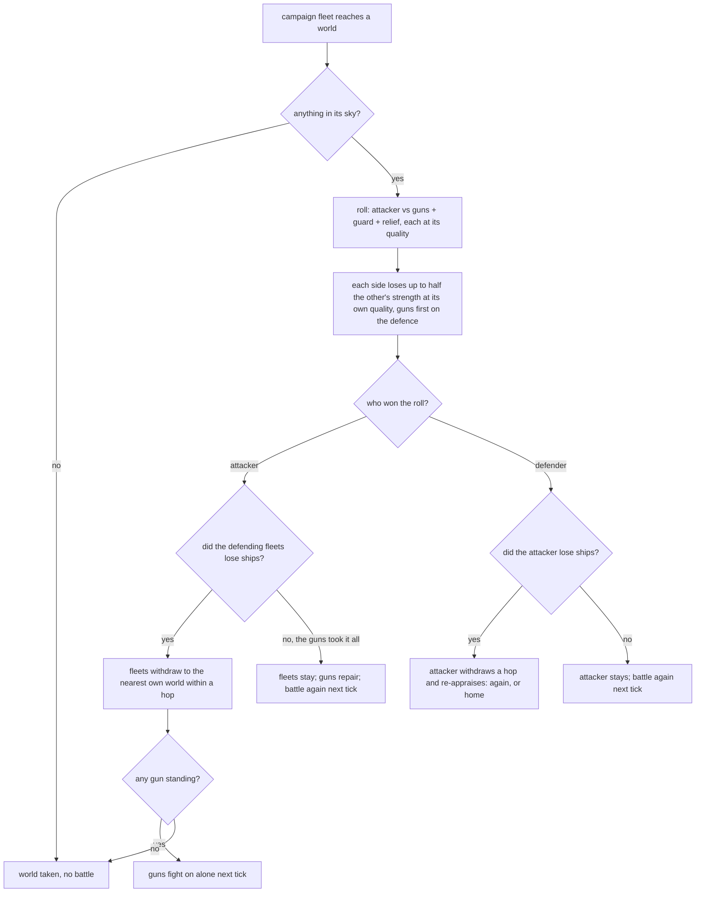

# Ships and garrisons

**Status:** Implemented (plan steps 8 and 9, 2026-09-18: levels and ships, docks and building, the keep and laying up, one fleet object with guards; guns and silos, the battle at a world, withdrawal, garrisons and the muster, hordes on the shared rule; see "Ships and docks" and "Battles, guns and garrisons" in `DESIGN_NOTES.md`). Superseded by the canonical spec where they differ.
**Last updated:** 2026-09-17

Assumes [one-tick](one-tick.md) (a tick is a thousand years for the whole age, and a battle is one per tick). Reads [fleet-interception](fleet-interception.md) (the losses rule, wrecks and interception all assume the fleet is the unit of war; this makes it the only one) and [resources-and-trade](resources-and-trade.md) (ships, docks and guns as reservations of flow; the count of ships is bounded by nothing else). It changes both where noted. It stands on its own to argue.

## Problem

Military is two things at once. It is a level, derived from the tree each tick, that filters test and the Find rolls against; and it is the force that fights. A strike across the front rolls the whole home `Mil` as the attack and the whole home `Mil` as the defence of every world at once; nothing crosses, nothing is spent, and the war is decided by will. Fleets are a second rule: a share leaves home, crosses at ship speed, fights from a base, bleeds, goes native or comes home. The two coexist by the overlap: worlds within reach are fought over by levels, worlds beyond it by fleets, and a people inside another's reach never sees the enemy's ships. Nomads are a third rule: their fleets are their Military, grow at their bases, split and merge, and are broken fleet by fleet. The sightings proposal had to add a fourth thing that reads as ships, `Civ.Losses`, because the home's force had to bleed and heal and there was no fleet to hold it.

Nothing about the front is wrong as a picture of what is in reach. What is wrong is that reach makes ships unnecessary, and that the level is asked to be a count. An earlier draft of this proposal kept the level as a cap on the count; that tied hulls to knowledge, needed a second number for hordes, and made a rich people and a poor one at the same level the same size. The count should come from the economy and the level from the tree, and they should meet only in battle.

## Scope

**In.**
- Military as quality: a multiplier on every ship and gun a people fights with. The count of ships is a count, bounded by what a people can build, feed and crew and by nothing else.
- Docks: ships are built at docks over time, and a ship costs four thousand years of its own keep to build.
- The keep: a ship whose keep is paid is safe, repaired and refitted to its people's level; a ship whose keep is not paid is laid up, fights nothing, and rots.
- Living ships: grown, not built, and kept on organic matter alone.
- One fleet object for everybody: guards, campaigns, relief, scouts, surveyors, pickets, interceptors and hordes are fleets that merge and split.
- The defence of a world is what is in its sky: a garrison, relief, and planetary guns.
- Guns as structures that fight as an immobile fleet, cheaper to keep than ships, broken before any fleet and never withdrawing: silos, cheap and early, that anyone with the atom and the rocket can dig; and the defence grid, the real thing.
- The battle at a world: the roll, losses by the sightings rule scaled by quality, guns absorbing first, withdrawal, and the taking of a world with nothing left above it.
- The front reduced to reach: every strike is a fleet sent from a holding.
- Nomads under the same rule, with no capacity of their own: a horde is as large as the stars it grazes can feed and crew.
- What still reads the level, and what reads ships.

**Out.**
- Ship classes and sizes: a ship is a ship, and the level is its only quality.
- Ground forces, occupation, revolt at a taken world: a taken world is taken, as now.
- Blockades, raids that do not try to take a world, escorts: sightings has them out too.
- Population as a number: resources leaves it out and says spare organic matter is it; here a ship's crew is a reservation of organic matter, and that is all the staffing there is.
- Hiring a garrison: contracts-and-mercenaries' relief term is a stationed fleet already.

## Design

### Levels and ships

One sentence: **a level is how good a people's arms are; ships are how many it has.** `Mil` stays the derived level, clamped 0–10, from species, tree, miracles, dominion, scars, boons and morale, and stops being a count of anything: it is no longer reduced by `Away`, no longer replaced by a horde's fleets, and the two structures that fed it stop (a yard makes ships, a grid is guns). It is the **quality** of everything the people fights with:

    q = 1.25 ^ Mil

A fleet's **strength** is its ships times its owner's `q`; a gun's is `q` too. Every level is a generation of ships, weapons and doctrine, and each generation beats the last: a fleet three levels better is worth twice its ships, a fleet ten levels better nine times. The miracles that fight stop being a flat bonus to the roll and become levels added before `q`: the Unmaking three, foresight two, the ansible one and a half, FTL one, as `warBonus` has them now. So a people with the Unmaking fights as three levels better than its tree says, which reads as it should.

What a gap means, four ships a side, one battle:

| Attacker better by | 0 | 1 | 2 | 3 | 5 |
|---|---|---|---|---|---|
| attacker wins the roll | 49% | 68% | 86% | 96% | 100% |

Losses go the same way: the sightings rule's `U(0, 0.5 × the other's strength)` is in strength, and a side pays it in ships **divided by its own `q`**, so better ships die less as well as win more. A people that is outnumbered three to one at equal arts loses; at three levels better it is even.

Everything that tests Military as an art keeps reading `Mil`: filters (an incursion tests the art of war, not the count of hulls), the Find's Wield roll, the leap and focus rules, the dominion arithmetic, and contact's first sizing of one another. Everything that fights reads ships and `q`: appraisal, strength, defence, the battle, the relief decision, the scout and survey policies' "a level must stay home", which becomes a ship.

A fleet fights at its owner's level **today**, not at the level of the year its hulls were laid down: the keep, below, is the refit as much as the crew, and a kept ship is always the latest the people knows how to make. That cuts both ways. A people that learns a weapons node has every kept ship fight a level better the same tick, with no line spent and nothing built; a people in a dark age has its `q` fall and the same ships fight worse, since the crews forget and the refit stops. Nothing scraps a hull for a lower level, and a kept ship is never lost to anything but battle. This is the quantity the sightings proposal wanted to heal and had nowhere to put: `Civ.Losses` goes, and the healing is the docks, and the damage that is not a loss is nothing at all, because the keep repairs it.

### Docks and building

A **dock** is where ships are made. Every starfaring people has one at its home (a people that reached the stars built at least one ship); each `shipyard` structure is one more, at its star; a horde's fleet at a base is a dock at a quarter of the rate, below. A dock at full work makes **one ship per thousand years**, one a tick, rounded stochastically as every rate is. The new ship joins the guard at the dock's star. A vassal's docks work at half rate; a slave's not at all. The shipyard's `Mil +0.5` goes: a yard's worth is building, not a level.

Building is the expensive part, and the resources proposal saves nothing between ticks, so the cost is a flow while the work goes on: **a dock at work draws four times the keep of a ship**, `4 M 4 E` at full rate, and a dock working at a fraction of the rate draws that fraction. A ship therefore costs four thousand years of its own metal and energy keep to build, whatever the tick and however many docks share the work; ten ships lost in a war are forty thousand ship-years of flow to replace, and a people that can spare four of each runs one dock flat out and keeps nothing while it does. That is the intent: replacing ships is not free, and a people that bleeds every war is a people that is always building and never has a fleet. A dock works at whatever rate the spare income affords, up to the full one, and the choice to work at all is the council's, below.

A ship in being reserves its **keep**: `1 O 1 M 1 E`. The organic matter is the crew, and it is the staffing limit the resources proposal defers to a later proposal: spare organic matter is population, and a ship takes a shipload of it. The metal and the energy are the repair and the refit: a kept ship is whole, and it is at its people's level. A machine-born people's ships reserve `1 M 2 E` and no crew. **Living ships** (an evolver with the node) are grown, not built: crew, hull and drive are all one flesh, and the keep is `3 O` and nothing else; their dock draws `12 O` and is a breeding ground rather than a yard. Military matters to them exactly as to everyone: a level is how far the whales have been bred, and the keep is the breeding, so a kept living ship is the latest strain as a kept hull is the latest refit. In `direct`, ships in being are arms, as resources has them; docks at work are the works in peace and arms at war. Energy that keeps ships is energy that does not run the mind: resources gives research a bonus from spare energy, and a fleet eats it; a living-ship people pays the same price in the fields instead.

**Laying up.** A fleet that `direct` cannot feed is **laid up** at its star: inoperable, it neither fights nor moves nor counts in `defence` until the flow comes back, and it is not refitted while it waits. A fleet in flight is never laid up for anything but the fields, as resources has it. A laid-up fleet **rots**: it loses a tenth of its ships per thousand years, stochastically rounded, so a fleet of ten is gone in a long dark age and a fleet of two lasts a while by luck. What is manned again is manned at the people's level today, since the keep is the refit. A laid-up fleet in the sky of a world that is taken is lost with it, as a field. "The X lay up six ships at H" is the decline's own line, and a home with a rusting fleet and a working grid is a common late sight; "the X man the ships at H again" is the rarer one.

**Want.** How many ships a people builds is not a limit but a choice, and the council makes it as it makes everything, by a number: the **want** is the sum of the garrison wants below, the need of the campaign the council is sizing, one ship per exploring policy that wants one (scout, survey, picket), and a floor of one plus `Fear` rounded. Docks work while the ships in being and on the slips are under the want and the spare covers the work; a people whose want is met builds nothing and its spare goes to the mind and the road. So a people with nobody in reach keeps a ship or two, a people with a hostile neighbour keeps what that neighbour is believed to have, and a conqueror builds to the campaign.

### Fleets

Every ship is in a **fleet**: an `Expedition`, one object for all of them, with `Ships int` in place of `Mil float64`, a base or a line in flight, an owner and a kind. The kinds are what a fleet is for, and a fleet changes kind by order rather than being a different thing:

| Kind | What it is | Moves |
|---|---|---|
| Guard | the ships at one of the people's stars: its garrison and its reserve | between own holdings by order |
| Campaign | ships sent against an enemy | as now |
| Relief | ships sent to stand with a host | as now |
| Scout, Survey, Picket, Intercept | one ship, or a few, on the exploring and sightings rules | as now |
| Roam | a horde's fleet: guard and campaign in one, with a base that feeds it | as nomads do |

Fleets of one owner at one base **merge** when they are of the same kind, so a relief that arrives at a garrisoned world stands beside the guard and does not become it. A fleet **splits** by order: a campaign is ships taken out of a guard, a scout is one ship taken out of a guard, a garrison is ships sent from one guard to another. There is no `Away`; the count of ships is the sum of the fleets, and `launch(c, kind, target, star, n)` takes `n` ships from the guard at `from`.

**Muster.** A campaign is drawn from the guard at the holding nearest the target if it has the ships, else the council orders ships from other guards to that holding and the campaign launches when they have arrived, at ship speed. This is the muster the sightings proposal set at a flat fifty years: real now, and usually longer. A people with the ansible musters at once only in that the order arrives at once; the ships still cross. A muster that no longer meets `need` when complete stands down into the guard.

### Garrisons

The council places ships as it places everything, by a score. Each holding has a **want** in ships: the home wants the strongest fleet a hostile or unknown neighbour in reach is believed to have, counted in the home's own ships (their ships times their `q` over ours), times `0.5 + Fear`, and at least one; a world within an enemy's reach wants a share by the enemy's believed ships and the appraisal's odds; a world a sighting says a fleet is bound for wants what the sighting says the fleet has, in the same terms; a world with guns wants less by the guns' strength; everything else wants none. Ships move from where they exceed want to where they fall short, at ship speed, one order per council. So a people with ten worlds and six ships keeps most at home and a couple at the frontier, and the rest of its worlds have empty skies. That is a decline: worlds held by nobody's guns, taken by whoever comes. The greedy strip the home for the campaign, as the sizing's cap lets them now.

A guard moving between holdings is a fleet in flight, seen and met on the sightings rules. Nothing here is hidden.

### Guns

The `defences` structure stops giving a level and becomes **guns**: an immobile fleet at its star of `Guns` count, three at the defence grid node and one more per weapons era the builder knows beyond it, each of the builder's `q`, reserving less flow than the ships it stands for (resources: its flat upkeep against the per-ship keep; the ratio is theirs to set, the intent is about a third per gun and no crew). Guns are **repaired** in place at one per thousand years with no dock and no build cost, so a grid that lost two of three is whole in two thousand years unless the world falls first. A people can raise one per world (`build` caps `defences` per star, not per people).

**Silos** are the guns before there are ships: a new structure, `silos`, on `orbital_weapons` (era 2, whose prerequisites are rocketry and the atom, and which has no structure now), two guns at any world of a people that knows it, nukes on rockets aimed at the sky. They are the cheapest thing a people builds (resources: the smallest upkeep in the table, the intent is a fraction of a ship's), and they are not raised by the random pick: a people that has the nodes digs silos at its home within a millennium and at every colony within a few thousand years of settling it, so nearly every world in the galaxy has two. A silo fired is a silo spent: silos are not repaired during a siege, and are re-dug afterwards at one per thousand years if the world is still held. A grid at a world stands on top of its silos, five guns and more. Under the battle rule, at equal arts, two silos hold a world against one ship nine times in ten, against two nearly one in two, against three about one in eight, and against four almost never; a raider two levels better takes the world from a single ship one time in three, and four levels better two times in three:

| Attacking ships | 1 | 2 | 3 | 4 | 6 |
|---|---|---|---|---|---|
| two silos hold, no repair, equal arts | 88% | 48% | 13% | 2% | 0% |
| two silos hold, attacker 2 levels better | 64% | 13% | 1% | 0% | 0% |
| two silos hold, attacker 4 levels better | 35% | 2% | 0% | 0% | 0% |
| a grid of three holds, repaired one a kyr, equal arts | 100% | 100% | 100% | 93% | 43% |
| a grid of three holds, attacker 2 levels better | 100% | 98% | 76% | 35% | 3% |
| a grid of three holds, attacker 4 levels better | 100% | 65% | 17% | 3% | 0% |

(Ten thousand runs of the rule at one battle per thousand-year tick, the attacker fighting to the end; the grid rows are the grid alone, without its silos.) So a single ship cannot roll up an empire's colonies unless it is a generation ahead, a raid at equal arts needs three, and a grid is what makes a world cost a fleet, and a better fleet. Every ship lost to silos is a wreck in that world's sky on the sightings rule, which is where a young people's first finds come from.

Guns never withdraw, and they are broken before any fleet: the defender's losses fall on the guns first, then on the fleets at the world in proportion to their size. A world with a gun standing cannot be taken. A world with no guns and no fleet is taken by any campaign fleet that reaches it, without a battle: "The X take S. There was nothing in its sky." No wrecks, since nothing fought. Scouts, surveyors and pickets only look and never take.

The home's flat +2.5 and the grid's +0.5 go with the rest of the level bonuses in `defence()`. The home is defended by what is stationed there, which is where the garrison rule keeps the largest share, and by its dock, which builds through a siege while the flow lasts.

### The battle at a world

There is **one battle per tick** at a world: the campaign loop's up to three goes, so a siege is several ticks and a withdrawal, a re-appraisal and a relief on its way all have somewhere to happen. A battle is a campaign fleet at a world against what is in the world's sky, `guns + guard + relief`, each side's strength being ships and guns times its `q`, with the noise. The noise is a multiplier on the strength, not a flat term, so that the dice are as wide as the fleet: a roll is strength times `exp(N(0, 0.35))`. The roll decides who won the day; the losses rule decides what each paid, `U(0, 0.5 × the other's strength)` in strength, paid in ships at the payer's `q`, rounded stochastically to whole ships. Then:

**Withdrawal.** The loser of the roll withdraws if it lost ships in that battle. A fleet that lost the roll and nothing else holds its ground: the guns took the blow. A fleet that withdraws leaves the world to its guns, and if no gun stands the world is taken as the fleet leaves, on `takeWorld`'s rules by the taker's nature. Withdrawal is to the nearest own holding within a hop, else the nearest empty star within a hop, else home; a guard that withdrew wants to come back, and the garrison score sends it once the enemy is gone. An attacker that withdraws re-appraises from where it stands against what it now believes is at the world, and returns if the odds hold, which is a siege, or goes home, which is the campaign lost. A fleet with fewer ships than the appraisal needs goes home at once. A fleet met in the dark follows the sightings rule instead: the loser is turned back into the far hemisphere.

**Relief** stands with the guard and loses in proportion with it, not first. The sightings proposal's "relief loses first" line is withdrawn: a host that lets its ally bleed first is a betrayal that should be a choice, and here it would be a rule. A relief fleet turning on its host (`turn`) is a battle against the guns and guard there on these rules, and a host with no ships at the world is taken at once, which is what makes an empty sky a temptation.

**Wipes** are as sightings says: losses past a side's ships end it. A fleet of one that loses one is over. Guns at zero are a broken grid, repaired from nothing at the same rate if the world is still held.

### The front becomes reach

`front(c, e)` stays as the list of the enemy's worlds within reach of a holding: it is where a campaign can be sent, and what the appraisal looks at. `strikes()` goes: no battle happens without a fleet at the world. Reach limits where a fleet may go, as `sizeCampaign`'s lag limit does, and the "war of fleets" line goes because every war is one. A war with nobody's fleet on the way and none at a base drains will twice as fast, as an empty front does now, so a war nobody sends ships to ends quickly, and a declaration that no fleet ever followed is a fact of its own.

What this does: a people cannot strike everything in reach at once with its whole level. It strikes with the ships it sends, at one world at a time, and every strike is seen, can be met, costs ships and leaves wrecks. The long campaign against a home ten light years off at slow drives is unchanged. The war between neighbours whose reaches overlap changes most: it was a lottery of level rolls at one world a millennium; it becomes fleets crossing a few light years, garrisons, guns, and worlds with nothing above them taken in a night. And a small people a generation ahead holds against a large one behind, which the level never let it do with numbers against it.

### Nomads

A horde is the same rule with no number of its own. A settled people keeps its numbers on worlds and feeds its ships from them; a horde keeps its numbers in hulls and feeds them by grazing, and the resources proposal already binds that: every ship reserves its keep, a horde grazes half the yield of the stars it sits at, and a horde that cannot meet the keep lays ships up, which for a horde is thinning, since a laid-up Roam fleet does not move and is left behind when the horde does. So a horde in a rich field grows to what the field feeds and crews, and a horde in the void thins to what its bases give, with no capacity and no third number. `Quality + 2` goes.

Its fleets are its docks: a fleet at a base builds at a quarter rate, one ship per four thousand years, drawing a quarter of a dock's work, under the same want. `strip` stays: a stripped world's share of the loser's ships joins the horde as a new fleet, fed or not (a horde can be too large for its field, and thins). `hitFleet`'s flat third goes: a settled people strikes a horde by sending a campaign to a base, on the battle rule, and a horde with nothing at a base has moved on. `takeSky` turns guards into Roam fleets at their worlds; `rest` turns them back. `seat`, `carry`, splitting above four and merging at a base are unchanged; merging and splitting are everybody's now.

### What reads what

| Reads the level `Mil` | Reads ships and `q` |
|---|---|
| filters and their margins | `strength`, `appraise`, `believe`: intel carries believed ships, their quality, and where |
| the Find's Wield roll, `holdDiff` | `defence(e, t)`: guns, guard and relief at `t`, at `e`'s quality |
| dominion and vassal arithmetic | `sizeCampaign` need, floor, cap; `answerCall` share and safe |
| research focus, leap weights | `maybeScout`, `survey`, `picket`: a ship spared |
| contact's first sizing of one another: the arts, as seen | the fleet line of the portrait |
| `q` itself | `strip`'s share; the want and the docks |

Intel: a scout at a world reports the ships in its sky and the guns; the appraisal against a world reads that, or the believed total with a spread when nothing has been seen there, and the believed level for `q`. The sightings proposal's per-fleet sightings are the same records.

### Portrait and output

The legend counts ships as sightings says. New lines: a garrison sent ("The X send two ships to hold S"), a world taken with nothing in its sky, a fleet holding its ground behind the guns, a grid broken and a grid repaired, a muster ("The X gather their ships at S"), a fleet laid up and a fleet manned again, a dock's first ship. The shipyard's text stays. The portrait's military line becomes "Military 6: nine ships in four fleets, three guns at H, one dock at work". `techstats`: ships built and lost, ship-years of flow spent on building, share of peoples at their want and share with ships laid up, battles by outcome (taken without a battle, withdrew, held behind guns, wiped), battles won by the side with fewer ships, garrison moves, worlds struck with an empty sky.

## Implementation notes

- `quality(c) = 1.25^(c.Mil + c.warBonus())`; `warBonus` stops being added to rolls. `strength(x)` on a fleet is `x.Ships × quality(owner)`; guns are `count × quality(owner)`.
- `Expedition.Mil float64` becomes `Ships int`; `Kind` gains `Guard` (and sightings' `Picket`, `Intercept`); `LaidUp bool`. `Civ.Away` goes. `w.ships(c)` sums all fleets for everybody. `recompute` stops subtracting `Away`, stops setting a horde's `Mil` to its fleets, and stops reading `shipyard` and `defences`; `Civ.Quality` goes.
- `docks(c) []dock{star, rate}`: home at 1, shipyard stars at 1, a horde's bases at 0.25; halved for a vassal, none for a slave. `shipwright(c)` in the civ tick: per dock, the rate the spare affords up to the dock's, `w.count(rate × dt/1000)` ships added to the guard at that star while `ships + slips < want(c)`; the dock's draw is a use in `direct` (the works, or arms at war). Ships in being reserve `1 O 1 M 1 E` by kind as above.
- `want(c)`: garrison wants (absolute, in own ships: enemy ships × enemy `q` / own `q`) + campaign need + exploring policies + `1 + round(Fear)`.
- `direct` shedding of a fleet sets `LaidUp` rather than ending it; laid-up fleets are skipped by movement, battle and `defence`, lose `w.count(0.1 × Ships × dt/1000)` ships in the civ tick, and are cleared when fed again; a horde's laid-up fleet is left behind by `moveFleet` and ends; a taken world's laid-up fleet becomes a field.
- `launch` takes ships from the guard at `from`; `muster(c, star, n)` sets a pending order on the civ and moves guards; the campaign launches when the guard at `star` has `n`.
- `garrison(c)` beside `survey`: wants per holding, one move per council, a `Guard` fleet in flight with `Star` the holding.
- `tech.Structure.Guns`; `defences` gets `Guns 3`, `Mil 0`; `silos` in `tech.Structures` with `Guns 2`, `Repair false`, named by `orbital_weapons`'s `Structure` field; `Civ.Guns map[int]int` standing per star, repaired or re-dug in the civ tick; `build` caps both per star; `dig(c)` beside `build` raises silos at every world at 1 per kyr at the home and 0.3 per kyr at a colony.
- `defence(e, t)` returns `(guns + Guard + Relief ships at t) × quality(e)`. `battle(x, t)` in war.go replaces the roll block of `campaign`, `strike` and `turn`: multiplicative noise, sightings' `losses(a, b)` in strength paid at each side's `q`, the defender's losses on guns first then fleets in proportion, withdrawal, taking. `strikes` and the level attack go. `hitFleet` goes.
- `withdraw(x, from)` to the nearest own holding in a hop, else empty star, else home; `x.Withdrawn` for the re-appraisal; `resolve` reads it.
- `strength`, `appraise`, `believe`, `Intel` gain ships, guns and a believed `q`; contact keeps `Mil`.
- `strip` makes a Roam fleet of ships; `takeSky` converts guards; `rest` converts back; `roam` loses its cap and its growth term and uses the dock rate.
- Enslavement: the slave's fleets become the master's guards at the slave's home; a vassal keeps its own and its docks work at half rate.
- Sightings proposal: drop `Civ.Losses` and its healing, "relief loses first", and the flat muster; losses are paid at `q`; keep the rest. Resources proposal: the "fleet, relief, scout, surveyor: per level `1 M 1 E`" row becomes per ship `1 O 1 M 1 E` (machine-born `1 M 2 E`, living ships `3 O`); a new row, "dock at work: `4 M 4 E` at full rate, in proportion below it; living ships `12 O`"; `shipyard` loses `Mil +0.5` and the half-reservation and gains "one more dock"; `defences` reserves per gun with no `O`; `silos` is the smallest upkeep in the table. The carrying-capacity line in its scope stands: this uses the spare organic matter it names and adds no number.
- Stage: (0) one-tick lands first, so every rate here is written per thousand years and never per tick. (1) `Ships` and `Guard` fleets, docks, the keep, `Away` gone, everything reads ships and `q`, with the front still striking using the nearest guard's strength as a bridge; batch re-read. (2) The battle rule with guns and withdrawal, `strikes` gone. (3) Garrison policy, the want and muster. (4) Nomads on the shared rule; laying up.
- Tests: four ships beat four at three levels better about nineteen times in twenty; two silos hold against one ship at equal arts about nine times in ten and against three about one in eight over ten thousand runs, and against one ship four levels better about one in three; a silo is not repaired during a siege and is re-dug after; a dock with a spare of `4 M 4 E` builds one ship a kyr and with `2 M 2 E` one per two; a ship's build draws four times its keep in ship-years whatever the tick; a people at its want builds nothing; a fleet the flow cannot keep is laid up, does not fight, loses about one ship in ten per kyr, and is manned at the current level when it can; a people that learns a weapons node fights a level better next tick with the same ships; a world with an empty sky is taken without a battle and leaves no field; guns absorb before a guard, and a guard that lost nothing stays; a guard that lost one withdraws to the nearest own world in a hop; a world with a gun standing is not taken; a broken grid repairs a gun per kyr; a horde with no grazing thins; a muster completes at ship speed and stands down if `need` is no longer met; a war with no fleet drains double.

## Open questions

- **The base.** `1.25` per level makes three levels twice the ship and the top of the tree nine times the bottom. `1.2` makes ten levels six times, `1.3` fourteen. The gap between neighbours is usually one to three levels, where the three bases are close; the number to watch is how often a smaller fleet wins, which should be common at two levels and rare at none.
- **The build cost.** Four thousand years of keep per ship is the figure asked for. It is right if a lost war should be felt for a few thousand years and wrong if a people should be able to rebuild between two wars a millennium apart. The numbers to watch: ship-years spent building against ship-years of keep, and how long after a wipe a people is back at its want.
- **The rate.** One ship per dock per thousand years at full work. With the cost bound to the flow the rate only says how fast a rich people can turn spare into hulls; a second dock doubles it and doubles the draw.
- **The want.** Building to what the neighbours are believed to have is a race, and two fearful neighbours build until their flow gives out, which is a decline in its own right. Is that wanted, or should the want be capped by temperament (the greedy build to the campaign, the fearful to the neighbours, the rest to a floor)?
- **Rot.** One in ten per thousand years is a guess. Too fast and a short lean stretch eats a fleet; too slow and laying up is free storage. The number to watch is how many laid-up ships are manned again against how many rot.
- **The empty sky.** Most colonies will have no fleet above them, and silos are what stands between them and a single ship. A colony too young to have dug them, or a people that never learned the atom, is taken by one ship without a battle. That is the intended decline; the question is whether every world should still cost a tick of siege even when nothing is there.
- **Guns.** Three per grid is a guess against ships at one a kyr. Should the count grow with the world (the home twice as many) or is the builder's `q` enough?
- **Whole worlds.** A swarm's nest or a planetary mind is the world; "taken" for them is burned or dead as `homeFalls` has it. Does an empty sky above such a world cost the taker anything?
- **Home want.** The home wants the strongest neighbour's believed fleet at `0.5 + Fear`; a people with a grid at home wants less there, and a conqueror's home is often what falls behind its fleet.
- **A turned relief and the empty sky.** A relief fleet at a world with no guard takes it for nothing when it turns. Probably right, and a reason to garrison what one asks help for; is it too strong at practical honour's 0.01 a tick?
