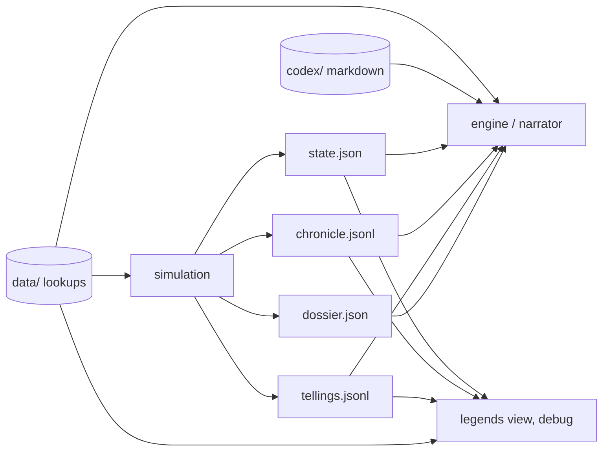

# Structured output: the state, the chronicle and the tellings as records, the words in lookups, a codex for whoever narrates

**Status:** In Progress (2026-09-22). Stages 1 (events) and 2 (lookups) implemented; stages 3 and 4 as `specs/plan.md` orders them (steps 5 and 8). Independent of `decline.md` and `galaxy-in-motion.md`; **follows `names.md` stage 1**, whose record shape this proposal serialises (the adjustments are marked "names:" below).
**Last updated:** 2026-09-22

## Problem

The generator's product is a text file. A run of seed 3 at 400 stars prints 27,700 lines: a header, the ages of myth, the youth and the waning as one sentence per happening, an aftermath with a standing line per people, "As they tell it" with the thirty dearest tales of each living people rendered in its voice, and a gazetteer. Every one of those lines is written by the simulation, in the simulation's voice, at the moment the thing happens: `w.log("The %s split the atom.", ...)` in 412 places across `internal/history`, and a template table plus a framing grammar in `telling.go` for the tales.

That was right for a generator read by a person tuning it. It is wrong for what the output is now for: a **game engine** that must place things, answer "what is at this star" and "what does this people remember", and generate detail on demand; and a **language model** that must narrate, in whatever register the moment wants, from what actually happened and what each side believes. For both, the prose is in the way:

- **The prose is the only record of most things.** The structured `Fact` in `lore.go` (kind, subject, object, star, legacy, count, `What`) exists for the eighty kinds the tellings track, but a tech node learned, a node let go dark, a refusal of trade, guns dug, a fleet laid up, a demand heeded, a cure, a drift are sentences and nothing else. A consumer that wants to know when the Eti split the atom has to parse "The Eti split the atom."
- **The sim's mood is baked in.** "Everything goes faster now", "They are stronger for it", "Something is there", "It was necessary" are judgments the narrator should make, from the record and the teller's regard, not lines the record carries. The tone the fiction wants (cold, old, incomprehension) is a property of the telling, and the sim is not the teller.
- **The sim plays mysterious to the wrong reader.** "Somewhere, something that thought in the convection cells of a red giant rises." "Something speaks from Tupã in no language." "The surveyors of the Totsia do not come back from Sirius. Something is there." In every one of these the code knows exactly what it is: the elder is a record with a portrait, a rise and a fall and a list of works; the voice is a transmitter with a node, a maker and a payload; the star is held by a replicator, and the fact carries it as `Object`. The mystery is put on by the sentence, for a reader who is supposed to be the player. The engine is not the player.
- **Numbers are words.** Levels print as "modest, strong, formidable, overwhelming" (`util.go`); years as "57.79 Myr ago"; counts as "a single world"; conditions as "in bad shape". Once the words are chosen, the information is gone. Every exotic-era people is "overwhelming" three times over.
- **Flavour and mechanics share tables.** A trait's phrase (`species.go`: `{Key: "vengeful", Name: "who never forget a wrong", ...}`), a tech node's meaning (`tech/desc.go`), an elder portrait (`ages.go`), a feature's two descriptions (`galaxy/features.go`), a remain's description (`legacy.go`), a ruler's title (`names.go`), the archetype an enemy is reduced to at myth, the coined words for the state beneath (`beneath.go`): all Go string tables, some picked by the RNG and stored as text on the object (`Legacy.Desc`, `Elder.Portrait`). A consumer cannot reword them, translate them, or swap the register; and a copy-edit is a code change and a determinism risk.
- **The tellings are rendered, not held.** A tale is a record (`Tale`: fact, provenance, slant, wear, blame, revisions) but what the run emits is `tell()`'s sentence. The slant grammar (a friend's deed shrinks to "it is said that", one's own crime becomes "there was no other way", the victim of one's own crime at myth is "the ones who deserved it") is exactly the material a narrating model should be given as *rules*, and instead it receives the applied result with the rule hidden. A testament on a remain stores its text (`Inscription.Text`).
- **There is no state file.** The aftermath is a summary; the present is only in memory. An engine that wants the galaxy at the present (who holds what, what stands where, what is buried, what speaks, who sleeps, who knows what) has nothing to load.

## Scope

**In.**

- The run emits **structured files**: a state snapshot at the present, a chronicle of everything that happened as typed records, and the tellings as records over the chronicle. Maximum information density: identifiers, numbers, enum keys; no sentence anywhere in them.
- **Nothing hidden from the engine.** Every record names the true cause, the true parties and the true nature of the thing. What a people knows, believes or has forgotten is modelled and exported separately, as its **knowledge**. What the player may know is decided after the simulation, by the engine and the narrator, from the state and the knowledge; the sim takes no view.
- **Keys, never text.** The simulation neither stores nor compares flavour text. Every value it decides on is a key; flavour text exists only in the lookups and is introduced by the interpretation layer. Names are not an exception: the sim holds ids, and names are rows generated after the run by the names pass (`names.md`).
- **Completeness.** The chronicle is sufficient to rebuild the durable part of the state, and a test proves it (the fold test).
- **Lookups**: every enum key a record can carry (event kinds, traits, nodes, filters, scars, miracles, kinds and powers, conditions, portraits, features, words) resolves in a data file that holds the mechanics in one line and the flavour text beside it. The sim reads the same files, so the keys cannot drift.
- A **codex**: hand-written context for whoever narrates, the fiction of this galaxy as prose dense enough to interpret any record, separate from the canonical spec.
- A **per-run dossier**: the region, its laws, its features, the cycle's numbers, the present, as a compact generated context block.
- A **format contract** (`FORMAT.md`, versioned) describing every file and field.
- The existing prose legends kept as a **view rendered from the structured files alone**, behind a flag, for tuning and as the proof that nothing was lost.
- `techstats` and `-stats` reading the structured files rather than the `World`.

**Out.**

- Any change to what the simulation decides or when. This is a change of what it writes, not what it does. A seed produces the same history before and after.
- The narrator. No prompt, no model call, no rendering pipeline in this repo beyond the debug view. The codex and the rendering hints are for a consumer we do not build here.
- The reasons behind decisions (`-ai`). The mind's `Reason` strings are debug text; a `decisions.jsonl` with structured motives is a follow-up proposal. The causes that narration needs most (a war's cause, an offer's refusal, a filter's outcome) are event parameters already.
- A state at an earlier year is a re-run: `worldgen -seed N -until Y` writes the directory as of year Y, exact, since a seed reproduces byte for byte. No snapshots are kept and the chronicle is not a mutation log (see "Why not event sourcing").
- The lazy detail layer (a star's contents on demand). The state file is what it will read; the layer is later.
- Names. Generated after the run by the names pass from the record (`names.md`): one row per (object, namer, tone), transcriptions and translations, with the human catalogue designation as the substrate's own row. Which name a consumer shows is its business; a recommended rule is in `names.md`.

## Design

### Principle: the record is omniscient; the mystery is knowledge

The simulation knows everything that happens and why. The output says all of it, plainly:

- An **elder** is a record (`elders[]`: id, age, portrait key, rose, fell, works) and its works point at it; "somewhere" is not a location, the record has none, and says so with a null.
- A **remain** says what it is (`node`), who made it, what it does (`kind`: artifact, structure, threat, sleeper, law), what condition it is in, what it carries (`payload`), and what it is disguised as in the fiction (`portrait`, a key).
- A **transmitter** is a remain with a maker (or an elder), a node, a payload and a listener count. "A voice that did not cross space" is a leak event with `p.mechanism: "leak"` and the wall's value.
- A **sleeper** is a people, asleep, with its species record like any other.
- A **lost survey** is an event whose `object` is what was there, as the fact already carries it.
- The **state beneath** has a key (`beneath`) in the records and lookups, its `wall` a number with a stage key in the dossier, and each leak an event with its mechanism. The fiction's rule stands: no *people* names it, and the codex says why; a key is an identifier, not a name.
- A **filter** event carries the filter, the level tested, the margin, the outcome and the scar or boon that resulted.
- A **cause** is always a key, never "nobody knows".

What a given people knows of any of this is a separate thing, and the sim already models it. It is exported per people as **knowledge**, and it is the only place ignorance lives in the output:

| field | from | what it says |
|---|---|---|
| `met`, `reached` | `Civ.Met`, `Civ.Reached` | peoples known of by signal or touch; met in the flesh |
| `fathomed`, `fathom_tried` | `Civ.Fathomed`, `FathomTried` | who it understands, and since when it has tried |
| `perceives` | `perceives()` | which peoples it can hold in mind at all (the anti-memetic) |
| `charted` | `Civ.Charted` | stars read, with the year of the reading (stale charts are a belief) |
| `marked` | `Civ.Marked` | stars the Sight showed something at |
| `intel` | `Civ.Intel` | what it believes of each other people: levels, ships, posture, as of a year |
| `regards`, `monsters`, `dread` | `regard()`, `monster()`, `dread()` | how it holds each people; whom it counts a monster; stars it will not go to |
| `word` | `Civ.Word` | its coined word for the state beneath, if it has reached in |
| `lore` | `Civ.Lore` | its tales: the tellings file |
| `known`, `dormant` | `Civ.Known` | the arts it holds and the ones gone dark |

The engine reads the truth from the state and the chronicle, and the player's view of it through a people's knowledge and telling. A remnant's telling as the player's first source (a next step in the spec) is a query over these files, not a mode of the sim.

### The shape of the output

A run writes one self-contained directory. Nothing in it contains a sentence written by the simulation.



| file | what it is | grain |
|---|---|---|
| `dossier.json` | the run's header: format version, code revision, seed, place, laws, features near and beyond, the cycle's numbers, the present's year, hazard, the wall | one object |
| `state.json` | the galaxy at the present: stars and their systems, peoples (living, remnant, ended) with their knowledge, species, elders, works and remains, transmitters, plagues, wars, fleets, contracts, lines | one object of arrays keyed by id |
| `chronicle.jsonl` | what happened, one record per line, in year order: every event the sim now logs, the facts among them flagged | ~25k records per 400-star run |
| `tellings.jsonl` | what each people holds, one record per tale; and each remain's testament as the same records frozen, with the names the maker used | ~30 per living people; ~8 per remain |
| `data/*.json` | lookups: key → mechanics + text; copied from the binary's embedded copy | static, versioned with the code |
| `codex/*.md` | the fiction, for interpretation; copied likewise | static, hand-written |
| `FORMAT.md` | the contract: every file, every field, the version | static |

The debug view (`worldgen -legends`) renders the prose legends of today from these files and nothing else. `worldgen -out DIR` writes the directory; with no `-out` it writes to `out/<seed>/`.

### Records

**Identifiers.** Every object has a small integer id stable within a run (peoples, species, elders, stars, remains, plagues, wars, fleets, contracts, events). Records refer by id; `-1` is none. **names:** no record carries a `name` field; names are the `names[]` table of the state (below), and a star carries only its human `designation` and its kind (`proper`, `bayer`, `flamsteed`, `hip`, `gaia`, `2mass`). Enum-valued fields carry a string key (`"atomic_age"`, `"conqueror"`, `"derelict"`) that resolves in a lookup.

**Years** are integers, years since the dawn of the age (the sim's own `Year`); the dossier gives `present`, so "ago" is `present − year`. Myth-age years are negative. Nothing is rounded to "about" in the record; the tellings carry their own believed year.

**Numbers stay numbers.** Levels are the floats the sim holds (`"military": 8.4`), not "formidable". Counts are counts. Wear is 0, 1, 2. The condition ladder is a key. The words for a scale live in the lookup (`levels.json`: bands and their words) so the view can say "formidable" and the narrator can say what it likes.

**An event** (`chronicle.jsonl`):

```json
{"id":18211,"year":2010000,"kind":"filter_overcome","subject":41,"object":-1,"star":88,"legacy":-1,"n":0,
 "p":{"filter":"atomic_age","level":"military","margin":0.7},"fact":true}
```

- `kind` is one of an **event vocabulary** that is the union of today's `FactKind` (80 kinds) and every distinct `w.log` call site that is not a fact. The first cut of the vocabulary is mechanical: every `log` call becomes a kind, then kinds that differ only in wording merge (the four ways a tech node is "learned" are one `node_learned` with `p.node`; "agree to teach" and "teach" are `teach_agreed` and `taught`; the three lines the wall's stages print are one `wall_stage` with `p.stage`).
- `subject`, `object`, `star`, `legacy`, `n` are the fields `Fact` has now. `p` holds the kind's typed parameters, replacing the catch-all `What`: `node`, `filter`, `level`, `margin`, `outcome`, `miracle`, `route`, `cause`, `plague`, `power`, `commodity`, `amount`, `word` (a coined name), `from`, `to`, `worlds`, `ships`, `mechanism`, `stage`. **`data/events.json` declares the keys each kind uses**, and a test fails on an emitted event whose `p` has a key its kind does not declare, or lacks one it requires.
- `fact: true` marks the kinds with a `factShape` (sort and weight), the ones tellings can hold and `spread()` carries. The sort and weight are in the lookup, not the record; every other kind has weight 0. Economy chatter (a node gone dark, a refusal, a fleet laid up) stays in the one stream at weight 0; consumers filter by kind.
- A fact whose party a witness cannot perceive (the anti-memetic) is written with every name in the chronicle, as now; what a people holds of it is the telling's business.

**A tale** (`tellings.jsonl`):

```json
{"civ":41,"fact":18211,"learned":2010000,"source":"witnessed","from":-1,"slant":0,"wear":1,
 "blamed":-1,"revised":0,"forgot":false,"believed_year":2000000,"sort":"deed","dear":true}
```

- The record is `Tale` as it stands, plus what the view derives and the narrator needs: `believed_year` (the exact year at wear 0; the rounded one at wear 1; absent at myth), `sort` (the sort *this* teller gives it through its morality, which may differ from the fact's own), and `dear` (among the thirty a people would tell first, in the order it believes they happened).
- A people's **standing memory** goes with its knowledge in the state: `scapegoat`, and the tallies (held, myth, forgotten, retold, blame moved).
- **A testament** is the same tale records with `civ` the maker and `remain` set, frozen at the moment the remain was left. **names:** no frozen name map is needed; the maker's names are its rows in `names[]`, each coined at its year, and the wall is read with the maker's rows of that time or earlier. What the maker had forgotten by then is the wear on the frozen tale.
- What the wear and the slant do to a sentence (a stranger's name lost at myth, an enemy reduced to an archetype, "a star whose name is lost", a friend's deed shrunk, one's own crime excused) are **not applied**. They are a pure function of the tale's fields and the teller's present knowledge (verified in `partyName` and `starName`: wear, slant, blame, whether the teller perceives the party, whether the star is the teller's), so they need no field; they are rules in `codex/tellings.md`, hints in `data/events.json`, and the view reproduces them exactly.

**The state** (`state.json`) is the present as objects. The fields are the ones the aftermath, "What is still there", "Lines", "As they tell it" and the gazetteer read today, plus the knowledge above and what the engine will need to place things:

- `stars[]`: id, name, real, catalogue id, class, multiplicity, position (ly from the anchor), `worlds[]` (name, kind key, mass, orbit, period, locked, moons, `known_from_earth` year), habitable world index, biosphere key, held by, works (id list), remains (id list), what speaks there, what sleeps there, laws where they vary.
- `civs[]`: id, name, species, line (parent, heirs, kind of break), cradle star, seat star, status (`standing`, `remnant`, `extinct`, `transformed`, `sundered`, `shattered`), born and ended years, fate key and cause, era, levels, wisdom, stiffness, morale, dials, worlds held, ships and fleets, guns per world, nodes known and dormant, boons and scars, miracles held with the route and the coined word, `asleep_since` and wakes, plagues raging, contracts, wars open, remnant title, the `young`/`settled`/`set` key, and `knowledge` as above.
- `species[]`: id, substrate, modifiers, seat, traits by group, senses, powers, born of (uplift, breeding, branch, drift), world archetype key.
- `elders[]`: id, age, portrait key, rose, fell, works, finder names by people.
- `remains[]`: id, kind, star, maker or elder, node, condition, hardiness, state (`buried`, `found`, `sealed`, `wielded`, `mastered`, `unleashed`, `lost`), payload, listeners taken, portrait key, `people` for a sleeper or a threat, finder, finder names, testament (tale ids), adrift and position for a field of wrecks.
- `ages[]`, `plagues[]` (with the profile from `names.md`: the symptom or effect list, onset, course, whom it takes, the form and carrier; flavour per key in `plagues.json`), `wars[]`, `fleets[]`, `contracts[]`, `lines[]`.
- **names:** `names[]`: `{object: {kind, id}, by, name, mode, tone, coined, from, gloss?, recipe?}` as `names.md` defines it, one row per (object, namer, tone); the only place a name appears.

### Lookups: `data/`

One JSON file per vocabulary, each entry `key → {mechanics, text}`. The mechanics fields are what the sim reads today from its Go tables; the text fields are what the prose used to say. The list, from where the strings live now:

| file | from | text fields |
|---|---|---|
| `events.json` | the `log` call sites, `templates`, `blamedTemplates`, `factShape` | `params` (declared keys), `sort`, `weight`, `meaning` (one line, plain), `hint` (how the wear and the slant bear on it) |
| `traits.json` | `species.go` trait table | phrase, what it does |
| `kinds.json` | `species/registry.go`, `pool.go` | substrate and modifier portrait sentences, powers |
| `tech.json` | `tech/tech.go`, `tech/desc.go` | name, domain, meaning, prerequisites, the filter attached |
| `filters.json` | `filters.go` | what it is, what overcome, scarred, declined mean, the scars it leaves |
| `scars.json`, `boons.json` | `civ.go`, `ossify.go` | the creed's name and what it is |
| `miracles.json` | `miracle.go` | the four causal miracles and the two that are not, the route names |
| `conditions.json` | `legacy.go` | the ladder, `remainDescs`, hardiness by work |
| `works.json` | structures | what each is |
| `portraits.json` | `ages.go`: `elderPortraits`, `ageEnders`, `ageKnowers`, `structureDescs`, `artifactDescs`, `lawDescs`; `legacy.go`: `ruinNames` | the sentences, keyed; the sim stores the key |
| `features.json` | `galaxy/features.go` | position, kind, the near telling and the known fact |
| `worlds.json` | archetypes and world kinds | phrase, physical facts |
| `families.json`, `epithets.json`, `banks.json` | **names:** `names.go`, `beneath.go`, `archetypes`, `titleAdj`/`titleNoun`, `names.Plague` parts, `finderNames`, `ruinNames`, `objectNames` | phonology families and their inventories; the epithet recipes with their `requires`, `tone` and `notice`; the word banks by semantic field. Read by the names pass, not by the sim |
| `levels.json` | `util.go` | bands and their words; era names; the stiffness words; the wall's stages |
| `laws.json` | `galaxy/milky.go` | the six laws and the zones, what each does |

Rules:

- **The sim embeds `data/`** (`embed.FS`) and reads its mechanics from it; the Go tables go. A test walks every key the sim can emit (each event kind and its params, each trait, each node, each portrait index) and fails if the lookup lacks it, so a record never points at nothing.
- **Where the RNG picks from a list**, the sim stores the key, not the text: `Legacy.Portrait = "red_giant_convection"`, not the sentence. Lists are ordered in the file and the draw is by index, so the seed reproduces. **names:** the sim never assembles a name; titles, plague names, finder names and the words for the state beneath are recipes rendered by the names pass from its own hash-seeded stream.
- **Every key's `term` is a technical term**: a phrase a reader who never saw this project understands at once or can search for, never a capitalised coinage. The miracle and object names (the Door, the Voice, the Sight, the Unmaking, the Chorus, the Ember, the Manna) become terms under this rule (`names.md`, "Three classes of name").
- **Text is free to change without a code change** and without touching determinism, because nothing the sim decides reads or compares a text field. A test enforces it: no `history` or `species` code compares a string against a lookup's text field, and the Go structs carry no text fields but names (`Name`, `Word`, a title, a finder's name for an elder). Anything else that was a string becomes a key with an entry.
- **Format is JSON**, for one parser and the same shape as the output. The files are small enough to edit by hand; if that proves painful, a YAML source compiled to JSON is a build step, not a design change.

### The codex: `codex/`

Hand-written markdown, the fiction as a reader who has to narrate it needs it: what the galaxy is, what an age is and how it ends, the state beneath and the wall, what each filter is *in the world* (not its difficulty), the miracles and their price, the kinds of people and what it is like to be each, remains and the Find as the middle ages in Roman buildings, war and its ending, plagues, contracts and slights, ossification, the transmitter, the eaters and the sleepers, the unseen; how memory works (witness, word, reading, inheritance; wear; slant; scapegoats; what a wall says); humanity and Sol; the present as aftermath; **tone** (what the reference points are and are not; cold, old, incomprehension; horror from scale not from monsters); **vocabulary** (the fiction's words against the code's: dawn and waning for surge and fade, remains for legacies, the coined word for the state beneath and the rule that nobody names it).

It is written from `DESIGN_NOTES.md` but is not it: the spec describes the system for someone changing it, with its numbers and file names; the codex describes the world for someone telling it, with none of either. It does not go stale with tuning. A section per file, one file per system, an index. Weird consequences of the departures from physics belong here in full: what it means that a crossing has no duration, that a wall can be thin for everyone, that a people can hold a thing it cannot perceive. **Where the codex and the spec disagree about the fiction, the codex is canonical**; about the mechanics, the spec.

`codex/knowing.md` states the general principles of what is knowable and how, for the engine and the narrator to decide after the fact; it holds no per-event or per-kind entries. The player is an observer at the present: what is knowable to them is what survives to it and can be reached (the state), and what some surviving people, wall or relic holds of the past (the tellings and the knowledge), read through that source's slant and wear. The principles: the record is true and the sources are not; a thing is known to the player by the route it is known to some people, or by finding it; what no people knows and nothing records is lost, whatever the chronicle says; some things are by the fiction's rule unknowable to anyone in the age (why the cycle turns, what the state beneath is, an elder's own name) and a source that claims them is wrong. How to apply these to a given event is the narrator's judgment, with the tale's fields and the codex for the world.

`codex/tellings.md` also carries the name-choice rule from `names.md`: which of a teller's rows a tale uses, by its `slant`. It is the rendering grammar the sim's `frame()`, `partyName()`, `starName()`, `ours()`, `judged()` and `sentences()` apply today, written as rules with examples: at wear 1 the year is rough and the thing is "great" or "dark"; at wear 2 the year is gone, a stranger's name is lost, an enemy is an archetype, a lost star is "a star whose name is lost", and the old songs are about it; a friend's deed told by an enemy shrinks; one's own crime is excused; a blamed woe gains its cause; a fact whose party the teller cannot perceive has "something nameless" in it; how a people's morality re-sorts another's act ("Among us that is counted a deed"). `data/events.json` carries the per-kind hint that points into it.

### The dossier

`dossier.json` is the generated context block for one run: `format` version, seed, anchor and zone, the laws with their values relative to the Sun, the features near (id, distance) and beyond, how many stars are real, the cycle (period, fade, dawn, fertility now, next dawn), the present year, the hazard, the wall's value and stage, and the counts the aftermath header prints. Small enough to sit in a prompt whole.

### Why not event sourcing, and what is borrowed from it

The alternative considered: make the run an event-sourced record, the stream the only durable output and the state a fold over it, so any year can be replayed. Rejected, for two reasons. **Replay is already free**: a seed reproduces byte for byte and a run takes under a second, so the state at year Y is `worldgen -seed N -until Y`, exact, with no fold to maintain; the RNG sits inside the decisions, so a stream could never diverge from a re-run and there is nothing replay would give that determinism does not. **Most of the state is derived, not durable**: levels are recomputed every tick from species, tech, works, scars and morale; so are flows, dials, intel, the wear of thousands of tales, the decay of remains. A stream that carried every mutation would be millions of records; one that left them out would not fold to the state, and would be what this proposal is: a log of happenings and a snapshot. Turning the history package itself into commands, events and a fold would be a rewrite, and the proposal's first rule is no behaviour change. Event sourcing belongs one layer up, in the engine's log of what the player does after the present.

What is borrowed is its guarantee. **The fold test**: a reducer in the test suite folds `chronicle.jsonl` from the dawn and must reproduce the **durable** part of `state.json` exactly: every star's holder, every people's status, fate, cradle, seat, worlds, nodes known and dormant, boons and scars, miracles, line and heirs, sleeping and awake; every remain's state and condition, finder and listeners; every war's sides, cause and ending; every plague's hosts; every transmitter. Whatever is durable and changes without an event fails the test, so no kind can go missing and no consumer has to guess. Names are outside the table: they are derived from the record by the names pass, whose own determinism test covers them. The **derived** part (levels, wisdom, stiffness, morale, dials, flows, intel, ships, guns, tale wear) is snapshot-only and listed as such in `FORMAT.md`. The line between the two is a table in the test, kept alongside the writer. The test will surface durable changes the prose never mentioned (a buried remain dropping a step of condition unseen, about 80% of them crumble unfound today; a work put back to work by takeover) and those become kinds with no line in the view: the chronicle is allowed to say more than the legends ever did.

`-until Y` runs the seed to year Y and writes the directory as of then, chronicle, state, tellings and dossier alike, with the dossier's `present` set to Y and a `truncated: true`. The dossier also carries `code` (the git revision that produced the run), since a history is a function of seed, configuration and code, and a run kept on disk should say which.

### The format contract

`FORMAT.md` lists every file, every record type and every field with its type, unit and meaning, the `names[]` rows and the human designation kinds, and the `format` version the dossier carries. It is maintained by hand next to the writer; a test checks that every field the writer emits is documented. JSON Schema is not worth the weight for five record types; if an engine wants one it can be generated from this later.

### The view

`internal/legends` stops reading `*history.World` and reads the output directory: it is the first consumer and the test of the format. Every line it prints today it must be able to print from the records, the lookups and the knowledge in the state; where it cannot, the record is missing a field. The migration keeps a **byte-identical** legends output on the reference seeds through every stage, tellings and testaments included, and the view is free to diverge only once it is the sole reader of the files (a short mode is trivial once the records have kinds).

`techstats` and `-stats` likewise read the directory (the `civs.jsonl` techstats writes today is a first draft of `state.civs`).

## Stages

Four stages on one design; each leaves the legends byte-identical on the reference batch (the one regenerated at `names.md` stage 1) and each is a working generator on its own.

**Stage 1: events.** The chronicle as typed records inside the sim. **Done 2026-09-22.**
- *Delivers*: `Event{Year, Kind, Subject, Object, Star, Legacy, N, P}`; the event vocabulary (every `w.log` site a kind, merged where only the wording differed) with a template per kind in the `kinds` table; `Fact` merged into `Event`; the `What` templates as kinds of their own; `data/events.json` with the declared params; the view rendering from the templates.
- *Testable*: byte-identical legends; the param test (no undeclared or missing key); `TestDeterminism`.
- *Depends on*: `names.md` stage 1 (typed tokens).
- *As built*: `Event{ID, Year, Kind, Subject, Object, Star, Legacy, Plague, N, P}` with `Kind` a string key and `P` a `map[string]any`; `data/events.json` holds 232 kinds (84 facts with sort and weight, the rest the chronicle's chatter) with their declared parameters (`?` marks an optional one) and a one-line meaning, and `kinds_gen.go` is generated from it (`go generate`, checked by a test). The sim reads the shapes from the file; `w.log` is gone and `w.event`/`w.fact` are the only writers. The record (`w.Events`, by id) and the chronicle (`w.Chronicle`, the order things are told, sorted by year at the end) are two lists over the same events, because a fact is recorded where it happens and told where the old line was: `fact` places before its spread, `told` after, and `unplaced`/`place`/`slot`/`fill` cover the dozen sites where other lines fall between. The chronicle's templates are `internal/history/lines.go`, the view's file inside the history package until step 5 moves the view out; `tell()` reads the old `What` from the parameters through `what()`. The legends of ten seeds at 200 stars are byte-identical to the reference but for one thing: the archetype an enemy's lost name becomes ("the ones from the dark", "the old enemy", ...) hashes the tale's event id, and the ids shifted when the chatter joined the record; 296 lines of 214k, all in myth-wear tellings. Deferred to the lookups step: parameters that are still words (`cause`, `desc`, `why`, `what`, `shape`, `portrait` lines, a use's `name`); `Civ.Cause` as text; `Legacy.Desc`.

**Stage 2: lookups.** The Go string tables to `data/`. **Done 2026-09-22.**
- *Delivers*: `traits`, `kinds`, `tech`, `filters`, `scars`, `boons`, `miracles`, `conditions`, `works`, `portraits`, `features`, `worlds`, `levels`, `laws` as JSON, embedded and read for their mechanics; keys stored where text was (`Legacy.Portrait`, a made people's origin); the law `variant` key replacing `civ.go:356`'s text match; the coverage test; the no-text-comparison source test; the `term` rule written into every file's header.
- *Testable*: byte-identical legends; the coverage and source tests.
- *Depends on*: stage 1 (the events lookup is one of the files).
- *As built*: twenty tables in `data/`, the fourteen above and six the survey found: `aptitudes` (what a body and a world do to the tree, with the birthright's lines), `sources` (the natural sources and rarities, their names, and which are worth a line), `causes` (every reason a fact gives: endings, falls, dark ages, leavings, cut-offs, peaces, blasts, becomings, war causes and results, the shapes of betrayal), `origins` (how a made people or blood came to be), plus `events` and `families` from the earlier steps. Each file opens with a `_` header stating what it holds and the term rule. The simulation loads them once (`data.Load`, `history/tables.go`) and reads its numbers from them: the tree and the works, the traits and worlds, the filters' levels and difficulties and the trait table, the wreckage, the scars' dials and which are iron, the miracles' wear and the objects' forms, the bands of the levels, the stages of the wall and of stiffness, the aptitudes; the profiles, hooks and outcome functions stay in Go keyed by the same keys, and a load panics on a key the code has that the file lacks. Text left the records: `Legacy.Desc` is `Portrait`, a key by kind (an elder list, a relic, a threat, a sleeper, a bounty, a work, an object's form) and the description is derived; `Elder.Portrait` and `AgeRecord.Ender` are keys; `Civ.Cause`, `War.Cause` and `Result`, `Betrayal.Shape`, `Trace.Kind`, `Civ.Into` (with `IntoCivs`) and `Muster.Cause` are keys; `Civ.Origin` and `Species.Made` are a `Making` (a key of `origins.json` and the ids its text names); `Civ.Record` is typed; `Source.Name`, `Contract.Why` and `flow.Use.Name` are gone. A fact's reason is a `reason` (a key with `by`, `at`, `plague`, `blast` beside it in the parameters), and a blast's what is the blast event. The scars are keys with the dialed ones first in the file, in the old order, so the sums do not move. Every event parameter that carried words carries a key or an id now: the trait keys where a blood was described, a species id where a flavour word was, a captured condition where a remain was described, the ids a use's name needs, the powers held for a portrait. The view (`lines.go`, `describe.go`, and `telling.go` for the tellings) renders all of it and nothing in the simulation calls it (`TestLinesUnread`); `TestKeysResolve` walks a run's events and records against the tables; `TestNoTextOnRecords` parses the record structs and `TestNoTextComparisons` the sources. Left as words: `Inscription.Text`, a testament rendered when it was written (the writer step freezes the maker's knowledge instead); the galaxy's own words for a world's kind and a disc (`Star.Remnant` and `System.Comp` became keys, since the history compared them); the `-ai` reason text.

**Stage 3: the writer and the view.** The output directory, and the view as its first consumer.
- *Delivers*: `worldgen -out` writing `dossier.json` (with `format` and `code`), `state.json` (with `knowledge` and `names[]`), `chronicle.jsonl`, `tellings.jsonl`, and copying `data/`, `codex/` (empty until stage 4) and `FORMAT.md` in; `-until Y`; `internal/legends` reading the directory only; `-legends`; `techstats` and `-stats` reading the directory; the fold test with its durable/derived table, and the event kinds it forces (remains crumbling, takeovers); the field-documentation test against `FORMAT.md`.
- *Testable*: byte-identical legends from the files alone; the fold test; `-until` at the present equal to the plain run.
- *Depends on*: stage 2; `names.md` stage 2 for the translated rows (without it, `names[]` holds stage 1's rows and the format is the same).

**Stage 4: the codex and the dossier's prose.** The hand-written context.
- *Delivers*: `codex/` one file per system plus `tellings.md` (the rendering grammar, written from `telling.go` before the view is simplified), `knowing.md` (the general principles), `tone.md`, `vocabulary.md`, an index; the dossier reviewed against a few seeds; `CLAUDE.md` linking the codex as the fiction's entry point.
- *Testable*: every event kind and every lookup key a reference run emits is covered by a codex section (a test that greps the kinds against the index); a reader with the codex and one run's files can answer a fixed set of questions about it (a checklist, not a test).
- *Depends on*: stage 3 for the files it is checked against; `decline.md` for the waning's fiction, if it has landed, so the codex is not written twice.

## Implementation / migration notes

The rule throughout: no behaviour change; `TestDeterminism` (`sim_test.go`) and a byte-identical legends diff on the reference seeds guard every stage. **names:** the reference batch is the one regenerated at `names.md` step 1 (the history's RNG stops drawing for names there, which shifts every seed once); the guard holds from that batch on.

1. **Events replace log lines.** Add `Event{Year, Kind, Subject, Object, Star, Legacy, N, P}` and a `kinds` table with a template per kind; replace each `w.log(fmt, args)` with `w.event(kind, ...)`. **names:** the log lines already take ids as typed tokens after `names.md` step 1, so the arguments are typed before this conversion starts. The view renders the template. Legends byte-identical. Merge `Fact` into `Event` (a fact is an event whose kind has a shape) at the end of the stage; `Tale.Fact`, `factsAt` and `Civ.lore` hold event ids. The `What` templates that facts carry today (`strings.Contains(f.What, "{S}")` in `tell`) become kinds of their own.
2. **Lookups.** Extract the Go string tables into `data/*.json`, embed, read mechanics from them; store keys where text was stored on objects (`Legacy.Desc`, `Elder.Portrait`, a made people's origin). One decision reads text today and must be keyed first: `civ.go:356` recognises a law legacy by `l.Desc == lawDescs[0]`; laws get a `variant` key. The coverage test. Legends byte-identical. *Done.*
3. **The writer.** `worldgen -out` writes `dossier.json`, `state.json` (with knowledge and `names[]` from the names pass), `chronicle.jsonl`, `tellings.jsonl` and copies `data/`, `codex/` and `FORMAT.md` in; `-until Y`. The fold test, with its durable/derived table. `internal/legends` rewritten to read the directory; `-legends` renders. Byte-identical on the reference seeds.
4. **techstats and -stats** read the directory.
5. **The codex.** Written by hand, system by system, from the spec; reviewed against a few seeds' records to check that every kind a run emits has somewhere to be understood. `codex/tellings.md` written from `telling.go` before the grammar moves into the view; `codex/knowing.md` from the principles above.
6. **Absorb**: the spec's "Output" paragraphs describe the directory; `CLAUDE.md` links the codex as the fiction's entry point beside the spec.

Stages 1 and 2 are large and mechanical (412 call sites; a dozen tables) and split cleanly by package. Stages 3 to 5 are independent of each other once 1 and 2 are in.

## Open questions (sharpening)

- [x] **Demystify.** The chronicle and state are omniscient; ignorance lives only in per-people knowledge, exported; what the player may know is the engine's and the narrator's decision after the fact, by general principles (`codex/knowing.md`), not per event. → "Principle" section; `knowledge` in the state.
- [x] **Keys, never text.** The sim stores and compares keys only; text is introduced by the interpretation layer; a test enforces it. → lookup rules.
- [x] **Event sourcing instead?** No; determinism already gives exact replay (`-until Y`), and the durable-versus-derived split makes a mutation log either enormous or incomplete. Borrowed its guarantee: the fold test. → "Why not event sourcing".
- [x] **Decision reasons as a stream.** Out of scope; a follow-up proposal (`decisions.jsonl`). The `-ai` text stays debug output.
- [x] **Year convention.** Dawn-relative integers with `present` in the dossier. One convention; "ago" is a subtraction.
- [x] **Economy chatter in the chronicle.** One stream; non-fact kinds have weight 0 in the lookup; consumers filter by kind.
- [x] **Format contract.** `FORMAT.md` with a version in the dossier, and a test that every emitted field is documented. Not JSON Schema.
- [x] **Earlier states.** `-until Y` re-runs the seed and writes the directory as of Y. No snapshots.
- [x] **Names at wear.** Verified a pure function of the tale and present knowledge: no new field; the rule in the codex; the view reproduces it. Amended for `names.md`: testaments freeze nothing; the maker's rows carry their coining year and the wall is read with the rows of its time.
- [x] **Names as rows.** Adjusted for `names.md`: no `name` fields, a `names[]` table, `words.json` split into families, epithets and banks, the technical-term rule on every `term`, the reference batch restarted at the names step.
- [x] **Lookups in JSON.** Yes; a YAML source would be a build step if hand-editing hurts.
- [x] **Codex against spec.** Codex canonical for the fiction, spec for the mechanics.
- [x] **Self-contained output.** The run copies the embedded `data/`, `codex/` and `FORMAT.md` into the output directory.
- [x] **Param schema.** `events.json` declares each kind's keys; a test checks emitted events against it.
- [x] **Size.** Split into four stages (see "Stages"): events; lookups; the writer and the view; the codex. Absorb after the last.

## Deferred

- `decisions.jsonl`: structured motives behind every decision a people makes, from the mind's inputs and tuning, for narration of *why*.
- A JSON Schema generated from `FORMAT.md`, if an engine asks.
